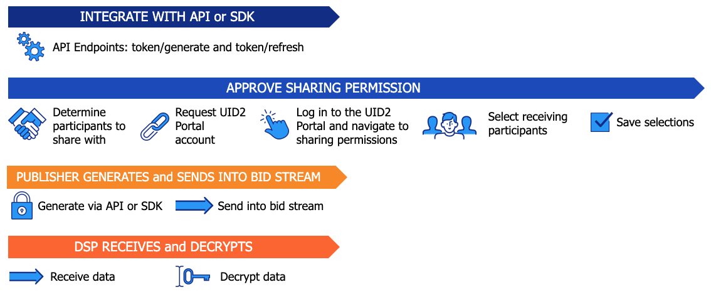

# Sharing in the Bid Stream

<!-- It includes the following:

- [Account Setup in the UID2 Portal](#account-setup-in-the-uid2-portal)
- [UID2 Sharing Workflow: Sharing in the Bid Stream](#uid2-sharing-workflow-sharing-in-the-bid-stream)
- [Token Example for Publishers in the Bid Stream](#token-example-for-publishers-in-the-bid-stream) -->

Publishers use UID2s by encrypting [directly identifying information (DII)](../ref-info/glossary-uid.md#gl-dii) (email addresses or phone numbers) via API endpoints or via an SDK, into a UID2 token, and then sending the UID2 token into the bid stream.

Additional resources:
- [UID2 Overview for Publishers](../overviews/overview-publishers.md)
- [UID2 Portal: Overview](../portal/portal-overview.md)

## Account Setup in the UID2 Portal

In the UID2 Portal, the sender and the receiver must set up an account and then configure their sharing permissions.

The sender only needs to set up sharing permission once for each receiver or participant type. However, if you want to add new sharing permissions or change existing ones, you'll need to go back to adjust your settings.

As a publisher, we recommend that you set up your sharing permissions to share with all DSPs.

For details, see [UID2 Portal: Overview](../portal/portal-overview.md) and follow the links for each task.

## UID2 Sharing Workflow: Sharing in the Bid Stream

When you want to send UID2 tokens in the bid stream, you can integrate via the API or via one of these SDKs:

- The Java server-side SDK (see [UID2 SDK for Java Reference Guide](../sdks/uid2-sdk-ref-java.md)).
- The Python server-side SDK (see [UID2 SDK for Python Reference Guide](../sdks/uid2-sdk-ref-python.md)).

These options support generating UID2 tokens from email addresses or phone numbers and also refreshing the tokens regularly. Other SDKs do not support token generate and token refresh at this time.

The workflow for generating UID2 tokens from DII, via the API or the specified server-side SDKs, consists of the following steps (each step links to the corresponding section):

1. Publisher: Integrate with UID2, using one of the following:

   - Java SDK: see [UID2 SDK for Java Reference Guide](../sdks/uid2-sdk-ref-java.md)).
   - Python SDK: see [UID2 SDK for Python Reference Guide](../sdks/uid2-sdk-ref-python.md)).
   - Direct integration with API endpoints: see [UID2 Endpoints: Summary](../endpoints/summary-endpoints.md).
   - Direct integration with API endpoints to generate UID2 tokens using the [POST&nbsp;/token/generate](../endpoints/post-token-generate.md) endpoint, but using the UID2 SDK for JavaScript (see [UID2 SDK for JavaScript Reference Guide](../sdks/client-side-identity.md)) to refresh UID2 tokens.

   >NOTE: The DSP must integrate with UID2 using one of the server-side SDKs. See [Sharing Steps: Summary](sharing-implementing.md#sharing-steps-summary) (step 2).

1. Publisher: Approve sharing permissions in the UID2 Portal:

   1. Publisher: Define which DSPs are allowed to decrypt the sender's UID2 token. 
   1. Publisher and DSP: Create a UID2 Portal account.
   1. Publisher: Log in to the UID2 Portal and navigate to the sharing permissions page.
   1. Publisher: Select one or more DSPs that you want to share with. If needed, use the search feature to find specific DSPs.
   1. Publisher: Save the sharing selection.

1. The publisher completes the following steps to create and send the UID2 tokens:

   1. Generates a UID2 token from an email or phone number.
   1. Puts the UID2 token into the bid stream.

1. The DSP completes the following steps:

   1. Receives the UID2 tokens.
   1. Decrypts the UID2 tokens into raw UID2s and uses them.

The following diagram illustrates the UID2 sharing workflow for publishers.

## Token Example for Publishers in the Bid Stream

Publishers convert the input email address or phone number directly to a UID2 token for use in the bid stream, using one operation, as shown in the following example.

<table>
<colgroup>
    <col style={{
      width: "30%"
    }} />
    <col style={{
      width: "40%"
    }} />
    <col style={{
      width: "30%"
    }} />
   
  </colgroup>
<thead>
<tr>
<th>Input Example</th>
<th>Process/User</th>
<th >Result</th>
</tr>
</thead>
<tbody>
<tr>
<td>user@example.com</td>
<td>Convert normalized email/phone number to UID2 token: <a href="../endpoints/post-token-generate">POST&nbsp;/token/generate</a> endpoint NOTE: If you're using an SDK, the SDK manages token generation.</td>
<td style={{
  wordBreak: "break-all"
}}>KlKKKfE66A7xBnL/DsT1UV/Q+V/r3xwKL89Wp7hpNllxmNkPaF8vdzenDvfoatn6sSXbFf5DfW9wwbdDwMnnOVpPxojkb8KYSGUte/FLSHtg4CLKMX52UPRV7H9UbWYvXgXC4PaVrGp/Jl5zaxPIDbAW0chULHxS+3zQCiiwHbIHshM+oJ==</td>
</tr>
</tbody>
</table>
