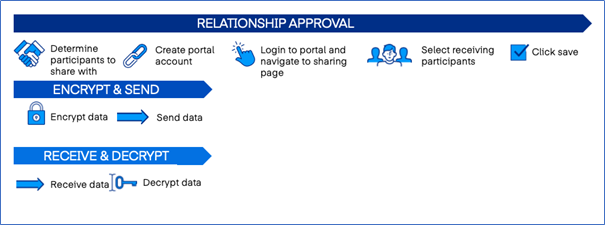

# Sharing UID2 Information: Overview

<!-- This page provides information about sharing UID2 information: what sharing means, who you can share with, the benefits of sharing, how to set up and manage your sharing relationships, and lots more! Use sharing relationships to expand your reach and help your business to prosper. -->

<!-- It includes the following:

- [Sharing Scenarios](#sharing-scenarios)
- [Implementation](#implementation)
- [Approval of Sharing Relationships](#approval-of-sharing-relationships)
  - [Workflow for Sharing Relationships](#workflow-for-sharing-relationships)
- [Best Practices for Sharing](#best-practices-for-sharing) -->

In UID2, sharing is the act of securely transmitting one or more UID2 tokens from one participant to another participant, or to the service provider for another participant.

There are many ways to implement sharing, and there are many advantages.

## Sharing Scenarios

Here are some ways to implement sharing:

- An advertiser (sender) sends a UID2 token to a DSP (receiver) for segment creation via an API.
- A measurement partner (sender) sends a UID2 token to an advertiser (receiver) via Amazon Simple Storage Service (S3).
- A publisher (sender) sends a UID2 token via a pixel to an advertiser (receiver).

Different types of UID2 participants have different needs, and the advantages of sharing are different depending on the type of participant. Overall, sharing can be mutually advantageous for both participants in the sharing relationship.

UID2 is a privacy-focused identity solution. Therefore, when a sharing participant is sending a UID2 to another participant, or to a service provider, the raw UID2 must be encrypted (except for what is allowed today – sharing UID2s with UID2 DSPs). {**gwh/KP can we clarify? How is the exception kept secure?**}

For example, when a participant sends a UID2 outside of the participant infrastructure, such as to an API endpoint or to a location such as S3 where it is accessible to another participant, the UID2 must be encrypted into a UID2 token. As part of sharing, the UID2 SDKs take care of the encryption and decryption.

## Implementation

To implement UID2 sharing, you must use an SDK. The following SDKs are available:
- C#
- C++
- Java
- Python

If your back end uses a different language, please reach out to your UID2 contact.

The basic steps are:

1. Set up your sharing account and sharing relationships.
2. Choose the SDK that's right for you and download it.
3. Integrate it into your code.

And you're ready to go!

If you have any questions, ask your UID2 contact, who will be happy to help.

## Approval of Sharing Relationships

Sharing relationships must be specifically requested and specifically approved. You have full control at all times, and you have multiple sharing options:

- You can choose to share with one UID2 participant or multiple specific participants.
- You can choose to share with a specific subset of UID2 participants, such as DSPs.
- You can choose to create sharing relationships automatically with future members of a participant subset. For example, if you choose to share with all advertisers, you can also choose to share with future UID2 sharing participants who are advertisers. This choice is offered for your convenience; if you don't choose to create future relationships automatically, you can go into the UID2 Portal at any time to create relationships manually.
When others request a sharing relationship with you, you have the choice to accept or decline. A sharing relationship is not created unless you specifically accept. {**KT/GWH how does this work? I made this up but there must surely be permission? Or maybe not in which case we just take this out :-)**}

### Workflow for Sharing Relationships

The workflow for creating sharing relationships is as follows:
1. Determine participants to share with.
1. Create an account in the UID2 Portal.
1. Log in to the UID2 Portal and go to the Sharing page.
1. Specify the participants you want to share with.
1. Click Save to create the sharing relationships.

{**KT/GWH what about approval?**}

 
## Best Practices for Sharing

With sharing, there are many more ways that you can use UID2 in your business. However, we all have a responsibility to maintain the privacy of users as well as the integrity of our own data and data that others share with us. Here are some best practices to help ensure UID2 sharing runs smoothly and securely:

- When storing information, always store raw UID2, not UID2 tokens. A raw UID2 is encrypted, using a specific encryption key, to create a UID2 token. Encryption keys are refreshed on a regular basis, for security purposes. If you store a UID2 token for a period of time, and the encryption key changes, the UID2 token becomes invalid. In addition, you won't be able to decrypt it to arrive at the raw UID2.
- Avoid using fixed length limits for raw UID2s {**KT/GWH why? Security reasons perhaps, not to keep it short which is easier to break? Just guessing**}. If you must have a limit, allow for at least 70 characters in the raw UID2.
- Refresh UID2 tokens hourly by calling the [POST /token/refresh](../endpoints/post-token-refresh.md) endpoint. {**KT/GWH is this raw UID2 or UID2 token? I looked at token/refresh doc and I don't even see that it says. I must be missing it**}
