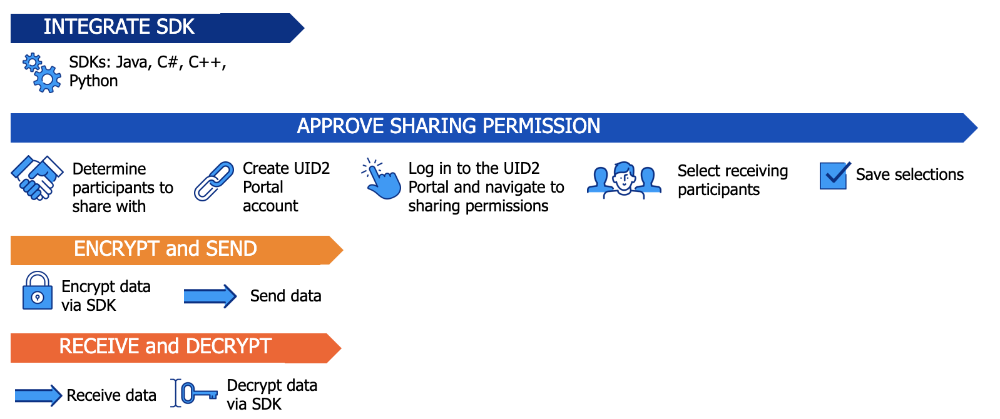

# UID2 Sharing: Overview 

<!-- This page provides information about sharing UID2s: what sharing means, who you can share with, the benefits of sharing, how to set up and manage your sharing permissions, and lots more! Use sharing permissions to expand your reach and help your business to prosper. -->

<!-- It includes the following:

- [UID2 Sharing Background](#uid2-sharing-background)
  - [UID2 Token Pass-Through](#uid2-token-pass-through)
- [UID2 Sharing Workflow](#uid2-sharing-workflow)
  - [One-Time Setup Steps](#one-time-setup-steps)
  - [Action Steps](#action-steps)
- [UID2 Sharing: Implementation Guidelines](#uid2-sharing-implementation-guidelines)
- [UID2 Portal Sharing Permissions](#uid2-portal-sharing-permissions)
  - [Steps for Granting Sharing Permission](#steps-for-granting-sharing-permission) -->

In UID2, sharing is a process for distributing raw UID2s between UID2 participants. To protect raw UID2s from unauthorized access, the originating participant (sender) must encrypt the raw UID2s into UID2 tokens before transmission. The destination participants (receivers) must decrypt the UID2 tokens into raw UID2s for internal use.

The UID2 sender specifies which receivers can decrypt their tokens, by configuring permissions in the UID2 Portal. When a sender grants permission to a receiver for UID2 sharing, the sender's decryption keys are shared with the receiver via a UID2 SDK. As part of sharing, the UID2 SDKs take care of the encryption and decryption.

There are many scenarios for sharing. For details, see [Sharing Use Cases](sharing-use-cases.md).

 By using the sharing functionality, here are some use cases that you couldn't otherwise do **GWH FIGURE ON THE WORDING**. call out -- because you're sharing some things you can do. if don't do sharing can't do these, if use sharing you can.} 

**Here are some cases where sharing must be used:  GWH THIS SECTION COMES OUT **
- A measurement partner (sender) sends a UID2 token to an advertiser (receiver) via Amazon Simple Storage Service (S3).
- A publisher (sender) sends a UID2 token via the bid stream to a DSP (receiver).  
- An advertiser (sender) sends a UID2 token to a DSP (receiver) for segment creation via an API.  

 Different types of UID2 participants have different needs, and the advantages of sharing are different depending on the type of participant. Overall, sharing can be mutually advantageous for both participants in the sharing relationship.

UID2 is a privacy-focused identity solution. Therefore, when a participant is sending a UID2 to another participant the raw UID2 must be encrypted into a UID2 token.   
For example, when a participant sends a UID2 outside of the participant infrastructure, such as to an API endpoint or to a location such as S3 where it is accessible to another participant, the UID2 must be encrypted into a UID2 token.

The following example shows a fictitious email, user@example,com, as it goes through the stages to be used for UID2 sharing.

There are two ways that you can generate a UID2 token. There are different use cases for each:
- For pixels and bid stream: 

<table className="table-fixed-width">
<thead>
<tr>
<th style={{
  width: "15%"
}}>Input Example</th>
<th style={{
  width: "50%"
}}>Process/User</th>
<th style={{
  width: "35%"
}}>Result</th>
</tr>
</thead>
<tbody>
<tr>
<td>user@example.com</td>
<td>Conversion to a raw UID2, used for internal participant processing, using the [POST /identity/map](../endpoints/post-identity-map.md) endpoint.</td>
<td>K2jlbu2ldlpKL1z6n5bET7L3g0xfqmldZPDdPTktdRQ=</td>
</tr>
<tr>
<td>K2jlbu2ldlpKL1z6n5bET7L3g0xfqmldZPDdPTktdRQ=</td>
<td>Encryption from a raw UID2 to a UID2 token that a sharing participant can send securely to another participant (see [Encrypting Requests](../getting-started/gs-encryption-decryption.md#encrypting-requests)).</td>
<td>KlKKKfE66A7xBnL/DsT1UV/Q+V/r3xwKL89Wp7hpNllxmNkPaF8vdzenDvfoatn6sSXbFf5DfW9wwbdDwMnnOVpPxojkb8KYSGUte/FLSHtg4CLKMX52UPRV7H9UbWYvXgXC4PaVrGp/Jl5zaxPIDbAW0chULHxS+3zQCiiwHbIHshM+oJ==</td>
</tr>
</tbody>
</table>

In a scenario where you don't need to store the raw UID2, you can convert the input email address or phone number directly to a UID2 token in one operation:

| Input Example | Process/User | Result |
| :--- | :--- | :--- |
| user@example.com | Conversion to a UID2 token, used in the bid stream, using the [POST /token/generate](../endpoints/post-token-generate.md) endpoint. | KlKKKfE66A7xBnL/DsT1UV/Q+V/r3xwKL89Wp7hpNllxmNkPaF8vdzenDvfoatn6sSXbFf5DfW9wwbdDwMnnOVpPxojkb8KYSGUte/FLSHtg4CLKMX52UPRV7H9UbWYvXgXC4PaVrGp/Jl5zaxPIDbAW0chULHxS+3zQCiiwHbIHshM+oJ==  |

xxx, you can convert the input email address or phone number directly to a UID2 token in one operation:

| Input Example | Process/User | Result |
| :--- | :--- | :--- |
| user@example.com |Conversion to a raw UID2, used for internal participant processing, using the [POST /identity/map](../endpoints/post-identity-map.md) endpoint. | K2jlbu2ldlpKL1z6n5bET7L3g0xfqmldZPDdPTktdRQ= |
| K2jlbu2ldlpKL1z6n5bET7L3g0xfqmldZPDdPTktdRQ= |Encryption from a raw UID2 to a UID2 token that a sharing participant can send securely to another participant (see [link to sharing encrypt for each SDK gwh](../xxx.md#encrypting-requests)). | KlKKKfE66A7xBnL/DsT1UV/Q+V/r3xwKL89Wp7hpNllxmNkPaF8vdzenDvfoatn6sSXbFf5DfW9wwbdDwMnnOVpPxojkb8KYSGUte/FLSHtg4CLKMX52UPRV7H9UbWYvXgXC4PaVrGp/Jl5zaxPIDbAW0chULHxS+3zQCiiwHbIHshM+oJ==  |

[gwh new table

gwh: depending on the use case, use the encryption method for your use case. based off the use case. DUE TO THE NATURE OF THE BID STREAM THREE ARE HIGHER SECURITY STANDARDS ON A TOKEN GENERATED FROM TOKEN/GENERATE RATHER THAN FROM THE ENCRYPT METHOD.

| Use Case | Encryption Method |
| :--- | :--- |
|  Bid stream | [POST /token/generate](../endpoints/post-token-generate.md) when using the UID2 API, or corresponding function in a UID2 SDK. |
| API | `encrypt()` function in the corresponding server-side SDK: see [Steps to Implement Sharing](sharing-implementing.md#steps-to-implement-sharing). |
| File transfer | `encrypt()` function in the corresponding server-side SDK: see [Steps to Implement Sharing](sharing-implementing.md#steps-to-implement-sharing). |
| Pixel | `encrypt()` function in the corresponding server-side SDK: see [Steps to Implement Sharing](sharing-implementing.md#steps-to-implement-sharing). |
| All other sharing use cases | `encrypt()` function in the corresponding server-side SDK: see [Steps to Implement Sharing](sharing-implementing.md#steps-to-implement-sharing). |

### UID2 Token Pass-Through
The UID2 token is designed so that it can be seen by all but can only be used by UID2 participants that have access to the decryption keys.

For example, UID2 tokens are habitually passed through the bid stream from a publisher to a DSP. Although a UID2 token might go through several parties, such as an SSP, it can be decrypted only by an authorized UID2 participant. On its journey through the bid stream, the UID2 token can safely pass through one or more intermediaries.

## UID2 Sharing Workflow
The basic steps for sharing UID2 tokens within the ad tech ecosystem are as follows:

- [One-Time Setup Steps](#one-time-setup-steps)
- [Action Steps](#action-steps)

### One-Time Setup Steps

The sender and the receiver must complete the following one-time setup steps so that they can participate in sharing.

Sender:
- In the UID2 Portal, set up your sharing permissions.

  The sender only needs to set up sharing permission once for each receiver or receiver group. However, if you want to add new sharing permissions or change existing ones, you'll need to go back to adjust your settings. <!-- {KT/GWH review}  -->

  <!-- For information about sharing options that can help streamline this step, see [share with a participant type](xxx). {GWH to add link to portal doc when written.} -->

Please see here (link to Share with a participant type) for sharing setting options which can streamline this step. 
- Integrate the SDK into your code.

Receiver:
- Integrate the SDK into your code.

### Action Steps

1. Sender: Do one of the following:

   - Encrypt one or more raw UID2s into UID2 tokens.
   - Encrypt one or more pieces of [directly identifying information (DII)](../ref-info/glossary-uid.md#gl-dii) (email addresses or phone numbers) into UID2 tokens.

1. Sender: Send the data, including UID2 tokens, to the receiver, who must be a sharing participant.
1. Receiver: Receive the data, including UID2 tokens.
1. Receiver: Decrypt the UID2 tokens into raw UID2s and use the raw UID2 data.

UID2 Sharing Permission SDK Integration Workflow:

 ## UID2 Portal Sharing Permissions

With a sharing permission enabled, a sharing participant who receives an encrypted UID2 token can decrypt the UID2 token into a raw UID2. The sharing options available include the following:

- Individual selection of sharing participants

   A participant can choose to share with one or more participants by individually selecting each participant.

- Automatic sharing with all participants of a specific type

  A participant can choose to share with all participants of one or more participant types, such as all Publishers, Advertisers, DSPs, or Data Providers.  

  If you choose this option, all new participants of the selected participant type will automatically have permission to decrypt any data that you send to them. For details, see [Encryption/Decryption Key Refresh Cadence for Sharing](sharing-best-practices.md#encryptiondecryption-key-refresh-cadence-for-sharing).

  For example, let's say you choose to share with all of 20 existing DSPs. The next day, when DSP 21 signs up for sharing, DSP 21 will automatically have permission to decrypt data that you send. To share with DSP 21, just send one or more encrypted UID2 tokens and DSP 21 will be able to decrypt the tokens into raw UID2s. Because you chose automatic sharing, you do not need to log in to explicitly update your sharing permissions to include DSP 21, or any future DSPs that sign up for the UID2 ecosystem. You can remove any sharing permission at any point.

### Steps for Granting Sharing Permission

At a high level, enabling sharing permissions includes the following steps. For exact instructions for configuring your sharing options in the UID2 Portal, refer to [Sharing Permissions](../portal/sharing-permissions.md).

1. Integrate the SDK into your code.
1. Log in to the UID2 Portal account.
1. Click **Sharing Permissions**.
1. Do one of the following:
   - **Share with one participant**: Search for a UID2 participant that you want to send data to, and select the participant.
   - **Share with a participant type**: Select a participant type that you want to start sharing with. Sharing will be enabled for current participants of that type, and also future participants of that type that join the UID2 ecosystem.
1. Save changes.

<!-- {**GWH/KT_02 Gen to revisit the above procedure when sharing portal is available**} -->
 
NOTE: When you enable sharing permission, this allows the selected sharing participants to access your decryption keys. Each participant that you enable for sharing can use your keys, via the SDK, to decrypt a UID2 token into a raw UID2. However, granting permission is just the first step. In order for sharing to occur, you must send the tokens to the participant. The UID2 Portal enables the permissions, it does not send the data&#8212;that is up to you.
