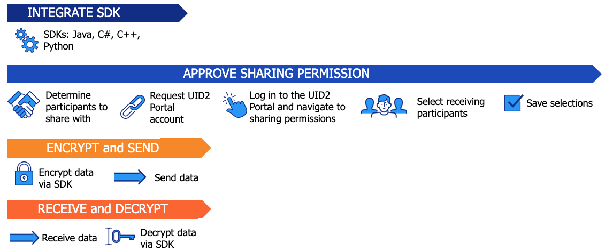

# UID2 Sharing: Overview 

<!-- It includes the following:

- [UID2 Sharing Workflow](#uid2-sharing-workflow)
- [Generating the Token for UID2 Sharing: Example](#creating-the-token-for-sharing-example)
- [Sharing in the Bid Stream](#sharing-in-the-bid-stream) -->

In UID2, sharing is a process for distributing either [raw UID2s](../ref-info/glossary-uid.md#gl-raw-uid2) or [UID2 tokens](../ref-info/glossary-uid.md#gl-raw-uid2) securely between UID2 participants.

There are several main sharing scenarios, summarized in the following table.

| Sharing scenario | Audience | Sharing methodology | Link for details
| :--- | :--- | :--- | :--- |
| Sharing to the bid stream | Publisher | Tokenized sharing for bid stream | [Sharing in the Bid Stream](sharing-bid-stream.md) |
| Sharing with another UID2 sharing participant, [when messaging is secure](#security-requirements-for-raw-uid2-sharing) (GWH_KL input) | Any Sharer | raw UID2 sharing | [Raw UID2 Sharing](#raw-uid2-sharing) |
| Sharing with another UID2 sharing participant, without secure messaging | Any Sharer | Participant to participant tokenized sharing | [Implementing Tokenized Sharing](sharing-implementing.md) OR [Tokenized UID2 Sharing](#tokenized-uid2-sharing) |
| Sending a UID2 in a creative pixel | Advertiser or Data Provider | Tokenized sharing (UID2 token) | xxx **NEW PAGE TO COME** |

## UID2 Sharing Options

All UID2 participants have a core responsibility to make sure that the UID2 data is protected from unauthorized access or use, in all states including storage and transit.

A key reason for the creation of a UID2 token from a raw UID2 is that the UID2 token is more secure.

In a scenario where a sharing participant wants to share UID2s with another authorized sharing participant, there are two possible paths:

- Sender encrypts the raw UID2s into UID2 sharing tokens, using one of the UID2 server-side SDKs or Snowflake. The receiver, in turn, decrypts the UID2 sharing tokens into raw UID2s.

- Both sender and receiver have the resources, processes, and facilities in place to ensure secure transit of the raw UID2s, without risk of compromising the data. In this scenario, as long as all UID2 security requirements are met, the sender can send raw UID2s to an authorized sharing participant.

## Security Requirements for Raw UID2 Sharing

The security requirements for sharing raw UID2s between authorized sharing participants include these criteria, which must all be met consistently:

- [Authentication](#authentication)
- [Authorization](#authorization)
- [Accounting](#accounting)
- [Secure Transport](#secure-transport)

### Authentication

In essence, authentication means that you verify that the sharing participant you're working with is who they say they are.

Common ways of achieving this are to require verification via credentials, such as:
- Username and password
- API keys

### Authorization

Essentially, authorization means that you verify that the sharing participant you're working with is authorized to receive the data you're sending -- or to send the data you're receiving. In the context of sharing, this means that the participant has the appropriate role required to access the specific UID2 data. Some examples are the following:

- The receiver has the appropriate cloud security role [**GWH_KL not sure exactly what this means. Shouldn't it rather be UID2 role? And, how can the sender verify?**]

- The receiver has accepted the terms of the UID2 sharing contract (**GWH_KL what's the name of this?**)

>NOTE: Only authorized sharing participants are available for creating a sharing relationship in the UID2 Portal.

(**GWH_KL this might be a non-issue but what if someone creates a sharing relationship, then the recipient ends their involvement and the sender doesn't know? The recipient no longer receives the updated keys I guess? Rusty on this.**)

### Accounting

Accounting means that there is a record of what happens, so that activity can be reviewed or audited if necessary. Some examples of accounting:

- Application logs
- Web server logs
- Cloud storage logs

### Secure Transport

Secure transport is the mechanism that's in place to ensure that the transition of the raw UID2s from sender to receiver is secure, end to end. There must be no possibility that the raw UID2s are accessible or modifiable by an onlooker. Examples of secure transport include:

- HTTPS or TLS
- Message-based encryption

>NOTE: ALL the above security points must be in place, continuously, if you are sending or receiving raw UID2s.

## Raw UID2 Sharing

If you want to share raw UID2s with other authorized sharing participants, you must make sure that all points of the [Security Requirements for Raw UID2 Sharing](#security-requirements-for-raw-uid2-sharing) are rigorously followed, so that the raw UID2s are kept secure at all times.

For instructions for implementing raw UID2 sharing, see (**NEW PAGE YET TO COME. KL question should I clone and customize the "Implementing Tokenized Sharing" page for sharing of raw UID2s? And, if so, where will I get actual procedure.**).

(**GWH_ updates done up to here**)

## Tokenized UID2 Sharing

To protect raw UID2s from unauthorized access, if messaging is not secure per [Security Requirements for Raw UID2 Sharing](#security-requirements-for-raw-uid2-sharing), the originating participant (sender) must encrypt the raw UID2s into [UID2 tokens](../ref-info/glossary-uid.md#gl-uid2-token) before transmission. The destination participant (receiver) must decrypt the UID2 tokens into raw UID2s for internal use.

The UID2 sender specifies which receivers can decrypt their UID2 tokens, by configuring permissions in the UID2 Portal (see [UID2 Portal: Overview](../portal/portal-overview.md)). When a sender grants permission to a receiver for UID2 sharing, the sender's decryption keys are shared with the receiver via a UID2 SDK. As part of sharing, the UID2 SDKs and APIs take care of the encryption and decryption.

For example, let's say that an advertiser (sender) wants to share raw UID2s with a trusted sharing participant who is a UID2 DSP, for segment creation via an API. Using sharing, the advertiser first enables the DSP with sharing permission via the UID2 Portal. The advertiser then encrypts the raw UID2s into UID2 tokens and sends them securely to the DSP (receiver). The DSP, who is also taking part in sharing, has access to the advertiser's decryption keys (through the UID2 Portal sharing permissions setup), and can therefore decrypt the UID2 tokens into raw UID2s for segment creation.

Both the UID2 sender and receiver must create an account in order to take part in sharing. Without an account, a UID2 participant is not displayed in the list of sharing participants in the UID2 Portal.

There are many scenarios for sharing. For additional examples, see [Sharing UID2s: Use Cases](sharing-use-cases.md).

>NOTE: The process for publishers sharing UID2 tokens in the bid stream is a different process. If you are a publisher who is putting UID2 tokens into the bid stream, see [Sharing in the Bid Stream](sharing-bid-stream.md).

Additional resources:

- [Implementing Sharing](sharing-implementing.md)
- [UID2 Sharing: Best Practices](sharing-best-practices.md)
- [UID2 Portal: Overview](../portal/portal-overview.md)

## UID2 Tokenized Sharing Workflow

Sharing of UID2 data securely between UID2 participants, if messaging is not secure per [Security Requirements for Raw UID2 Sharing](#security-requirements-for-raw-uid2-sharing), includes encrypting raw UID2s into UID2 tokens that the receiver can decrypt using your encryption keys. To do this, you must use a UID2 SDK or the UID2 Snowflake integration.

The workflow for UID2 tokenized sharing, for all sharers except when sharing UID2 tokens in the bid stream, consists of the following steps:

1. Sender and receiver: Integrate with UID2 sharing, using one of the following:

   - SDK for sharing: see [Steps to Implement Sharing with an SDK](sharing-implementing.md#steps-to-implement-sharing-with-an-sdk).
   - Snowflake integration for sharing: see [Steps to Implement Sharing Using Snowflake](sharing-implementing.md#steps-to-implement-sharing-using-snowflake).

1. Sender and receiver: Approve sharing permissions in the UID2 Portal:

   1. Sender: Define which sharing participants are allowed to decrypt the sender's UID2 token. 
   1. Sender and receiver: Request a UID2 Portal account: see [Request an Account](../portal/participant-info.md#request-an-account).
   1. Sender: Log in to the UID2 Portal and navigate to the sharing permissions page: see [Sharing Permissions](../portal/sharing-permissions.md).
   1. Sender: Select the participants that you want to share with. If needed, use the search feature to find specific sharing participants.
   1. Sender: Save the sharing selection.

1. Sender: Complete the following steps to encrypt and send the UID2s:

   1. Encrypt raw UID2s to convert them into UID2 tokens, using a UID2 SDK or Snowflake: see [Sharing Steps: Summary](sharing-implementing.md#sharing-steps-summary).
   1. Transmit the UID2 tokens to an authorized receiver.

1. Receiver: Complete the following steps to decrypt the UID2 tokens:

   1. Receive the UID2 tokens.
   1. Decrypt the UID2 tokens into raw UID2s that the receiver can use: see [Sharing Steps: Summary](sharing-implementing.md#sharing-steps-summary).

The following diagram illustrates the UID2 sharing permission SDK integration workflow:

## Generating the Token for UID2 Tokenized Sharing: Example

>Note: If you are a publisher, see [Token Example for Publishers in the Bid Stream](sharing-bid-stream.md#token-example-for-publishers-in-the-bid-stream).

UID2 sharers follow a two-step process, as shown in the following example. The steps are:
1. Convert email or phone number to raw UID2:

    Convert the input email address or phone number to a raw UID2, which they can store securely.

1. Convert raw UID2 to UID2 token:

    Encrypt the raw UID2 to create a UID2 token that they can share with another trusted UID2 sharing participant.

<table>
<colgroup>
    <col style={{
      width: "30%"
    }} />
    <col style={{
      width: "40%"
    }} />
    <col style={{
      width: "30%"
    }} />
  </colgroup>
<thead>
<tr>
<th>Input Example</th>
<th>Process/User</th>
<th >Result</th>
</tr>
</thead>
<tbody>
<tr>
<td>user@example.com</td>
<td>Convert email/phone number to raw UID2: <a href="../endpoints/post-identity-map">POST&nbsp;/identity/map</a> endpoint</td>
<td>K2jlbu2ldlpKL1z6n5bET7L3 g0xfqmldZPDdPTktdRQ=</td>
</tr>
<tr>
<td>K2jlbu2ldlpKL1z6n5bET7L3 g0xfqmldZPDdPTktdRQ=</td>
<td>Encrypt raw UID2 to create a UID2 token: encrypt() function in applicable SDK. For example, for Java, see <a href="../sdks/uid2-sdk-ref-java#usage-for-uid2-sharers">Usage for UID2 Sharers</a> step 3.</td>
<td style={{
  wordBreak: "break-all"
}}>KlKKKfE66A7xBnL/DsT1UV/Q+V/r3xwKL89Wp7hpNllxmNkPaF8vdzenDvfoatn6sSXbFf5DfW9wwbdDwMnnOVpPxojkb8KYSGUte/FLSHtg4CLKMX52UPRV7H9UbWYvXgXC4PaVrGp/Jl5zaxPIDbAW0chULHxS+3zQCiiwHbIHshM+oJ==</td>
</tr>
</tbody>
</table>

## Sharing in the Bid Stream

The process for publishers sharing UID2 tokens in the bid stream is a different process. For details, see [Sharing in the Bid Stream](sharing-bid-stream.md).

## UID2 Token Pass-Through

The UID2 token is designed so that even if the underlying raw UID2 remains the same, each time a UID2 token is generated from it, the token value is different. This means that the UID2 token can be seen by all but can only be used by UID2 participants that have access to the decryption key. 

For example, UID2 tokens are habitually passed through the bid stream from a publisher to a DSP. Although a UID2 token might go through several parties, such as an SSP, it can be decrypted only by an authorized UID2 participant. On its journey through the bid stream, the UID2 token can safely pass through one or more intermediaries.

The same is true in all sharing scenarios between UID2 sharing participants. A UID2 token can be passed through non-UID2 participants.
