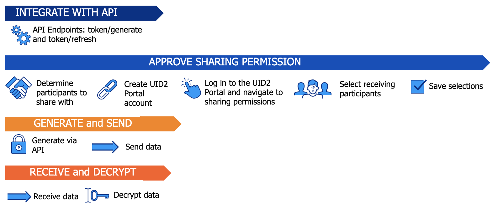

import Link from '@docusaurus/Link';

# Tokenized Sharing in the Bidstream

UID2 data shared to the <Link href="../ref-info/glossary-uid#gl-bidstream">bidstream</Link> must be in the form of UID2 tokens generated by encrypting [directly identifying information (DII)](../ref-info/glossary-uid.md#gl-dii) (an email address or phone number) directly into a UID2 token.

Publishers can encrypt the DII into a UID2 token, using one of the [implementation options](#implementation-options-for-senders), and then send the UID2 token into the bidstream.

Other sharing participants might also use this form of tokenized sharing. For example, an advertiser might use it for creating a UID2 token for a tracking pixel. 

:::caution
Data in the bidstream can be accessed by unauthorized parties, so it is never acceptable to share raw UID2s in the bidstream. If you're sharing in the bidstream, tokenized sharing is required.
:::

Additional information for publishers is on the following pages:
- [UID2 Overview for Publishers](../overviews/overview-publishers.md)
- [UID2 Portal: Overview](../portal/portal-overview.md)

### Audience

Tokenized sharing in the bidstream is applicable to the following audiences:

- **Sender**: Publisher. Account Setup in the UID2 Portal is optional.
- **Receiver**: DSP. See [Information for Sharing Receivers](#information-for-sharing-receivers).

### Implementation Options for Senders

The following approaches are available for encrypting the DII directly into a UID2 token for sending in the bidstream.

| Integration Option | Token Generated Client-Side or Server-Side? | Integration Guide |
| :--- | :--- | :--- |
| Prebid.js | Client-Side | [UID2 Client-Side Integration Guide for Prebid.js](../guides/integration-prebid-client-side.md) |
| Prebid.js | Server-Side | [UID2 Client-Server Integration Guide for Prebid.js](../guides/integration-prebid-client-server.md) |
| JavaScript SDK | Client-Side | [Client-Side Integration Guide for JavaScript](../guides/integration-javascript-client-side.md) |
| JavaScript SDK | Server-Side | [Client-Server Integration Guide for JavaScript](../guides/integration-javascript-client-server.md) |
| Java SDK | Server-Side | [SDK for Java Reference Guide](../sdks/sdk-ref-java.md) |
| Python SDK | Server-Side | [SDK for Python Reference Guide](../sdks/sdk-ref-python.md) |
| UID2 API (token generate and refresh) | Server-Side | [UID2 Endpoints Summary: UID2 Tokens](../endpoints/summary-endpoints.md#uid2-tokens) | 

These options support generating UID2 tokens from email addresses or phone numbers and also refreshing the tokens regularly. Other SDKs do not support token generate and token refresh at this time.

### Decryption Options for Receivers

The following approaches are available for decrypting UID2 tokens.

   | Scenario | Link to Doc |
   | :--- | :--- |
   | Tokenized sharing from raw UID2s with SDK | [Implementing Sharing Encryption/Decryption with an SDK](sharing-tokenized-from-raw.md#implementing-sharing-encryptiondecryption-with-an-sdk) |
   | Tokenized sharing from raw UID2s with Snowflake | [Implementing Sharing Encryption/Decryption Using Snowflake](sharing-tokenized-from-raw.md#implementing-sharing-encryptiondecryption-using-snowflake) |
   | Tokenized sharing in the bidstream from DII | [DSP Integration Guide](../guides/dsp-guide.md) |
   | Tokenized sharing in tracking pixels from DII | [Workflow: Tokenized Sharing in Tracking Pixels](sharing-tokenized-from-data-pixel.md#workflow-tokenized-sharing-in-tracking-pixels) |
   | Tokenized sharing in creative pixels from raw UID2s | [Workflow: Tokenized Sharing in Creative Pixels](sharing-tokenized-from-data-pixel.md#workflow-tokenized-sharing-in-creative-pixels) |

### Account Setup in the UID2 Portal

For sharing in the bidstream, the sender does not need a UID2 Portal account. We automatically set up any publisher to share with all DSPs. However, if you are a publisher and want to limit your sharing scope, you can request a UID2 Portal account and set up sharing permissions. For example, you might want to share with a limited audience of one or more sharing partners for security or other reasons.

All sharing receivers must set up an account in the UID2 Portal.

The sender only needs to set up sharing permission once for each receiver or participant type. However, if you want to add new sharing permissions or change existing ones, you'll need to go back to adjust your settings.

For details, see [UID2 Portal: Overview](../portal/portal-overview.md) and follow the links for each task.

### Workflow: Tokenized Sharing in the Bidstream

The workflow for generating UID2 tokens from DII, via the API or the specified server-side SDKs, consists of the following steps:

1. Set up integration with UID2:

   - Publisher: Use one of the integration options listed in [Implementation Options for Senders](#implementation-options-for-senders).

     Optional to restrict which DSPs can decrypt your UID2 tokens: Set up sharing permissions in the UID2 Portal. See [Account Setup in the UID2 Portal](#account-setup-in-the-uid2-portal).
   - DSP: Use one of the integration options listed in [Decryption Options for Receivers](#decryption-options-for-receivers).

1. The publisher completes the following steps to create and send the UID2 tokens:

   1. Generates a UID2 token from an email or phone number.
   1. Puts the UID2 token into the bidstream.

1. The DSP completes the following steps:

   1. Receives the UID2 tokens.
   1. Decrypts the UID2 tokens into raw UID2s.
   1. Checks that the UID2s are not opted out. For details, see [Honor User Opt-Outs](../guides/dsp-guide.md#honor-user-opt-outs). If they are not opted out, uses the raw UID2s for bidding.

The following diagram illustrates the UID2 sharing workflow for publishers.

### Token Example for Publishers in the Bidstream

Publishers convert the input email address or phone number directly to a UID2 token for use in the bidstream, as shown in the following example.

<table>
<colgroup>
    <col style={{
      width: "30%"
    }} />
    <col style={{
      width: "40%"
    }} />
    <col style={{
      width: "30%"
    }} />
   
  </colgroup>
<thead>
<tr>
<th>Input Example</th>
<th>Process/User</th>
<th >Result</th>
</tr>
</thead>
<tbody>
<tr>
<td>user@example.com</td>
<td>Convert normalized email/phone number to UID2 token: <a href="../endpoints/post-token-generate">POST&nbsp;/token/generate</a> endpoint NOTE: If you're using an SDK, the SDK manages token generation.</td>
<td style={{
  wordBreak: "break-all"
}}>KlKKKfE66A7xBnL/DsT1UV/Q+V/r3xwKL89Wp7hpNllxmNkPaF8vdzenDvfoatn6sSXbFf5DfW9wwbdDwMnnOVpPxojkb8KYSGUte/FLSHtg4CLKMX52UPRV7H9UbWYvXgXC4PaVrGp/Jl5zaxPIDbAW0chULHxS+3zQCiiwHbIHshM+oJ==</td>
</tr>
</tbody>
</table>

## Information for Sharing Receivers

To be able to decrypt a UID2 token into a raw UID2, you must be an authorized sharer and have the sender's cryptographic keys.

By default, for publishers sending UID2 tokens to the bidstream, the publisher's cryptographic keys are shared with all authorized DSPs. However, if a publisher has set up specific sharing relationships, you'll only receive that publisher's cryptographic keys if the publisher has created a sharing relationship with you.

For details, see [Receiving UID2 Tokens from Another Sharing Participant](sharing-tokenized-overview.md#receiving-uid2-tokens-from-another-sharing-participant).

It's important to set up a regular cadence for refreshing cryptographic keys, and to decrypt UID2 tokens promptly.

For details, see the following sections in *UID2 Sharing: Best Practices*:

- [Decryption Key Refresh Cadence for Sharing](sharing-best-practices.md#decryption-key-refresh-cadence-for-sharing)
- [Best Practices for Managing Raw UID2s and UID2 Tokens](sharing-best-practices.md#best-practices-for-managing-raw-uid2s-and-uid2-tokens)
