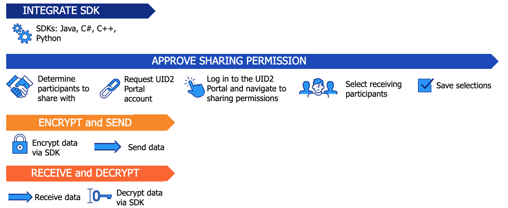

import Link from '@docusaurus/Link';

# Tokenized Sharing from Raw UID2s

In some cases, sharing participants might have raw UID2s and want to encrypt them before sending to another sharing participant. One example is for advertisers sharing UID2s in creative pixels.

### Audience

Tokenized sharing from raw UID2s could be applicable to any sharing participant, depending on the use case.

## Overview

To share raw UID2s with another participant by encrypting into UID2 tokens before sending, the sharing sender must create a UID2 Portal account and implement sharing, and must create a sharing relationship with the receiver.

The sharing receiver must create a UID2 Portal account and implement sharing, and must have a sharing relationship with the sender, so that the receiver has the cryptographic keys necessary to decrypt the UID2 tokens into raw UID2s.

## Account Setup in the UID2 Portal

In the UID2 Portal, the sender and the receiver must set up an account and the sender must configure sharing permissions.

The sender only needs to set up sharing permission once for each receiver or participant type. However, if you want to add new sharing permissions or change existing ones, you'll need to go back to adjust your settings.

For details, see [UID2 Portal: Overview](../portal/portal-overview.md) and follow the links for each task.

## Tokenized Sharing Steps: Summary

At a very high level, the following are the steps to set up and configure tokenized sharing from raw UID2s:

1. All users must set up an account and configure sharing options. See [Account Setup in the UID2 Portal](#account-setup-in-the-uid2-portal).

2. To implement sharing in your code, choose from the following, depending on the integration option you're using:

   - [Implementing Sharing Encryption/Decryption with an SDK](#implementing-sharing-encryptiondecryption-with-an-sdk)
   - [Implementing Sharing Encryption/Decryption Using Snowflake](#implementing-sharing-encryptiondecryption-using-snowflake)

## Workflow: Tokenized Sharing from Raw UID2

The workflow for tokenized sharing by generating UID2 tokens from raw UID2s consists of the following steps.

:::note
Both sender and receiver must have a UID2 Portal account. See [Request an Account](../portal/portal-getting-started.md#request-an-account).
:::

1. Sender and receiver: Integrate with UID2 sharing, using a [UID2 SDK](sharing-tokenized-from-raw.md#implementing-sharing-encryptiondecryption-with-an-sdk) or [Snowflake](sharing-tokenized-from-raw.md#implementing-sharing-encryptiondecryption-using-snowflake).

1. Sender: Approve sharing permissions in the UID2 Portal:

   1. Define which sharing participants you want to allow to decrypt your UID2 tokens. 
   1. Log in to the UID2 Portal, go to the [Sharing Permissions](../portal/sharing-permissions.md) page, and specify the participants that you want to share with. If needed, use the search feature to find specific sharing participants.
   1. Save the sharing selection.

1. Sender: Encrypt raw UID2s to convert them into UID2 tokens, using a [UID2 SDK](sharing-tokenized-from-raw.md#implementing-sharing-encryptiondecryption-with-an-sdk) or [Snowflake](sharing-tokenized-from-raw.md#implementing-sharing-encryptiondecryption-using-snowflake).

   -  Securely transmit the UID2 tokens to an authorized receiver.

1. Receiver: Complete the following steps to decrypt the UID2 tokens:

   1. Securely receive the UID2 tokens.
   1. Decrypt the UID2 tokens into raw UID2s that you can use: see [Implementing Sharing Encryption/Decryption with an SDK](sharing-tokenized-from-raw.md#implementing-sharing-encryptiondecryption-with-an-sdk) or [Implementing Sharing Encryption/Decryption Using Snowflake](sharing-tokenized-from-raw.md#implementing-sharing-encryptiondecryption-using-snowflake).

The following diagram illustrates the UID2 sharing permission SDK integration workflow:

## Implementing Sharing Encryption/Decryption with an SDK

The following steps are for all sharing participants who are using an SDK to encrypt raw UID2s into UID2 tokens or decrypt back to raw UID2s&#8212;senders and receivers.

1. Decide which SDK to use, from the following options, and review the examples in the applicable sharing documentation to see what the sharing code might look like.

   | SDK/Integration Tool | Link to Sharing Section |
   | :--- | :--- | 
   | C# / .NET | [SDK for C# / .NET: Usage for UID2 Sharers](../sdks/sdk-ref-csharp-dotnet.md#usage-for-uid2-sharers) |
   | C++ | [SDK for C++: Usage for UID2 Sharers](../sdks/sdk-ref-cplusplus.md#usage-for-uid2-sharers) |
   | Java | [SDK for Java: Usage for UID2 Sharers](../sdks/sdk-ref-java.md#usage-for-uid2-sharers) |
   | Python | [SDK for Python: Usage for UID2 Sharers](../sdks/sdk-ref-python.md#usage-for-uid2-sharers) |

2. Integrate the SDK into your code to implement each step, depending on whether your role is sender or receiver. To see code examples for the language you're using, follow the link in the table provided in Step 1.
   1. Both senders and receivers: define the UID2 client.
   
   2. Both senders and receivers: define the schedule for refreshing cryptographic keys.
   
      Recommended refresh interval is hourly. For an example, see [Decryption Key Refresh Cadence for Sharing (SDK Only)](#decryption-key-refresh-cadence-for-sharing-sdk-only).

   3. Senders, set up encryption.

   4. Receivers, set up decryption.

### Decryption Key Refresh Cadence for Sharing (SDK Only)

If you're using an SDK, defining the schedule for refreshing the sharing keys is part of step 2.

For long/continuously running processes, we recommend calling the `uid2client.refresh()` function once per hour.

For details, see [Decryption Key Refresh Cadence for Sharing](sharing-best-practices.md#decryption-key-refresh-cadence-for-sharing) in *UID2 Sharing: Best Practices*.

:::note
If you're using Snowflake, you don't need to do this step. The Snowflake UID2 integration takes care of refreshing the keys.
:::

### Decryption Key Refresh Example

This example illustrates how the `uid2client.refresh()` function enables a new sharing permission. In this example, Advertiser ABC wants to send data to Data Provider XYZ.

| Time | Event |
| :--- | :--- | 
| 12:00 pm | The sharing permission is not yet enabled. Data Provider XYZ calls `uid2client.refresh()`. The decryption key for Advertiser ABC is not returned, so Data Provider XYZ cannot decrypt the UID2 tokens. |
| 12:30&nbsp;pm | Advertiser ABC logs in to the UID2 Portal and creates a sharing permission with Data Provider XYZ. |
| 1:00 pm | Data Provider XYZ, on an hourly cadence, again calls `uid2client.refresh()`. Because there is a new sharing permission, the key for Advertiser ABC is returned in the response. Data Provider XYZ can now decrypt any UID2 token received from Advertiser ABC into a raw UID2. |

## Implementing Sharing Encryption/Decryption Using Snowflake

The following steps are for Snowflake users who want to take part in UID2 sharing, either as senders or receivers.

1. Review the examples in [Snowflake Integration Guide: Usage for UID2 Sharers](../guides/integration-snowflake.md#usage-for-uid2-sharers) to see what the sharing code might look like.

2. Integrate Snowflake into your code, according to whether your role is sender or receiver. Use the code examples in the documentation referenced in the Snowflake Integration Guide, [UID2 Sharing Example](../guides/integration-snowflake.md#uid2-sharing-example):

   - Senders, set up encryption.
   - Receivers, set up decryption.

## Information for Sharing Receivers

To be able to decrypt a UID2 token into a raw UID2, you must have a UID2 Portal account and the sender must create a sharing relationship with you.

For details, see [Receiving UID2 Tokens from Another Sharing Participant](sharing-tokenized-overview.md#receiving-uid2-tokens-from-another-sharing-participant).

It's important to set up a regular cadence for refreshing decryption keys, and to decrypt UID2 tokens promptly.

For details, see the following sections in *UID2 Sharing: Best Practices*:

- [Decryption Key Refresh Cadence for Sharing](sharing-best-practices.md#decryption-key-refresh-cadence-for-sharing)
- [Best Practices for Managing Raw UID2s and UID2 Tokens](sharing-best-practices.md#best-practices-for-managing-raw-uid2s-and-uid2-tokens)
