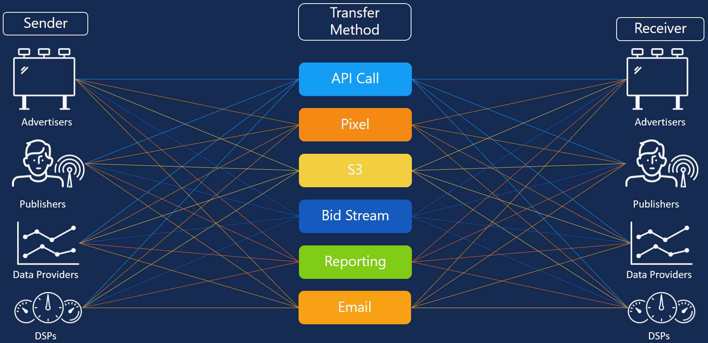

# Sharing UID2s: Use Cases

The secure sharing workflow allows you to share raw UID2s securely with trusted participants in many different ways. For example, here are some sample scenarios where a sender wants to share UID2s with a receiver: 

- A publisher (sender) sends a UID2 token via the bid stream to a DSP (receiver). For details, see [Sharing in the Bid Stream](sharing-bid-stream.md).
- A measurement partner (sender) sends a UID2 token to an advertiser (receiver) via Amazon Simple Storage Service (S3).
- A DSP (sender) sends a UID2 token to an advertiser (receiver) via reporting.

These scenarios, and others, are represented in the following diagram.

> NOTE: Any sender can transfer a UID2 token to any receiver using one of the transfer methods. Only a handful of transfer methods are defined here; there are many others.
