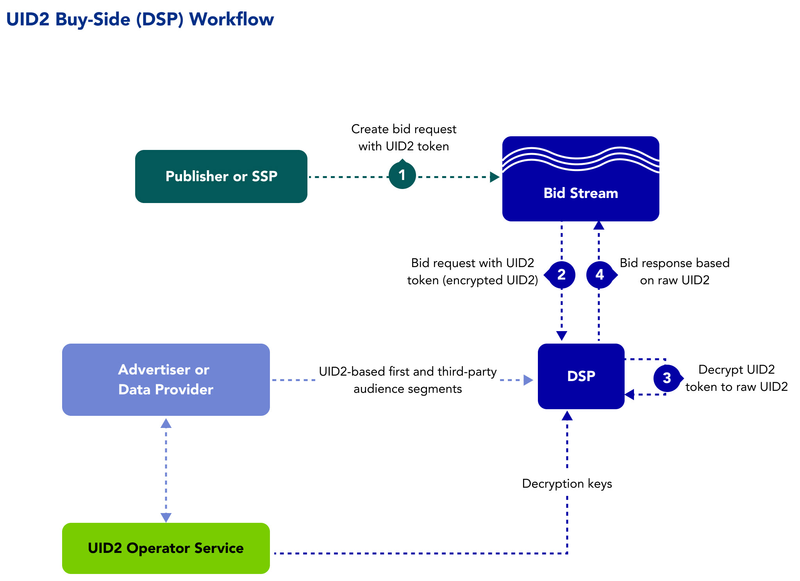

# DSP Workflow Overview

The following steps provide a high-level outline of the workflow intended for demand-side platforms (DSPs) that transact on UID2s in the bid stream.

The following processes occur in the background:
- The advertiser and/or data provider passes first-party and third-party audience segments to the DSP.
- The DSP syncs with the UID2 Operator to receive decryption keys.
- The DSP listens to opt-out requests from the UID2 Operator.

The following steps occur for each bid/ad impression:

1. A bid request is passed into the bid stream with the UID2 token.
2. The DSP receives the bid request with the UID2 token from the bid stream.
3. The DSP:
   - Decrypts the UID2 token into a raw UID2.
   - Checks to see if the user opted out and, if so, does not bid.
   - Matches the raw UID2 to an audience segment. 
4. The DSP sends a bid response to the bid stream based on the raw UID2.     

## Integration Requirements

To integrate with UID2 to receive UID2s from brands (as first-party data) and data providers (as third-party data) and leverage them to inform bidding on UID2s in the bid stream, the buy-side participants must meet the following requirements:

- Accept data in the form of UID2s
- Bid on data in the form of UID2s
- Build a webhook for honoring opt-out requests
- Sync encryption keys daily with the UID2 Administrator

For details, see [DSP Integration Guide](../guides/dsp-guide.md).

Optionally, if DSPs want to generate UID2s themselves from DII, they can also follow the [Third-Party Data Provider Workflow](workflow-overview-3p-data-provider.md).
