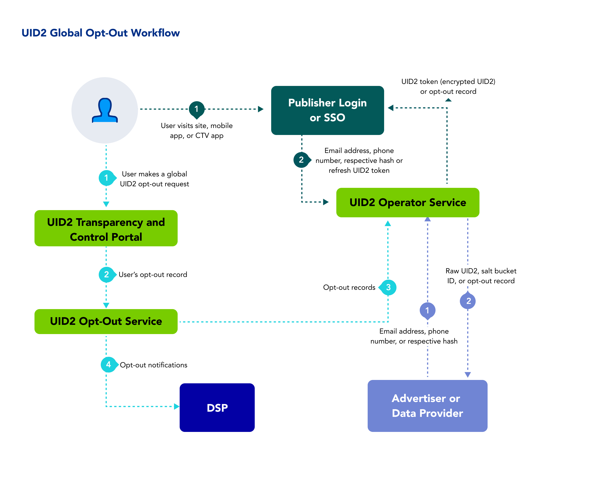

# Opt-Out Workflow Overview

The following steps provide a high-level outline of the workflow intended for users who engage with publishers or their identity providers. 

1. Users visit the [Transparency and Control Portal](https://www.transparentadvertising.com/), where they can globally opt out of UID2.
2. The Transparency and Control Portal sends the opt-out request to the UID2 [Operator Service](../ref-info/glossary-uid.md#gl-operator-service).
3. If the user has opted out, the UID2 Operator Service distributes the opt-out information to UID2 participants, as follows:

   | Participant | Distribution Method |
   | :--- | :--- | 
   | Publishers | A publisher calling  [POST /token/generate](../endpoints/post-token-generate.md) with the required `optout_check` parameter set to `1`, or [POST /token/refresh](../endpoints/post-token-refresh.md), receives the opt-out response instead of the UID2 token. |
   | DSPs | The UID2 Operator Service distributes information on all opted-out users to DSPs via a webhook provided for the purpose. For details, see [Honor User Opt-Outs](../guides/dsp-guide#honor-user-opt-outs). |
   | Advertisers | The UID2 Operator Service distributes opt-out information to advertisers via the [POST /identity/map](../endpoints/post-identity-map.md) endpoint. |

This workflow allows users to consent to the creation of UID2 identifiers and manage their UID2 consent and privacy settings through the Transparency and Control Portal.

<!-- 3. If the user has opted out, the UID2 Operator Service distributes the opt-out information to various UID2 participant types, as follows:
   - **Publishers**: A publisher calling  the [POST /token/generate](../endpoints/post-token-generate.md) or [POST /token/refresh](../endpoints/post-token-refresh.md) endpoint receives the opt-out response. At this point, there is no longer a valid UID2 token for that user.
   - **DSPs**: The UID2 Operator Service distributes information on all opted-out users to DSPs via a webhook provided for the purpose. For details, see [Honor User Opt-Outs](../guides/dsp-guide#honor-user-opt-outs).
   - **Advertisers**: The UID2 Operator Service distributes opt-out information to advertisers via the [POST /identity/map](../endpoints/post-identity-map.md) endpoint.
 -->