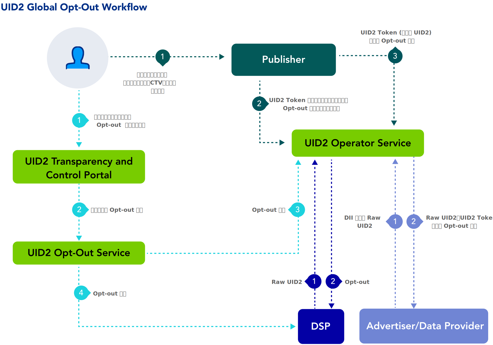

import Link from '@docusaurus/Link';

# User Opt-Out

さまざまなパブリッシャーや広告主が UID2 を使用しています。しかし、UID2 全体としては、すべての UID2 [参加者](../ref-info/glossary-uid.md#gl-participant) が受け入れるべき、具体的なオプトアウトプロセスがあります。

## How Users Can Opt Out of UID2

UID2 エコシステムには、2 種類のオプトアウトがあります:
- 参加者のサイトからのオプトアウト
- UID2 からのオプトアウト

各参加者には独自のオプトアウトワークフローがあるため、参加者はユーザーのオプトアウトステータスを受け入れ、したがって参加者からオプトアウトしたユーザーの UID2 を作成しないことが義務付けられています。

例えば、あるユーザーがパブリッシャーのサイトからオプトアウトしたが、UID2 からオプトアウトしていない場合、パブリッシャーはそのユーザーの UID2 Token を生成すべきではありません。 

消費者はいつでも、[Transparency and Control Portal](https://www.transparentadvertising.com/) で UID2 を完全にオプトアウトすることができます。メールアドレスまたは電話番号を選択し、データを入力し、プロンプトに従ってください。

:::tip
メールアドレスと電話番号の両方をオプトアウトするには、それぞれ行います。
:::

## Difference Between Opting Out from a Single Participant and Opting Out of UID2

消費者が特定の参加者からオプトアウトした場合、UID2 のガイドラインでは、その参加者は、その消費者の情報を使用して UID2 を作成したり生成したりしないことを義務付けています。これは UID2 フレームワークの要件です。

さらに、ユーザーが特定の参加者からオプトアウトした場合、その情報は UID2 には伝わりません。特定の参加者からオプトアウトしても、消費者が UID2 からオプトアウトされるわけではありません。

消費者が UID2 を完全にオプトアウトする確実な方法は、[Transparency and Control Portal](https://www.transparentadvertising.com/) にあります。

## Opt-Out Workflow

消費者が UID2 をオプトアウトすると、その個人の UID2 は、UID2 エコシステムのどこででも、ターゲティング広告のために受け入れられることはなくなります。ただし、UID2 情報の処理と更新にかかる時間には遅延があるため、オプトアウトしたユーザーの UID2 は、オプトアウト後もしばらくの間は有効である可能性があります。各参加者が UID2 を定期的に更新すると、オプトアウト情報が参加者に伝搬されます。

以下の手順は、メールアドレスまたは電話番号から UID2 が作成されたユーザーを対象としたオプトアウトワークフローの概要です。

1. ユーザーは [Transparency and Control Portal](https://www.transparentadvertising.com/) にアクセスし、UID2 のオプトアウトをグローバルに行うことができます。
2. Transparency and Control Portalは、オプトアウト要求を UID2 <Link href="../ref-info/glossary-uid#gl-operator-service">Operator Service</Link> に送信します。
3. ユーザーがオプトアウトした場合、UID2 Operator Service はオプトアウト情報を UID2 参加者に以下のように配布します:

   | Participant | Distribution Method |
   | :--- | :--- | 
   | Publishers | [POST&nbsp;/token/generate](../endpoints/post-token-generate.md) を必須パラメータ `optout_check` を `1` に設定して呼び出したパブリッシャー、または [POST&nbsp;/token/refresh](../endpoints/post-token-refresh.md) を呼び出したパブリッシャーは、UID2 Token の代わりにオプトアウトレスポンスを受け取ります。|
   | DSPs | UID2 Operator Service は、DSP に対して、その目的のために提供された Webhook を介して、オプトアウトしたすべてのユーザーの情報を配布します。詳細は [Honor User Opt-Outs](../guides/dsp-guide#honor-user-opt-outs) を参照してください。 DSP は、[POST&nbsp;/optout/status](../endpoints/post-optout-status.md) エンドポイントを使用して、生の UID2 のオプトアウトステータスを確認することもできます。 |
   | 広告主とデータプロバイダー | UID2 Operator Service は、[POST&nbsp;/identity/map](../endpoints/post-identity-map.md) エンドポイントを介して、広告主とデータプロバイダーにオプトアウト情報を配布します。別のオプションとして、[POST&nbsp;/optout/status](../endpoints/post-optout-status.md) エンドポイントを使用して、raw UID2 のオプトアウトステータスを確認することもできます。 |
   | Sharers | UID2 Sharer は、[POST&nbsp;/optout/status](../endpoints/post-optout-status.md) エンドポイントを使用して、raw UID2 のオプトアウトステータスを確認することができます。 |

このワークフローにより、ユーザーは Transparency and Control Portal を通じて、UID2 に基づくパーソナライズ広告をオプトアウトすることができます。

