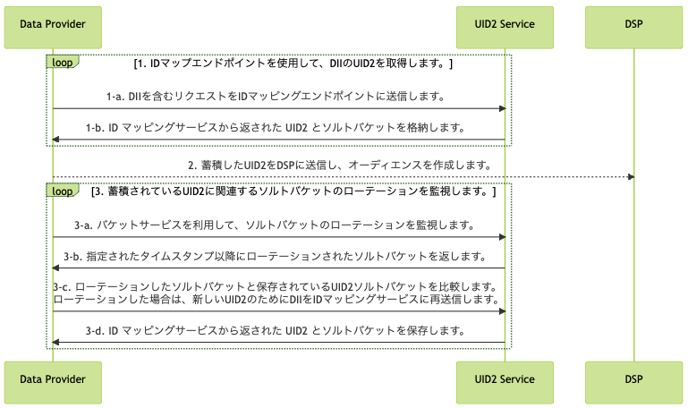

import Link from '@docusaurus/Link';

# Advertiser/Data Provider Integration Guide

このガイドでは、ユーザーデータを収集し、DSP にプッシュする組織のためのインテグレーション手順について説明します。データコレクターには、広告主、データオンボーダー、測定プロバイダー、ID グラフプロバイダー、サードパーティデータプロバイダー、および DSP にデータを送信する他の組織が含まれます。

Snowflake Data Marketplace でホストされる Open Operator Service を使用する場合は、[Snowflake Integration Guide](../guides/snowflake_integration.md) も参照してください。

## Advertiser/Data Provider Routes to Use UID2

アドテクノロジー業界では、広告主は ID を使用してオーディエンスを構築し、コンバージョンを追跡し、グラフを生成します。広告主または広告主の代理としてデータプロバイダーが UID2 を使用してこれらの目標を達成する方法の例を以下に示します。

:::note
これらのユースケース以外にも、UID2 を使用する方法はあります。これらはいくつかの例です。
:::

| Send/Receive? | Action | Advantage/Result |
| --- | --- | --- |
| Send | UID2 を API またはピクセルを介して送信 | オーディエンスを作成します。 |
| Send | UID2 をコンバージョン情報として送信 | コンバージョン情報を使用して測定 (アトリビューション) またはリターゲティングに使用します。 |
| Receive | API またはピクセルを介してグラフ/データプロバイダーから UID2 を受信 | グラフデータを構築します。 |

<!-- - **Create/send in audiences**: You can send UID2s to create audiences via API or pixels
- **Send in conversions**: You can send UID2s as conversion information that can be used for measurement (attribution) or retargeting via API or pixels
- **Receive graph data**: You can receive UID2s from graph/data providers via API or pixels. -->

### High-Level Steps

広告主およびデータプロバイダーが UID2 とインテグレーションする手順は次のとおりです:

1. <Link href="../ref-info/glossary-uid#gl-dii">directly identifying information (DII)</Link> から UID2 を生成するか、広告主やデータプロバイダーなどの他の UID2 参加者から UID2 を受け取ります。

1. Step1 で受け取った UID2 を使用します。たとえば、以下のいずれかを行うかもしれません:
   - 何らかの操作を行う: たとえば、DII から生成した UID2 と広告主やデータプロバイダーなどの他の参加者から受け取った UID2 を組み合わせます。
   - 既存のオーディエンスに新しい UID2 を追加します。

1. Raw UID2 を計測目的で使用します。

## Integration Diagram

以下の図は、オーディエンスの構築とターゲティングのために DII を raw UID2 にマッピングするためにデータコレクターが完了する必要がある手順を示しています。

DII とは、正規化されたメールアドレスや電話番号、あるいは正規化され SHA-256 ハッシュ化されたメールアドレスや電話番号のことです。

<!-- diagram source: resource/advertiser-flow-mermaid.md.bak -->

図の各部の詳細については、以下のセクションを参照してください:
1. [Retrieve a raw UID2 for DII using the identity map endpoints](#1-retrieve-a-raw-uid2-for-dii-using-the-identity-map-endpoint)
2. [Send stored raw UID2s to DSPs to create audiences or conversions](#2-send-stored-raw-uid2s-to-dsps-to-create-audiences-or-conversions)
3. [Monitor for salt bucket rotations related to your stored raw UID2s](#3-monitor-for-salt-bucket-rotations-related-to-your-stored-raw-uid2s)

### 1: Retrieve a raw UID2 for DII using the identity map endpoint

| Step | Endpoint | Description |
| --- | --- | --- |
| 1-a  | [POST&nbsp;/identity/map](../endpoints/post-identity-map.md)リクエスト | DII を含むリクエストを ID マッピングエンドポイントに送信します。 |
| 1-b | [POST&nbsp;/identity/map](../endpoints/post-identity-map.md) レスポンス | レスポンスで返される `advertising_id` (raw UID2) は、関連する DSP でオーディエンスをターゲティングするために使用できます。 このレスポンスは、ユーザーの raw UID2 と、ソルトバケットに対応する `bucket_id` を返します。バケットに割り当てられたソルトは毎年ローテーションされ、生成される raw UID2 に影響を与えます。ソルトバケットのローテーションをチェックする方法の詳細は [3: Monitor for salt bucket rotations](#3-monitor-for-salt-bucket-rotations-related-to-your-stored-raw-uid2s) を参照してください。 メンテナンスを簡単にするために、ユーザの raw UID2 と `bucket_id` をマッピングテーブルに格納することを推奨します。インクリメンタルな更新に関するガイダンスについては、[Use an incremental process to continuous-update raw UID2s](#use-an-incremental-process-to-continuously-update-raw-uid2s) を参照してください。|

### 2: Send stored raw UID2s to DSPs to create audiences or conversions

Step 1-b で返された `advertising_id` (raw UID2) を、オーディエンスを構築しながら DSP に送信します。各 DSP はオーディエンスを構築するための独自のインテグレーションプロセスを持っています。raw UID2 を送信してオーディエンスを構築するには、DSP が提供するインテグレーションガイダンスに従ってください。

### 3: Monitor for salt bucket rotations related to your stored raw UID2s
raw UID2 は、特定の時点のユーザーに対する識別子です。特定のユーザーの raw UID2 は、ソルトのローテーションの結果、少なくとも 1 年に 1 回は変化します。

ソルトバケットの更新は 1 年に 1 回程度ですが、個々のバケットの更新は 1 年に分散しています。全ソルトバケットの約 1/365 を毎日ローテーションしています。

:::important
あなたのインテグレーションが最新の raw UID2 を持っていることを確認するために、アクティブなユーザーのソルトバケットのローテーションを毎日チェックしてください。
:::

| Step | Endpoint | Description |
| --- | --- | --- |
| 3-a  | [POST&nbsp;/identity/buckets](../endpoints/post-identity-buckets.md) | 特定のタイムスタンプ以降に変更されたすべてのソルトバケットについて、バケットステータスエンドポイントにリクエストを送信します。 |
| 3-b  | [POST&nbsp;/identity/buckets](../endpoints/post-identity-buckets.md) | UID2 service: バケットステータスエンドポイントは `bucket_id` と `last_updated` のタイムスタンプのリストを返します。 |
| 3-c  | [POST&nbsp;/identity/map](../endpoints/post-identity-map.md)         | 返された`bucket_id`を、キャッシュしておいた raw UID2 のソルトバケットと比較します。 1 つ以上の raw UID2 についてソルトバケットが更新されていることがわかったら、新しい raw UID2 について ID マッピングサービスに DII を再送信します。 |
| 3-d  | [POST&nbsp;/identity/map](../endpoints/post-identity-map.md)         | `advertising_id`と`bucket_id`に返された新しい値を保存します。 |

## Use an Incremental Process to Continuously Update Raw UID2s

UID2 ベースのオーディエンス情報を正確かつ最新の状態に保つために、毎日以下のインテグレーション手順を実行してください:

1.  [UID2 retrieval step](#1-retrieve-a-raw-uid2-for-dii-using-the-identity-map-endpoint) のレスポンスにはマッピング情報が含まれています。以下をキャッシュします:
   - DII (`identifier`) と raw UID2 (`advertising_id`) とソルトバケット (`bucket_id`) のマッピング。
   - 最新の `last_updated` タイムスタンプ。
2. Step 3の結果を使用して、[Monitor for salt bucket rotations related to your stored raw UID2s](#3-monitor-for-salt-bucket-rotations-related-to-your-stored-raw-uid2s)、 Step1 の [Retrieve a raw UID2 for DII using the identity map endpoint](#1-retrieve-a-raw-uid2-for-dii-using-the-identity-map-endpoint) に従って、ソルトバケットがローテーションされた ID の新しい raw UID2 を取得して、ソルトバケットの raw UID2 を再マッピングします。

   次に、Step 2 の[send raw UID2 to a DSP](#2-send-stored-raw-uid2s-to-dsps-to-create-audiences-or-conversions) に従って、リフレッシュされた UID2 を使ってオーディエンスまたはコンバージョンを更新します。

## Check Opt-Out Status

ユーザーのオプトアウトステータスを受け入れることは重要です。最新のオプトアウト情報を確認するために、次の 2 つの方法を使用できます:

- UID2 Operator Service は、広告主やデータプロバイダーに、[POST&nbsp;/identity/map](../endpoints/post-identity-map.md) エンドポイントを介してオプトアウト情報を配布します。

- 広告主やデータプロバイダーは、[POST&nbsp;/optout/status](../endpoints/post-optout-status.md) エンドポイントを使用して、生の UID2 のオプトアウトステータスを確認できます。

## FAQs

UID2 フレームワークを使用する広告主およびデータプロバイダー向けのよくある質問は、[FAQs for Advertisers and Data Providers](../getting-started/gs-faqs.md#faqs-for-advertisers-and-data-providers) を参照してください。
