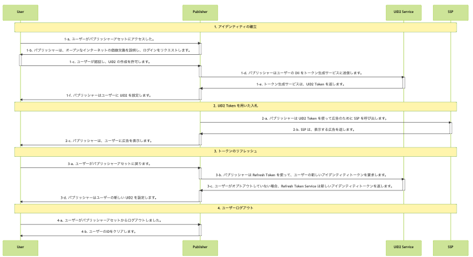

# Publisher Integration Guide, Server-Only

このガイドは、UID2 対応のシングルサインオンや ID プロバイダーではなく、UID2 と直接インテグレーションしながら、RTB ビッドストリーム用に UID2 Token (Advertising Token) を生成したいパブリッシャーを対象としています。

<!-- It includes the following sections:

- [Introduction](#introduction)
- [Integration Steps ](#integration-steps)
  - [Establish Identity: User Login](#establish-identity-user-login)
  - [Bid Using UID2 Tokens](#bid-using-uid2-tokens)
  - [Refresh Tokens](#refresh-tokens)
  - [Clear Identity: User Logout](#clear-identity-user-logout)
  - [Sample Application](#sample-application)
- [FAQs](#faqs) -->

## Introduction

このガイドでは、Client-Side または Server-Side SDK を使用せずにインテグレーションを行う場合に考慮する必要がある[基本的な手順](#integration-steps)を概説します。例えば、ユーザーのログインとログアウトの実装方法、UID2 ID 情報の管理とターゲティング広告への使用方法、トークンのリフレッシュ、ID の欠落への対処、ユーザーのオプトアウトの処理方法などを決定する必要があります。[FAQ](#faqs)も参照してください。

このガイドでは、Client-Side または Server-Side SDK を使用せずにインテグレーションを行う場合に考慮する必要がある[基本的な手順](#integration-steps)を概説しています。例えば、以下のような方法を決定する必要があります:

- ユーザーログインとログアウトの実装方法
- UID2 アイデンティティ情報を管理し、ターゲティング広告に使用する方法
- UID2 Token をリフレッシュする方法
- 紛失した ID の対処方法
- ユーザーのオプトアウトを管理する方法

[FAQ](#faqs)も参照してください。

パブリッシャーが UID2 とインテグレーションするために利用できるオプションは以下のとおりです:

- Client UID2 SDK for JavaScript ([UID2 SDK for JavaScript Reference Guide](../sdks/client-side-identity.md) を参照してください) と [UID2 SDK for Java](../sdks/uid2-sdk-ref-java.md) on the server.
- Client UID2 SDK for JavaScript ([UID2 SDK for JavaScript Reference Guide](../sdks/client-side-identity.md) を参照してください) と custom server code.
- Server-only integration と [UID2 SDK for Java](../sdks/uid2-sdk-ref-java.md) または [UID2 SDK for Python](../sdks/uid2-sdk-ref-python.md) on the server.
- Server-only integration と custom server code.

このガイドでは、最後の 2 つのオプションに関する情報を提供します。

ワークフローを示すサンプルアプリケーションもあります。[サンプルアプリケーション](#sample-application)を参照してください。

> TIP: UID2 を使用してクライアントの identity を確立し、UID2 Token を取得するプロセスを容易にするには、UID2 SDK for JavaScript の使用を検討してください。詳細については、[JavaScript Standard Integration Guide](integration-javascript-standard.md)を参照してください。

## Integration Steps

以下の図は、ユーザーがパブリッシャーと UID2 Token を確立するために必要なステップと、UID2 Token が RTB ビッドストリームとどのようにインテグレーションされるかを概説したものです。

Server-Side SDK を使用している場合、SDK はエンドポイントに関連するすべてのステップを処理します。例えば、Step 1-d では、発行者はユーザーの DII をトークン生成サービスに送信します。

次のセクションでは、図中の各ステップについて詳細を説明します:

1. [Establish identity: user login](#establish-identity-user-login)
2. [Bid using a UID2 token](#bid-using-a-uid2-token)
3. [Refresh a UID2 token](#refresh-a-uid2-token)
4. [Clear Identity: user logout](#clear-identity-user-logout)

### Establish Identity: User Login

Step 1-c での認証(ユーザーの同意を得ること、パブリッシャーがユーザーのメールアドレスまたは電話番号を検証することを含む)の後、パブリッシャーは Server-Side で UID2 Token を生成するリクエストを送ることがでます。以下の表は、トークン生成ステップの詳細です。

| Step | Endpoint | Description |
| :--- | :--- | :--- |
| 1-d  | [POST /token/generate](../endpoints/post-token-generate.md) | パブリッシャーが UID2 を使用してアイデンティティを確立するには、2 つの方法があります: - UID2 対応のシングルサインオンプロバイダーとインテグレーションします。 - [POST /token/generate](../endpoints/post-token-generate.md) エンドポイントを使って、ユーザーの正規化したメールアドレスまたは電話番号から UID2 Token を生成します。 |
| 1-e  | [POST /token/generate](../endpoints/post-token-generate.md) | ユーザーのメールアドレス、電話番号、またはそれぞれのハッシュからと、Refresh Token などの関連値から生成された UID2 Token を返します。 |
| 1-f  | N/A                                                         | 返された `advertising_token` と `refresh_token` は、ユーザーに紐づくストレージに保存します。ファーストパーティクッキーのようなClient-Side のストレージや、Server-Sideのストレージを検討するとよいでしょう。|

### Bid Using a UID2 Token

UID2 ID 情報をどのように管理し、ターゲティング広告に使用したいかを検討する必要があります。例えば、返された UID2 token を SSP に渡す等。

| Step | Endpoint | Description |
| :--- | :--- | :--- |
| 2-a  | N/A      | Step [1-e](#establish-identity-user-login) の `advertising_token` を入札のために SSP に送信します。そのままの値を送信します。 |

>NOTE: UID2 Token が SSP から DSP に送信されるとき、ビッドストリーム内でどのように見えるかの例については、[What does a UID2 token look like in the bid stream?](../getting-started/gs-faqs.md#what-does-a-uid2-token-look-like-in-the-bid-stream) を参照してください。

### Refresh a UID2 Token

`POST /token/refresh` エンドポイントを使用して、常に有効で最新の UID2 Token を持つようにします。UID2 ローテーションと同期させるには、UID2 Token をリフレッシュする必要があります。さらに、トークンリフレッシュプロセスではユーザーのオプトアウトステータスをチェックし、ユーザーがオプトアウトしている場合は新しいトークンを送信しません。これによりトークンリフレッシュチェーンが終了します。その UID2 Token を二度と使用してはなりません。

| Step | Endpoint | Description |
| :--- | :--- | :--- |
| 3-a  | N/A | ユーザーがアセットに戻り、再びアクティブになったとき、UID2 Token をリフレッシュしてから、SSP に送信します。 |
| 3-b  | [POST /token/refresh](../endpoints/post-token-refresh.md) | Step [1-e](#establish-identity-user-login) で取得した `refresh_token` をクエリパラメータとして送信します。 |
| 3-c  | [POST /token/refresh](../endpoints/post-token-refresh.md) | UID2 Service は、オプトアウトしていないユーザーに対して新しい ID トークンを発行します。 |
| 3-d  | N/A | `POST /token/refresh` エンドポイントから返される値、`advertising_token` と `refresh_token` を、ユーザーにリンクされるように配置します。ファーストパーティのクッキーのようなClient-Side のストレージか、サーバサイドのストレージを検討するとよいでしょう。 |

> TIP: [POST /token/generate](../endpoints/post-token-generate.md) または [POST /token/refresh](../endpoints/post-token-refresh.md) エンドポイントによって返された ID の `refresh_from` タイムスタンプからトークンのリフレッシュを始めてください。

### Clear Identity: User Logout

| Step | Endpoint | Description |
| :--- | :--- | :--- |
| 4-a  | N/A | ユーザーがパブリッシャーアセットからログアウトしました。|
| 4-b  | N/A | そのユーザー用に保存してある UID2 Token を削除します。UID2 Service とのやりとりは必要ありません。 |

## Sample Application

A sample application is available for server-only integration. See:
Server-only のインテグレーションの場合は、サンプル・アプリケーションをがあります:

- [Server-Only UID2 Integration Example (sample application)](https://esp-srvonly-integ.uidapi.com/)
- [Server-Only UID2 Integration Example (readme)](https://github.com/IABTechLab/uid2-examples/blob/main/publisher/server_only/README.md)

## FAQs

パブリッシャー向けのよくある質問は、[FAQs for Publishers](../getting-started/gs-faqs.md#faqs-for-publishers) を参照してください。
