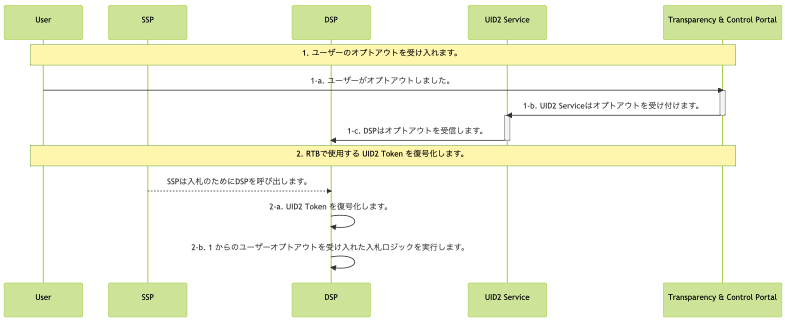
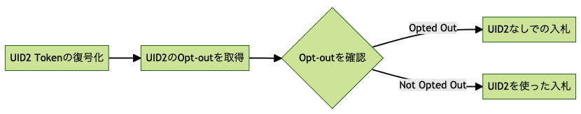

import Link from '@docusaurus/Link';

# DSP Integration Guide

このガイドは、<Link href="../ref-info/glossary-uid#gl-bidstream">ビッドストリーム</Link>で UID2 の取引を行う DSP を対象としています。

DSP はビッドリクエストで UID2 Token を受け取り、この機能をサポートする Server-Side SDK のいずれかを使用して UID2 Token を復号化し、入札に使用できる raw UID2 を取得します。

利用可能な Server-Side SDK の概要については、[SDKs: Summary](../sdks/summary-sdks.md) を参照してください。

:::note
バックエンドが、利用可能な Server-Side SDK のいずれでもカバーされていない言語で書かれている場合は、UID2 の担当者に問い合わせてください。誰に聞けばいいかわからない場合は、[連絡先情報](../getting-started/gs-account-setup.md#contact-info) を参照してください。
:::

## Integration Steps 

以下は、RTB で UID2 をサポートするための DSP のインテグレーションワークフローで、大きく 2 つのステップで構成されています:
1. [Honor user opt-outs](#honor-user-opt-outs)
2. [Decrypt UID2 tokens for RTB use](#decrypt-uid2-tokens-for-rtb-use)



<!-- diagram source: resource/dsp-guide-flow-mermaid.md.bak -->

### Honor User Opt-Outs

このセクションには、UID2 のユーザーオプトアウトを受け入れる必要がある DSP 向けの以下の情報が含まれています:

- [Opt-Out Webhook](#opt-out-webhook)
- [POST /optout/status Endpoint](#post-optoutstatus-endpoint)
- [Bidding Opt-Out Logic](#bidding-opt-out-logic)

#### Opt-Out Webhook

UID2 Service からユーザーオプトアウトを受け取り、それを受け入れるために DSP が事前に設定されたインターフェース (オプトアウト Webhook/API エンドポイント) を確立し、オンボーディング中に UID2 Service に提供します。ユーザーがオプトアウトすると、UID2 Service はユーザーの raw UID2 と対応するオプトアウトタイムスタンプを事前に設定されたインターフェースに送信します。

UID2 Service は、ユーザーのオプトアウトから数秒以内に次のデータを送信し、DSP は [Decrypt UID2 Tokens for RTB Use](#decrypt-uid2-tokens-for-rtb-use) で定義された入札ロジックを使用します。

| Parameter | Description |
| :--- | :--- |
| `identity` | オプトアウトしたユーザーの raw UID2。 |
| `timestamp` | ユーザーがオプトアウトした時刻 (情報のみ)。 |

DSP は、オプトアウトデータに 200 レスポンスコードで応答する必要があります。

次の例は、raw UID2 と対応するタイムスタンプを受信するように構成された Webhook を示しています:

```html
https://dsp.example.com/optout?user=%%identity%%&optouttime=%%timestamp%%
```

#### POST /optout/status Endpoint

DSP は、[POST&nbsp;/optout/status](../endpoints/post-optout-status.md) エンドポイントを使用して raw UID2 のオプトアウトステータスを確認できます。

#### Bidding Opt-Out Logic

入札時 (2-b)に以下のロジックを使用し、ユーザーのオプトアウトを受け入れます。

Server-Side SDK のいずれか ([SDKs: Summary](../sdks/summary-sdks.md) を参照) を利用して、受信した UID2 Token を raw UID2 に復号します。decrypt関数へのレスポンスには、raw UID2 が含まれます。

オプトアウトのロジックを次の図に示します。



ユーザーがオプトアウトして他場合、UID2 は RTB に使用されるべきではありません。このような場合、DSP は入札のために代替 ID を送信するか、入札しないことを選択できます。

### Decrypt UID2 Tokens for RTB Use

次の表は、[Integration Steps](#integration-steps) で示したワークフロー図の Step 2 の詳細です。

| Step | SDK | Description |
| :--- | :--- | :--- |
| 2-a  | Server-side SDK ([SDKs: Summary](../sdks/summary-sdks.md) を参照) | 提供されている SDK を活用して、入力された UID2 Token を復号化します。レスポンスには `UID2` と UID2 の作成時刻が含まれます。 |
| 2-b  | | DSP は UID2 のオプトアウトプロトコルを受け入れることが要求されます。ユーザーオプトアウトの設定と入札時の受け入れは、[ユーザーオプトアウトの受け入れ](#honor-user-opt-outs) を参照してください。 |

## Recommendations for Managing Latency

:::note
このセクションは、*SDK for C# / .NET Reference Guide* の [Usage for DSPs](../sdks/sdk-ref-csharp-dotnet.md#usage-for-dsps) にあるサンプルコードを参照してください。メソッド名は [Java](../sdks/sdk-ref-java.md#usage-for-dsps)、[Python](../sdks/sdk-ref-python#usage-for-dsps)、および [C++](../sdks/sdk-ref-cplusplus.md#interface) SDK でも同様です。
:::

低遅延/高スループットのセットアップを行う場合は、以下の推奨事項に従ってください:

- 各サーバーに `BidstreamClient` クラスのローカルインスタンスを持ちます。これはプロセス内またはプロセス外で行うことができます。プロセス内が最も簡単です。
- クライアントの `Refresh` メソッドをバックグラウンドで定期的に呼び出します: たとえば、1時間ごとに、グローバルフリートの再起動後のピークを避けるためにいくつかのランダム化を行います。
- トークンを暗号化する必要がある場合は、`DecryptTokenIntoRawUid` メソッドを呼び出します。プロセス内が最速ですが、正しく行えばプロセス外でも問題ありません。
  :::note
  トークンの復号化メソッドはスレッドセーフなので、複数のスレッドで同時に呼び出すことができます。
  :::

## FAQs

DSP に関するよくある質問は、[FAQs for DSPs](../getting-started/gs-faqs.md#faqs-for-dsps) を参照してください。
