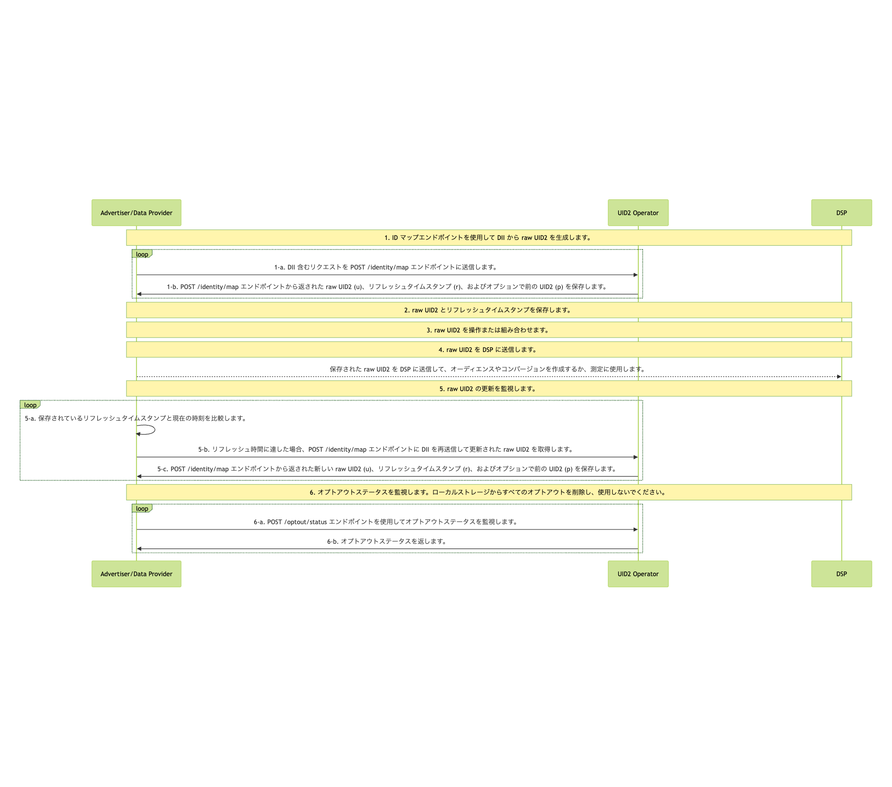

import Link from '@docusaurus/Link';

# Advertiser/Data Provider Integration to HTTP Endpoints

このガイドでは、広告主やデータプロバイダーが UID2 HTTP エンドポイントを呼び出すコードを記述して、SDK、Snowflake、または AWS Entity Resolution などの他の実装オプションを使用するのではなく、UID2 とインテグレーションする手順について説明します。

:::tip
広告主及びデータプロバイダー向けのインテグレーションオプションと手順の概要は、[Advertiser/Data Provider Integration Overview](integration-advertiser-dataprovider-overview.md) を参照してください。
:::

## Complete UID2 Account Setup and Configure Account

UID2 とインテグレーションするには、UID2 アカウントが必要です。まだアカウントを作成していない場合は、まず [Account Setup](../getting-started/gs-account-setup.md) ページに記載されている手順に従ってください。

初期アカウント設定が完了すると、[UID2 Portal](../portal/portal-overview.md) にアクセスするための指示とリンクが送信されます。ここで、[credentials](../getting-started/gs-credentials.md) を作成し、必要に応じて追加の値を構成できます。詳細は、[Getting Started with the UID2 Portal](../portal/portal-getting-started.md) を参照してください。

UID2 Portal の [API Keys](../portal/api-keys.md) ページで、次の値を設定する必要があります:

- <Link href="../ref-info/glossary-uid#gl-api-key">API key</Link> (クライアントキーとも呼ばれます)
- <Link href="../ref-info/glossary-uid#gl-client-secret">Client secret</Link> (参加者と UID2 サービスのみに知られている値)

:::important
これらの値を安全に保管することが非常に重要です。詳細は、[Security of API Key and Client Secret](../getting-started/gs-credentials.md#security-of-api-key-and-client-secret) を参照してください。
:::

## High-Level Steps

UID2 とインテグレーションするための広告主やデータプロバイダー向けの手順は、以下のとおりです:

1. [Generate Raw UID2s from DII](#1-generate-raw-uid2s-from-dii)

2. [Store Raw UID2s and Refresh Timestamps](#2-store-raw-uid2s-and-refresh-timestamps)

3. [Manipulate or Combine Raw UID2s](#3-manipulate-or-combine-raw-uid2s)

4. [Send Stored Raw UID2s to DSPs to Create Audiences or Conversions](#4-send-stored-raw-uid2s-to-dsps-to-create-audiences-or-conversions)

5. [Monitor for Raw UID2 Refresh](#5-monitor-for-raw-uid2-refresh)

6. [Monitor for Opt-Out Status](#6-monitor-for-opt-out-status)

## Integration Diagram

次の図は、オーディエンスの構築とターゲティングのために、DII を raw UID2 にマッピングするためにデータ収集者が行わなければならない手順です。

DII は、ユーザーの正規化されたメールアドレスまたは電話番号、または正規化および SHA-256 ハッシュ化されたメールアドレスまたは電話番号を指します。

<!-- diagram source: resource/advertiser-flow-endpoints-v3-mermaid.mermaid -->

### 1: Generate Raw UID2s from DII

| Step | Endpoint | Description |
| --- | --- | --- |
| 1-a | [POST&nbsp;/identity/map](../endpoints/post-identity-map.md) request | DIIを含むリクエストをアイデンティティマッピングエンドポイントに送信します。 |
| 1-b | [POST&nbsp;/identity/map](../endpoints/post-identity-map.md) response | レスポンスで返される raw UID2 (`u` フィールド) は、関連する DSP でオーディエンスをターゲティングするために使用できます。 レスポンスは、ユーザーの raw UID2 (`u`)、リフレッシュ タイムスタンプ (`r`)、およびオプションで、現在の UID2 が過去 90 日以内にローテーションされた場合の前の raw UID2 (`p`) を返します。リフレッシュ タイムスタンプを使用して、UID2 を更新するタイミングを判断します。詳細は、[5: Monitor for Raw UID2 Refresh](#5-monitor-for-raw-uid2-refresh) を参照してください。 |

### 2: Store Raw UID2s and Refresh Timestamps

Step 1、[Generate Raw UID2s from DII](#1-generate-raw-uid2s-from-dii) のレスポンスには、マッピング情報が含まれています。以下の情報を保存することを推奨します:

- DII と raw UID2 (`u` フィールド) のマッピングをキャッシュします。
- raw UID2 がいつ更新されるかを知るために、リフレッシュ タイムスタンプ (`r` フィールド) を保存します。
- 過去 90 日以内にローテーションされた場合の前の raw UID2 (`p` フィールド) をオプションで保存します。

### 3: Manipulate or Combine Raw UID2s

Step 1 で受け取った UID2 を使用します。例えば、以下のような操作を行うことができます:

- いくつかの操作を行います:たとえば、DII から生成した raw UID2 と、広告主やデータプロバイダーなどの別の参加者から受け取った raw UID2 を突合します。
- 新しい raw UID2 を既存のオーディエンスに追加します。

### 4: Send Stored Raw UID2s to DSPs to Create Audiences or Conversions

raw UID2 は、以下のような目的で使用できます:

   - 保存されている raw UID2s を DSP に送信して、オーディエンスやコンバージョンを作成します。
   - 測定（アトリビューション）のために raw UID2s を使用します。

例えば、Step 1-b で返された (<Link href="../ref-info/glossary-uid#gl-raw-uid2">raw UID2</Link>) (`u` フィールド) を DSP に送信して、オーディエンスを構築することができます。各 DSP には、オーディエンスを構築するための独自のインテグレーションプロセスがあります。DSP が提供するインテグレーションガイダンスに従って、raw UID2 を送信してオーディエンスを構築してください。

API またはピクセルを介してコンバージョン情報を送信し、測定（アトリビューション）やリターゲティングに使用することもできます。

### 5: Monitor for Raw UID2 Refresh

raw UID2 は、特定の時点でのユーザーの識別子です。特定のユーザーの raw UID2 は、UID2 リフレッシュプロセスの一環として、およそ 1 年に 1 回変更されます。

v3 Identity Map API のレスポンスには、各 raw UID2 がいつリフレッシュされるかを示すリフレッシュ タイムスタンプ (`r` フィールド) が含まれています。このタイムスタンプを使用して、保存されたデータの raw UID2 を再生成するタイミングを判断します。このタイムスタンプ以降に raw UID2 がリフレッシュされることは保証されています。

リフレッシュの機会を毎日確認することを推奨します。以下の表は、raw UID2 のリフレッシュを監視する手順を示しています。

| Step | Action | Description |
| :--- | :--- | :--- |
| 5-a | ローカルでのタイムスタンプチェック | 現在の時刻と、以前に [POST&nbsp;/identity/map](../endpoints/post-identity-map.md) レスポンスから保存したリフレッシュ タイムスタンプ (`r` フィールド) を比較します。 |
| 5-b | [POST&nbsp;/identity/map](../endpoints/post-identity-map.md) | 現在の時刻がリフレッシュ タイムスタンプ以降である場合、同じ DII でアイデンティティマップエンドポイントを再度呼び出して raw UID2 を再生成します。 |
| 5-c | ローカルストレージの更新 | レスポンスから返された新しい raw UID2 (`u` フィールド)、リフレッシュ タイムスタンプ (`r` フィールド)、およびオプションで前の UID2 (`p` フィールド) を保存します。 |

#### Determine whether to refresh a raw UID2

raw UID2 を更新する必要があるかを判断するには、以下の手順に従います:

1.  現在の時刻と、[POST&nbsp;/identity/map](../endpoints/post-identity-map.md) のレスポンスから保存したリフレッシュタイムスタンプ（`r` フィールド）を比較します。

2. 現在の時刻がリフレッシュ タイムスタンプ以降である場合、同じ DII で [POST&nbsp;/identity/map](../endpoints/post-identity-map.md) を再度呼び出して raw UID2 を再生成します。

このアプローチにより、raw UID2 が最新の状態で、オーディエンスターゲティングや測定に有効であることが保証されます。

### 6: Monitor for Opt-Out Status

ユーザーのオプトアウトステータスを受け入れることは重要です。定期的にオプトアウトステータスを監視し、最近オプトアウトしたユーザーの raw UID2 を引き続き使用しないようにすることが重要です。

UID2 <Link href="../ref-info/glossary-uid#gl-operator-service">Operator Service</Link> を使用して、最新のオプトアウト情報を取得する方法は2つあります:

- [POST&nbsp;/identity/map](../endpoints/post-identity-map.md) エンドポイントを呼び出してオプトアウトを確認します。DII がオプトアウトされている場合、raw UID2 は生成されません。

- [POST&nbsp;/optout/status](../endpoints/post-optout-status.md) エンドポイントを使用して raw UID2 のオプトアウトステータスを確認します。

UID2 のオプトアウト手順の詳細と、ユーザーがどのようにオプトアウトできるかは、[User Opt-Out](../getting-started/gs-opt-out.md) を参照してください。

## Using POST /identity/map Version 2

:::note
以下の情報は、`POST /identity/map` エンドポイントのバージョン 2 またはそれ以前を使用している場合にのみ関連し、参照用に提供されています。新しい実装では最新バージョンを使用する必要があります。手順は、[High-Level Steps](#high-level-steps) を参照してください。
:::

v2 Identity Map API の使用時との主な違いは以下の通りです:

- **Step 2**: リフレッシュタイムスタンプの代わりにソルトバケット ID を保存します。
- **Step 5**: リフレッシュタイムスタンプの代わりにソルトバケットのローテーションを監視します。

その他の Step (1, 3, 4, and 6) は、v3 実装で説明されている内容と同じです: [High-Level Steps](#high-level-steps) を参照してください。

### Integration Diagram (v2)

次の表は、v2 インテグレーションフローを示しています。違いは Step 2（ソルトバケット ID の保存）と Step 5（ソルトバケットのローテーションの監視）です。

<!-- diagram source: resource/advertiser-flow-endpoints-v2-mermaid.md.bak -->

### Store Raw UID2s and Salt Bucket IDs (v2)

:::note
このステップは、v3 実装の Step 2 を置き換えます。
:::

Step 1 のレスポンスには、マッピング情報が含まれています。以下の情報を保存することを推奨します:

- DII (`identifier`)、raw UID2 (`advertising_id`)、およびソルトバケット (`bucket_id`) のマッピングをキャッシュします。
- レスポンスデータを受信した時刻のタイムスタンプを保存します。後で、このタイムスタンプを Step 5 で返される `last_updated` タイムスタンプと比較できます。

### Monitor for Salt Bucket Rotations for Your Stored Raw UID2s (v2)

:::note
このステップは、v3 実装の Step 5 を置き換えます。
:::

raw UID2 は、特定の時点におけるユーザーを識別する ID です。特定のユーザーの raw UID2 は、<Link href="../ref-info/glossary-uid#gl-salt-bucket">ソルトバケット</Link> のローテーションの結果として、おおよそ 1 年に 1 回変更されます。

各ソルトバケットはおおよそ年に 1 回更新されますが、個々のバケットの更新は年間を通じて分散されます。おおよそ 365 分の 1 のソルトバケットが毎日ローテーションされます。このことを考慮して、オーディエンスの更新に合わせてソルトバケットのローテーションを定期的に確認することを推奨します。例えば、週ごとに更新する場合は、週ごとにソルトバケットの更新を確認してください。

ソルトバケットがローテーションされた場合は、raw UID2 を再生成します。詳細は、[Determine whether the salt bucket has been rotated](#determine-whether-the-salt-bucket-has-been-rotated) を参照してください。

次の表は、ソルトバケットのローテーションを確認する手順を示しています。

| Step | Endpoint | Description |
| --- | --- | --- |
| 5-a | [POST&nbsp;/identity/buckets](../endpoints/post-identity-buckets.md) | 特定のタイムスタンプ以降に変更されたすべてのソルトバケットについて、`POST /identity/buckets` エンドポイントにリクエストを送信します。 |
| 5-b | [POST&nbsp;/identity/buckets](../endpoints/post-identity-buckets.md) | UID2 Service: `POST /identity/buckets` エンドポイントは、`bucket_id` と `last_updated` タイムスタンプのリストを返します。 |
| 5-c | [POST&nbsp;/identity/map](../endpoints/post-identity-map-v2.md) | 返された `bucket_id` をキャッシュしている raw UID2 のソルトバケットと比較します。 1 つ以上の raw UID2 のソルトバケットが更新されている場合は、DII を `POST /identity/map` エンドポイントに再送信して新しい raw UID2 を取得します。 |
| 5-d | [POST&nbsp;/identity/map](../endpoints/post-identity-map-v2.md) | 返された `advertising_id` と `bucket_id` の新しい値を保存します。 |

##### Determine whether the salt bucket has been rotated

特定の raw UID2 のソルトバケット ID が変更されたかどうかを判断するには、以下の手順に従います。

1. 以下の値を比較します:

    - 監視中のソルトバケットのローテーションの一環として返された各 `bucket_id` の `last_updated` タイムスタンプ。

    - 同じ `bucket_id` の raw UID2 生成時のタイムスタンプ。これはステップ 1 で返され、ステップ 2 で保存されました。

1. `last_updated` タイムスタンプが以前のタイムスタンプよりも新しい場合、ソルトバケットがローテーションされています。そのため、この `bucket_id` に関連付けられた raw UID2 を再生成する必要があります。Step 1 の [Generate Raw UID2s from DII](#1-generate-raw-uid2s-from-dii) に従ってください。
