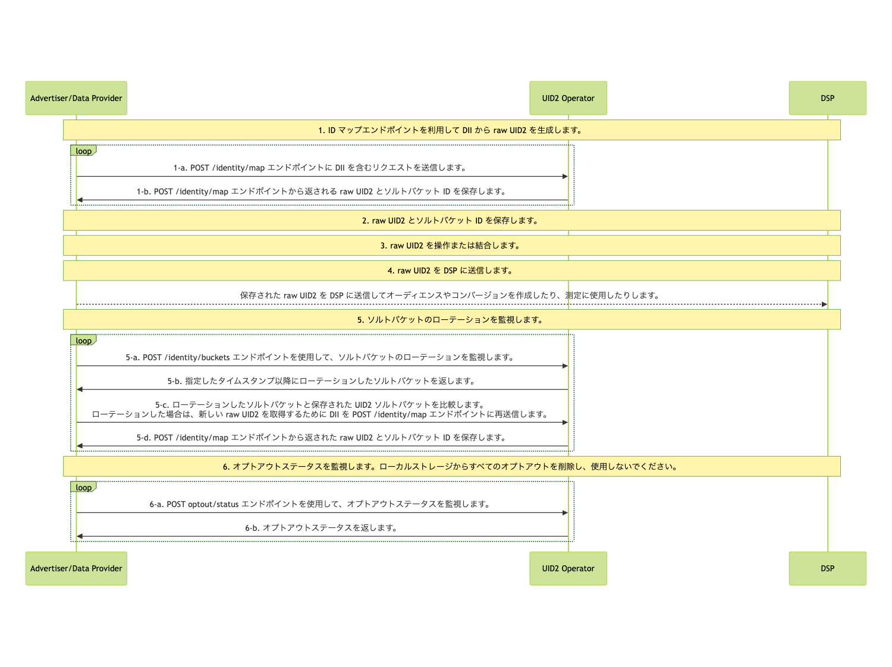

import Link from '@docusaurus/Link';

# Advertiser/Data Provider Integration to HTTP Endpoints

このガイドでは、広告主およびデータプロバイダが、UID2 とインテグレーションするために、SDK、Snowflake、または AWS Entity Resolution などの他の実装オプションを使用せずに、UID2 HTTP エンドポイントを呼び出すためのコードを記述する手順について説明します。

:::tip
広告主とデータプロバイダー向けのインテグレーションオプションと手順の概要については、[Advertiser/Data Provider Integration Overview](integration-advertiser-dataprovider-overview.md) を参照してください。
:::

## Complete UID2 Account Setup and Configure Account

UID2 とインテグレーションするには、UID2 のアカウントが必要です。まだアカウントを作成していない場合は、最初に [Account Setup](../getting-started/gs-account-setup.md) ページの手順に従ってください。

アカウントの初期設定が完了すると、本番環境用の [credentials](../getting-started/gs-credentials.md) を作成し、必要に応じて追加の値を設定できる [UID2 Portal](../portal/portal-overview.md) にアクセスするための手順とリンクが送信されます。詳細については、[UID2 Portal での開始](../portal/portal-getting-started.md) を参照してください。

UID2 Portal の [API Keys](../portal/api-keys.md) ページで、以下の値を設定する必要があります:

- <Link href="../ref-info/glossary-uid#gl-api-key">API key</Link>、Client Key とも呼ばれます。
- <Link href="../ref-info/glossary-uid#gl-client-secret">Client secret</Link>、参加者と UID2 Servivce のみが知る値です。

:::important
これらの値を安全に保管することは非常に重要です。詳細については、[Security of API Key and Client Secret](../getting-started/gs-credentials.md#security-of-api-key-and-client-secret) を参照してください。
:::

## High-Level Steps

広告主およびデータプロバイダーが UID2 とインテグレーションする手順は次のとおりです:

1. [Generate Raw UID2s from DII](#1-generate-raw-uid2s-from-dii)

2. [Store Raw UID2s and Salt Bucket IDs](#2-store-raw-uid2s-and-salt-bucket-ids)

3. [Manipulate or Combine Raw UID2s](#3-manipulate-or-combine-raw-uid2s)

4. [Send Stored Raw UID2s to DSPs to Create Audiences or Conversions](#4-send-stored-raw-uid2s-to-dsps-to-create-audiences-or-conversions)

5. [Monitor for Salt Bucket Rotations for Your Stored Raw UID2s](#5-monitor-for-salt-bucket-rotations-for-your-stored-raw-uid2s)

6. [Monitor for Opt-Out Status](#6-monitor-for-opt-out-status)

## Integration Diagram

以下の図は、オーディエンスの構築とターゲティングのために DII を raw UID2 にマッピングするためにデータコレクターが完了する必要がある手順を示しています。

DII は、ユーザーの正規化されたメールアドレスまたは電話番号、または正規化され、SHA-256 ハッシュされたメールアドレスまたは電話番号を指します。

<!-- diagram source: resource/advertiser-flow-endpoints-mermaid.md.bak -->

### 1: Generate Raw UID2s from DII

| Step | Endpoint | Description |
| --- | --- | --- |
| 1-a | [POST&nbsp;/identity/map (v2)](../endpoints/post-identity-map-v2.md) request | DII を含むリクエストを ID マッピングエンドポイントに送信します。 |
| 1-b | [POST&nbsp;/identity/map (v2)](../endpoints/post-identity-map-v2.md) response | レスポンスで返される `advertising_id` (raw UID2) は、関連する DSP でオーディエンスをターゲットするために使用できます。 レスポンスは、ユーザーの raw UID2 と、それに対応するソルトバケットの `bucket_id` を返します。バケットに割り当てられたソルトは年に一度ローテーションし、生成された raw UID2 に影響を与えます。ソルトバケットのローテーションを確認する方法の詳細は、[5: Monitor for salt bucket rotations related to your stored raw UID2s](#5-monitor-for-salt-bucket-rotations-for-your-stored-raw-uid2s) を参照してください。 |

### 2: Store Raw UID2s and Salt Bucket IDs

Step 1 のレスポンス [Generate Raw UID2s from DII](#1-generate-raw-uid2s-from-dii) には、マッピング情報が含まれています。以下の情報を保存することを勧めます:

- DII (`identifier`) と raw UID2 (`advertising_id`)、ソルトバケット (`bucket_id`) のマッピングをキャッシュします。
- レスポンスデータを受信した際のタイムスタンプを保存します。後で、このタイムスタンプを、Step 5 の [Monitor for Salt Bucket Rotations for Your Stored Raw UID2s](#5-monitor-for-salt-bucket-rotations-for-your-stored-raw-uid2s) で返される `last_updated` タイムスタンプと比較できます。

### 3: Manipulate or Combine Raw UID2s

Step 1 で受け取った UID2 を使用します。たとえば、次のような操作を行うことができます:

- 操作を行う: たとえば、DII から生成した UID2 と広告主またはデータプロバイダーなど他の参加者から受け取った UID2 を組み合わせる。
- 既存のオーディエンスに新しい UID2 を追加する。

### 4: Send Stored Raw UID2s to DSPs to Create Audiences or Conversions

raw UID2 を以下の目的で使用します:

   - 保存された raw UID2 を DSP に送信して、オーディエンスとコンバージョンを作成する。
   - 計測のために raw UID2 を使用する。

たとえば、Step 1-b で返された `advertising_id` (<Link href="../ref-info/glossary-uid#gl-raw-uid2">raw UID2</Link>) を DSP に送信してオーディエンスを構築します。各 DSP は、オーディエンスを構築するための独自のインテグレーションプロセスを持っています。オーディエンスを構築するために raw UID2 を送信するための DSP から提供されるインテグレーションガイダンスに従ってください。

また、計測（アトリビューション）やリターゲティングのために、API やピクセルを介してコンバージョン情報を送信することもできます。

### 5: Monitor for Salt Bucket Rotations for Your Stored Raw UID2s

raw UID2 は、特定の時点におけるユーザーの識別子です。raw UID2 は、<Link href="../ref-info/glossary-uid#gl-salt-bucket">ソルトバケット</Link> のローテーションにより、少なくとも年に一度変更されます。

各ソルトバケットは、約1年に1回更新されますが、個々のバケットの更新は年間を通じて分散されます。約 1/365 のソルトバケットが毎日ローテーションされます。このため、ソルトバケットのローテーションを定期的にチェックすることを勧めます。これは、オーディエンスの更新に合わせた頻度で行うことが望ましいです。たとえば、週ごとに更新する場合は、週ごとにソルトバケットの更新を確認してください。

ソルトバケットがローテーションされた場合は、raw UID2 を再生成します。詳細は、[Determine whether the salt bucket has been rotated](#determine-whether-the-salt-bucket-has-been-rotated) を参照してください。

以下の表は、ソルトバケットのローテーションを確認するための手順を示しています。

| Step | Endpoint | Description |
| --- | --- | --- |
| 5-a | [POST&nbsp;/identity/buckets](../endpoints/post-identity-buckets.md) | 特定のタイムスタンプ以降に変更されたすべてのソルトバケットに対して、`POST /identity/buckets` エンドポイントにリクエストを送信します。 |
| 5-b | [POST&nbsp;/identity/buckets](../endpoints/post-identity-buckets.md) | UID2 Service: `POST /identity/buckets` エンドポイントは、`bucket_id` と `last_updated` タイムスタンプのリストを返します。 |
| 5-c | [POST&nbsp;/identity/map (v2)](../endpoints/post-identity-map-v2.md) | 返された `bucket_id` をキャッシュした raw UID2 のソルトバケットと比較します。 1 つ以上の raw UID2 のソルトバケットが更新された場合は、新しい raw UID2 用に DII を `POST /identity/map` エンドポイントに再送信します。 |
| 5-d | [POST&nbsp;/identity/map (v2)](../endpoints/post-identity-map-v2.md) | `advertising_id` と `bucket_id` の新しい値を保存します。 |

#### Determine whether the salt bucket has been rotated

特定の raw UID2 のソルトバケット ID が変更されたかどうかを判断するには、次の手順に従います。

1. 以下の 2 つの値を比較します:

   - ソルトバケットのローテーション時に返された、同じ `bucket_id` の raw UID2 の `last_updated` タイムスタンプ。
   
   - Step 1 で返され、Step 2 で保存された、同じ `bucket_id` の raw UID2 生成時のタイムスタンプ。

1. `last_updated` タイムスタンプが、以前に記録したタイムスタンプよりも新しい場合、ソルトバケットがローテーションされています。その場合、この `bucket_id` に関連するすべての raw UID2 を再生成する必要があります。この場合は、Step 1 の [Generate Raw UID2s from DII](#1-generate-raw-uid2s-from-dii) に従ってください。

### 6: Monitor for Opt-Out Status

ユーザーのオプトアウトステータスを受け入れることは重要です。定期的にオプトアウトステータスを監視し、最近オプトアウトしたユーザーの UID2 を引き続き使用しないようにしてください。

UID2 <Link href="../ref-info/glossary-uid#gl-operator-service">Operator Service</Link> に最新のオプトアウト情報があるかを確認する方法は 2 つあります:

- [POST&nbsp;/identity/map (v2)](../endpoints/post-identity-map-v2.md) エンドポイントを呼び出してオプトアウトを確認します。DII がオプトアウトされている場合、raw UID2 は生成されません。

- [POST&nbsp;/optout/status](../endpoints/post-optout-status.md) エンドポイントを使用して、raw UID2 のオプトアウトステータスを確認します。

UID2 のオプトアウトワークフローとユーザーがオプトアウトする方法についての詳細は、[User Opt-Out](../getting-started/gs-opt-out.md) を参照してください。
