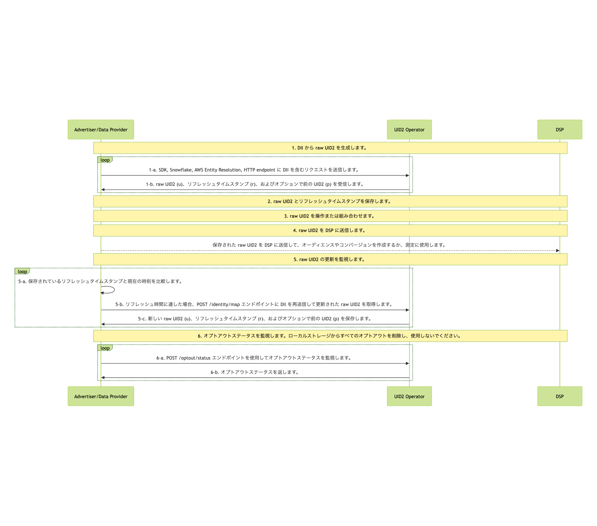
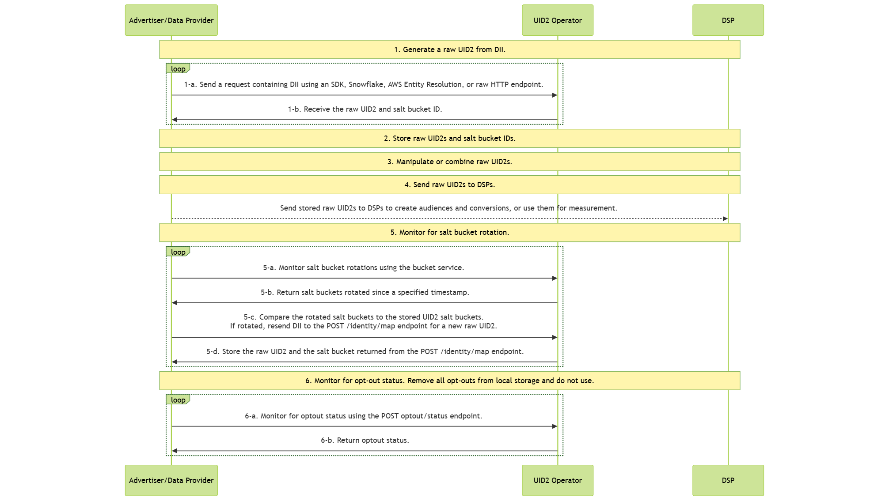

import Link from '@docusaurus/Link';
import SnptPreparingEmailsAndPhoneNumbers from '../snippets/_snpt-preparing-emails-and-phone-numbers.mdx';

# Advertiser/data provider integration overview

このガイドは、ユーザーデータを収集し、他の UID2 参加者に送信する組織向けのインテグレーションオプションの概要を提供します。データ収集者には、広告主、データオンボーダー、計測プロバイダー、ID グラフプロバイダー、サードパーティデータプロバイダー、およびその他のデータを他の参加者に送信する組織が含まれます。

## Advertiser/data provider routes to use UID2

アドテクノロジー業界では、広告主はアイデンティティを使用してオーディエンスを構築し、コンバージョンを追跡し、グラフを作成します。広告主として、または広告主に代わって行動するデータプロバイダーとして、以下の表は UID2 を使用してこれらの目標の一部を達成する方法の例を示しています。

:::note
UID2 は、これらのユースケース以外でも使用できます。これらは一部の例に過ぎません。
:::

| Send/Receive? | Action | Advantage/Result |
| --- | --- | --- |
| オーディエンスを送信 | API またはピクセルを介して raw UID2 を送信 | オーディエンスを作成します。 |
| コンバージョンを送信 | コンバージョン情報として raw UID2 を送信 | コンバージョン情報を計測（アトリビューション）または API やピクセルを介してリターゲティングに使用します。 |
| グラフデータを受信 | API またはピクセルを介してグラフ/データプロバイダーから raw UID2 を受信 | グラフデータを作成します。 |

## Preparing DII for processing

<SnptPreparingEmailsAndPhoneNumbers />

## High-level steps

UID2 とインテグレーションする広告主とデータプロバイダーのインテグレーション手順は、次のとおりです。

1. [Generate raw UID2s from DII](#1-generate-raw-uid2s-from-dii)

2. [Store raw UID2s and refresh timestamps](#2-store-raw-uid2s-and-refresh-timestamps)

3. [Manipulate or combine raw UID2s](#3-manipulate-or-combine-raw-uid2s)

4. [Send stored raw UID2s to DSPs to create audiences or conversions](#4-send-stored-raw-uid2s-to-dsps-to-create-audiences-or-conversions)

5. [Monitor for raw UID2 refresh](#5-monitor-for-raw-uid2-refresh)

6. [Monitor for opt-out status](#6-monitor-for-opt-out-status)

:::note
[POST&nbsp;/identity/map](../endpoints/post-identity-map.md) エンドポイントのバージョン 3 より前のバージョンを使用している場合は、[Using POST /identity/map version 2](#using-post-identitymap-version-2) を参照してください。このバージョンを使用している場合は、強化された機能を利用するためにできるだけ早くアップグレードすることを推奨します。
:::

## Summary of implementation options

以下の表は、広告主とデータプロバイダー向けの実装オプションを、各レベルのステップごとに示しています。一部のステップは、独自のカスタム実装の一部としてのみ管理されます。一部のステップは、利用可能な UID2 実装オプションの 1 つ以上によって管理できます。詳細は、各ステップのリンクをクリックしてください。

| High-Level Step | Implementation Options |
| --- | --- |
| [1: Generate raw UID2s from DII](#1-generate-raw-uid2s-from-dii) | DII を raw UID2 にマップするには、次のいずれかのオプションを利用します:<ul><li>UID2 SDK のいずれか:<ul><li>Python SDK: [Map DII to raw UID2s](../sdks/sdk-ref-python.md#map-dii-to-raw-uid2s)</li><li>Java SDK: [Usage for advertisers/data providers](../sdks/sdk-ref-java.md#usage-for-advertisersdata-providers)</li></ul></li><li>Snowflake: [Map DII](integration-snowflake.md#map-dii)</li><li>Databricks: [Map DII](integration-databricks.md#map-dii)</li><li>AWS Entity Resolution: [AWS Entity Resolution integration guide](integration-aws-entity-resolution.md)</li><li>HTTP endpoints: [POST&nbsp;/identity/map](../endpoints/post-identity-map.md)</li></ul> |
| [2: Store raw UID2s and refresh timestamps](#2-store-raw-uid2s-and-refresh-timestamps) | カスタム（必要に応じて） |
| [3: Manipulate or combine raw UID2s](#3-manipulate-or-combine-raw-uid2s) | カスタム（必要に応じて） |
| [4: Send stored raw UID2s to DSPs to create audiences or conversions](#4-send-stored-raw-uid2s-to-dsps-to-create-audiences-or-conversions) | カスタム（必要に応じて） |
| [5: Monitor for raw UID2 refresh](#5-monitor-for-raw-uid2-refresh) | [POST&nbsp;/identity/map](../endpoints/post-identity-map.md) エンドポイントから返されるリフレッシュタイムスタンプ（`r` フィールド）を使用して、raw UID2 を更新するタイミングを判断します。 |
| [6: Monitor for opt-out status](#6-monitor-for-opt-out-status) | [POST /optout/status](../endpoints/post-optout-status.md) エンドポイントへの API コール。 |

## Integration diagram

以下の図は、データ収集者がオーディエンスの構築とターゲティングのために DII を raw UID2 にマッピングするために完了する必要があるステップを概説しています。

DII とは、ユーザーの正規化されたメールアドレスまたは電話番号、または正規化されて SHA-256 ハッシュ化されたメールアドレスまたは電話番号を指します。

UID2 ベースのオーディエンス情報を正確かつ最新の状態に保つには、これらのインテグレーションステップを毎日実行してください。

<!-- diagram source: resource/advertiser-flow-overview-v3-mermaid.mermaid -->

図の各部分の詳細は、以下のセクションを参照してください。

### 1: Generate raw UID2s from DII

<Link href="../ref-info/glossary-uid#gl-dii">Directly Identifying Information (DII)</Link> から raw UID2 を生成するか、データプロバイダーなどの他の UID2 参加者から UID2 を受信できます。

raw UID2 を生成するには、次のいずれかのオプションを使用します:

- UID2 SDK のいずれか:

  - Python SDK: See [Map DII to raw UID2s](../sdks/sdk-ref-python.md#map-dii-to-raw-uid2s).
  - Java SDK: See [Usage for advertisers/data providers](../sdks/sdk-ref-java.md#usage-for-advertisersdata-providers).

- Snowflake: [Map DII](integration-snowflake.md#map-dii) を参照してください。

- Databricks: [Map DII](integration-databricks.md#map-dii) を参照してください。

- AWS Entity Resolution: [AWS Entity Resolution integration guide](integration-aws-entity-resolution.md) を参照してください。

- HTTP endpoints: [POST&nbsp;/identity/map](../endpoints/post-identity-map.md) を参照してください。詳細は、[Advertiser/data provider integration to HTTP endpoints](integration-advertiser-dataprovider-endpoints.md#1-generate-raw-uid2s-from-dii) を参照してください。

### 2: Store raw UID2s and refresh timestamps

Step 1 [Generate raw UID2s from DII](#1-generate-raw-uid2s-from-dii) のレスポンスには、マッピング情報が含まれています。Step 1 で返される以下の情報を保存することを推奨します:

- DII と raw UID2 (`u` フィールド) のマッピングをキャッシュします。
- リフレッシュタイムスタンプ (`r` フィールド) を保存して、raw UID2 がいつリフレッシュされるかを把握します。
- オプションで、過去 90 日以内に UID2 がリフレッシュされたユーザーのために提供された場合は、前の raw UID2 (`p` フィールド) を保存します。

### 3: Manipulate or combine raw UID2s

Step 1 で受け取った raw UID2 を使用します。たとえば、以下を行うことができます:

- 何らかの操作を行う: たとえば、DII から生成した raw UID2 と、広告主やデータプロバイダーなどの他の参加者から受け取った raw UID2 を組み合わせます。
- 新しい raw UID2 を既存のオーディエンスに追加します。

### 4: Send stored raw UID2s to DSPs to create audiences or conversions

raw UID2 を次の目的で使用します:

   - 保存された raw UID2 を DSP に送信して、オーディエンスやコンバージョンを作成します。
   - 測定のために raw UID2 を使用します。

たとえば、Step 1 で返された (<Link href="../ref-info/glossary-uid#gl-raw-uid2">raw UID2</Link> (`u` フィールド)) を DSP に送信してオーディエンスを作成することができます。各 DSP にはオーディエンスを作成するための独自のインテグレーションプロセスがあるため、raw UID2 を送信してオーディエンスを作成するためのインテグレーションガイダンスに従ってください。

コンバージョン情報を API またはピクセルを介して送信して、測定 (アトリビューション) またはリターゲティングを行うこともできます。

### 5: Monitor for raw UID2 refresh

raw UID2 は、特定の時点でのユーザーの識別子です。特定のユーザーの raw UID2 は、UID2 リフレッシュプロセスの一環として、約 1 年に 1 回変更されます。

v3 Identity Map API のレスポンスには、各 raw UID2 がいつリフレッシュされるかを示すリフレッシュタイムスタンプ (`r` フィールド) が含まれています。このタイムスタンプを使用して、保存されたデータの raw UID2 を再生成するタイミングを判断します。このタイムスタンプ以降に raw UID2 がリフレッシュされることは保証されています。

raw UID2 は、更新タイムスタンプ以降の時間には変更されません。更新タイムスタンプ以降、DII を再マッピングすると、新しい更新タイムスタンプが返されます。しかし、raw UID2 は変更される可能性もあります。複数の更新間隔で raw UID2 が変更されない可能性もあります。

リフレッシュのタイミングを毎日確認することを推奨します。raw UID2 をリフレッシュするかどうかを判断するには、次の手順に従います:

1. 現在の時刻と[POST&nbsp;/identity/map](../endpoints/post-identity-map.md) レスポンスから保存したリフレッシュタイムスタンプ (`r` フィールド) を比較します。

2. 現在の時刻がリフレッシュタイムスタンプ以降である場合、同じ DII で [POST&nbsp;/identity/map](../endpoints/post-identity-map.md) を再度呼び出して raw UID2 を再生成します。

このアプローチにより、raw UID2 が最新かつ有効であり、オーディエンスのターゲティングや測定に使用できることが保証されます。

### 6: Monitor for opt-out status

ユーザーのオプトアウトステータスを受け入れることは重要です。定期的にオプトアウトステータスを監視し、最近オプトアウトしたユーザーの raw UID2 を使用し続けないようにします。

UID2 <Link href="../ref-info/glossary-uid#gl-operator-service">Operator Service</Link> で最新のオプトアウト情報を確認するには、次の 2 つの方法があります:

- [POST&nbsp;/identity/map](../endpoints/post-identity-map.md) エンドポイントを呼び出してオプトアウトを確認します。DII がオプトアウトされている場合、raw UID2 は生成されません。

- [POST&nbsp;/optout/status](../endpoints/post-optout-status.md) エンドポイントを使用して raw UID2 のオプトアウトステータスを確認します。

UID2 オプトアウトワークフローの詳細や、ユーザーがオプトアウトする方法は、[User opt-out](../getting-started/gs-opt-out.md) を参照してください。

## Using POST /identity/map version 2

:::note
以下の情報は、`POST /identity/map` エンドポイントの以前のバージョン 2 を使用するインテグレーションアプローチにのみ関連し、参照用に提供されています。新しい実装では最新バージョンを使用する必要があります: [High-level steps](#high-level-steps) を参照してください。
:::

Identity Map API のバージョン 2 を使用する場合の主な違いは次のとおりです:

- **Step 2**: ソルトバケット ID を保存する代わりにリフレッシュタイムスタンプを保存します
- **Step 5**: ソルトバケットのローテーションを監視する代わりにリフレッシュタイムスタンプを使用します

他のすべてのステップ (1, 3, 4, および 6) は、v3 実装で説明されているとおりです: [High-level steps](#high-level-steps) を参照してください。

### Integration diagram (v2)

以下の図は、v2 インテグレーションフローを概説しています。主な違いは、Step 2（ソルトバケット ID の保存）と Step 5（ソルトバケットのローテーションの監視）にあります。

<!-- diagram source: resource/advertiser-flow-overview-v2-mermaid.md.bak -->

### Store raw UID2s and salt bucket ids (v2)

:::note
このステップは、v3 実装の Step 2 を置き換えます。
:::

Step 1 のレスポンスには、マッピング情報が含まれています。Step 1 で返される以下の情報を保存することを推奨します:

- DII (`identifier`) と raw UID2 (`advertising_id`) とソルトバケット (`bucket_id`) のマッピングを保存します。
- レスポンスデータを受信したタイムスタンプを保存します。後で、このタイムスタンプを Step 5 で返される `last_updated` タイムスタンプと比較できます。

### Monitor for salt bucket rotations for your stored raw UID2s (v2)

:::note
このステップは、v3 実装の Step 5 を置き換えます。
:::

raw UID2 は特定の時点でのユーザーの識別子です。特定のユーザーの raw UID2 は、<Link href="../ref-info/glossary-uid#gl-salt-bucket">ソルトバケット</Link>のローテーションの結果として、約 1 年に 1 回変更されます。

各ソルトバケットは約 1 年に 1 回更新されますが、個々のバケットの更新は年間を通じて分散されます。おおよそ 365 分の 1 のソルトバケットが毎日ローテーションされます。これに基づいて、オーディエンスの更新に合わせて定期的にソルトバケットのローテーションを確認することを推奨します。たとえば、毎週更新する場合は、毎週ソルトバケットの更新を確認します。

ソルトバケットがローテーションされた場合は、raw UID2 を再生成します。詳細は、[Determine whether the salt bucket has been rotated](#determine-whether-the-salt-bucket-has-been-rotated-v2) を参照してください。

ソルトバケットのローテーションを監視する手順は、以下のいずれかを参照してください:

- Python SDK: [Monitor rotated salt buckets](../sdks/sdk-ref-python.md#monitor-rotated-salt-buckets)

- Snowflake: [Monitor for salt bucket rotation and regenerate raw UID2s](integration-snowflake-previous#monitor-for-salt-bucket-rotation-and-regenerate-raw-uid2s)

- HTTP endpoints: [Monitor for salt bucket rotations for your stored raw UID2s (v2)](integration-advertiser-dataprovider-endpoints.md#monitor-for-salt-bucket-rotations-for-your-stored-raw-uid2s-v2)

<!-- GWH_Note 8/4/25 I took the .md out of the Snowflake link line 194 because Docu would not build it correctly... broken link in output. Do not know why, though. Same thing on 2 links -->

:::note
AWS Entity Resolution では、ソルトバケットの監視を行う方法はありません。代わりに、AWS Entity Resolution サービスを使用して定期的に raw UID2 を再生成することができます。
:::

##### Determine whether the salt bucket has been rotated (v2)

特定の raw UID2 のソルトバケット ID が変更されたかどうかを判断するには、次の手順に従います。

1. 2 つの値を比較します:

  - ソルトバケットのローテーションを監視する際に返される各 `bucket_id` の `last_updated` タイムスタンプ。

  - 同じ `bucket_id` の raw UID2 生成のタイムスタンプ。これは Step 1 で返され、Step 2 で保存したものです。

1. `last_updated` タイムスタンプが、先ほど記録したタイムスタンプよりも新しい場合、ソルトバケットがローテーションされています。その結果、この `bucket_id` に関連付けられているすべての raw UID2 を、Step1 [Generate raw UID2s from DII](#1-generate-raw-uid2s-from-dii) に従って再生成する必要があります。

## FAQs

UID2 フレームワークを使用する広告主とデータプロバイダー向けのよくある質問のリストは、[FAQs for advertisers and data providers](../getting-started/gs-faqs.md#faqs-for-advertisers-and-data-providers) を参照してください。
