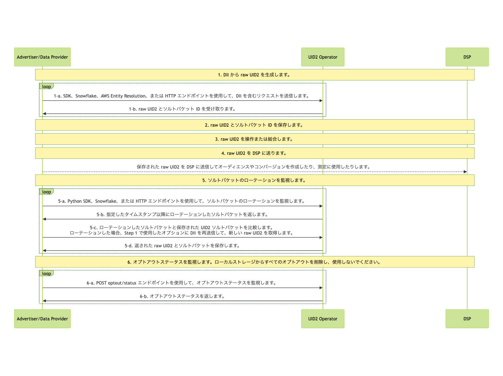

import Link from '@docusaurus/Link';

# Advertiser/Data Provider Integration Overview

このガイドでは、ユーザーデータを収集し、他の UID2 参加者へプッシュする組織向けのインテグレーションオプションの概要を提供します。データコレクターには、広告主、データオンボーダー、計測プロバイダー、アイデンティティグラフプロバイダー、サードパーティデータプロバイダー、および他のデータを他の参加者に送信する組織が含まれます。

## Advertiser/Data Provider Routes to Use UID2

アドテク業界では、広告主は ID を使用してオーディエンスを構築し、コンバージョンを追跡し、グラフを生成します。広告主または広告主を代表してデータプロバイダーとして、UID2 を使用してこれらの目標を達成する方法の一部の例を次の表に示します。

:::note
これらのユースケース以外にも、UID2 を使用する方法があります。以下に、いくつかの例を示します。
:::

| Send/Receive? | Action | Advantage/Result |
| --- | --- | --- |
| オーディエンスを送信 | API またはピクセルを介して UID2 を送信 | オーディエンスを作成します。 |
| コンバージョンを送信 | UID2 をコンバージョン情報として送信 | 測定（アトリビューション）またはリターゲティングのためにコンバージョン情報を使用します。 |
| グラフデータを受信 | API またはピクセルを介してグラフ/データプロバイダーから UID2 を受信 | グラフデータを構築します。 |

## High-Level Steps

広告主およびデータプロバイダーが UID2 とインテグレーションする手順は次のとおりです:

1. [Generate Raw UID2s from DII](#1-generate-raw-uid2s-from-dii)

2. [Store Raw UID2s and Salt Bucket IDs](#2-store-raw-uid2s-and-salt-bucket-ids)

3. [Manipulate or Combine Raw UID2s](#3-manipulate-or-combine-raw-uid2s)

4. [Send Stored Raw UID2s to DSPs to Create Audiences or Conversions](#4-send-stored-raw-uid2s-to-dsps-to-create-audiences-or-conversions)

5. [Monitor for Salt Bucket Rotations for Your Stored Raw UID2s](#5-monitor-for-salt-bucket-rotations-for-your-stored-raw-uid2s)

6. [Monitor for Opt-Out Status](#6-monitor-for-opt-out-status)

## Summary of Implementation Options

以下の表は、広告主およびデータプロバイダーが利用できる実装オプションを、各ステップごとに示しています。一部のステップは、独自のカスタム実装の一部としてのみ管理されます。一部のステップは、利用可能な UID2 実装オプションのいずれかを使用して管理できます。詳細は、各ステップのリンクをクリックしてください。

| High-Level Step | Implementation Options |
| --- | --- |
| [1: Generate Raw UID2s from DII](#1-generate-raw-uid2s-from-dii) | DII を raw UID2 にマッピングするには、以下のオプションのいずれかをします:<ul><li>以下の UID2 SDK のいずれか:<ul><li>Python SDK: [DII を Raw UID2 にマッピング](../sdks/sdk-ref-python.md#map-dii-to-raw-uid2s)</li><li>Java SDK: [広告主/データプロバイダー向けの使用法](../sdks/sdk-ref-java.md#usage-for-advertisersdata-providers)</li></ul></li><li>Snowflake: [DII をマッピング](integration-snowflake.md#map-dii)</li><li>AWS Entity Resolution: [AWS Entity Resolution インテグレーションガイド](integration-aws-entity-resolution.md)</li><li>HTTP エンドポイント: [POST&nbsp;/identity/map](../endpoints/post-identity-map.md)</li></ul> |
| [2: Store Raw UID2s and Salt Bucket IDs](#2-store-raw-uid2s-and-salt-bucket-ids) | カスタム（適切な方法で）。 |
| [3: Manipulate or Combine Raw UID2s](#3-manipulate-or-combine-raw-uid2s) | カスタム（適切な方法で）。 |
| [4: Send Stored Raw UID2s to DSPs to Create Audiences or Conversions](#4-send-stored-raw-uid2s-to-dsps-to-create-audiences-or-conversions) | カスタム（適切な方法で）。 |
| [5: Monitor for Salt Bucket Rotations for Your Stored Raw UID2s](#5-monitor-for-salt-bucket-rotations-for-your-stored-raw-uid2s) | 以下のいずれかのオプションを使用してください:<ul><li><strong>Python SDK</strong>: Python Reference Guide を参照してください</li><li><strong>Snowflake</strong>: [Snowflake Integration Guide](integration-snowflake.md) の [Monitor for Salt Bucket Rotation and Regenerate Raw UID2s](integration-snowflake.md#monitor-for-salt-bucket-rotation-and-regenerate-raw-uid2s) を参照してください</li><li><strong>Raw HTTP endpoint</strong>: [POST&nbsp;/identity/buckets](../endpoints/post-identity-buckets.md)</li></ul> |
| [6: Monitor for Opt-Out Status](#6-monitor-for-opt-out-status) | API コールを使用して、[POST /optout/status](../endpoints/post-optout-status.md) エンドポイントにアクセスします。 |

## Integration Diagram

以下の図は、オーディエンスの構築とターゲティングのために DII を raw UID2 にマッピングするためにデータコレクターが完了しなければならない手順を示しています。

DII とは、ユーザーの正規化されたメールアドレスまたは電話番号、または正規化され、SHA-256 ハッシュされたメールアドレスまたは電話番号を指します。

UID2 に基づくオーディエンス情報を正確かつ最新の状態に保つために、毎日以下のインテグレーション手順に従ってください。

<!-- diagram source: resource/advertiser-flow-overview-mermaid.md.bak -->

図の各部分の詳細は、次のセクションを参照してください。

### 1: Generate Raw UID2s from DII

raw UID2 は、<Link href="../ref-info/glossary-uid#gl-dii">直接識別情報 (DII)</Link> から生成するか、広告主を代表してデータプロバイダーなどの他の UID2 参加者から UID2 を受け取ることができます。

raw UID2 を生成するには、以下のオプションのいずれかを使用します:

- UID2 SDK のいずれか:

  - Python SDK: [Map DII to Raw UID2s](../sdks/sdk-ref-python.md#map-dii-to-raw-uid2s) を参照してください。
  - Java SDK: [Usage for Advertisers/Data Providers](../sdks/sdk-ref-java.md#usage-for-advertisersdata-providers) を参照してください。

- Snowflake: [Map DII](integration-snowflake.md#map-dii) を参照してください。

- AWS Entity Resolution: [AWS Entity Resolution Integration Guide](integration-aws-entity-resolution.md) を参照してください。

- HTTP endpoints: [POST&nbsp;/identity/map](../endpoints/post-identity-map.md). 詳細は、[Generate Raw UID2s from DII](integration-advertiser-dataprovider-endpoints.md#1-generate-raw-uid2s-from-dii) を参照してください。

### 2: Store Raw UID2s and Salt Bucket IDs

Step 1 のレスポンス [Generate Raw UID2s from DII](#1-generate-raw-uid2s-from-dii) には、マッピング情報が含まれています。以下の情報を保存することを勧めます:

- DII (`identifier`) と raw UID2 (`advertising_id`)、ソルトバケット (`bucket_id`) のマッピングをキャッシュします。
- レスポンスデータを受信した際のタイムスタンプを保存します。後で、このタイムスタンプを、Step 5 の [Monitor for Salt Bucket Rotations for Your Stored Raw UID2s](#5-monitor-for-salt-bucket-rotations-for-your-stored-raw-uid2s) で返される `last_updated` タイムスタンプと比較できます。

### 3: Manipulate or Combine Raw UID2s

Step 1 で受け取った UID2 を使用します。たとえば、次のような操作を行うことができます:

- 操作する: たとえば、DII から生成した UID2 と広告主またはデータプロバイダーなど他の参加者から受け取った UID2 を組み合わせる。
- 既存のオーディエンスに新しい UID2 を追加する。

### 4: Send Stored Raw UID2s to DSPs to Create Audiences or Conversions

UID2 を以下の目的で使用します:

   - 保存された raw UID2 を DSP に送信して、オーディエンスとコンバージョンを作成する。
   - 計測のために raw UID2 を使用する。

たとえば、Step 1-b で返された `advertising_id` (<Link href="../ref-info/glossary-uid#gl-raw-uid2">raw UID2</Link>) を DSP に送信してオーディエンスを構築します。各 DSP は、オーディエンスを構築するための独自のインテグレーションプロセスを持っています。オーディエンスを構築するために raw UID2 を送信するための DSP から提供されるインテグレーションガイダンスに従ってください。

また、計測（アトリビューション）やリターゲティングのために、API やピクセルを介してコンバージョン情報を送信することもできます。

### 5: Monitor for Salt Bucket Rotations for Your Stored Raw UID2s

raw UID2 は、特定の時点におけるユーザーの識別子です。raw UID2 は、<Link href="../ref-info/glossary-uid#gl-salt-bucket">ソルトバケット</Link>のローテーションにより、少なくとも年に一度変更されます。

各ソルトバケットは、約1年に1回更新されますが、個々のバケットの更新は年間を通じて分散されます。約 1/365 のソルトバケットが毎日ローテーションされます。このため、ソルトバケットのローテーションを定期的にチェックすることを勧めます。これは、オーディエンスの更新に合わせた頻度で行うことが望ましいです。たとえば、週ごとに更新する場合は、週ごとにソルトバケットの更新を確認してください。

ソルトバケットがローテーションされた場合は、raw UID2 を再生成します。詳細は、[Determine whether the salt bucket has been rotated](#determine-whether-the-salt-bucket-has-been-rotated) を参照してください。

ソルトバケットのローテーションを監視する場合については、次のいずれかを参照してください:

- Python SDK: [Monitor Rotated Salt Buckets](../sdks/sdk-ref-python.md#monitor-rotated-salt-buckets).

- Snowflake: [Monitor for Salt Bucket Rotation and Regenerate Raw UID2s](integration-snowflake.md#monitor-for-salt-bucket-rotation-and-regenerate-raw-uid2s).

- HTTP endpoints: [Monitor for Salt Bucket Rotations for Your Stored Raw UID2s](integration-advertiser-dataprovider-endpoints.md#5-monitor-for-salt-bucket-rotations-for-your-stored-raw-uid2s).

:::note
AWS Entity Resolution では、ソルトバケットの監視方法はありません。代わりに、AWS Entity Resolution サービスを使用して定期的に raw UID2 を再生成することができます。
:::

#### Determine whether the salt bucket has been rotated

特定の raw UID2 のソルトバケット ID が変更されたかどうかを判断するには、次の手順に従います。

1. 2 つの値を比較します:

   - ソルトバケットのローテーション時に返された、同じ `bucket_id` の raw UID2 の `last_updated` タイムスタンプ。(選択したオプションによって返されたもの)
   
   - 同じ `bucket_id` の raw UID2 生成時のタイムスタンプ。Step 1 で返され、Step 2 で保存されたもの。

1. `last_updated` タイムスタンプが、以前に記録したタイムスタンプよりも新しい場合、ソルトバケットがローテーションされています。その場合、この `bucket_id` に関連するすべての raw UID2 を再生成する必要があります。これには、Step 1 の [Generate Raw UID2s from DII](#1-generate-raw-uid2s-from-dii) に従います。

### 6: Monitor for Opt-Out Status

ユーザーのオプトアウトステータスを受け入れることは重要です。定期的にオプトアウトステータスを監視し、最近オプトアウトしたユーザーの UID2 を引き続き使用しないようにしてください。

UID2 <Link href="../ref-info/glossary-uid#gl-operator-service">Operator Service</Link> で最新のオプトアウト情報があるかを確認する方法は 2 つあります:

- [POST&nbsp;/identity/map](../endpoints/post-identity-map.md) エンドポイイントを使用して、raw UID2 のオプトアウトステータスを確認します。オプトアウトされた DII には、raw UID2 は生成されません。

- [POST&nbsp;/optout/status](../endpoints/post-optout-status.md) エンドポイントを使用して、raw UID2 のオプトアウトステータスを確認します。

UID2 のオプトアウトワークフローとユーザーがオプトアウトする方法についての詳細は、[User Opt-Out](../getting-started/gs-opt-out.md) を参照してください。

## FAQs

UID2 のフレームワークを使用する広告主およびデータプロバイダー向けのよくある質問のリストについては、[FAQs for Advertisers and Data Providers](../getting-started/gs-faqs.md#faqs-for-advertisers-and-data-providers) を参照してください。
