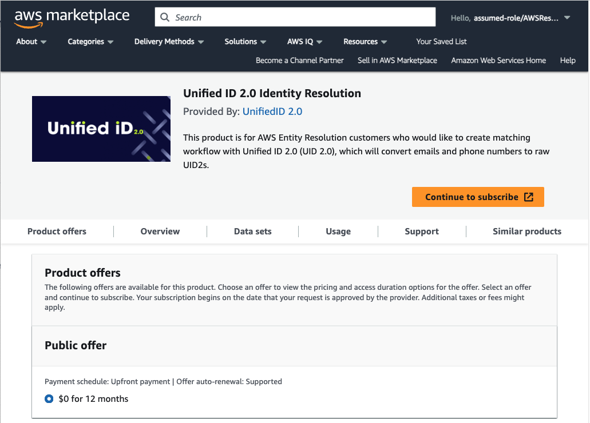

# AWS Entity Resolution Integration Guide

<!-- This guide includes the following information:

- [Functionality](#functionality)
- [Integration Summary](#integration-summary)
- [Workflow Diagram](#workflow-diagram)
- [Initial Setup Steps](#initial-setup-steps)
  - [Create UID2 Account](#create-uid2-account)
  - [Create AWS Account](#create-aws-account)
  - [Subscribe to UID2 on AWS Data Exchange](#subscribe-to-uid2-on-aws-data-exchange)
- [Configure AWS Account](#configure-aws-account)
- [Create a Matching Workflow](#create-a-matching-workflow)
- [Run the Matching Workflow](#run-the-matching-workflow)
 -->

[AWS Entity Resolution](https://aws.amazon.com/entity-resolution/) は、Amazon Web Services が提供する ID ソリューションプロダクトで、AWS の顧客が UID2 フレームワークとインテグレーションすることを可能にします。このインテグレーションにより、UID2 Operator を直接呼び出したり、機密性の高いクライアント ID や秘密鍵の値を扱ったりすることなく、安全かつシームレスに UID2 を生成することができます。

このサービスは、[DII](../ref-info/glossary-uid.md#gl-dii) (メールアドレスまたは電話番号) を raw UID2 に迅速かつ安全にマッピングすることができます。

>NOTE: 現在 UID2 エコシステムに参加していない場合は、[Request Access to UID2](https://unifiedid.com/request-access) にアクセスしてください。

## Functionality

以下の表は、AWS Entity Resolution インテグレーションで利用可能な機能をまとめたものです。

| Encrypt Raw UID2 to UID2 Token | Decrypt Raw UID2 from UID2 Token | Generate UID2 Token from DII | Refresh UID2 Token | Map DII to a Raw UID2 |
| :--- |  :--- | :--- | :--- | :--- |
| No | No | No | No | Yes |

## Integration Summary

以下の表は、AWS Entity Resolution を使用して UID2 とインテグレーションする手順をまとめたものです。

| Step/Link | Details |
| --- | --- |
| [Initial Setup Steps](#initial-setup-steps) | UID2 アカウント、AWS アカウントを作成し、リンクします:<ul><li>[Create UID2 Account](#create-uid2-account)</li><li>[Create AWS Account](#create-aws-account)</li><li>[Subscribe to UID2 on AWS Data Exchange](#subscribe-to-uid2-on-aws-data-exchange)</li></ul> |
| [Configure AWS Account](#configure-aws-account) | IAM ユーザー、データテーブル、データのスキーママッピングを設定します。 |
| [Create a Matching Workflow](#create-a-matching-workflow) | 入力場所、適用するマッチング手法、出力場所など、データをマッチングするためのワークフローを作成します。 |
| [Run the Matching Workflow](#run-the-matching-workflow) | 入力データを処理して raw UID2 を生成します。 |

## Workflow Diagram

以下の図は、サービスへの登録から設定ステップを経て raw UID2 を受け取るまでの、エンドツーエンドの UID2 プロセスを示しています。

以下の表は、図に示されたステップを示しています。

| Step | Actor | Action |
| --- | --- | --- |
| 1 | Participant | AWS に登録します。 |
| 2 | Participant | UID2 の契約を締結し、UID2 連絡先と AWS アカウント ID を共有します。 |
| 3 | Participant | Amazon Data Exchange の UID2 をサブスクライブします。 |
| 4 | UID2 Administrator | Step 2 で提供された AWS アカウント ID と、Step 3 で受信したサインアップリクエストを照合し、リクエストを承認します。 |
| 5 | Participant | 入力データを Amazon S3 バケットに格納します。 |
| 6 | Participant | Entity Resolution を設定し、マッチングワークフローを作成します。 |
| 7 | Participant | マッチングワークフローを実行します。 |
| 8 | AWS Entity Resolution | S3バケットから入力データを読み込みます。 |
| 9 | AWS Entity Resolution | 入力データを `POST /SendApiAsset` を使って Amazon Data Exchange に送信します。 |
| 10 | Amazon Data Exchange | `POST /uid2/assignment` を用いて API Gateway にデータを送信します。 |
| 11 | API Gateway | `path=assignment` を使って Lambda にデータを送ります。 |
| 12 | Lambda for UID2 generation | UID2 Public Operator にデータを送り、`POST /identity/map` を使用して raw UID2 に変換します。 |
| 13 | UID2 Public Operator | raw UID2 を API Gateway に返します。 |
| 14 | Lambda for UID2 generation | raw UID2 を API Gateway に返します。 |
| 15 | API Gateway | raw UID2 を Amazon Data Exchange に返します。 |
| 16 | Amazon Data Exchange | raw UID2 を AWS Entity Resolution に返します。 |
| 17 | AWS Entity Resolution | raw UID2 を含む出力レコードを S3 バケットに書き込みます。 |

## Initial Setup Steps

以下は、AWS Entity Resolution で UID2 インテグレーションを設定するための初期手順です:

- [Create AWS Account](#create-aws-account)
- [Create UID2 Account](#create-uid2-account)
- [Subscribe to UID2 on AWS Data Exchange](#subscribe-to-uid2-on-aws-data-exchange)

### Create AWS Account

AWS アカウントにサインアップするか、既存のアカウントを使用します。

詳細は AWS ドキュメントの [Getting started: Are you a first time AWS user?](https://docs.aws.amazon.com/accounts/latest/reference/welcome-first-time-user.html) を参照してください。

### Create UID2 Account

UID2 の連絡先に、あなたを UID2 参加者として登録するよう依頼します。依頼先がかわからない場合は、[連絡先情報](../getting-started/gs-account-setup.md#contact-info) を参照してください。

UID2 の連絡先に、Entity Resolution での UID2 インテグレーションに使用する AWS アカウント ID を送信してください。

### Subscribe to UID2 on AWS Data Exchange

AWS Data Exchange の [Unified ID 2.0 Identity Resolution](https://aws.amazon.com/marketplace/pp/prodview-66zqls7iqsm6o?sr=0-4&ref_=beagle&applicationId=AWSMPContessa#offers) ページにアクセスし、**Continue to Subscribe.** をクリックします。

加入リクエストを受け取ると、UID2 チームは以下を行います:
- サブスクリプションのリクエストを確認します。
- リクエストを [Create UID2 Account](#create-uid2-account) で送信した AWS アカウント ID と照合します。
- リクエストを承認します。

## Configure AWS Account

UID2 の参加者は AWS の S3 バケットにデータを保存し、AWS Entity Resolution とインテグレーションします。AWS アカウントを作成したら([Create AWS Account](#create-aws-account) を参照してください。)、基本的な手順は以下の通りです。

>NOTE: 詳細な手順については、AWSドキュメントの [Setting up AWS Entity Resolution](https://docs.aws.amazon.com/entityresolution/latest/userguide/setting-up.html) を参照してください。

1. [管理者ユーザーを作成します](https://docs.aws.amazon.com/entityresolution/latest/userguide/setting-up.html#setting-up-create-iam-user).

2. [データテーブルを準備します](https://docs.aws.amazon.com/entityresolution/latest/userguide/setting-up.html#prepare-data-tables).

   AWS Entity Resolution では、各入力データテーブルには、消費者識別子を持つソースレコードが含まれます。UID2 では、識別子はメールアドレスまたは電話番号のいずれかになりますが、各レコードの識別子は 1 つだけでなければなりません。識別子は、提供された他のソースレコードと照合することができます。各レコードには、Step 4 で作成したスキーママッピングの主キーとして定義されている固有 ID が必要です。以下の手順に従ってください:

   - 入力データテーブルをサポートされているデータ形式で保存します。
   - 入力データテーブルを Amazon S3 にアップロードします。
   - [AWS Glue](https://docs.aws.amazon.com/glue/latest/dg/what-is-glue.html) テーブルを作成します。

3. コンソールユーザーの IAM ロールを作成します。

4. AWS Entity Resolution のワークフロージョブロールを作成します。

5. データのスキーママッピングを作成します: AWS ドキュメントの [Creating a schema mapping](https://docs.aws.amazon.com/entityresolution/latest/userguide/create-schema-mapping.html) を参照してください。

## Create a Matching Workflow

最初のアカウント作成とセットアップが完了したら、次のステップはデータのマッチングワークフローを作成することです。

以下のステップは、AWS Entity Resolution ユーザーインターフェースで行うアクションの概要です。詳細と手順については、AWS Entity Resolution ドキュメントの [Creating a matching workflow with UID 2.0](https://docs.aws.amazon.com/entityresolution/latest/userguide/create-matching-workflow-provider.html#create-mw-uid) を参照してください。

:::note
UID2 は、UID2 生成のためにメールアドレスまたは電話番号のいずれかをサポートします。しかし、AWS Entity Resolution では、スキーママッピングに両方の値が存在する場合、ワークフローはメールアドレスを使用し、電話番号はパススルーフィールドとして扱います。もしデータにメールアドレスと電話番号が混在している場合、最適な方法は、スキーママッピングを別々にして、それぞれ別のワークフローを作成することです。このシナリオでは、以下のステップを2回行います&#8212;1つはメールアドレス用のワークフロー、もう1つは電話番号用のワークフローを作成します。
:::

マッチングワークフローを作成するには、まず AWS Management コンソールにサインインし、**AWS Entity Resolution** ページを開き、**Workflows** > **Matching workflows** > **Create matching workflow** を選択します。次に、マッチングワークフローの以下のステップを完了します。

1. 一致するワークフローについて、以下の詳細を指定します:
   - **Name**: この値は必須です。短く、わかりやすく、直感的な名前をお勧めします。例えば、会社名を指定する場合: `CompanyName_UID2_Daily_Matching`。
   - **Description**: マッチングワークフローの説明(オプション)。
   - **Data input**: AWS のデータソース。ドロップダウンリストから、AWS Glue データベース、AWS Glue テーブル、スキーママッピングの順に選択します。データ入力は複数指定できます。以下の例では、メールアドレスのみを指定しています:

     |UniqueId|Name|Email|Date of Birth|
     |--------|----|-----|-----------|
     |0001|Test 1|test1@uidapi.com|1/1/90|
     |0002|Test 2|test2@gmail.com|1/2/78|
   
      NOTE: 1レコードにつき、メールアドレスまたは電話番号フィールドは **1** つだけです。メールアドレスが存在する場合、電話番号はパススルーとして扱われます。電話番号を処理するには、別のワークフローを作成してください。詳細はこのセクションの前を参照してください。

   - **Service access**: 既存または新規のサービスロールを使用して、AWS Glue で指定されたデータにアクセスするための特定の権限を Entity Resolution に付与します。入力データが暗号化されている場合は、復号化のための AWS Key Management Service (KMS) キーも指定する必要があります。

2. マッチング技術を選びます:
   - **Matching method**で、**Partner services** オプションを選択します。
   - 次に、**Partner services** で、**Unified ID2.0** を選択します。
   - **Next** をクリックします。

     先のステップ、[Subscribe to UID2 on AWS Data Exchange](#subscribe-to-uid2-on-aws-data-exchange) を完了していれば、**Approved** のメッセージが表示されます。

3.  データの出力先を定義します:
   - **Data Output Destination** には、出力データに使用する S3 バケットの URI を指定します。データフォーマットを選択します: Normalized または Original を選択します。
   
     `Normalized` がデフォルトで、データ入力はマッチングの前に正規化されます。

     データは、デフォルトでは AWS が所有し管理するキーで暗号化されます。別のキーを指定するには、暗号化設定をカスタマイズしてください。

   - 次の例に示すように、出力から除外したい入力フィールドと、出力データでハッシュ化したいフィールドを選択します。

     |UniqueId|Name|Email|Date of Birth|UID2_identifier|UID2_advertising_id|UID2_bucket_id|
     |--------|----|-----|-----------|-------------|---------------|-------------------|
     |0001|Test 1|test1@uidapi.com|1/1/90|test1@uidapi.com|Q4A5ZBuBCYfuV3Wd8Fdsx2+i33v7jyFcQbcMG/LH4eM=|ad1ANEmVZ|
     |0002|Test 2|test2@gmail.com|1/2/78|test2@gmail.com|kds8hgBuBCYfuV3Wd8Fdsx2+i33v7jyFcQbcMG/jgksuh=|kd9ANE98d|

4. **Review and Create**: マッチングワークフローのすべての詳細を確認します。値に問題がなければ、**Create** をクリックします。

   一致するワークフローが作成され、確認メッセージが表示されます。

## Run the Matching Workflow

以下の手順に従って、マッチングワークフローを実行し、結果を表示します。

詳細は、AWS Entity Resolution ドキュメントの [Running and managing matching workflows](https://docs.aws.amazon.com/entityresolution/latest/userguide/run-manage-matching-workflow.html) を参照してください。

1. AWS Management コンソールにサインインし、AWS Entity Resolution ページを開き、**Workflows** > **Matching workflows** を選択します。

2. 実行したいワークフローを選択します。

3. **Matching workflows** の詳細ページで、右上にある **Run** を選択します。

   マッチングワークフローが実行されます。完了すると、**Completed** というステータスメッセージが表示されます。

4. 結果を表示するには、**Data** 出力タブに移動し、Amazon S3 の場所を選択します。
