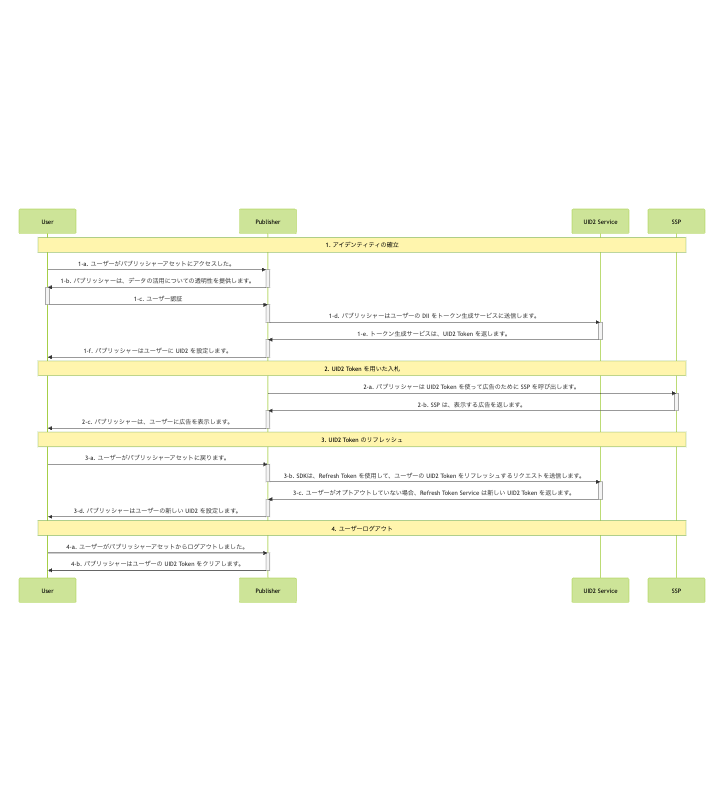

import Link from '@docusaurus/Link';
import ExampleClientServerSendUid2ToSdk from '../snippets/_example-client-server-send-uid2-to-sdk.mdx'; 
import IntegratingWithSSO from '../snippets/_integrating-with-sso.mdx';

# Client-Server Integration Guide for JavaScript

このガイドは、Web アセットを持つパブリッシャー向けに、RTB <Link href="../ref-info/glossary-uid#gl-bidstream">bidstream</Link> で UID2 を使用して ID トークンを生成し、サーバーサイドで UID2 トークンを生成してパブリッシャーの Web ページに渡し、JavaScript の UID2 SDK を使用してクライアントサイドでトークンをリフレッシュする方法を説明します。

これは、JavaScript インテグレーションステップが Client-Side であり、その他のステップが Server-Side であるため、Client-Server インテグレーションと呼ばれます。

Client-Side の JavaScript の変更 **だけ** で UID2 とインテグレーションする場合は、[Client-Side Integration Guide for JavaScript](integration-javascript-client-side.md) を参照してください。

SDK の技術的な詳細は [SDK for JavaScript Reference Guide](../sdks/sdk-ref-javascript.md) を参照してください。

## Sample Implementation

実装例については、次の UID2 SDK インテグレーション例を参照してください。
- [Client-Server UID2 SDK Integration Example](https://example-jssdk-integ.uidapi.com/)
- [Code Repository with Readme](https://github.com/IABTechLab/uid2-web-integrations/tree/main/examples/js-sdk)

## Introduction

このガイドでは、SDK を使用せずにインテグレーションを行う場合に考慮すべき基本的な手順を説明します。たとえば、ユーザー認証とデータ取得の実装方法、UID2 ID 情報の管理方法とターゲティング広告への使用方法、トークンのリフレッシュ方法、紛失した ID の処理方法、ユーザーのオプトアウトの処理方法などを決定する必要があります。

ワークフロー図は、[Integration Steps](#integration-steps) を参照してください。また、[FAQ](#faqs) も参照してください。

UID2 の Opt-out ワークフローとユーザーが Opt-out する方法の詳細は、[User Opt-Out](../getting-started/gs-opt-out.md) を参照してください。

UID2 を使用してクライアントの ID を確立し、Advertising Token を取得するプロセスを容易にするために、このガイドで提供する Web インテグレーション手順は、JavaScript 用の UID2 SDK に依存しています。このガイドに記載されているインテグレーションステップと SDK の使用方法(現在はメールアドレスのみ) を示す [example application](https://example-jssdk-integ.uidapi.com/) を以下に示します。アプリケーションのドキュメントについては、[UID2 SDK Integration Example](https://github.com/IABTechLab/uid2-web-integrations/tree/main/examples/js-sdk) を参照してください。

:::tip
ファーストパーティ Cookie とローカルストレージの実装の詳細は 将来変更される可能性があります。潜在的な問題を回避するため、ID 管理には [SDK for JavaScript API Reference](../sdks/sdk-ref-javascript.md#api-reference) に記載されている機能を使用してください。
:::

SDK for JavaScript を使用しないパブリッシャーのインテグレーションシナリオについては、[Publisher Integration Guide, Server-Side](integration-publisher-server-side.md) を参照してください。

:::note
Google Ad Managerを使用していて、セキュアシグナル機能を使用したい場合は、まずこのガイドの手順に従った後、[Google Ad Manager Secure Signals Integration Guide](integration-google-ss.md) の追加手順に従ってください。
:::

## Integrating with Single Sign-On (SSO)

<IntegratingWithSSO />

## Complete UID2 Account Setup and Configure Account

UID2 とインテグレーションするには、UID2 アカウントが必要です。アカウントを作成していない場合は、まず [Account Setup](../getting-started/gs-account-setup.md) ページの手順に従ってください。

アカウントの初期設定が完了すると、本番環境用の [credentials](../getting-started/gs-credentials.md) を作成し、必要に応じて追加の値を設定できる [UID2 Portal](../portal/portal-overview.md) にアクセスするための手順とリンクが送信されます。詳細については、[Getting Started with the UID2 Portal](../portal/portal-getting-started.md) を参照してください。

Client-Server インテグレーションを行う場合は、UID2 Portal の [API Keys](../portal/api-keys.md) ページで以下の値を設定する必要があります:

  - <Link href="../ref-info/glossary-uid#gl-api-key">API key</Link>、Client Key とも呼ばれます。
  - <Link href="../ref-info/glossary-uid#gl-client-secret">Client secret</Link>、参加者と UID2 Servivce のみが知る値です。

:::important
これらの値を安全に保管することは非常に重要です。詳細については、[Security of API Key and Client Secret](../getting-started/gs-credentials.md#security-of-api-key-and-client-secret) を参照してください。
:::

## Integration Steps 

以下の図は、ユーザーの UID2 Token をパブリッシャーと確立するために必要なステップと、UID2 Token が RTB ビッドストリームとどのようにインテグレーションされるかを説明しています。



<!-- diagram source: resource/integration-javascript-client-server-mermaid.md.bak -->

以下のセクションでは、図中の各ステップについての詳細を説明します: 

 1. [Establish identity: capture user data](#establish-identity-capture-user-data)
 2. [Bid Using UID2 Tokens](#bid-using-uid2-tokens)
 3. [Refresh Tokens](#refresh-tokens)
 4. [Clear Identity: User Logout](#clear-identity-user-logout)

### Establish Identity: Capture User Data

Step 1-c でパブリッシャーがユーザーのメールアドレスまたは電話番号を検証した後、Server-Side で UID2 Token を生成する必要があります。次の表は、トークン生成ステップの詳細です。

| Step | Endpoint/SDK | Description |
| :--- | :--- | :--- |
| 1-d | [POST&nbsp;/token/generate](../endpoints/post-token-generate.md) | [POST&nbsp;/token/generate](../endpoints/post-token-generate.md) エンドポイントを使用して、ユーザーから提供されたメールアドレスまたは電話番号を使用して UID2 Token を生成します。正規化されていることを確認してください。 |
| 1-e | [POST&nbsp;/token/generate](../endpoints/post-token-generate.md) | ユーザーのメールアドレス、電話番号、またはそれぞれのハッシュから生成された UID2 Token を返します。 |
| 1-f | SDK for JavaScript | Step 1-e で返された UID2 Token を、SDK の [init()関数](../sdks/sdk-ref-javascript.md#initopts-object-void) の `identity` プロパティで SDK に送信し、以下に示すように [コールバック関数](../sdks/sdk-ref-javascript.md#callback-function) を指定します。このメカニズムにより、ユーザーがログアウトするまで、UID2 Token がターゲティング広告に利用できるようになります。|
| 1-g | SDK for JavaScript | SDK から ID 更新を受け取り、ターゲティング広告を開始するために使用するコールバック関数を SDK に提供します。 |

#### Generating a UID2 Token on the Server

最初のステップは、サーバーで UID2 Token を生成することです。

手順や例については、[Server-Side Token Generation](../ref-info/ref-server-side-token-generation.md) を参照してください。

`Identity` レスポンスを SDK に渡す必要があります。[Sending the UID2 Token to the SDK](#sending-the-uid2-token-to-the-sdk) を参照してください。

:::warning
セキュリティ上の理由から、トークン生成に使用される API キーとシークレットはサーバーサイドで呼び出す必要があります。これらの値をクライアントサイドに保存しないでください。詳細は [Security of API Key and Client Secret](../getting-started/gs-credentials.md#security-of-api-key-and-client-secret) を参照してください。
:::

#### Sending the UID2 Token to the SDK

以下のコード例は、JavaScript と TypeScript でのステップ 1-f と 1-g の説明です。

<ExampleClientServerSendUid2ToSdk />

SDKは、指定された [callback function](../sdks/sdk-ref-javascript.md#callback-function) (ID の可用性を示します) を呼び出し、確立された ID をClient-Side で入札可能な状態にします。

:::tip
コードの構造によっては、Step 1-f と 1-g のコールバックを 1 つのコールバック関数にまとめると便利かもしれません。
:::

### Bid Using UID2 Tokens

有効な ID のステータスと利用可能性に基づいて、SDK は以下を実行します:

1. バックグラウンドの token auto-refresh を設定します。
1. ID 情報を [ローカルストレージまたはファーストパーティクッキー](../sdks/sdk-ref-javascript.md#uid2-storage-format) に保存します。
1. ID 情報を使用して、ターゲティング広告のリクエストを始めます。

<!-- (**GWH_TODO. Q: Not sure about the relationship between the steps above and the table below. And the diagram 2-a which says "the publisher calls the SSP for ads using the UID2 token". A: Diagram needs to be updated.**) -->

ビッドステップを次の表に示します。

| Step | Endpoint/SDK | Description |
| :--- | :--- | :--- |
| 2-a | SDK for JavaScript | 以下に示すように、[getAdvertisingToken() 関数](../sdks/sdk-ref-javascript.md#getadvertisingtoken-string) を使用して、現在のユーザーの Advertising Token を取得します。|

:::note
UID2 Token が SSP から DSP に送信されるとき、ビッドストリーム内でどのように見えるかの例については、[ビッドストリームで UID2 Token はどのように見えますか？](../getting-started/gs-faqs.md#what-does-a-uid2-token-look-like-in-the-bidstream) を参照してください。
:::

```html
<script>
  let advertisingToken = __uid2.getAdvertisingToken();
</script>
```

:::info
返された Advertising Token をどのように SSP に渡すかを検討する必要があります。`Prebid.js`([UID2 Integration Overview for Prebid](integration-prebid.md) を参照してください) や Google Ad Manager Secure Signals([Google Ad Manager Secure Signals Integration Guide](integration-google-ss.md) を参照してください) を使用するなど、Client-Side で UID2 を実装する他のいくつかのアプローチでは、実装に、返された Advertising Token の受け渡しを管理する関数が含まれています。SDK for JavaScriptを使用している場合は、これを自分で管理する必要があります。
:::

:::tip
`__uid2.getAdvertisingToken()` を呼び出す代わりに、Step 1-g で設定したコールバックに渡された ID の `advertising_token` プロパティを使用することができます。このコールバックは ID が変更されるたびに呼び出されます。
:::

### Refresh Tokens

初期化の一環として、SDK は ID の [token auto-refresh](../sdks/sdk-ref-javascript.md#background-token-auto-refresh) を設定します。これは、ID 上のタイムスタンプ、または断続的なエラーによるリフレッシュの失敗によってバックグラウンドでトリガーされます。

| Step | Endpoint/SDK | Description |
| :--- | :--- | :--- |
| 3-a | [SDK for JavaScript](../sdks/sdk-ref-javascript.md) | SDK はバックグラウンドで自動的に UID2 Token をリフレッシュします。手動で操作する必要はありません。 |
| 3-b | [SDK for JavaScript](../sdks/sdk-ref-javascript.md) | ユーザーがオプトアウトしていない場合、[POST&nbsp;/token/refresh](../endpoints/post-token-refresh.md) エンドポイントは、自動的に新しい ID トークンを返します。 |


### Clear Identity: User Logout

クライアントのライフサイクルは、ユーザーがパブリッシャーのサイト (UID2 ではなく) からログアウトすることを決定したときに完了します。これにより、クライアントの ID セッションが終了し、ファーストパーティ Cookie 情報がクリアされます。

| Step | Endpoint/SDK | Description |
| :--- | :--- | :--- |
| 4-a | N/A | ユーザーはパブリッシャーのアセットからログアウトします。 |
| 4-b | [SDK for JavaScript](../sdks/sdk-ref-javascript.md) | SDKは、以下に示すように、[disconnect() function](../sdks/sdk-ref-javascript.md#disconnect-void) を使用して、ファーストパーティ Cookie から UID2 ID をクリアし、クライアントのライフサイクルを切断します。|


```html
<script>
  __uid2.disconnect();
</script>
```

## FAQs

パブリッシャー向けのよくある質問については、[FAQs for Publishers](../getting-started/gs-faqs.md#faqs-for-publishers) を参照してください。
