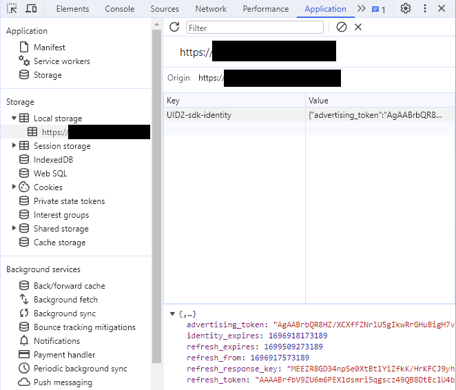
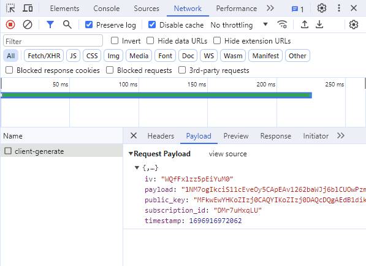

import Tabs from '@theme/Tabs';
import TabItem from '@theme/TabItem';
import Link from '@docusaurus/Link';

# Client-Side Integration Guide for JavaScript

<!-- The below segment is for UID2 only: not applicable for advertisers since EUID doesn't support sharing. -->
このガイドは、UID2 とインテグレーションして、ウェブサイト上で JavaScript クライアントサイドの変更のみを使用して、最小限の努力で <Link href="../ref-info/glossary-uid#gl-uid2-token">UID2 Token</Link> (Advertising Token) を生成するすべての参加者向けです。

この方法は、次の参加者タイプで使用されます:

- **Publishers**: このワークフローは、UID2 Token をビッドストリームに送信したいパブリッシャー向けです。
- **Advertisers** および **Data Providers**: さらに、広告主やデータプロバイダは、UID2 Token をトラッキングピクセルに追加するために使用します (詳細は [Tokenized Sharing in Pixels](sharing/sharing-tokenized-from-data-pixel.md) を参照してください)。

<!-- End of UID2-only section. -->
<!-- Begin EUID-only section. -->
<!-- This guide is for publishers who want to integrate with UID2 and generate EUID tokens (advertising tokens) using only JavaScript client-side changes on their website with minimum effort. -->
<!-- End of EUID-only section. -->

このガイドは、<Link href="../ref-info/glossary-uid#gl-private-operator">Private Operator</Link> を使いたいパブリッシャーや、Server-Side でトークンを生成したいパブリッシャーには適用されません。これらのパブリッシャーは、[Client-Server Integration Guide for JavaScript](integration-javascript-client-server.md) に従う必要があります。

UID2 は、SDK for JavaScript を提供しています (詳細は [SDK for JavaScript Reference Guide](../sdks/sdk-ref-javascript.md) を参照してください)。この SDK には以下の機能があります:

- UID2 Token の生成
- UID2 Token の自動リフレッシュ
- ブラウザへの UID2 Token の自動保存

実装するには、以下の手順を完了する必要があります:

1. [Complete UID2 account setup and configure account](#complete-uid2-account-setup-and-configure-account)
2. [Add SDK for JavaScript to your site](#add-sdk-for-javascript-to-your-site)
3. [Configure the SDK for JavaScript](#configure-the-sdk-for-javascript)
4. [Check that the token was successfully generated](#check-that-the-token-was-successfully-generated)

## SDK for JavaScript Version

Client-Side でのトークン生成のサポートは、SDK のバージョン 3.2 以上で利用可能です。

SDKのURLは以下のとおり:

- [https://cdn.prod.uidapi.com/uid2-sdk-3.4.5.js](https://cdn.prod.uidapi.com/uid2-sdk-3.4.5.js)

以下のコードサンプルでは、プレースホルダ `{{ UID2_JS_SDK_URL }}` は、この URL を指します。

SDK のデバッグビルドを使用したい場合は、代わりに以下の URL を使用してください:

- [https://cdn.integ.uidapi.com/uid2-sdk-3.4.5.js](https://cdn.integ.uidapi.com/uid2-sdk-3.4.5.js)

## Sample Implementation

実装例については、次の例を参照してください:
- Code: [Example Client-Side Integration for JavaScript](https://github.com/IABTechLab/uid2-web-integrations/tree/main/examples/cstg)
- ランニングサイト: [Client-Side Integration Example, UID2 JavaScript SDK](https://cstg-integ.uidapi.com/)

<!-- (Source code for running site: https://github.com/IABTechLab/uid2-web-integrations) -->
  

## Complete UID2 Account Setup and Configure Account

アカウント設定ページに記載されている手順に従って、UID2 アカウントの設定を完了してください。アカウント設定プロセスの一環として、この SDK for JavaScript で使用するサイトの**ドメイン名**のリストを提供する必要があります。

アカウントのセットアップが完了すると、UID2 サーバーがユーザーを識別するために使用する 2 つの値であるクライアントキーペアが発行されます: Subscription ID と Public key。これらの値はあなたに固有で、UID2 モジュールの設定に使用します。詳細は [Subscription ID and Public Key](../getting-started/gs-credentials.md#subscription-id-and-public-key) を参照してください。

:::tip
アカウント設定に必要なのは、ルートレベルのドメインだけです。例えば、JavaScript 用の UID2 SDK を example.com、shop.example.com、example.org で使用する場合、ドメイン名 example.com と example.org を指定するだけです。
:::

## Add SDK for JavaScript to Your Site

以下のコードスニペットは、ウェブサイトに追加する必要があるコードの概要です。また、SDK がトリガーできるさまざまなイベントも示しています。

より詳細なコードスニペットについては、[Example Integration Code and When to Pass DII to the UID2 SDK](#example-integration-code-and-when-to-pass-dii-to-the-uid2-sdk) を参照してください。

`UID2_JS_SDK_URL` の値については、[SDK for JavaScript Version](#sdk-for-javascript-version) を参照してください。

```js
<script async src="{{ UID2_JS_SDK_URL }}"></script>
 
<script>
 
// When the UID2 SDK is executed, it looks for these callbacks and invokes them.
window.__uid2 = window.__uid2 || {};
window.__uid2.callbacks = window.__uid2.callbacks || [];
window.__uid2.callbacks.push((eventType, payload) => {
  switch (eventType) {
    case "SdkLoaded":
      // The SdkLoaded event occurs just once.
      __uid2.init({});
      break;
 
    case "InitCompleted":
      // The InitCompleted event occurs just once.
      //
      // If there is a valid UID2 token, it is in payload.identity.
      break;
 
    case "IdentityUpdated":
      // The IdentityUpdated event happens when a UID2 token is generated or refreshed.
      // payload.identity contains the resulting latest identity.
      break;
  }
});
 
</script>
```

SDK の詳細は [SDK for JavaScript Reference Guide](../sdks/sdk-ref-javascript.md) を参照してください。

### Using the UID2 Integration Environment

デフォルトでは、SDK は UID2 本番環境 `https://prod.uidapi.com` で動作するように設定されています。代わりに UID2 インテグレーション環境を使用したい場合は、`init` を呼び出す際に以下の URL を指定してください:

```js
__uid2.init({
  baseUrl: "https://operator-integ.uidapi.com",
});
```
:::note
UID2 インテグレーション環境からのトークンは、<Link href="../ref-info/glossary-uid#gl-bidstream">ビッドストリーム</Link>に渡しても無効です。インテグレーション環境では、**Subscription ID** と **public key** の値が異なります。
:::

### Optional: Specifying the API Base URL to Reduce Latency

デフォルトでは、この SDK は米国の UID2 本番環境サーバーにリクエストを送信します。

ユースケースに最適な URL を選択する方法と、有効なベース URL の全リストについては、[Environments](../getting-started/gs-environments.md) を参照してください。

デフォルト以外の UID2 サーバーを指定するには、`init` 呼び出しで変更します:

```js
__uid2.init({
  baseUrl: "https://global.prod.uidapi.com",
});
```

## Configure the SDK for JavaScript

UID2 は、Client-Side のトークン生成機能を使用するために必要な以下の値をパブリッシャーに提供します:

* Subscription ID(サブスクリプション ID)
* Public key(公開鍵)

パブリッシャーのインテグレーション環境用に 1 セット、本番環境用に別のセットを用意します。

SDK を設定するには、アカウントセットアップ時に受け取った **public key** と **Subscription ID**、およびユーザーのハッシュ化またはハッシュ化していない <Link href="../ref-info/glossary-uid#gl-dii">DII</Link>(メールアドレスまたは電話番号) を含むオブジェクトを指定して、以下のメソッドのいずれかを呼び出します:

*  `__uid2.setIdentityFromEmail`
*  `__uid2.setIdentityFromEmailHash`
*  `__uid2.setIdentityFromPhone`
*  `__uid2.setIdentityFromPhoneHash`

以下のセクションでは、各シナリオのコーディング例を示します。

設定が終わると、UID2 SDK は以下を行います:
- ユーザーの UID2 Token を生成します。
- トークンをユーザーのブラウザに保存します。
- ユーザーのブラウザでサイトを開いている間、必要に応じてトークンを自動的にリフレッシュします。

UID2 SDK には、ユーザーの DII をハッシュ化して渡すことも、ハッシュ化せずに渡すこともできます。ハッシュ化せずに DII を渡すと、UID2 SDK が代わりにハッシュ化します。すでにハッシュ化された DII を SDK に渡したい場合は、ハッシュ化する前に正規化する必要があります。詳細は [Normalization and Encoding](../getting-started/gs-normalization-encoding.md) を参照してください。

## Format Examples for DII

SDK は、UID2 Service に送信する前に、ハッシュ化された DII を暗号化します。

SDK は、特定のユーザーに対して、4 つの DII フォーマットのいずれかを送信するように設定できます。DII 形式はユーザーごとに異なる場合がありますが、送信できる値はユーザーごとに 1 つだけです。

以下のセクションでは、UID2 SDK を構成するさまざまな方法を示し、SDK に渡される DII の要件を示します:

- メールアドレス, ハッシュ化されていない
- メールアドレス, 正規化とハッシュ化
- 電話番号, ハッシュ化されていない
- 電話番号, 正規化とハッシュ化

SDK が複数回設定された場合、最新の設定値が使用されます。

JavaScript でメールアドレスと電話のハッシュを生成する方法の例については、[Example Code: Hashing and Base-64 Encoding](#example-code-hashing-and-base-64-encoding) を参照してください。

<Tabs>
<TabItem value='example_email_unhashed' label='Email, Unhashed'>

以下の例では、メールアドレスで UID2 SDK を設定しています。

```js
await __uid2.setIdentityFromEmail(
    "test@example.com",
    {
        subscriptionId: subscriptionId,
        serverPublicKey: publicKey,
    }
);
```

このシナリオでは:

- パブリッシャーによる正規化やハッシュ化は必要ありません。
- UID2 SDK は、暗号化されたハッシュを UID2 Service に送信する前に、メールアドレスを正規化し、ハッシュ化します。

</TabItem>
<TabItem value='example_email_hash' label='Email, Normalized and Hashed'>

以下の例では、ハッシュ化されたメールアドレスで UID2 SDK を設定しています。

```js
await __uid2.setIdentityFromEmailHash(
    'lz3+Rj7IV4X1+Vr1ujkG7tstkxwk5pgkqJ6mXbpOgTs=',
    {
        subscriptionId: subscriptionId,
        serverPublicKey: publicKey,
    }
);
```

このシナリオでは:
- **メールアドレスの正規化とハッシュ化はパブリッシャーの責任です。** 詳細は [Normalization and Encoding](../getting-started/gs-normalization-encoding.md) を参照してください。
- UID2 SDK は、UID2 Service に送信する前にハッシュを暗号化します。

</TabItem>
<TabItem value='example_phone_unhashed' label='Phone Number, Unhashed'>

以下の例では、UID2 SDK を電話番号で設定しています。

```js
await __uid2.setIdentityFromPhone(
    '+12345678901',
    {
        subscriptionId: subscriptionId,
        serverPublicKey: publicKey,
    }
);
```
このシナリオでは:

- **電話番号の正規化とハッシュ化はパブリッシャーの責任です。** 詳細は [Normalization and Encoding](../getting-started/gs-normalization-encoding.md) を参照してください。
- UID2 SDK は、暗号化されたハッシュを UID2 Service に送信する前に、電話番号をハッシュ化します。

</TabItem>
<TabItem value='example_phone_hash' label='Phone Number, Normalized and Hashed'>

以下の例では、UID2 SDK をハッシュ化された電話番号で設定しています。

```js
await __uid2.setIdentityFromPhoneHash(
    'EObwtHBUqDNZR33LNSMdtt5cafsYFuGmuY4ZLenlue4=',
    {
        subscriptionId: subscriptionId,
        serverPublicKey: publicKey,
    }
);
```

このシナリオでは:
- **電話番号の正規化とハッシュ化はパブリッシャーの責任です。** 詳細は [Normalization and Encoding](../getting-started/gs-normalization-encoding.md) を参照してください。
- UID2 SDK は、UID2 Service に送信する前にハッシュを暗号化します。

</TabItem>
</Tabs>

## Token Storage and Refresh

[Configure the SDK for JavaScript](#configure-the-sdk-for-javascript) に記載されているメソッドのいずれかを正常に呼び出すと、<Link href="../ref-info/glossary-uid#gl-identity">identity</Link> が生成され、`UID2-sdk-identity` というキーでローカルストレージに保存されます。SDK は UID2 Token を定期的にリフレッシュします。

:::warning
ローカルストレージに保存されているオブジェクトのフォーマットは予告なく変更される可能性があります。ローカルストレージのオブジェクトを直接読み込んだり更新したり**しないこと**でください。
:::

## Example Integration Code and When to Pass DII to the UID2 SDK

パブリッシャーで、<Link href="../ref-info/glossary-uid#gl-identity">identity</Link> がない状態で最初のページをロードする場合、トークン生成の呼び出しを開始するには、DII で `setIdentity` メソッドのいずれかを呼び出す必要があります。ID が生成されると、SDK からの `IdentityUpdated` イベントを待つことで、ビッドストリームに送信する Advertiser Token (<Link href="../ref-info/glossary-uid#gl-uid2-token">UID2 token</Link>) を利用できるようになります。例として、`advertising_token_to_use` の値がどのように設定されるかを以下のコードスニペットで示します。

場合によっては、ユーザーの DII はページロード時に利用できず、DII の取得には何らかの関連コストがかかります。例えば、DII を取得するために API コールが必要な場合や、DII 情報を提供するためにユーザーにプロンプトが表示される場合があります。

既存のトークンをチェックし、使用またはリフレッシュすることで、このコストを回避できる可能性があります。これを行うには
[__uid2.isLoginRequired](../sdks/sdk-ref-javascript#isloginrequired-boolean) を呼び出し、ブール値を受け取ります。これが `true` の場合、UID2 SDK は既存のリソースで新しい Advertising Token を作成できず、DII はまったく新しい UID2 Token を生成する必要があることを意味します。

DII を提供すると、[__uid2.isLoginRequired](../sdks/sdk-ref-javascript#isloginrequired-boolean) が `false` の値を返す可能性があります。これは、ユーザーが UID2 からオプトアウトしている場合に発生します。UID2 SDK for JavaScript は、ユーザーのオプトアウトを受け入れ、UID2 Token を生成しないため、同じ DII を使用していても、`setIdentity` メソッドのいずれかを呼び出しても UID2 Token を生成しません。オプションとして、このような呼び出し実行しないようにすることもできます。

以下のコードスニペットは、UID2 SDK for JavaScript とインテグレーションして、上記の 2 つのシナリオを実現する方法を示しています。&#8212;トークンがない状態から開始し、既存の UID2 Token が見つかった場合はそれを再利用/リフレッシュします。

```js
<script async src="{{ UID2_JS_SDK_URL }}"></script>
 
<script>
 
// UID2 provides these configuration values to the publisher.
const clientSideConfig = {
  subscriptionId: "...",
  serverPublicKey: "...",
};
  
// Example of a base-64 encoded SHA-256 hash of an email address.
const emailHash = "tMmiiTI7IaAcPpQPFQ65uMVCWH8av9jw4cwf/F5HVRQ=";

// When the UID2 SDK is executed, it looks for these callbacks and invokes them.
window.__uid2 = window.__uid2 || {};
window.__uid2.callbacks = window.__uid2.callbacks || [];
window.__uid2.callbacks.push(async (eventType, payload) => {
  switch (eventType) {
    case "SdkLoaded":
      // The SdkLoaded event occurs just once.
      __uid2.init({});
      break;
 
    case "InitCompleted":
      // The InitCompleted event occurs just once.
      //
      // If there is a valid UID2 token, it is in payload.identity.
      if (payload?.identity) {
        //
        // payload looks like this:
        // {
        //   "identity": {
        //     "advertising_token": "A4A...MqA",
        //     "refresh_token": "A3A...pdg==",
        //     "identity_expires": 1692257038260,
        //     "refresh_expires": 1692339838260,
        //     "refresh_from": 1692254338260
        //     "refresh_response_key": "z0v...zL0="
        //   }
        // }
        var advertising_token_to_use = payload.identity.advertising_token;
      } else {
         if (__uid2.isLoginRequired()) {
            // Call one of the setIdentityFrom functions to generate a new UID2 token.
            // Add any retry logic around this call as required.
            await __uid2.setIdentityFromEmailHash(
                emailHash,
                clientSideConfig);
          }  
          else {
            // there is a token generation API call in flight which triggers a IdentityUpdated event 
            // or no token would be generated because one of previous `setIdentity` calls determines the DII has opted out.
          }
      }
      break;
 
    case "IdentityUpdated":
      // The IdentityUpdated event happens when a UID2 token is generated or refreshed.
      // See previous comment for an example of how the payload looks.
      // It's possible that payload/identity objects could be null for reasons such as the token
      // expired and cannot be refreshed, or the user opted out of UID2. 
      // Check that the advertising token exists before using it.
      if (payload?.identity?.advertising_token) {
          var advertising_token_to_use = payload.identity.advertising_token;
      }
      break;
  }
});
 
</script>
```

## Check that the Token Was Successfully Generated

トークンが正常に生成されたことを確認するには、ブラウザの開発者ツールを使ってローカルストレージからトークンを探します。



トークンの生成に問題があった場合は、**Network** タブでリクエストを見つけてください。`client-generate` という文字列でフィルタリングすることで、リクエストを見つけることができます。リクエストに失敗した理由についての情報は、レスポンスの中にあるはずです。



## Example Code: Hashing and Base-64 Encoding

次のコードサンプルは、JavaScript でメールアドレスと電話のハッシュを生成する方法を示しています。

```js
async function hash(value) {
  const hash = await window.crypto.subtle.digest(
    "SHA-256",
    new TextEncoder().encode(value)
  );
  return bytesToBase64(new Uint8Array(hash));
}
 
function bytesToBase64(bytes) {
  const binString = Array.from(bytes, (x) => String.fromCodePoint(x)).join("");
  return btoa(binString);
}
```