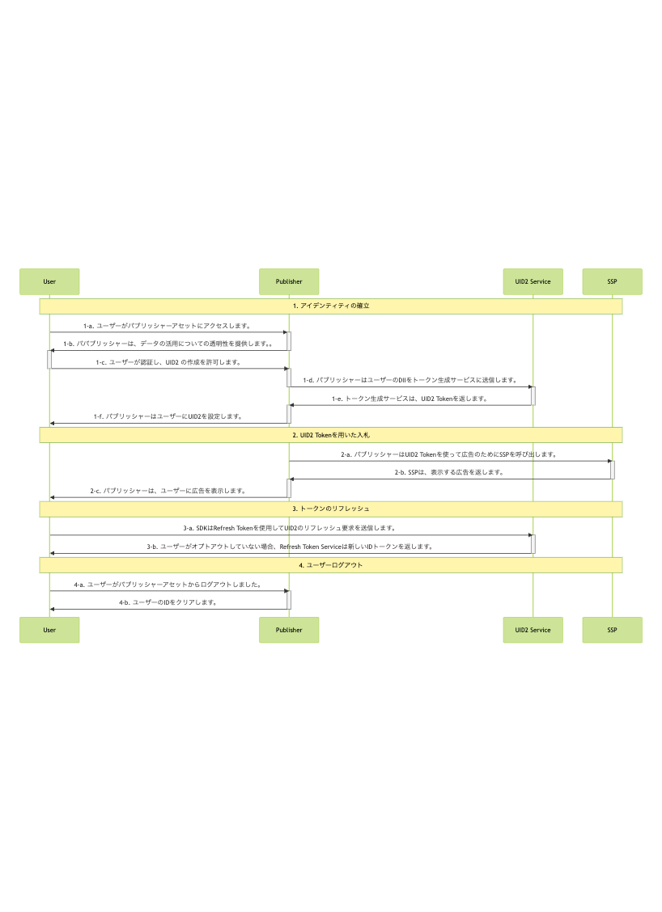

import Tabs from '@theme/Tabs';
import TabItem from '@theme/TabItem';

# Server-Side Integration Guide for JavaScript

このガイドは、UID2 対応のシングルサインオンや ID プロバイダーではなく、UID2 と直接統インテグレーションしながら、RTB ビッドストリーム用に UID2 を使用して ID トークンを生成したいウェブアセットを持つパブリッシャーを対象としています。

SDK の技術的な詳細については、[UID2 SDK for JavaScript Reference Guide](../sdks/client-side-identity.md) を参照してください。

<!-- It includes the following sections:

- [Sample Implementation Website](#sample-implementation-website)
- [Introduction](#introduction)
- [Integration Steps](#integration-steps)
  - [Establish Identity: Capture User Data](#establish-identity-capture-user-data)
  - [Bid Using UID2 Tokens](#bid-using-uid2-tokens)
  - [Refresh Tokens](#refresh-tokens)
  - [Clear Identity: User Logout](#clear-identity-user-logout)
- [FAQs](#faqs) -->

## Sample Implementation Website

アプリケーションの例については、SDK v3 を使用した UID2 Google Secure Signals の例を参照してください:
- コードとドキュメント: [UID2 SDK Secure Signals Integration Example](https://github.com/IABTechLab/uid2-web-integrations/tree/main/examples/google-secure-signals-integration/with_sdk_v3)
- ランニングサイト: [Client-Side UID2 SDK Integration Example](https://secure-signals-jssdk-integ.uidapi.com/)

## Introduction

このガイドでは、SDK を使用せずにインテグレーションを行う場合に考慮すべき基本的な手順を説明します。例えば、ユーザーログインとログアウトの実装方法、UID2 ID 情報の管理方法とターゲティング広告への使用方法、トークンのリフレッシュ方法、紛失した ID の処理方法、ユーザーのオプトアウトの処理方法などを決定する必要があります。

ワークフロー図は、[Integration Steps](#integration-steps) を参照してください。また、[FAQ](#faqs) も参照してください。

UID2 を使用してクライアントの ID を確立し、Advertising Token を取得するプロセスを容易にするために、このガイドで提供する Web インテグレーション手順は、JavaScript 用の UID2 SDK に依存しています。このガイドに記載されているインテグレーションステップと SDK の使用方法(現在はメールアドレスのみ) を示す [example application](https://example-jssdk-integ.uidapi.com/) を以下に示します。アプリケーションのドキュメントについては、[UID2 SDK Integration Example](https://github.com/IABTechLab/uid2-examples/blob/main/publisher/standard/README.md) を参照してください。

:::tip
ファーストパーティ Cookie とローカルストレージの実装の詳細は、将来変更される可能性があります。潜在的な問題を回避するため、ID 管理には [UID2 SDK for JavaScript API Reference](../sdks/client-side-identity.md#api-reference) に記載されている機能を使用してください。
:::

UID2 SDK for JavaScript を使用しないパブリッシャーのインテグレーションシナリオについては、[Publisher Integration Guide, Server-Only](custom-publisher-integration.md) を参照してください。

:::note
Google Ad Managerを使用していて、セキュアシグナル機能を使用したい場合は、まずこのガイドの手順に従った後、[Google Ad Manager Secure Signals Integration Guide](google-ss-integration.md) の追加手順に従ってください。
:::

## Integration Steps 

以下の図は、ユーザーの UID2 Token をパブリッシャーと確立するために必要なステップと、UID2 Token が RTB ビッドストリームとどのようにインテグレーションされるかを説明しています。



以下のセクションでは、図中の各ステップについての詳細を説明します: 

 1. [Establish identity: capture user data](#establish-identity-capture-user-data)
 2. [Bid Using UID2 Tokens](#bid-using-uid2-tokens)
 3. [Refresh Tokens](#refresh-tokens)
 4. [Clear Identity: User Logout](#clear-identity-user-logout)

### Establish Identity: Capture User Data

Step 1-c で認証を行い、ユーザーに利用規約を受け入れさせ、パブリッシャーがユーザーのメールアドレスまたは電話番号を検証した後、Server-Side で UID2 Token を生成する必要があります。次の表は、トークン生成ステップの詳細です。

| Step | Endpoint/SDK | Description |
| :--- | :--- | :--- |
| 1-d  | [POST&nbsp;/token/generate](../endpoints/post-token-generate.md)        | ユーザーが認証され、UID2 の作成が許可されたら、[POST&nbsp;/token/generate](../endpoints/post-token-generate.md) エンドポイントを使用して、ユーザーの正規化したメールアドレスまたは電話番号を使って UID2 Token を生成します。 |
| 1-e  | [POST&nbsp;/token/generate](../endpoints/post-token-generate.md)        | ユーザーのメールアドレス、電話番号、またはそれぞれのハッシュから生成された UID2 Token を返します。 |
| 1-f  | UID2 SDK for JavaScript | Step 1-e で返された UID2 Token を、SDK の [init()関数](../sdks/client-side-identity.md#initopts-object-void) の `identity` プロパティで SDK に送信し、以下に示すように [コールバック関数](../sdks/client-side-identity.md#callback-function) を指定します。このメカニズムにより、ユーザーがログアウトするまで、UID2 Token がターゲティング広告に利用できるようになります。|
| 1-g | UID2 SDK for JavaScript | SDK から ID 更新を受け取り、ターゲティング広告を開始するために使用するコールバック関数を SDK に提供します。 |

<Tabs>
<TabItem value='js' label='JavaScript'>

```js
  window.__uid2 = window.__uid2 || {};
  window.__uid2.callbacks = window.__uid2.callbacks || [];

  // Step 1-f
  window.__uid2.callbacks.push((eventType, payload) => {
    if (eventType === 'SdkLoaded') {
      __uid2.init({
        identity : {
          "advertising_token": "AgmZ4dZgeuXXl6DhoXqbRXQbHlHhA96leN94U1uavZVspwKXlfWETZ3b/besPFFvJxNLLySg4QEYHUAiyUrNncgnm7ppu0mi6wU2CW6hssiuEkKfstbo9XWgRUbWNTM+ewMzXXM8G9j8Q=",
          "refresh_token": "Mr2F8AAAF2cskumF8AAAF2cskumF8AAAADXwFq/90PYmajV0IPrvo51Biqh7/M+JOuhfBY8KGUn//GsmZr9nf+jIWMUO4diOA92kCTF69JdP71Ooo+yF3V5yy70UDP6punSEGmhf5XSKFzjQssCtlHnKrJwqFGKpJkYA==",
          "identity_expires": 1633643601000,
          "refresh_from": 1633643001000,
          "refresh_expires": 1636322000000,
          "refresh_response_key":"dYNTB20edyHJU9mZv11e3OBDlLTlS5Vb97iQVumc7b/8QY/DDxr6FrRfEB/D",
        }
      });
    }
  });

  // Step 1-g
  window.__uid2.callbacks.push((eventType, payload) => {
    if (eventType !== 'SdkLoaded') {
      if (payload.identity) {
        const advertisingToken = payload.identity.advertising_token;
        // Pass advertising_token to your advertising system to use
      } else {
        // No identity is available for targeted advertising - trigger a login flow if you want to use UID2 for targeted advertising
      }
    }
  });
```

</TabItem>
<TabItem value='ts' label='TypeScript'>

```tsx
  import { EventType, CallbackPayload } from "./callbackManager";

  window.__uid2 = window.__uid2 || {};
  window.__uid2.callbacks = window.__uid2.callbacks || [];

  // Step 1-f
  window.__uid2.callbacks.push((eventType: EventType, payload: CallbackPayload) => {
    if (eventType === 'SdkLoaded') {
      __uid2.init({
        identity : {
          "advertising_token": "AgmZ4dZgeuXXl6DhoXqbRXQbHlHhA96leN94U1uavZVspwKXlfWETZ3b/besPFFvJxNLLySg4QEYHUAiyUrNncgnm7ppu0mi6wU2CW6hssiuEkKfstbo9XWgRUbWNTM+ewMzXXM8G9j8Q=",
          "refresh_token": "Mr2F8AAAF2cskumF8AAAF2cskumF8AAAADXwFq/90PYmajV0IPrvo51Biqh7/M+JOuhfBY8KGUn//GsmZr9nf+jIWMUO4diOA92kCTF69JdP71Ooo+yF3V5yy70UDP6punSEGmhf5XSKFzjQssCtlHnKrJwqFGKpJkYA==",
          "identity_expires": 1633643601000,
          "refresh_from": 1633643001000,
          "refresh_expires": 1636322000000,
          "refresh_response_key":"dYNTB20edyHJU9mZv11e3OBDlLTlS5Vb97iQVumc7b/8QY/DDxr6FrRfEB/D",
        }
      });
    }
  });

  // Step 1-g
  window.__uid2.callbacks.push((eventType: EventType, payload: CallbackPayload) => {
    if (eventType !== 'SdkLoaded') {
      if (payload.identity) {
        const advertisingToken = payload.identity.advertising_token;
        // Pass advertising_token to your advertising system to use
      } else {
        // No identity is available for targeted advertising - trigger a login flow if you want to use UID2 for targeted advertising
      }
    }
  });
```

</TabItem>
</Tabs>

SDKは、指定された [callback function](../sdks/client-side-identity.md#callback-function) (ID の可用性を示します) を呼び出し、確立された ID をClient-Side で入札可能な状態にします。

:::tip
コードの構造によっては、Step 1-f と 1-g のコールバックを 1 つのコールバック関数にまとめると便利かもしれません。
:::

### Bid Using UID2 Tokens

有効な ID のステータスと利用可能性に基づいて、SDK は以下を実行します:

1. バックグラウンドの token auto-refresh を設定します。
1. ID 情報を [ローカルストレージまたはファーストパーティクッキー](../sdks/client-side-identity.md#uid2-storage-format) に保存します。
1. ID 情報を使用して、ターゲティング広告のリクエストを始めます。

<!-- (**GWH_TODO. Q: Not sure about the relationship between the steps above and the table below. And the diagram 2-a which says "the publisher calls the SSP for ads using the UID2 token". A: Diagram needs to be updated.**) -->

ビッドステップを以下の表に示します。

| Step | Endpoint/SDK | Description |
| :--- | :--- | :--- |
| 2-a | UID2 SDK for JavaScript | 以下に示すように、[getAdvertisingToken() 関数](../sdks/client-side-identity.md#getadvertisingtoken-string) を使用して、現在のユーザーの Advertising Token を取得します。|

>NOTE: UID2 Token が SSP から DSP に送信されるとき、ビッドストリーム内でどのように見えるかの例については、[ビッドストリームで UID2 Token はどのように見えますか？](../getting-started/gs-faqs.md#%E3%83%93%E3%83%83%E3%83%89%E3%82%B9%E3%83%88%E3%83%AA%E3%83%BC%E3%83%A0%E3%81%A7-UID2-Token-%E3%81%AF%E3%81%A9%E3%81%AE%E3%82%88%E3%81%86%E3%81%AB%E8%A6%8B%E3%81%88%E3%81%BE%E3%81%99%E3%81%8B%EF%BC%9F) を参照してください。

```html
<script>
  let advertisingToken = __uid2.getAdvertisingToken();
</script>
```

:::info
返された Advertising Token をどのように SSP に渡すかを検討する必要があります。`Prebid.js`([UID2 Integration Overview for Prebid.js](integration-prebid.md) を参照) や Google Ad Manager Secure Signals([Google Ad Manager Secure Signals Integration Guide](google-ss-integration.md) を参照) を使用するなど、Client-Side で UID2 を実装する他のいくつかのアプローチでは、実装に、返された Advertising Token の受け渡しを管理する関数が含まれています。UID2 SDK for JavaScriptを使用している場合は、これを自分で管理する必要があります。
:::

:::tip
`__uid2.getAdvertisingToken()` を呼び出す代わりに、Step 1-g で設定したコールバックに渡された ID の `advertising_token` プロパティを使用することができます。このコールバックは ID が変更されるたびに呼び出されます。
:::

### Refresh Tokens

初期化の一環として、SDK は ID の [token auto-refresh](../sdks/client-side-identity.md#background-token-auto-refresh) を設定します。これは、ID 上のタイムスタンプ、または断続的なエラーによるリフレッシュの失敗によってバックグラウンドでトリガーされます。

| Step | Endpoint/SDK | Description |
| :--- | :--- | :--- |
| 3-a | [UID2 SDK for JavaScript](../sdks/client-side-identity.md) | SDK はバックグラウンドで自動的に UID2 Token をリフレッシュします。手動で操作する必要はありません。 |
| 3-b | [UID2 SDK for JavaScript](../sdks/client-side-identity.md) | ユーザーがオプトアウトしていない場合、[POST&nbsp;/token/refresh](../endpoints/post-token-refresh.md) エンドポイントは、自動的に新しい ID トークンを返します。 |


### Clear Identity: User Logout

クライアントのライフサイクルは、ユーザーがパブリッシャーのサイト (UID2 ではなく) からログアウトすることを決定したときに完了します。これにより、クライアントの ID セッションが終了し、ファーストパーティ Cookie 情報がクリアされます。

| Step | Endpoint/SDK | Description |
| :--- | :--- | :--- |
| 4-a | N/A | ユーザーはパブリッシャーのアセットからログアウトします。 |
| 4-b | [UID2 SDK for JavaScript](../sdks/client-side-identity.md) | SDKは、以下に示すように、[disconnect() function](../sdks/client-side-identity.md#disconnect-void) を使用して、ファーストパーティ Cookie から UID2 ID をクリアし、クライアントのライフサイクルを切断します。|


```html
<script>
  __uid2.disconnect();
</script>
```

## FAQs

パブリッシャー向けのよくある質問については、[FAQs for Publishers](../getting-started/gs-faqs.md#faqs-for-publishers) を参照してください。
