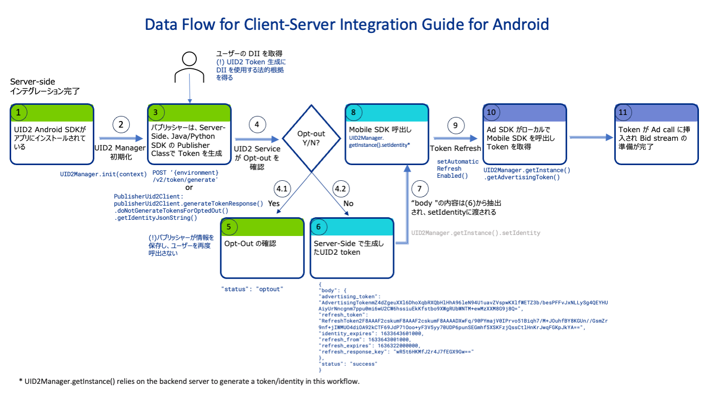

import Tabs from '@theme/Tabs';
import TabItem from '@theme/TabItem';
import Link from '@docusaurus/Link';
import EnableLogging from '/docs/snippets/_mobile-docs-enable-logging.mdx';
import GMAIMA_Plugins from '/docs/snippets/_mobile_docs_gmaima-plugin-gss.mdx';
import PrebidMobileSDK from '/docs/snippets/_mobile_docs_prebid-mobile.mdx';
import ExampleAdvertisingToken from '/docs/snippets/_example-advertising-token.mdx';

# UID2 Client-Server Integration Guide for Mobile

このガイドは、Public Operator または Private Operator を介して Server-Side で UID2 Token を生成し、そのトークンとユーザー ID をモバイルアプリに渡して UID2 とインテグレーションしたいモバイルアプリパブリッシャー向けです。モバイルアプリは、そのトークンを <Link href="../ref-info/glossary-uid#gl-bidstream">ビッドストリーム</Link> に使用するために渡します。

これは Client-Server インテグレーションと呼ばれます。これは、いくつかのインテグレーションステップがクライアントサイドで行われ、いくつかがサーバーサイドで行われるためです。

Client-Side のみの変更で UID2 とインテグレーションしたい場合 (つまり、すべてのインテグレーション変更がモバイルアプリ内で行われる場合) は、代わりに [UID2 Client-Side Integration Guide for Mobile](integration-mobile-client-side.md) を参照してください。

このページでは、インテグレーション手順の概要と、追加のドキュメントへのリンクを提供します。

UID2 は、[Android](../sdks/sdk-ref-android.md) および [iOS](../sdks/sdk-ref-ios.md) 向けのモバイル SDK を提供しています。各 SDK には、次の機能があります:

- UID2 <Link href="../ref-info/glossary-uid#gl-identity">identity</Link> (UID2 Token と関連する値) を生成し、モバイルアプリに渡すためのメソッドを提供します。
- UID2 Token を自動的にリフレッシュします。

:::note
このガイドの、**UID2 mobile SDKs** は、SDK for Android と SDK for iOS の両方を含むグループ用語です。
:::

モバイルパブリッシャーインテグレーションに関する FAQs については、[FAQs for Mobile Integrations](../guides/integration-mobile-overview.md#faqs-for-mobile-integrations) を参照してください。

以下の手順を完了する必要があります:

1. [Complete the UID2 account setup](#complete-the-uid2-account-setup).
2. [Implement server-side token generation](#implement-server-side-token-generation).
3. [Add the UID2 mobile SDK to your mobile app](#add-the-uid2-mobile-sdk-to-your-mobile-app).
4. [Configure the UID2 mobile SDK](#configure-the-uid2-mobile-sdk).
5. [Check that the token was successfully generated and then pass it for bidstream use](#pass-generated-token-for-bidstream-use).
6. [Optionally, integrate the UID2 GMA/IMA Plugin for GAM Secure Signals integration](#optional-uid2-gmaima-plugin-for-gam-secure-signals-integration).

## Mobile SDK Version

このガイドは、次のいずれかの UID2 mobile SDK のバージョン 1.2.0 以上を使用する方法について説明します:

- SDK for Android
- SDK for iOS

正しい SDK/バージョンをモバイルアプリにインストールする手順については、[Add the UID2 Mobile SDK to Your Mobile App](#add-the-uid2-mobile-sdk-to-your-mobile-app) を参照してください。

## Complete the UID2 Account Setup

アカウントの設定を完了するには、[Account Setup](../getting-started/gs-account-setup.md) に記載されている手順に従ってください。

アカウントの設定が完了すると、ユニークな API Key とクライアントシークレットが送信されます。これらの値はあなたに固有であり、安全に保管することが重要です。詳細は [API Key and Client Secret](../getting-started/gs-credentials.md#api-key-and-client-secret) を参照してください。

## Client-Server Mobile Integration Data Flow Overview

下記の図は、UID2 Client-Server モバイルインテグレーションを実装するためにパブリッシャーが実装する必要があるデータフローを示しています。

この例では、Client-Side のモバイルアプリで [SDK for Android](../sdks/sdk-ref-android.md) を使用し、Server-Side で [SDK for Java](../sdks/sdk-ref-java.md) を使用しています。



<!-- (**GWH_ https://ttdcorp-my.sharepoint.com/:p:/r/personal/rita_aleksanyan_thetradedesk_com/_layouts/15/Doc.aspx?sourcedoc=%7BDF894943-3D6A-4A60-A1E2-176ACD0BBBCC%7D&file=Sample%20Data%20Flow.pptx&wdLOR=c8FEF9DB2-E2FD-4F07-B411-B094C4813ACE&fromShare=true&action=edit&mobileredirect=true**) -->

## Implement Server-Side Token Generation

モバイル向けの Client-Server UID2 インテグレーションの場合、最初のステップは、サーバーで UID2 Token を生成できるようにすることです。その後、トークンをモバイルアプリに渡して RTB ビッドストリームに送信できます。

手順や例については、[Server-Side Token Generation](../ref-info/ref-server-side-token-generation.md) を参照してください。

`Identity` レスポンスをモバイルアプリに渡す必要があります: [Configure the UID2 Mobile SDK](#configure-the-uid2-mobile-sdk) を参照してください。

:::warning
セキュリティ上の理由から、トークン生成に使用される API キーとシークレットはサーバーサイドで呼び出す必要があります。これらの値をモバイルアプリ内に保存しないでください。
:::

## Server-Side Token Refresh

UID2 mobile SDK では Token Refresh が自動的に有効になっています。Server-Side で明示的に管理する必要はありません。

モバイルアプリでの変更をできるだけシンプルにしたい場合は、Server-Side で Token Refresh を行うこともできます。

Token Refresh を Server-Side で管理し、クライアント/モバイルサイドではなく行いたい場合は、次のいずれかを使用してください:

- [POST&nbsp;/token/refresh](../endpoints/post-token-refresh.md) エンドポイントを呼び出します。
- UID2 Server-Side SDK のいずれかの Publisher Client クラスを使用します。これらのクラスは、リクエストを単一のメソッド呼び出しに簡素化します。

  手順については、[SDK for Java, Usage for Publishers, Basic Usage Server-Side Integration section](../sdks/sdk-ref-java.md#basic-usage-server-side-integration) または [SDK for Python, Usage for Publishers, Server-Side Integration section](../sdks/sdk-ref-python.md#server-side-integration) を参照してください。

その後、このガイドの残りの部分に従って、新しくリフレッシュされた `Identity` 値をモバイルアプリに渡します。

## Add the UID2 Mobile SDK to Your Mobile App

インストール方法については、以下のいずれかを参照してください:

- [SDK for Android Reference Guide](../sdks/sdk-ref-android.md)
- [SDK for iOS Reference Guide](../sdks/sdk-ref-ios.md)

この時点で、Server-Side で生成された UID2 Identity をモバイル SDK で使用する準備が整いました。

### Using the UID2 Integration Environment

デフォルトでは、SDK は UID2 本番環境で動作するように構成されています: `https://prod.uidapi.com`。代わりに UID2 インテグレーション環境を使用する場合は、UID2Manager の初期化に次の URL を指定してください:

<Tabs groupId="language-selection">
<TabItem value='android' label='Android'>

```js
UID2Manager.init(
  context = this,
  UID2Manager.Environment.Custom("https://operator-integ.uidapi.com")
)
```

</TabItem>
<TabItem value='ios' label='iOS'>

```js
// Must be set before UID2Manager.shared is accessed
UID2Settings.shared.uid2Environment = .custom(
  url: URL(string: "https://operator-integ.uidapi.com")!
)
```

</TabItem>
</Tabs>

:::note
次のような環境間の違いに注意してください:
- UID2 インテグレーション環境のトークンは、ビッドストリームに渡しても有効ではありません。
- 各環境（インテグレーションおよび本番）には異なる API Key とクライアントシークレット値があります。各環境で正しい値を使用してください。
:::

### Optional: Specifying the API Base URL to Reduce Latency

デフォルトでは、この SDK は米国の UID2 本番環境サーバーにリクエストを送信します。

ユースケースに最適な URL を選択する方法と、有効なベース URL の完リストについては、[Environments](../getting-started/gs-environments.md) を参照してください。

異なる UID2 サーバーを指定するには、`init` 呼び出しで変更してください:

<Tabs groupId="language-selection">
<TabItem value='android' label='Android'>

```js
UID2Manager.init(
  context = this,
  serverUrl = "https://global.prod.uidapi.com"
)
// or 
UID2Manager.init(
  context = this,
  UID2Manager.Environment.Custom("https://global.prod.uidapi.com")
)
```

</TabItem>
<TabItem value='ios' label='iOS'>

```js
UID2Settings.shared.uid2Environment = .singapore
// or
UID2Settings.shared.uid2Environment = .custom(
  url: URL(string: "https://global.prod.uidapi.com")!
)
```

</TabItem>
</Tabs>

## Configure the UID2 Mobile SDK

モバイルアプリで `UID2Manager` を正しくインスタンス化した後、Server-Side で生成された UID2 <Link href="../ref-info/glossary-uid#gl-identity">identity</Link> を渡し ([Implement server-side token generation](#implement-server-side-token-generation) を参照してください)、以下のようにモバイルアプリに渡してください:

<Tabs groupId="language-selection">
<TabItem value='android' label='Android'>

```js
UID2Manager.getInstance().setIdentity()
```

</TabItem>
<TabItem value='ios' label='iOS'>

```js
UID2Manager.shared.setIdentity()
```

</TabItem>
</Tabs>

## Token Storage

`setIdentity` メソッドを呼び出すと、UID2 identity がローカルファイルストレージに永続化されます。

:::warning
ローカルファイルストレージに保存されたファイルの形式、またはファイル名自体が予告なく変更される可能性があります。ファイルを直接読み取ったり更新したりしないことを勧めます。
:::

## Pass Generated Token for Bidstream Use

トークンを取得するには、モバイルアプリで次のように呼び出します:

<Tabs groupId="language-selection">
<TabItem value='android' label='Android'>

```js
UID2Manager.getInstance().getAdvertisingToken()
```

</TabItem>
<TabItem value='ios' label='iOS'>

```js
UID2Manager.shared.getAdvertisingToken()
```

</TabItem>
</Tabs>

UID2Manager への ID の追加が成功した場合、このメソッドは次のような文字列を返します:

<ExampleAdvertisingToken />

この identity をダウンストリームに渡して RTB ビッドストリームに送信できます。

`getAdvertisingToken()`　メソッドが `null` を返す場合、identity または有効なトークンが生成されていません。これにはいくつかの理由が考えられ、トラブルシューティングするためにできることは次のとおりです:

- Identity が無効です。この場合、いくつかのオプションがあります:
  - 前の `setIdentity()` 呼び出しでエラーがあるかどうかを確認します。
  - 以下のいずれかを使用して、identity のステータスを確認します:
    - **Android Java**: `UID2Manager.getInstance().getCurrentIdentityStatus()` 
    - **Android Kotlin**: `UID2Manager.getInstance().currentIdentityStatus()` 
    - **iOS**: `UID2Manager.shared.identityStatus`
- ロギングを有効にして詳細情報を取得します: [Enable Logging](#enable-logging) を参照してください。
- UID2 identity 内の Advertising Token の有効期限が切れていて、Refresh Token も有効期限が切れているため、SDK がトークンをリフレッシュできません。

ID が無効の場合、[Implement Server-Side Token Generation](#implement-server-side-token-generation) に従って新しい identity を生成し、その結果をモバイルアプリの UID2Manager に再度渡してください。

## When to Pass a new UID2 Identity/Token into the SDK

UID2 SDK が新しい UID2 identity を再度必要とするかどうかを判断するための最良の方法は、すべてのケースで `getAdvertisingToken()` メソッドを呼び出すことです:

<Tabs groupId="language-selection">
<TabItem value='android' label='Android'>

```js
UID2Manager.getInstance().getAdvertisingToken()
```

</TabItem>
<TabItem value='ios' label='iOS'>

```js
UID2Manager.shared.getAdvertisingToken()
```

</TabItem>
</Tabs>

アプリの起動/再開時に、`getAdvertisingToken()` が `null` を返す場合、[Implement Server-Side Token Generation](#implement-server-side-token-generation) の手順に従ってサーバーで、新しい identity を生成してください。その後、モバイルアプリの UID2Manager に結果を再度渡してください: [Configure the UID2 Mobile SDK](#configure-the-uid2-mobile-sdk) を参照してください。

## Enable Logging

<EnableLogging />

## Enable Automatic Token Refresh in Mobile App/Client Side

デフォルトでは、有効な UID2 ID が UID2Manager に渡されると、自動的にトークンリフレッシュが実行されます。トークンリフレッシュが無効になっていた場合、次のメソッド呼び出しで有効にできます:

<Tabs groupId="language-selection">
<TabItem value='android' label='Android'>

**Android Java**:

```java
UID2Manager.getInstance().setAutomaticRefreshEnabled(false)
```

**Android Kotlin**:

```kotlin
UID2Manager.getInstance().automaticRefreshEnabled = false
```

</TabItem>
<TabItem value='ios' label='iOS'>

```js
UID2Manager.shared.automaticRefreshEnabled = false
```

</TabItem>
</Tabs>

## Optional: UID2 GMA/IMA Plugin for GAM Secure Signals integration

<GMAIMA_Plugins />

## Optional: UID2 Prebid Mobile SDK Integration

<PrebidMobileSDK />