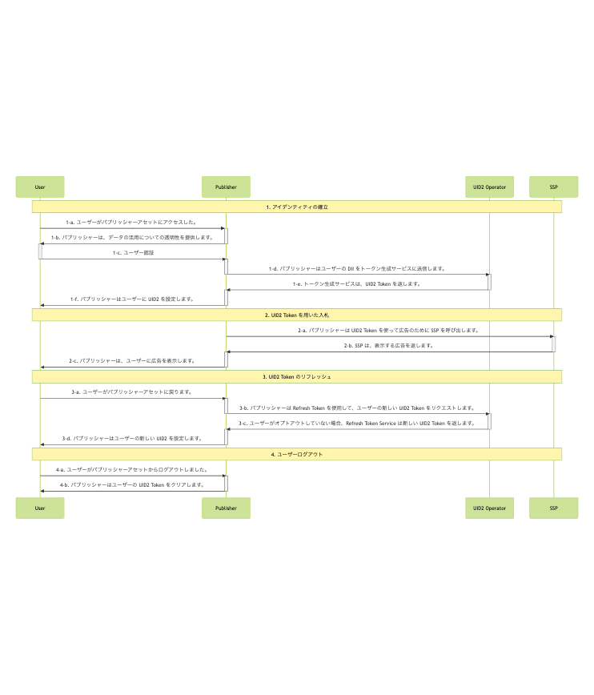

import Link from '@docusaurus/Link';
import IntegratingWithSSO from '../snippets/_integrating-with-sso.mdx';

# Publisher Integration Guide, Server-Side

このガイドは、<Link href="../ref-info/glossary-uid#gl-uid2-token">UID2 Token</Link> (Advertising Token) を RTB <Link href="../ref-info/glossary-uid#gl-bidstream"><Link href="../ref-info/glossary-uid#gl-bidstream">ビッドストリーム</Link></Link> 用に生成するために、UID2 と直接インテグレーションを行いながら、UID2 対応シングルサインオンや ID プロバイダーではなく、すべてのインテグレーションをサーバーサイドで行うパブリッシャー向けのガイドです。

パブリッシャーが UID2 と Server-Side でインテグレーションするには、以下のオプションが利用可能です:

- SDK for Java (see [Usage for Publishers](../sdks/sdk-ref-java.md#usage-for-publishers) section).
- SDK for Python (see [Usage for Publishers](../sdks/sdk-ref-python.md#usage-for-publishers) section).
- Custom server code to generate and refresh the UID2 token by calling the [POST&nbsp;/token/generate](../endpoints/post-token-generate.md) and [POST&nbsp;/token/refresh](../endpoints/post-token-refresh.md) endpoints.

ワークフローをデモするサンプルアプリケーションもあります。[Sample Implementation](#sample-implementation) を参照してください。

パブリッシャーインテグレーションオプションの完全な概要については、[Publisher Integrations](summary-guides.md#publisher-integrations) を参照してください。

:::tip
UID2 と UID2 Token を使用してクライアントのアイデンティティを確立し、UID2 Token を取得するプロセスを容易にするために、SDK for JavaScript を使用することを検討してください。詳細は [Client-Server Integration Guide for JavaScript](integration-javascript-client-server.md) を参照してください。
:::

## Introduction

このガイドでは、Client-Side または Server-Side SDK を使用せずインテグレーションを行う場合に考慮する必要がある [basic steps](#integration-steps) について説明します。たとえば、以下のようなことを決定する必要があります:

- メールアドレスまたは電話番号を取得する機会を実装する: たとえば、プロモーションの交換、サインアップとサブスクリプション、またはマーケティングフォームの記入。
- UID2 ID 情報を管理し、ターゲティング広告に使用する
- UID2 Token をリフレッシュする
- ID が欠落している場合の処理
- ユーザーオプトアウトを管理する

[FAQs](#faqs) も参照してください。

## Integrating with Single Sign-On (SSO)

<IntegratingWithSSO />

## Complete UID2 Account Setup and Configure Account

UID2 とインテグレーションするには、UID2 アカウントが必要です。アカウントをまだ作成していない場合は、まず [Account Setup](../getting-started/gs-account-setup.md) ページの手順に従ってください。

アカウントの初期設定が完了すると、UID2 Portalにアクセスするための手順とリンクが送信されます。UID2 Portalでは、本番環境のための [credentials](../getting-started/gs-credentials.md) を作成し、提供する必要がある追加の値を設定できます。詳細については、[Getting Started with the UID2 Portal](../portal/portal-getting-started.md) を参照してください。

Server-Side インテグレーションの場合、UID2 Portalの [API Keys](../portal/api-keys.md) ページで以下の値を設定する必要があります:

- <Link href="../ref-info/glossary-uid#gl-api-key">API key</Link>、Client Key とも呼ばれます、
- <Link href="../ref-info/glossary-uid#gl-client-secret">Client secret</Link>、参加者と UID2 Service のみが知る値。

:::important
これらの値を安全に保管することが非常に重要です。詳細については、[Security of API Key and Client Secret](../getting-started/gs-credentials.md#security-of-api-key-and-client-secret) を参照してください。
:::

## Integration Steps

以下の図は、ユーザーがパブリッシャーと UID2 Token を確立するために必要なステップと、UID2 Token が RTB ビッドストリームとどのようにインテグレーションされるかを概説したものです。

Server-Side SDK を使用している場合、SDK はエンドポイントに関連するすべてのステップを処理します。たとえば、Step 1-d では、発行者はユーザーの DII をトークン生成サービスに送信します。

<!-- diagram source: resource/integration-publisher-server-side-mermaid.md.bak -->

次のセクションでは、図中の各ステップについて詳細を説明します:

1. [Establish identity: capture user data](#establish-identity-capture-user-data)
2. [Bid using a UID2 token](#bid-using-a-uid2-token)
3. [Refresh a UID2 token](#refresh-a-uid2-token)
4. [Clear Identity: user logout](#clear-identity-user-logout)

### Establish Identity: Capture User Data

Step 1-c で認証が行われい、パブリッシャーがユーザーのメールアドレスや電話番号を検証した後、パブリッシャーは Server-Side で UID2 Token を生成するリクエストを送信することができます。次の表は、トークン生成ステップの詳細です。

:::tip
このエンドポイントを直接呼び出す代わりに、SDK のいずれかを使用して管理することもできます。オプションの概要については、[SDKs: Summary](../sdks/summary-sdks.md) を参照してください。
:::

| Step | Endpoint | Description |
| :--- | :--- | :--- |
| 1-d  | [POST&nbsp;/token/generate](../endpoints/post-token-generate.md) | パブリッシャーが UID2 を使用してアイデンティティを確立するには、2 つの方法があります: - UID2 対応のシングルサインオンプロバイダーとインテグレーションします。 - [POST&nbsp;/token/generate](../endpoints/post-token-generate.md) エンドポイントを使って、ユーザーの正規化したメールアドレスまたは電話番号から UID2 Token を生成します。 |
| 1-e  | [POST&nbsp;/token/generate](../endpoints/post-token-generate.md) | ユーザーのメールアドレス、電話番号、またはそれぞれのハッシュからと、Refresh Token などの関連値から生成された UID2 Token を返します。 |
| 1-f  | N/A                                                         | 返された `advertising_token` と `refresh_token` は、ユーザーに紐づくストレージに保存します。ファーストパーティクッキーのようなClient-Side のストレージや、Server-Sideのストレージを検討するとよいでしょう。|

### Bid Using a UID2 Token

UID2 ID 情報をどのように管理し、ターゲティング広告に使用したいかを検討する必要があります。たとえば、返された UID2 token を SSP に渡す等。

| Step | Endpoint | Description |
| :--- | :--- | :--- |
| 2-a  | N/A      | Step [1-e](#establish-identity-capture-user-data) の `advertising_token` を入札のために SSP に送信します。そのままの値を送信します。 |

:::note
UID2 Token が SSP から DSP に送信されるとき、ビッドストリーム内でどのように見えるかの例については、[ビッドストリームで UID2 Token はどのように見えますか？](../getting-started/gs-faqs.md#what-does-a-uid2-token-look-like-in-the-bidstream) を参照してください。
:::

### Refresh a UID2 Token

`POST /token/refresh` エンドポイントを使用して、常に有効で最新の UID2 Token を持つようにします。UID2 ローテーションと同期させるには、UID2 Token をリフレッシュする必要があります。さらに、トークンリフレッシュプロセスではユーザーのオプトアウトステータスをチェックし、ユーザーがオプトアウトしている場合は新しいトークンを送信しません。これによりトークンリフレッシュチェーンが終了します。その UID2 Token を二度と使用してはなりません。

UID2 の Opt-out ワークフローとユーザーが Opt-out する方法の詳細は、[User Opt-Out](../getting-started/gs-opt-out.md) を参照してください。

| Step | Endpoint | Description |
| :--- | :--- | :--- |
| 3-a  | N/A | ユーザーがアセットに戻り、再びアクティブになったとき、UID2 Token をリフレッシュしてから、SSP に送信します。 |
| 3-b  | [POST&nbsp;/token/refresh](../endpoints/post-token-refresh.md) | Step [1-e](#establish-identity-capture-user-data) で取得した `refresh_token` をクエリパラメータとして送信します。 |
| 3-c  | [POST&nbsp;/token/refresh](../endpoints/post-token-refresh.md) | UID2 Service は、オプトアウトしていないユーザーに対して新しい ID トークンを発行します。 |
| 3-d  | N/A | `POST /token/refresh` エンドポイントから返される値、`advertising_token` と `refresh_token` を、ユーザーにリンクされるように配置します。ファーストパーティのクッキーのようなClient-Side のストレージか、サーバサイドのストレージを検討するとよいでしょう。 |

:::tip
[POST&nbsp;/token/generate](../endpoints/post-token-generate.md) または [POST&nbsp;/token/refresh](../endpoints/post-token-refresh.md) エンドポイントによって返された ID の `refresh_from` タイムスタンプからトークンのリフレッシュを始めてください。
:::

### Clear Identity: User Logout

ユーザーがログアウトした場合は、UID2 Token を使用しないでください。

| Step | Endpoint | Description |
| :--- | :--- | :--- |
| 4-a  | N/A | ユーザーがパブリッシャーアセットからログアウトしました。|
| 4-b  | N/A | そのユーザー用に保存してある UID2 Token を削除します。UID2 Service とのやりとりは必要ありません。 |

## Sample Implementation

Server-only のインテグレーションのためのサンプルアプリケーションをがあります。以下を参照してください:

- [Server-Side UID2 Integration Example (sample implementation)](https://secure-signals-server-side-integ.uidapi.com/)
- [Server-Side UID2 Integration Example (readme)](https://github.com/IABTechLab/uid2-examples/blob/main/publisher/server_only/README.md)

## FAQs

パブリッシャー向けのよくある質問は、[FAQs for Publishers](../getting-started/gs-faqs.md#faqs-for-publishers) を参照してください。
