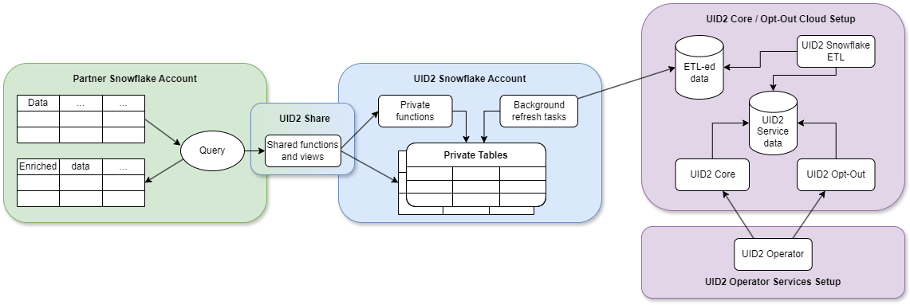

import Link from '@docusaurus/Link';

# Snowflake Integration Guide (Pre-July 2025)

[Snowflake](https://www.snowflake.com/)は、パートナーとしてデータを保存し、UID2 フレームワークとインテグレーションできるクラウドデータウェアハウジングソリューションです。Snowflake を使用することで、UID2 では機密性の高い<Link href="../ref-info/glossary-uid#gl-dii">直接識別情報（DII）</Link>を公開せずに、消費者識別子データを安全に共有できます。消費者識別子データについて Operator Web Serbvice に直接クエリを実行するオプションもありますが、Snowflake の UID2 インテグレーションはより円滑な体験を提供します。

:::important
このドキュメントは、2025年2月以前に公開された広告主とデータプロバイダー向けの別々の Snowflake marketplace を使用しているユーザー向けです。2025年2月に公開された新しいインテグレーションに関するドキュメントは、[Snowflake Integration Guide](integration-snowflake.md) を参照してください。以前の実装を使用している場合は、更新と強化を活用するために新しいバージョンに移行することを推奨します。移行情報は、[Migration Guide](integration-snowflake.md#migration-guide) を参照してください。
:::

## Snowflake Marketplace Listing

以下のリストは、Snowflake マーケットプレイスで利用可能です：
- [Unified ID 2.0: Advertiser and Data Provider Identity Solution](https://app.snowflake.com/marketplace/listing/GZT0ZRYXTN8/unified-id-2-0-unified-id-2-0-advertiser-and-data-provider-identity-solution)

:::tip
広告主とデータプロバイダー向けのインテグレーションオプションとステップの概要は、[Advertiser/Data Provider Integration Overview](integration-advertiser-dataprovider-overview.md)を参照してください。
:::

## Functionality

以下の表は、UID2 Snowflake インテグレーションで利用可能な機能をまとめたものです。

| Encrypt Raw UID2 to UID2 Token for Sharing | Decrypt UID2 Token to Raw UID2 | Generate UID2 Token from DII | Refresh UID2 Token | Map DII to Raw UID2s |
| :--- | :--- | :--- | :--- | :--- |
| &#9989; | &#9989; | &#8212;* | &#8212; | &#9989; |

*DII から 直接 UID2 Token を生成するために Snowflake を使用することはできません。ただし、DII を Raw UID2 に変換し、その Raw UID2 を UID2 Token に暗号化することは可能です。

:::note
<Link href="../ref-info/glossary-uid#gl-bidstream">ビッドストリーム</Link>で UID2 Token を共有するパブリッシャーの場合は、[Tokenized Sharing in the Bidstream](../sharing/sharing-tokenized-from-data-bid-stream.md)を参照してください。
:::

## Changes from Previous Version

2025年2月の UID2 Snowflake マーケットプレイスインテグレーションの更新には、いくつかの更新と機能強化が含まれています。主な変更点の一つは、以前の 2 つのデータ共有（広告主向けとデータプロバイダー向け）の機能を組み合わせた単一のリスティングとデータ共有が含まれることです。これにより、すべての参加者のインテグレーションが簡素化されます。

:::note
これらの変更は、2025年2月以前に公開されたSnowflake関数のバージョンを使用しているコードインテグレーションを想定しています（[nowflake Integration Guide (Version Prior to February 2025)](integration-snowflake-before-february-2025.md)を参照）。`FN_T_UID2_IDENTITY_MAP_EMAIL` と `FN_T_UID2_IDENTITY_MAP_EMAIL_HASH` 関数を使用するさらに古いバージョンを使用している場合は、[Migration Guide section in the earlier guide](integration-snowflake-before-february-2025.md#migration-guide)の指示に従い、その後再度現在のバージョンにアップグレードすることもできます。ただし、このシナリオでは、このガイドの指示に従い、一度に更新することを勧めます。詳細は、[Migration Guide](#migration-guide)を参照してください。
:::

以下の表は、以前のバージョンからのSnowflake関数の変更詳細を示しています。

| Old function | New function | Fields in old function | Fields in new function | Comments |
| :-- | :-- | :-- | :-- | :-- |
| `FN_T_UID2_IDENTITY_MAP` | `FN_T_IDENTITY_MAP` | `UID2` | `UID` | 詳細は[Map DII](#map-dii)を参照してください。|
| `FN_T_UID2_ENCRYPT` | `FN_T_ENCRYPT` | `UID2_TOKEN` | `UID_TOKEN` | 詳細は[Encrypt Tokens](#encrypt-tokens)を参照してください。|
| `FN_T_UID2_DECRYPT` | `FN_T_DECRYPT` | `UID2_TOKEN` | `UID_TOKEN` | 詳細は[Decrypt Tokens](#decrypt-tokens)を参照してください。|

以下の表は、以前のバージョンからのSnowflakeビューの変更詳細を示しています。

| Old view | New view | Comments |
| :-- | :-- | :-- |
| `UID2_SALT_BUCKETS` | `SALT_BUCKETS` | 詳細は[Monitor for Salt Bucket Rotation and Regenerate Raw UID2s](#monitor-for-salt-bucket-rotation-and-regenerate-raw-uid2s)を参照してください。 |

## Workflow Diagram

以下の図と表は、Snowflake における UID2 インテグレーションプロセスの各部分とワークフローを示しています。



|Partner Snowflake Account|UID2 Snowflake Account|UID2 Core Opt-Out Cloud Setup|
| :--- | :--- | :--- |
| パートナーとして、Snowflake アカウントを設定してデータをホストし、UID2 Share を通じて関数とビューを利用することで UID2 のインテグレーションを行います。 | UID2 インテグレーションは、Snowflake アカウントでホストされており、プライベートテーブルからデータを取得する認証済み関数とビューへのアクセス権を付与します。プライベートテーブルには直接アクセスできません。UID2 Share は、UID2 関連タスクを実行するために必要な重要なデータのみを公開します。<br/>**Note**：プライベートテーブルには<Link href="../ref-info/glossary-uid#gl-salt">ソルト</Link>と暗号化キーを保存しています。いかなる時点でも<Link href="../ref-info/glossary-uid#gl-dii">DII</Link>は保存されません。 | ETL（Extract Transform Load）ジョブが常に UID2 Core/Optout の Snowflake ストレージを、UID2 Operator Web Service を動かす内部データで更新しています。Operator Web Service で使用されるデータは UID2 Share を通じても利用可能です。|
| 共有関数とビューを使用する場合、トランザクション計算コストは Snowflake に支払います。 | UID2 Snowflake アカウントで保護されているこれらのプライベートテーブルは、UID2 関連タスクを完了するために使用される内部データを保持する UID2 Core/Optout の Snowflake ストレージと自動的に同期します。  | |

## Access the UID2 Share

UID2 Share へのアクセスは、[Snowflake Data Marketplace](https://www.snowflake.com/data-marketplace/)の以下のリスティングから利用できます：

- [Unified ID 2.0: Advertiser and Data Provider Identity Solution](https://app.snowflake.com/marketplace/listing/GZT0ZRYXTN8/unified-id-2-0-unified-id-2-0-advertiser-and-data-provider-identity-solution)

:::important
データをリクエストするには、Snowflakeアカウントで `ACCOUNTADMIN` ロールまたは `CREATE DATABASE` および `IMPORT SHARE` 権限を持つ別のロールを使用する必要があります。
:::

UID2 Share へのアクセスをリクエストするには、以下の手順を完了してください：

1.	Snowflake Data Marketplace にログインし、UID2 listing を選択します：
      - [Unified ID 2.0: Advertiser and Data Provider Identity Solution](https://app.snowflake.com/marketplace/listing/GZT0ZRYXTN8/unified-id-2-0-unified-id-2-0-advertiser-and-data-provider-identity-solution)
2.	**Personalized Data**セクションで、**Request Data**をクリックします。
3.	画面の指示に従って、連絡先の詳細やその他の必要な情報を確認して提供します。
4.	The Trade Desk の既存クライアントである場合は、データリクエストフォームの**Message** 欄にThe Trade Desk から発行されたパートナー ID と広告主 ID を記入します。
5.	フォームを送信します。

リクエストが受信された後、UID2 Administrator が適切なアクセス手順について連絡します。Snowflake でのデータリクエストの管理の詳細は、[Snowflake documentation](https://docs.snowflake.com/en/user-guide/data-marketplace-consumer.html)を参照してください。

## Shared Objects

次の関数を使用して、DII を UID2 にマッピングできます：

- `FN_T_IDENTITY_MAP`（詳細は[Map DII](#map-dii)を参照）

以下の関数は `FN_T_IDENTITY_MAP` に代わって非推奨となっています。以前の Snowflake バージョンを使用している場合は引き続き使用できますが（[Snowflake Integration (Pre-Feb 2025)](integration-snowflake-before-february-2025.md)を参照）、できるだけ早くアップグレードすることを勧めます：

- `FN_T_UID2_IDENTITY_MAP`（非推奨）

:::note
非推奨の関数を使用していて、新しい関数への移行に助けが必要な場合は、[Migration Guide](#migration-guide)を参照してください。
:::

再生成が必要なUID2を識別するには、UID2 Share の `SALT_BUCKETS` ビューを使用します。詳細は、[Monitor for Salt Bucket Rotation and Regenerate Raw UID2s](#monitor-for-salt-bucket-rotation-and-regenerate-raw-uid2s)を参照してください。

UID2共有参加者向けに、以下の関数も利用可能です：
- `FN_T_ENCRYPT`（[Encrypt Tokens](#encrypt-tokens)を参照）
- `FN_T_DECRYPT`（[Decrypt Tokens](#decrypt-tokens)を参照）

詳細は、[Usage for UID2 Sharers](#usage-for-uid2-sharers)を参照してください。

### Database and Schema Names

以下のセクションには各ソリューションのクエリ例が含まれており、データベースとスキーマ名の変数を除いて同一です：

```
{DATABASE_NAME}.{SCHEMA_NAME}
```

例：

```sql
select UID, BUCKET_ID, UNMAPPED from table({DATABASE_NAME}.{SCHEMA_NAME}.FN_T_IDENTITY_MAP('validate@example.com', 'email'));
```

すべてのクエリ例では、各名前変数に以下のデフォルト値が使用されています：

| Variable | Default Value | Comments |
| :--- | :--- | :--- |
| `{DATABASE_NAME}` | `UID2_PROD_UID_SH` | 必要に応じて、選択した UID2 Share へのアクセス権が付与された後に新しいデータベースを作成する際にデフォルトのデータベース名を変更できます。 |
| `{SCHEMA_NAME}`   | `UID` | これは不変の名前です。 |

### Map DII

すべてのタイプの<Link href="../ref-info/glossary-uid#gl-dii">DII</Link>をマッピングするには、`FN_T_IDENTITY_MAP` 関数を使用します。

DII がメールアドレスの場合、サービスは UID2 の[Email Address Normalization](../getting-started/gs-normalization-encoding.md#email-address-normalization)ルールを使用してデータを正規化します。

DII が電話番号の場合、UID2 の[Phone Number Normalization](../getting-started/gs-normalization-encoding.md#phone-number-normalization)ルールを使用してサービスに送信する前に正規化する必要があります。

| Argument | Data Type | Description |
| :--- | :--- | :--- |
| `INPUT`      | varchar(256) | UID2 とソルトバケット ID にマッピングする DII。 |
| `INPUT_TYPE` | varchar(256) | マッピングする DII のタイプ。許可される値：`email`、`email_hash`、`phone`、`phone_hash`。 |

成功したクエリは、指定されたDIIに対して以下の情報を返します。

| Column Name | Data Type | Description |
| :--- | :--- | :--- |
| `UID` | TEXT | 値は以下のいずれかです：<ul><li>DII が正常にマッピングされた場合： DII に関連付けられた UID2。</li><li>DII が正常にマッピングされなかった場合：`NULL`。</li></ul> |
| `BUCKET_ID` | TEXT | 値は以下のいずれかです：<ul><li> DII が正常にマッピングされた場合：UID2 を生成するために使用された<Link href="../ref-info/glossary-uid#gl-salt-bucket">ソルトバケット</Link>の ID。この ID は `SALT_BUCKETS` ビューのバケット ID にマッピングされます。</li><li>DII が正常にマッピングされなかった場合：`NULL`。</li></ul> |
| `UNMAPPED`  | TEXT | 値は以下のいずれかです：<ul><li>DII が正常にマッピングされた場合：`NULL`。</li><li>DII が正常にマッピングされなかった場合：識別子がマッピングされなかった理由：`OPTOUT`、`INVALID IDENTIFIER`、または`INVALID INPUT TYPE`。<br/>詳細は、[Values for the UNMAPPED Column](#values-for-the-unmapped-column)を参照してください。</li></ul> |

#### Values for the UNMAPPED Column

以下の表は、`UNMAPPED` カラムの可能な値を示しています。

| Value | Meaning |
| :-- | :-- |
| `NULL` | DIIが正常にマッピングされました。 |
| `OPTOUT` | ユーザーがオプトアウトしています。 |
| `INVALID IDENTIFIER` | メールアドレスまたは電話番号が無効です。 |
| `INVALID INPUT TYPE` | `INPUT_TYPE` の値が無効です。INPUT_TYPEの有効な値は：`email`、`email_hash`、`phone`、`phone_hash` です。 |

#### Examples

このセクションのマッピングリクエスト例：

- [Single Unhashed Email](#mapping-request-example---single-unhashed-email)
- [Multiple Unhashed Emails](#mapping-request-example---multiple-unhashed-emails)
- [Single Unhashed Phone Number](#mapping-request-example---single-unhashed-phone-number)
- [Multiple Unhashed Phone Numbers](#mapping-request-example---multiple-unhashed-phone-numbers)
- [Single Hashed Email](#mapping-request-example---single-hashed-email)
- [Multiple Hashed Emails](#mapping-request-example---multiple-hashed-emails)
- [Single Hashed Phone Number](#mapping-request-example---single-hashed-phone-number)
- [Multiple Hashed Phone Numbers](#mapping-request-example---multiple-hashed-phone-numbers)

:::note
これらの例の入力および出力データは架空のものであり、説明のためだけのものです。提供されている値は実際の値ではありません。
:::

#### Mapping Request Example - Single Unhashed Email

以下のクエリは、[Default database and schema names](#database-and-schema-names)を使用して、単一のメールアドレスをマッピングする方法を示しています。

```sql
select UID, BUCKET_ID, UNMAPPED from table(UID2_PROD_UID_SH.UID.FN_T_IDENTITY_MAP('validate@example.com', 'email'));
```

単一のメールに対するクエリ結果：

```
+----------------------------------------------+------------+----------+
| UID                                          | BUCKET_ID  | UNMAPPED |
+----------------------------------------------+------------+----------+
| 2ODl112/VS3x2vL+kG1439nPb7XNngLvOWiZGaMhdcU= | ad1ANEmVZ  | NULL     |
+----------------------------------------------+------------+----------+
```

#### Mapping Request Example - Multiple Unhashed Emails

以下のクエリは、[Default database and schema names](#database-and-schema-names)を使用して、複数のメールアドレスをマッピングする方法を示しています。

```sql
select a.ID, a.EMAIL, m.UID, m.BUCKET_ID, m.UNMAPPED from AUDIENCE a LEFT JOIN(
    select ID, t.* from AUDIENCE, lateral UID2_PROD_UID_SH.UID.FN_T_IDENTITY_MAP(EMAIL, 'email') t) m
    on a.ID=m.ID;
```

複数のメールに対するクエリ結果：

以下の表は、`NULL` または不適切にフォーマットされたメールの `NULL` 値を含む、応答の各項目を識別しています。

```sh
+----+----------------------+----------------------------------------------+------------+--------------------+
| ID | EMAIL                | UID                                          | BUCKET_ID  | UNMAPPED           |
+----+----------------------+----------------------------------------------+------------+--------------------+
|  1 | validate@example.com | 2ODl112/VS3x2vL+kG1439nPb7XNngLvOWiZGaMhdcU= | ad1ANEmVZ  | NULL               |
|  2 | test@uidapi.com      | IbW4n6LIvtDj/8fCESlU0QG9K/fH63UdcTkJpAG8fIQ= | a30od4mNRd | NULL               |
|  3 | invalid-email        | NULL                                         | NULL       | INVALID IDENTIFIER |
|  4 | NULL                 | NULL                                         | NULL       | INVALID IDENTIFIER |
+----+----------------------+----------------------------------------------+------------+--------------------+
```

#### Mapping Request Example - Single Unhashed Phone Number

以下のクエリは、[Default database and schema names](#database-and-schema-names)を使用して、電話番号をマッピングする方法を示しています。

UID2の[Phone Number Normalization](../getting-started/gs-normalization-encoding.md#phone-number-normalization)ルールを使用して電話番号を正規化する必要があります。

```sql
select UID, BUCKET_ID, UNMAPPED from table(UID2_PROD_UID_SH.UID.FN_T_IDENTITY_MAP('+12345678901', 'phone'));
```

単一の電話番号に対するクエリ結果：

```
+----------------------------------------------+------------+----------+
| UID                                          | BUCKET_ID  | UNMAPPED |
+----------------------------------------------+------------+----------+
| 2ODl112/VS3x2vL+kG1439nPb7XNngLvOWiZGaMhdcU= | ad1ANEmVZ  | NULL     |
+----------------------------------------------+------------+----------+
```

#### Mapping Request Example - Multiple Unhashed Phone Numbers

以下のクエリは、[Default database and schema names](#database-and-schema-names)を使用して、複数の電話番号をマッピングする方法を示しています。

UID2の[Phone Number Normalization](../getting-started/gs-normalization-encoding.md#phone-number-normalization)ルールを使用して電話番号を正規化する必要があります。

```sql
select a.ID, a.PHONE, m.UID, m.BUCKET_ID, m.UNMAPPED from AUDIENCE a LEFT JOIN(
    select ID, t.* from AUDIENCE, lateral UID2_PROD_UID_SH.UID.FN_T_IDENTITY_MAP(PHONE, 'phone') t) m
    on a.ID=m.ID;
```

複数の電話番号に対するクエリ結果：

以下の表は、`NULL` または無効な電話番号の `NULL` 値を含む、応答の各項目を識別しています。

```
+----+--------------+----------------------------------------------+------------+--------------------+
| ID | PHONE        | UID                                          | BUCKET_ID  | UNMAPPED           |
+----+--------------+----------------------------------------------+------------+--------------------+
|  1 | +12345678901 | 2ODl112/VS3x2vL+kG1439nPb7XNngLvOWiZGaMhdcU= | ad1ANEmVZ  | NULL               |
|  2 | +61491570006 | IbW4n6LIvtDj/8fCESlU0QG9K/fH63UdcTkJpAG8fIQ= | a30od4mNRd | NULL               |
|  3 | 1234         | NULL                                         | NULL       | INVALID IDENTIFIER |
|  4 | NULL         | NULL                                         | NULL       | INVALID IDENTIFIER |
+----+--------------+----------------------------------------------+------------+--------------------+
```

#### Mapping Request Example - Single Hashed Email

以下のクエリは、[Default database and schema names](#database-and-schema-names)を使用して、単一のメールアドレスハッシュをマッピングする方法を示しています。

```sql
select UID, BUCKET_ID, UNMAPPED from table(UID2_PROD_UID_SH.UID.FN_T_IDENTITY_MAP(BASE64_ENCODE(SHA2_BINARY('validate@example.com', 256)), 'email_hash'));
```

単一のハッシュ化メールに対するクエリ結果：

```
+----------------------------------------------+------------+----------+
| UID                                          | BUCKET_ID  | UNMAPPED |
+----------------------------------------------+------------+----------+
| 2ODl112/VS3x2vL+kG1439nPb7XNngLvOWiZGaMhdcU= | ad1ANEmVZ  | NULL     |
+----------------------------------------------+------------+----------+
```

#### Mapping Request Example - Multiple Hashed Emails

以下のクエリは、[Default database and schema names](#database-and-schema-names)を使用して、複数のメールアドレスハッシュをマッピングする方法を示しています。

```sql
select a.ID, a.EMAIL_HASH, m.UID, m.BUCKET_ID, m.UNMAPPED from AUDIENCE a LEFT JOIN(
    select ID, t.* from AUDIENCE, lateral UID2_PROD_UID_SH.UID.FN_T_IDENTITY_MAP(EMAIL_HASH, 'email_hash') t) m
    on a.ID=m.ID;
```

複数のハッシュ化メールに対するクエリ結果：

以下の表は、`NULL` ハッシュの `NULL` 値を含む、応答の各項目を識別しています。

```
+----+----------------------------------------------+----------------------------------------------+------------+--------------------+
| ID | EMAIL_HASH                                   | UID                                          | BUCKET_ID  | UNMAPPED           |
+----+----------------------------------------------+----------------------------------------------+------------+--------------------+
|  1 | LdhtUlMQ58ZZy5YUqGPRQw5xUMS5dXG5ocJHYJHbAKI= | 2ODl112/VS3x2vL+kG1439nPb7XNngLvOWiZGaMhdcU= | ad1ANEmVZ  | NULL               |
|  2 | NULL                                         | NULL                                         | NULL       | INVALID IDENTIFIER |
|  3 | /XJSTajB68SCUyuc3ePyxSLNhxrMKvJcjndq8TuwW5g= | IbW4n6LIvtDj/8fCESlU0QG9K/fH63UdcTkJpAG8fIQ= | a30od4mNRd | NULL               |
+----+----------------------------------------------+----------------------------------------------+------------+--------------------+
```

#### Mapping Request Example - Single Hashed Phone Number

以下のクエリは、[Default database and schema names](#database-and-schema-names)を使用して、単一の電話番号ハッシュをマッピングする方法を示しています。

```sql
select UID, BUCKET_ID, UNMAPPED from table(UID2_PROD_UID_SH.UID.FN_T_IDENTITY_MAP(BASE64_ENCODE(SHA2_BINARY('+12345678901', 256)), 'phone_hash'));
```

単一のハッシュ化電話番号に対するクエリ結果：

```
+----------------------------------------------+------------+----------+
| UID                                          | BUCKET_ID  | UNMAPPED |
+----------------------------------------------+------------+----------+
| 2ODl112/VS3x2vL+kG1439nPb7XNngLvOWiZGaMhdcU= | ad1ANEmVZ  | NULL     |
+----------------------------------------------+------------+----------+
```

#### Mapping Request Example - Multiple Hashed Phone Numbers

以下のクエリは、[Default database and schema names](#database-and-schema-names)を使用して、複数の電話番号ハッシュをマッピングする方法を示しています。

```sql
select a.ID, a.PHONE_HASH, m.UID, m.BUCKET_ID, m.UNMAPPED from AUDIENCE a LEFT JOIN(
    select ID, t.* from AUDIENCE, lateral UID2_PROD_UID_SH.UID.FN_T_IDENTITY_MAP(PHONE_HASH, 'phone_hash') t) m
    on a.ID=m.ID;
```

複数のハッシュ化電話番号に対するクエリ結果：

以下の表は、`NULL` ハッシュの `NULL` 値を含む、応答の各項目を識別しています。

```
+----+----------------------------------------------+----------------------------------------------+------------+--------------------+
| ID | PHONE_HASH                                   | UID                                          | BUCKET_ID  | UNMAPPED           |
+----+----------------------------------------------+----------------------------------------------+------------+--------------------+
|  1 | LdhtUlMQ58ZZy5YUqGPRQw5xUMS5dXG5ocJHYJHbAKI= | 2ODl112/VS3x2vL+kG1439nPb7XNngLvOWiZGaMhdcU= | ad1ANEmVZ  | NULL               |
|  2 | NULL                                         | NULL                                         | NULL       | INVALID IDENTIFIER |
|  3 | /XJSTajB68SCUyuc3ePyxSLNhxrMKvJcjndq8TuwW5g= | IbW4n6LIvtDj/8fCESlU0QG9K/fH63UdcTkJpAG8fIQ= | a30od4mNRd | NULL               |
+----+----------------------------------------------+----------------------------------------------+------------+--------------------+
```

### Monitor for Salt Bucket Rotation and Regenerate Raw UID2s

`SALT_BUCKETS` ビュークエリは、Raw UID2 のソルトバケットが最後に更新された日時を返します。ソルト値は UID2 を生成する際に使用されます。バケット内のソルトが更新されると、以前に生成された UID2 は古くなり、同じユーザーに対して他の当事者が生成した UID2 と一致しなくなります。

どの UID2 が再生成を必要とするかを判断するには、それらが生成された時のタイムスタンプをソルトバケット更新の最新のタイムスタンプと比較します。

| Column Name | Data Type | Description |
| :--- | :--- | :--- |
| `BUCKET_ID` | TEXT | ソルトバケットの ID。この ID は ID マップ関数によって返される `BUCKET_ID` と並行しています。`BUCKET_ID` をキーとして使用して、関数呼び出し結果とこのビュー呼び出しの結果の間で結合クエリを行います。 |
| `LAST_SALT_UPDATE_UTC` | TIMESTAMP_NTZ | バケット内のソルトが最後に更新された時間。この値はUTCで表現されます。 |

以下の例は、ソルトバケットが更新されたため再生成が必要なテーブル内のUID2を見つけるために使用される入力テーブルとクエリを示しています。

#### Targeted Input Table

この例のシナリオでは、広告主/データプロバイダーは `AUDIENCE_WITH_UID2` という名前のテーブルに UID2 を保存しています。最後のカラム `LAST_UID2_UPDATE_UTC` は、UID2 が生成された時間を記録するために使用されます。UID2 が生成されていない場合、値は3番目の例に示すように `NULL` です。広告主/データプロバイダーはこのタイムスタンプ値を使用して、どの UID2 を再生成する必要があるかを判断できます。

```sql
select * from AUDIENCE_WITH_UID2;
```
```
+----+----------------------+----------------------------------------------+------------+-------------------------+
| ID | EMAIL                | UID2                                         | BUCKET_ID  | LAST_UID2_UPDATE_UTC    |
+----+----------------------+----------------------------------------------+------------+-------------------------+
|  1 | validate@example.com | 2ODl112/VS3x2vL+kG1439nPb7XNngLvOWiZGaMhdcU= | ad1ANEmVZ  | 2025-02-01 00:00:00.000 |
|  2 | test1@uidapi.com     | Q4A5ZBuBCYfuV3Wd8Fdsx2+i33v7jyFcQbcMG/LH4eM= | ad1ANEmVZ  | 2025-02-03 00:00:00.000 |
|  3 | test2@uidapi.com     | NULL                                         | NULL       | NULL                    |
+----+----------------------+----------------------------------------------+------------+-------------------------+
```

欠落または古くなったUID2を見つけるには、[Default database and schema names](#database-and-schema-names)を使用した以下のクエリ例を使用します。

```sql
select a.*, b.LAST_SALT_UPDATE_UTC
    from AUDIENCE_WITH_UID2 a LEFT OUTER JOIN UID2_PROD_UID_SH.UID.SALT_BUCKETS b
    on a.BUCKET_ID=b.BUCKET_ID
    where a.LAST_UID2_UPDATE_UTC < b.LAST_SALT_UPDATE_UTC or a.UID2 IS NULL;
```

クエリ結果：

以下の表は、応答の各項目を識別しています。結果には、テーブルのID 1の例に示すように、メール、`UID2`、`BUCKET_ID`、`LAST_UID2_UPDATE_UTC`、`LAST_SALT_UPDATE_UTC` が含まれます。ID 2 は、対応する UID2 が最後のバケット更新後に生成されたため、情報は返されません。ID 3 は、UID2 が欠落しているため、`NULL` 値が返されます。

```
+----+----------------------+----------------------------------------------+------------+-------------------------+-------------------------+
| ID | EMAIL                | UID2                                         | BUCKET_ID  | LAST_UID2_UPDATE_UTC    | LAST_SALT_UPDATE_UTC    |
+----+----------------------+----------------------------------------------+------------+-------------------------+-------------------------+
|  1 | validate@example.com | 2ODl112/VS3x2vL+kG1439nPb7XNngLvOWiZGaMhdcU= | ad1ANEmVZ  | 2025-02-01 00:00:00.000 | 2025-02-02 00:00:00.000 |
|  3 | test2@uidapi.com     | NULL                                         | NULL       | NULL                    | NULL                    |
+----+----------------------+----------------------------------------------+------------+-------------------------+-------------------------+
```

## Usage for UID2 Sharers

UID2 の<Link href="../ref-info/glossary-uid#gl-sharing-participant">共有参加者</Link>は、送信者または受信者として共有に参加し、別の参加者と UID2 を共有する企業です。

広告主とデータプロバイダーは、Snowflake を通じて他の認証された UID2 共有参加者と UID2 を共有できます（<Link href="../ref-info/glossary-uid#gl-tokenized-sharing">Tokenized sharing</Link>）。[Raw UID2](../ref-info/glossary-uid#gl-raw-uid2)を<Link href="../ref-info/glossary-uid#gl-uid2-token">UID2 Token</Link>に暗号化し、ピクセルでの共有のために別の参加者に送信することができます（[Tokenized Sharing in Pixels](../sharing/sharing-tokenized-from-data-pixel.md)を参照）。Snowflake 内のピクセルでデータを送信していない場合でも、[Security Requirements for UID2 Sharing](../sharing/sharing-security.md)に記載されている要件に従えば、UID2 共有に参加することができます。

:::caution
このプロセスで生成される UID2 Token は共有専用であり、ビッドストリームでは使用できません。ビッドストリーム用のトークンを生成するための別のワークフローがあります：[Tokenized Sharing in the Bidstream](../sharing/sharing-tokenized-from-data-bid-stream.md)を参照してください。
:::

Snowflake内のピクセルやビッドストリームでデータを送信していない場合でも、[Security Requirements for UID2 Sharing](../sharing/sharing-security.md)に記載されている要件に従えば、Raw UID2共有にも参加できます。

以下のアクティビティはトークン化共有をサポートしています：

- [Encrypt Tokens](#encrypt-tokens)
- [Decrypt Tokens](#decrypt-tokens)

### Encrypt Tokens

Raw UID2 を UID2 Token に暗号化するには、`FN_T_ENCRYPT` 関数を使用します。

| Argument | Data Type | Description |
| :--- | :--- | :--- |
| `RAW_UID2` | varchar(128) | UID2 Tokenに暗号化するRaw UID2。 |

成功したクエリは、指定されたRaw UID2に対して以下の情報を返します。

| Column Name | Data Type | Description |
| :--- | :--- | :--- |
| `UID_TOKEN` | TEXT | 値は以下のいずれかです：<ul><li>暗号化成功：Raw UID2を含むUID2 Token。</li><li>暗号化失敗：`NULL`。</li></ul> |
| `ENCRYPTION_STATUS` | TEXT | 値は以下のいずれかです：<ul><li>暗号化成功：`NULL`。</li><li>暗号化失敗：Raw UID2が暗号化されなかった理由。例：`INVALID_RAW_UID2` や `INVALID NOT_AUTHORIZED_FOR_MASTER_KEY`。<br/>詳細は、[Values for the ENCRYPTION_STATUS Column](#values-for-the-encryption_status-column)を参照してください。</li></ul> |

#### Values for the ENCRYPTION_STATUS Column

以下の表は、`ENCRYPTION_STATUS` カラムの可能な値を示しています。

| Value | Meaning |
| :-- | :-- |
| `NULL` | Raw UID2 は正常に暗号化されました。 |
| `MISSING_OR_INVALID_RAW_UID2` | Raw UID2 が `NULL` です。 |
| `INVALID_RAW_UID2` | Raw UID2 が無効です。 |
| `MISMATCHING_IDENTITY_SCOPE` | Raw UID2 が不正なアイデンティティスコープに属しています。例えば、UID2 が期待される場所で EUID が渡された場合。 |
| `NOT_AUTHORIZED_FOR_MASTER_KEY` | 呼び出し元が必要な<a href="../ref-info/glossary-uid#gl-encryption-key">暗号化キー</a>にアクセスできません。UID2 Administrator に連絡してください。 |
| `NOT_AUTHORIZED_FOR_SITE_KEY` | 呼び出し元が必要な暗号化キーにアクセスできません。UID2 Administrator に連絡してください。 |

#### Encrypt Token Request Example - Single Raw UID2

以下のクエリは、[Default database and schema names](#database-and-schema-names)を使用して、単一の Raw UID2 を UID2 Token に暗号化する方法を示しています。

```sql
select UID_TOKEN, ENCRYPTION_STATUS from table(UID2_PROD_UID_SH.UID.FN_T_ENCRYPT('2ODl112/VS3x2vL+kG1439nPb7XNngLvOWiZGaMhdcU='));
```

単一のRaw UID2に対するクエリ結果：

```
+------------------------+-------------------+
| UID_TOKEN              | ENCRYPTION_STATUS |
+--------------------------------------------+
| A41234<rest of token>  | NULL              |
+--------------------------------------------+
```

#### Encrypt Token Request Example - Multiple Raw UID2s

以下のクエリは、[Default database and schema names](#database-and-schema-names)を使用して、複数の Raw UID2 を暗号化する方法を示しています。

```sql
select a.RAW_UID2, t.UID_TOKEN, t.ENCRYPTION_STATUS from AUDIENCE_WITH_UID2 a, lateral UID2_PROD_UID_SH.UID.FN_T_ENCRYPT(a.RAW_UID2) t;
```

複数のRaw UID2に対するクエリ結果：

以下の表は、`NULL` Raw UID2 の `NULL` 値を含む、応答の各項目を識別しています。

```
+----+----------------------------------------------+-----------------------+-----------------------------+
| ID | RAW_UID2                                     | UID_TOKEN             | ENCRYPTION_STATUS           |
+----+----------------------------------------------+-----------------------+-----------------------------+
|  1 | 2ODl112/VS3x2vL+kG1439nPb7XNngLvOWiZGaMhdcU= | A41234<rest of token> | NULL                        |
|  2 | NULL                                         | NULL                  | MISSING_OR_INVALID_RAW_UID2 |
|  3 | BXJSTajB68SCUyuc3ePyxSLNhxrMKvJcjndq8TuwW5g5 | B45678<rest of token> | NULL                        |
+----+----------------------------------------------+-----------------------+-----------------------------+
```

### Decrypt Tokens

UID2 Token を Raw UID2 に復号化するには、`FN_T_DECRYPT` 関数を使用します。

| Argument | Data Type | Description |
| :--- | :--- | :--- |
| `UID_TOKEN` | varchar(512) | Raw UID2に復号化するUID2 Token。 |

成功したクエリは、指定された UID2 Token に対して以下の情報を返します。

| Column Name | Data Type | Description |
| :--- | :--- | :--- |
| `UID` | TEXT | 値は以下のいずれかです：<ul><li>復号化成功：UID2 Token に対応する Raw UID2。</li><li>復号化失敗：`NULL`。</li></ul> |
| `SITE_ID`| INT | 値は以下のいずれかです：<ul><li>復号化成功：トークンを暗号化した UID2 参加者の識別子。</li><li>復号化失敗：`NULL`。</li></ul> |
| `DECRYPTION_STATUS` | TEXT | 値は以下のいずれかです：<ul><li>復号化成功：`NULL`。</li><li>復号化失敗：UID2 Token が復号化されなかった理由。例：`EXPIRED_TOKEN`。<br/>詳細は、[Values for the DECRYPTION_STATUS Column](#values-for-the-decryption_status-column)を参照してください。</li></ul> |

:::note
UID2 Tokenが正常に復号化できない状況のほとんどの場合、関数は行を一切返しません。
:::

#### Values for the DECRYPTION_STATUS Column

`DECRYPTION_STATUS`の可能な値は次のとおりです：

| Value | Meaning |
| :-- | :-- |
| `NULL` | UID2 Token は正常に復号化されました。 |
| `EXPIRED_TOKEN` | UID2 Token が指定された寿命を超えています&#8212;トークンが期限切れです。 |

#### Decrypt Token Request Example&#8212;Single UID2 Token

以下のクエリは、[Default database and schema names](#database-and-schema-names)を使用して、単一の UID2 Token を Raw UID2 に復号化する方法を示しています。

```sql
select UID, SITE_ID, DECRYPTION_STATUS from table(UID2_PROD_UID_SH.UID.FN_T_DECRYPT('A41234<rest of token>'));
```

単一のUID2 Tokenに対するクエリ結果：

```
+----------------------------------------------+-------------------+
| UID                                          | DECRYPTION_STATUS |
+----------------------------------------------+-------------------+
| 2ODl112/VS3x2vL+kG1439nPb7XNngLvOWiZGaMhdcU= | NULL              |
+----------------------------------------------+-------------------+
```

#### Decrypt Token Request Example&#8212;Multiple UID2 Tokens

以下のクエリは、[Default database and schema names](#database-and-schema-names)を使用して、複数の UID2 Token を復号化する方法を示しています。

```sql
select a.ID, b.UID, b.SITE_ID, CASE WHEN b.UID IS NULL THEN 'DECRYPT_FAILED' ELSE b.DECRYPTION_STATUS END as DECRYPTION_STATUS
  from TEST_IMPRESSION_DATA a LEFT OUTER JOIN (
    select ID, t.* from TEST_IMPRESSION_DATA, lateral UID2_PROD_UID_SH.UID.FN_T_DECRYPT(UID_TOKEN) t) b
  on a.ID=b.ID;
```

複数のUID2 Tokenに対するクエリ結果：

以下の表は、`NULL` および期限切れの UID2 Token の `NULL` 値を含む、応答の各項目を識別しています。

```
+----+----------------------------------------------+----------+-------------------+
| ID | UID                                          | SITE_ID  | DECRYPTION_STATUS |
+----+----------------------------------------------+----------+-------------------+
|  1 | 2ODl112/VS3x2vL+kG1439nPb7XNngLvOWiZGaMhdcU= | 12345    | NULL              |
|  2 | NULL                                         | NULL     | DECRYPT_FAILED    |
|  3 | BXJSTajB68SCUyuc3ePyxSLNhxrMKvJcjndq8TuwW5g5 | 23456    | NULL              |
|  4 | NULL                                         | NULL     | EXPIRED_TOKEN     |
|  5 | 2ODl112/VS3x2vL+kG1439nPb7XNngLvOWiZGaMhdcU= | 12345    | NULL              |
+----+----------------------------------------------+----------+-------------------+
```

### UID2 Sharing Example

以下の指示は、Snowflakeを使用する送信者と受信者の両方について、共有がどのように機能するかの例を提供します。この例のシナリオでは、広告主（送信者）は Raw UID2 を持つオーディエンステーブル（`AUDIENCE_WITH_UID2S`）を持っており、[Snowflake Secure Data Sharing](https://docs.snowflake.com/en/user-guide/data-sharing-intro)機能を使用してデータプロバイダー（受信者）にテーブル内のデータを利用可能にしたいと考えています。


#### Sender Instructions

 1. `AUDIENCE_WITH_UID2_TOKENS` という名前の新しいテーブルを作成します。
 2. `AUDIENCE_WITH_UID2S`テーブル内の Raw UID2 を暗号化し、結果を `AUDIENCE_WITH_UID2_TOKENS` テーブルに保存します。例えば、以下のクエリでこのタスクを達成することができます：
    ```sql
    insert into AUDIENCE_WITH_UID2_TOKENS select a.ID, t.UID_TOKEN from AUDIENCE_WITH_UID2S a, lateral UID2_PROD_UID_SH.UID.FN_T_ENCRYPT(a.RAW_UID2) t;
    ```
 3. セキュア共有を作成し、`AUDIENCE_WITH_UID2_TOKENS` テーブルへのアクセス権を付与します。
 4. 受信者にセキュア共有へのアクセス権を付与します。

:::warning
共有中に UID2 Token が期限切れになるのを防ぐため、新しく暗号化された UID2 Token をできるだけ早く受信者に送信してください。
:::

#### Receiver Instructions

 1. 送信者がアクセス権を提供したセキュア共有からデータベースを作成します。
 2. `RECEIVED_AUDIENCE_WITH_UID2` という名前の新しいテーブルを作成します。
 3. 共有された `AUDIENCE_WITH_UID2_TOKENS` テーブルからトークンを復号化し、結果を `RECEIVED_AUDIENCE_WITH_UID2` テーブルに保存します。例えば、以下のクエリでこれを達成することができます：
    ```sql
    insert into RECEIVED_AUDIENCE_WITH_UID2
      select a.ID, b.UID, CASE WHEN b.UID IS NULL THEN 'DECRYPT_FAILED' ELSE b.DECRYPTION_STATUS END as DECRYPTION_STATUS
        from AUDIENCE_WITH_UID2_TOKENS a LEFT OUTER JOIN (
          select ID, t.* from AUDIENCE_WITH_UID2_TOKENS, lateral UID2_PROD_UID_SH.UID.FN_T_DECRYPT(UID_TOKEN) t) b
        on a.ID=b.ID;
    ```

:::warning
UID2 Token が期限切れになるのを防ぐため、送信者から利用可能になり次第、UID2 Token をできるだけ早く復号化してください。
:::

## Migration Guide

このセクションには、新しいUID2 Snowflakeマーケットプレイス機能にアップグレードするのに役立つ以下の情報が含まれています：

- [Accessing the New Data Share](#accessing-the-new-data-share) 
- [Changing Existing Code](#changing-existing-code) 

### Accessing the New Data Share

新しいデータシェアにアクセスするには、[Access the UID2 Share](#access-the-uid2-share)の指示に従ってください。

### Changing Existing Code

変更の概要は、[Changes from Previous Version](#changes-from-previous-version)を参照してください。このセクションのコードスニペットは、以前の関数がどのように実装されていたか、および新しい関数を使用するように更新する方法についての例です。

#### Example for Mapping Unhashed Emails

変更前：

```sql
select UID2, BUCKET_ID, UNMAPPED from table({DATABASE_NAME}.{SCHEMA_NAME}.FN_T_UID2_IDENTITY_MAP(EMAIL, 'email'));
```

変更後：

```sql
select UID, BUCKET_ID, UNMAPPED from table({DATABASE_NAME}.{SCHEMA_NAME}.FN_T_IDENTITY_MAP(EMAIL, 'email'));
```

#### Example for Mapping Unhashed Phone Numbers

変更前：

```sql
select UID2, BUCKET_ID, UNMAPPED from table({DATABASE_NAME}.{SCHEMA_NAME}.FN_T_UID2_IDENTITY_MAP(PHONE_NUMBER, 'phone'));
```

変更後：

```sql
select UID, BUCKET_ID, UNMAPPED from table({DATABASE_NAME}.{SCHEMA_NAME}.FN_T_IDENTITY_MAP(PHONE_NUMBER, 'phone'));
```

#### Example for Monitoring Salt Bucket Rotation and Regenerating Raw UID2s

以下のクエリは、[Targeted Input Table](#targeted-input-table)で使用したのと同じ例のテーブル `AUDIENCE_WITH_UID2` を使用しています。

変更前：

```sql
select a.*, b.LAST_SALT_UPDATE_UTC
  from AUDIENCE_WITH_UID2 a LEFT OUTER JOIN {DATABASE_NAME}.{SCHEMA_NAME}.UID2_SALT_BUCKETS b
  on a.BUCKET_ID=b.BUCKET_ID
  where a.LAST_UID2_UPDATE_UTC < b.LAST_SALT_UPDATE_UTC or a.UID2 IS NULL;
```

変更後：

```sql
select a.*, b.LAST_SALT_UPDATE_UTC
  from AUDIENCE_WITH_UID2 a LEFT OUTER JOIN {DATABASE_NAME}.{SCHEMA_NAME}.SALT_BUCKETS b
  on a.BUCKET_ID=b.BUCKET_ID
  where a.LAST_UID2_UPDATE_UTC < b.LAST_SALT_UPDATE_UTC or a.UID2 IS NULL;
```

#### Example for Token Encryption

変更前：

```sql
select UID2_TOKEN, ENCRYPTION_STATUS from table({DATABASE_NAME}.{SCHEMA_NAME}.FN_T_UID2_ENCRYPT('2ODl112/VS3x2vL+kG1439nPb7XNngLvOWiZGaMhdcU='));
```

変更後：

```sql
select UID_TOKEN, ENCRYPTION_STATUS from table({DATABASE_NAME}.{SCHEMA_NAME}.FN_T_ENCRYPT('2ODl112/VS3x2vL+kG1439nPb7XNngLvOWiZGaMhdcU='));
```

#### Example for Token Decryption

変更前：

```sql
select UID2, SITE_ID, DECRYPTION_STATUS from table({DATABASE_NAME}.{SCHEMA_NAME}.FN_T_UID2_DECRYPT('A41234<rest of token>'));
```

変更後：
```sql
select UID, SITE_ID, DECRYPTION_STATUS from table({DATABASE_NAME}.{SCHEMA_NAME}.FN_T_DECRYPT('A41234<rest of token>'));
```
