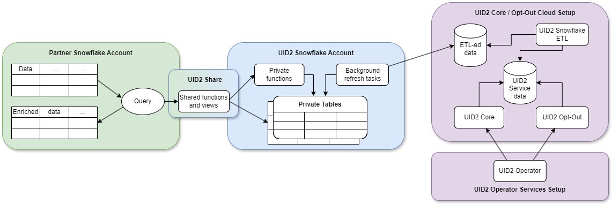

import Link from '@docusaurus/Link';

# Snowflake Integration Guide

[Snowflake](https://www.snowflake.com/) は、パートナーがデータを保存し、UID2 フレームワークとインテグレーションできるクラウドデータウェアハウジングソリューションです。Snowflake を使用することで、UID2 は、機密性の高い <Link href="../ref-info/glossary-uid#gl-dii">直接識別情報 (DII)</Link> を公開することなく、消費者識別子データを安全に共有できます。オペレーター Web サービスを直接クエリして消費者識別子データを取得するオプションもありますが、Snowflake UID2 インテグレーションはよりシームレスなエクスペリエンスを提供します。

:::important
このドキュメントは、最新の [Snowflake Marketplace listing](#snowflake-marketplace-listing) を使用している方を対象としています。以前のバージョンを使用している場合は、[Snowflake Integration Guide (Pre-July 2025)](integration-snowflake-previous.md) を参照してください。以前の実装を使用している場合は、更新と強化を利用するために新しいバージョンへの移行を推奨します。詳細は、[Changes from Previous Version](#changes-from-previous-version) を参照してください。移行情報は、[Migration Guide](#migration-guide) を参照してください。
:::

## Snowflake Marketplace Listing

以下の UID2 リスティングは、Snowflake Marketplace で利用できます:
- [Unified ID 2.0: Advertiser and Data Provider Identity Solution](https://app.snowflake.com/marketplace/listing/GZT0ZRYXTN8/unified-id-2-0-unified-id-2-0-advertiser-and-data-provider-identity-solution)

:::tip
  インテグレーションオプションとステップの概要は、[Advertiser/Data Provider Integration Overview](integration-advertiser-dataprovider-overview.md) を参照してください。
:::

## Functionality

以下の表は、UID2 Snowflake インテグレーションで利用可能な機能をまとめたものです。

| Encrypt Raw UID2 to UID2 Token for Sharing | Decrypt UID2 Token to Raw UID2 | Generate UID2 Token from DII | Refresh UID2 Token | Map DII to Raw UID2s |
| :--- | :--- | :--- | :--- | :--- |
| &#9989; | &#9989; | &#8212;* | &#8212; | &#9989; |

*Snowflake を使用して、DII から直接 UID2 Token を生成することはできません。ただし、DII を raw UID2 に変換し、その後 raw UID2 を UID2 Token に暗号化することはできます。

:::note
パブリッシャーで、<Link href="../ref-info/glossary-uid#gl-bidstream">bidstream</Link> で UID2 Token を共有している場合は、[Tokenized Sharing in the Bidstream](../sharing/sharing-tokenized-from-data-bid-stream.md) を参照してください。
:::

## Changes from Previous Version

2025年7月の UID2 Snowflake Marketplace インテグレーションの更新では、UID2 のリフレッシュ管理を簡素化し、ローテーション後 90 日間の以前の raw UID2 にアクセスできる新しい ID マッピング関数が導入されました。

:::note
これらの変更は、コードインテグレーションが 2025 年 7 月以前に公開された Snowflake 関数のバージョンを使用していることを前提としています: [Snowflake Integration Guide (Pre-July 2025)](integration-snowflake-previous.md) を参照してください。このバージョンへの移行の詳細は、[Migration Guide](#migration-guide) を参照してください。
:::

The following table shows the differences between the old and new identity mapping functions.

| Function | Version | Return Fields | Key Differences | Comments |
| :-- | :-- | :-- | :-- | :-- |
| `FN_T_IDENTITY_MAP` | 以前のバージョン | `UID`, `BUCKET_ID`, `UNMAPPED` | 基本的な ID マッピングとソルトバケットの追跡 | ソルトバケット監視を使用したレガシー関数。詳細は、[Snowflake Integration Guide (Pre-July 2025)](integration-snowflake-previous.md) を参照してください。|
| `FN_T_IDENTITY_MAP_V3` | 現在 | `UID`, `PREV_UID`, `REFRESH_FROM`, `UNMAPPED` | 強化された以前の UID2 アクセスとリフレッシュタイムスタンプ | ローテーション後 90 日間の以前の UID2 を返し、ソルトバケット監視の代わりにリフレッシュタイムスタンプを使用します。詳細は、[Map DII](#map-dii) を参照してください。|

### Key Benefits

このアップデートにより、以下の 2 つの主要な利点が提供されます:

- **Simplified Refresh Management**: `REFRESH_FROM` タイムスタンプに達した UID2 を監視できるようになり、ローテーションのために <Link href="../ref-info/glossary-uid#gl-salt-bucket-id">Salt Bucket</Link> をポーリングする必要がなくなります。
- **Previous UID2 Access**: ローテーション後 90 日間、以前の raw UID2 にアクセスできるようになり、キャンペーンの測定が可能になります。

## Workflow Diagram

以下の図は、Snowflake における UID2 インテグレーションプロセスの異なる部分とワークフローをです。



| Partner Snowflake Account | UID2 Snowflake Account | UID2 Core Opt-Out Cloud Setup |
| :--- | :--- | :--- |
| パートナーとして、データをホストし、UID2 インテグレーションに参加するための Snowflake アカウントをセットアップします。UID2 Share を通じて関数とビューを消費します。 | UID2 インテグレーションは、Snowflake アカウントでホストされ、UID2 関連のタスクを実行するために必要なデータのみを引き出す認可された関数とビューへのアクセスを提供します。プライベートテーブルにはアクセスできません。UID2 Share は、UID2 関連のタスクを実行するために必要な基本的なデータのみを公開します。<br/>**Note**: <Link href="../ref-info/glossary-uid#gl-salt">Salt</Link> と暗号化キーはプライベートテーブルに保存されています。<Link href="../ref-info/glossary-uid#gl-dii">DII</Link> はどの時点でも保存されません。 | ETL (Extract Transform Load) ジョブは、UID2 Core/Optout Snowflake ストレージを常に更新し、UID2 Operator Web サービスを動かす内部データを提供します。Operator Web サービスで使用されるデータは、UID2 Share を通じても利用可能です。 |
| 共有関数とビューを使用すると、トランザクションコンピューティングコストを Snowflake に支払います。 | これらのプライベートテーブルは、UID2 Snowflake アカウントで保護され、UID2 関連のタスクを完了するために使用される内部データを保持する UID2 Core/Optout Snowflake ストレージと自動的に同期します。 | |

## Access the UID2 Share

UID2 Share へのアクセスは、[Snowflake Data Marketplace](https://www.snowflake.com/data-marketplace/) の以下のリスティングを通じて利用可能です:

- [Unified ID 2.0: Advertiser and Data Provider Identity Solution](https://app.snowflake.com/marketplace/listing/GZT0ZRYXTN8/unified-id-2-0-unified-id-2-0-advertiser-and-data-provider-identity-solution)

:::important
データのリクエストを行うには、`ACCOUNTADMIN` ロールまたは Snowflake アカウントで `CREATE DATABASE` および `IMPORT SHARE` 権限を持つ他のロールを使用する必要があります。
:::

UID2 Share へのアクセスをリクエストするには、以下の手順を完了します:

1.  Snowflake Data Marketplace にログインし、UID2 リスティングを選択します:
      - [Unified ID 2.0: Advertiser and Data Provider Identity Solution](https://app.snowflake.com/marketplace/listing/GZT0ZRYXTN8/unified-id-2-0-unified-id-2-0-advertiser-and-data-provider-identity-solution)
2.	**Personalized Data** セクションで、**Request Data** をクリックします。
3.	画面の指示に従って、連絡先の詳細やその他の必要な情報を確認して提供します。
4.	The Trade Desk の既存のクライアントである場合は、データリクエストフォームの **Message** フィールドに The Trade Desk によって発行されたパートナーおよび広告主 ID を含めてください。
5.	フォームを送信します。

リクエストが受信されると、UID2 Administrator が適切なアクセス手順について連絡します。Snowflake でのデータリクエストの管理に関する詳細は、[Snowflake documentation](https://docs.snowflake.com/en/user-guide/data-marketplace-consumer.html)を参照してください。

## Shared Objects

DII を UID2 にマッピングするには、以下の関数を使用します:

- `FN_T_IDENTITY_MAP_V3` (詳細は[Map DII](#map-dii)を参照してください)

以下の関数は `FN_T_IDENTITY_MAP_V3` に置き換えられ、非推奨となっています。以前の Snowflake バージョンを使用している場合は引き続き使用できますが、できるだけ早くアップグレードすることをお勧めします（詳細は [Snowflake Integration Guide (Pre-July 2025)](integration-snowflake-previous.md) を参照してください）:

- `FN_T_IDENTITY_MAP` (deprecated)

:::note
非推奨の関数を使用していて、新しい関数への移行についてのヘルプが必要な場合は、[Migration Guide](#migration-guide)を参照してください。
:::

再生成が必要な UID2 を特定するには、`FN_T_IDENTITY_MAP_V3` 関数から返される `REFRESH_FROM` タイムスタンプを監視します。詳細は [Monitor Raw UID2 Refresh and Regenerate Raw UID2s](#monitor-raw-uid2-refresh-and-regenerate-raw-uid2s) を参照してください。

以下の関数は、UID2 Share 参加者向けに利用可能です:
- `FN_T_ENCRYPT` (See [Encrypt Tokens](#encrypt-tokens))
- `FN_T_DECRYPT` (See [Decrypt Tokens](#decrypt-tokens))

詳細は、[Usage for UID2 Sharers](#usage-for-uid2-sharers)を参照してください。

### Database and Schema Names

以下のセクションは、各ソリューションのクエリ例を含みます。これらは、データベース名とスキーマ名の変数を除いて同一です:

```
{DATABASE_NAME}.{SCHEMA_NAME}
```

例:

```sql
select UID, PREV_UID, REFRESH_FROM, UNMAPPED from table({DATABASE_NAME}.{SCHEMA_NAME}.FN_T_IDENTITY_MAP_V3('validate@example.com', 'email'));
```

すべてのクエリ例は、各名前変数に対して以下のデフォルト値を使用します:

| Variable | Default Value | Comments |
| :--- | :--- | :--- |
| `{DATABASE_NAME}` | `UID2_PROD_UID_SH` | 必要に応じて、選択した UID2 Share へのアクセスが付与された後に新しいデータベースを作成する際に、デフォルトのデータベース名を変更できます。 |
| `{SCHEMA_NAME}` | `UID` | これは変更できません。 |

### Map DII

すべての種類の <Link href="../ref-info/glossary-uid#gl-dii">DII</Link> をマッピングするには、`FN_T_IDENTITY_MAP_V3` 関数を使用します。

DII がメールアドレスの場合、サービスは UID2 [Email Address Normalization](../getting-started/gs-normalization-encoding.md#email-address-normalization) ルールを使用してデータを正規化します。

DII が電話番号の場合、UID2 [Phone Number Normalization](../getting-started/gs-normalization-encoding.md#phone-number-normalization) ルールを使用して、サービスに送信する前に正規化する必要があります。

| Argument | Data Type | Description |
| :--- | :--- | :--- |
| `INPUT` | varchar(256) | UID2 にマップする DII、リフレッシュ タイムスタンプ、およびローテーション後 90 日間の前の UID2。 |
| `INPUT_TYPE` | varchar(256) | マップする DII のタイプ。許可される値: `email`、`email_hash`、`phone`、 `phone_hash`。 |

指定した DII に対して、成功したクエリは以下の情報を返します。

| Column Name | Data Type | Description |
| :--- | :--- | :--- |
| `UID` | TEXT | 値は次のいずれかです:<ul><li>DII が正常にマッピングされた: DII に関連付けられた UID2。</li><li>それ以外の場合: `NULL`。</li></ul> |
| `PREV_UID` | TEXT | 値は次のいずれかです:<ul><li>DII が正常にマッピングされ、現在の raw UID2 は過去 90 日間にローテーションしました: 以前の raw UID2</li><li>それ以外の場合: `NULL`。</li></ul> |
| `REFRESH_FROM` | TIMESTAMP | 値は次のいずれかです:<ul><li>DII が正常にマッピングされた: この UID2 を更新する必要がある時刻 (エポック秒) を示します。</li><li>それ以外の場合: `NULL`。</li></ul> |
| `UNMAPPED` | TEXT | 値は次のいずれかです:<ul><li>DII が正常にマッピングされた: `NULL`。</li><li>それ以外の場合: 識別子がマッピングされなかった理由: `OPTOUT`、`INVALID IDENTIFIER`、または `INVALID INPUT TYPE`。<br/>詳細は、[UNMAPPED 列の値](#values-for-the-unmapped-column)を参照してください。</li></ul> |

#### Values for the UNMAPPED Column

以下の表は、`UNMAPPED` 列の可能な値です。

| Value | Meaning |
| :-- | :-- |
| `NULL` | DII が正常にマッピングされまし。 |
| `OPTOUT` | ユーザーがオプトアウトしています。 |
| `INVALID IDENTIFIER` | メールアドレスまたは電話番号が無効です。 |
| `INVALID INPUT_TYPE` | `INPUT_TYPE` の値が無効です。`INPUT_TYPE` の有効な値は、`email`、`email_hash`、`phone`、`phone_hash` です。 |

#### Examples

以下はマッピングリクエストの例です:

- [Single Unhashed Email](#mapping-request-example---single-unhashed-email)
- [Multiple Unhashed Emails](#mapping-request-example---multiple-unhashed-emails)
- [Single Unhashed Phone Number](#mapping-request-example---single-unhashed-phone-number)
- [Multiple Unhashed Phone Numbers](#mapping-request-example---multiple-unhashed-phone-numbers)
- [Single Hashed Email](#mapping-request-example---single-hashed-email)
- [Multiple Hashed Emails](#mapping-request-example---multiple-hashed-emails)
- [Single Hashed Phone Number](#mapping-request-example---single-hashed-phone-number)
- [Multiple Hashed Phone Numbers](#mapping-request-example---multiple-hashed-phone-numbers)

:::note
これらの例の入力および出力データは架空のものであり、説明を目的としています。提供されている値は実際の値ではありません。
:::

#### Mapping Request Example - Single Unhashed Email

以下のクエリは、[default database and schema names](#database-and-schema-names)を使用して、単一のメールアドレスをマッピングする方法です。

```sql
select UID, PREV_UID, REFRESH_FROM, UNMAPPED from table(UID2_PROD_UID_SH.UID.FN_T_IDENTITY_MAP_V3('validate@example.com', 'email'));
```

単一のメールアドレスのクエリ結果は以下の通りです:

```
+----------------------------------------------+--------------------------------------------------+--------------+----------+
| UID                                          | PREV_UID                                         | REFRESH_FROM | UNMAPPED |
+----------------------------------------------+--------------------------------------------------+--------------+----------+
| 2ODl112/VS3x2vL+kG1439nPb7XNngLvOWiZGaMhdcU= | vP9zK2mL7fR4tY8qN3wE6xB0dH5jA1sC+nI/oGuMeVa=     | 1735689600   | NULL     |
+----------------------------------------------+--------------------------------------------------+--------------+----------+
```

#### Mapping Request Example - Multiple Unhashed Emails

以下のクエリは、[default database and schema names](#database-and-schema-names)を使用して、複数のメールアドレスをマッピングする方法です。

```sql
select a.ID, a.EMAIL, m.UID, m.PREV_UID, m.REFRESH_FROM, m.UNMAPPED from AUDIENCE a LEFT JOIN(
    select ID, t.* from AUDIENCE, lateral UID2_PROD_UID_SH.UID.FN_T_IDENTITY_MAP_V3(EMAIL, 'email') t) m
    on a.ID=m.ID;
```

複数のメールアドレスのクエリ結果は以下の通りです:

以下の表は、レスポンス内の各項目を識別し、`NULL` または不正な形式のメールアドレスに対する `NULL` 値を含みます。

```
+----+----------------------+----------------------------------------------+----------------------------------------------+--------------+--------------------+
| ID | EMAIL                | UID                                          | PREV_UID                                     | REFRESH_FROM | UNMAPPED           |
+----+----------------------+----------------------------------------------+----------------------------------------------+--------------+--------------------+
|  1 | validate@example.com | 2ODl112/VS3x2vL+kG1439nPb7XNngLvOWiZGaMhdcU= | vP9zK2mL7fR4tY8qN3wE6xB0dH5jA1sC+nI/oGuMeVa= | 1735689600   | NULL               |
|  2 | test@uidapi.com      | IbW4n6LIvtDj/8fCESlU0QG9K/fH63UdcTkJpAG8fIQ= | NULL                                         | 1735689600   | NULL               |
|  3 | optout@example.com   | NULL                                         | NULL                                         | NULL         | OPTOUT             |
|  4 | invalid-email        | NULL                                         | NULL                                         | NULL         | INVALID IDENTIFIER |
|  5 | NULL                 | NULL                                         | NULL                                         | NULL         | INVALID IDENTIFIER |
+----+----------------------+----------------------------------------------+----------------------------------------------+--------------+--------------------+
```

#### Mapping Request Example - Single Unhashed Phone Number

以下のクエリは、[default database and schema names](#database-and-schema-names)を使用して、単一の電話番号をマッピングする方法です。

電話番号は、UID2 [Phone Number Normalization](../getting-started/gs-normalization-encoding.md#phone-number-normalization) ルールを使用して正規化する必要があります。

```sql
select UID, PREV_UID, REFRESH_FROM, UNMAPPED from table(UID2_PROD_UID_SH.UID.FN_T_IDENTITY_MAP_V3('+12345678901', 'phone'));
```

単一の電話番号のクエリ結果は以下の通りです:

```
+----------------------------------------------+----------+--------------+----------+
| UID                                          | PREV_UID | REFRESH_FROM | UNMAPPED |
+----------------------------------------------+----------+--------------+----------+
| 2ODl112/VS3x2vL+kG1439nPb7XNngLvOWiZGaMhdcU= | NULL     | 1735689600   | NULL     |
+----------------------------------------------+----------+--------------+----------+
```

#### Mapping Request Example - Multiple Unhashed Phone Numbers

以下のクエリは、[default database and schema names](#database-and-schema-names)を使用して、複数の電話番号をマッピングする方法です。

電話番号は、UID2 [Phone Number Normalization](../getting-started/gs-normalization-encoding.md#phone-number-normalization) ルールを使用して正規化する必要があります。

```sql
select a.ID, a.PHONE, m.UID, m.PREV_UID, m.REFRESH_FROM, m.UNMAPPED from AUDIENCE a LEFT JOIN(
    select ID, t.* from AUDIENCE, lateral UID2_PROD_UID_SH.UID.FN_T_IDENTITY_MAP_V3(PHONE, 'phone') t) m
    on a.ID=m.ID;
```

複数の電話番号のクエリ結果は以下の通りです:

以下の表は、レスポンス内の各項目を識別し、`NULL` または不正な形式の電話番号に対する `NULL` 値を含みます。

```
+----+--------------+----------------------------------------------+----------------------------------------------+--------------+--------------------+
| ID | PHONE        | UID                                          | PREV_UID                                     | REFRESH_FROM | UNMAPPED           |
+----+--------------+----------------------------------------------+----------------------------------------------+--------------+--------------------+
|  1 | +12345678901 | 2ODl112/VS3x2vL+kG1439nPb7XNngLvOWiZGaMhdcU= | vP9zK2mL7fR4tY8qN3wE6xB0dH5jA1sC+nI/oGuMeVa= | 1735689600   | NULL               |
|  2 | +61491570006 | IbW4n6LIvtDj/8fCESlU0QG9K/fH63UdcTkJpAG8fIQ= | NULL                                         | 1735689600   | NULL               |
|  3 | +56789123001 | NULL                                         | NULL                                         | NULL         | OPTOUT             |
|  4 | 1234         | NULL                                         | NULL                                         | NULL         | INVALID IDENTIFIER |
|  5 | NULL         | NULL                                         | NULL                                         | NULL         | INVALID IDENTIFIER |
+----+--------------+----------------------------------------------+----------------------------------------------+--------------+--------------------+
```

#### Mapping Request Example - Single Hashed Email

以下のクエリは、[default database and schema names](#database-and-schema-names)を使用して、単一のメールアドレスハッシュをマッピングする方法です。

```sql
select UID, PREV_UID, REFRESH_FROM, UNMAPPED from table(UID2_PROD_UID_SH.UID.FN_T_IDENTITY_MAP_V3(BASE64_ENCODE(SHA2_BINARY('validate@example.com', 256)), 'email_hash'));
```

単一のメールアドレスハッシュのクエリ結果は以下の通りです:

```
+----------------------------------------------+----------------------------------------------+--------------+----------+
| UID                                          | PREV_UID                                     | REFRESH_FROM | UNMAPPED |
+----------------------------------------------+----------------------------------------------+--------------+----------+
| 2ODl112/VS3x2vL+kG1439nPb7XNngLvOWiZGaMhdcU= | vP9zK2mL7fR4tY8qN3wE6xB0dH5jA1sC+nI/oGuMeVa= | 1735689600   | NULL     |
+----------------------------------------------+----------------------------------------------+--------------+----------+
```

#### Mapping Request Example - Multiple Hashed Emails

以下のクエリは、[default database and schema names](#database-and-schema-names)を使用して、複数のメールアドレスハッシュをマッピングする方法をです

```sql
select a.ID, a.EMAIL_HASH, m.UID, m.PREV_UID, m.REFRESH_FROM, m.UNMAPPED from AUDIENCE a LEFT JOIN(
    select ID, t.* from AUDIENCE, lateral UID2_PROD_UID_SH.UID.FN_T_IDENTITY_MAP_V3(EMAIL_HASH, 'email_hash') t) m
    on a.ID=m.ID;
```

複数のメールアドレスハッシュのクエリ結果は以下の通りです:

以下の表は、レスポンス内の各項目を識別し、`NULL` または不正な形式のメールアドレスハッシュに対する `NULL` 値を含みます。

```
+----+----------------------------------------------+----------------------------------------------+----------------------------------------------+--------------+--------------------+
| ID | EMAIL_HASH                                   | UID                                          | PREV_UID                                     | REFRESH_FROM | UNMAPPED           |
+----+----------------------------------------------+----------------------------------------------+----------------------------------------------+--------------+--------------------+
|  1 | LdhtUlMQ58ZZy5YUqGPRQw5xUMS5dXG5ocJHYJHbAKI= | 2ODl112/VS3x2vL+kG1439nPb7XNngLvOWiZGaMhdcU= | vP9zK2mL7fR4tY8qN3wE6xB0dH5jA1sC+nI/oGuMeVa= | 1735689600   | NULL               |
|  2 | /XJSTajB68SCUyuc3ePyxSLNhxrMKvJcjndq8TuwW5g= | IbW4n6LIvtDj/8fCESlU0QG9K/fH63UdcTkJpAG8fIQ= | NULL                                         | 1735689600   | NULL               |
|  2 | UebesrNN0bQkm/QR7Jx7eav+UDXN5Gbq3zs1fLBMRy0= | NULL                                         | NULL                                         | 1735689600   | OPTOUT             |
|  4 | NULL                                         | NULL                                         | NULL                                         | NULL         | INVALID IDENTIFIER |
+----+----------------------------------------------+----------------------------------------------+----------------------------------------------+--------------+--------------------+
```

#### Mapping Request Example - Single Hashed Phone Number

以下のクエリは、[default database and schema names](#database-and-schema-names)を使用して、単一の電話番号ハッシュをマッピングする方法です。

```sql
select UID, PREV_UID, REFRESH_FROM, UNMAPPED from table(UID2_PROD_UID_SH.UID.FN_T_IDENTITY_MAP_V3(BASE64_ENCODE(SHA2_BINARY('+12345678901', 256)), 'phone_hash'));
```

単一の電話番号ハッシュのクエリ結果は以下の通りです:

```
+----------------------------------------------+----------------------------------------------+--------------+----------+
| UID                                          | PREV_UID                                     | REFRESH_FROM | UNMAPPED |
+----------------------------------------------+----------------------------------------------+--------------+----------+
| 2ODl112/VS3x2vL+kG1439nPb7XNngLvOWiZGaMhdcU= | vP9zK2mL7fR4tY8qN3wE6xB0dH5jA1sC+nI/oGuMeVa= | 1735689600   | NULL     |
+----------------------------------------------+----------------------------------------------+--------------+----------+
```

#### Mapping Request Example - Multiple Hashed Phone Numbers

以下のクエリは、[default database and schema names](#database-and-schema-names)を使用して、複数の電話番号ハッシュをマッピングする方法です。

```sql
select a.ID, a.PHONE_HASH, m.UID, m.PREV_UID, m.REFRESH_FROM, m.UNMAPPED from AUDIENCE a LEFT JOIN(
    select ID, t.* from AUDIENCE, lateral UID2_PROD_UID_SH.UID.FN_T_IDENTITY_MAP_V3(PHONE_HASH, 'phone_hash') t) m
    on a.ID=m.ID;
```

複数の電話番号ハッシュのクエリ結果は以下の通りです:

以下の表は、レスポンス内の各項目を識別し、`NULL` または不正な形式の電話番号ハッシュに対する `NULL` 値を含みます。

```
+----+----------------------------------------------+----------------------------------------------+----------------------------------------------+--------------+--------------------+
| ID | PHONE_HASH                                   | UID                                          | PREV_UID                                     | REFRESH_FROM | UNMAPPED           |
+----+----------------------------------------------+----------------------------------------------+----------------------------------------------+--------------+--------------------+
|  1 | LdhtUlMQ58ZZy5YUqGPRQw5xUMS5dXG5ocJHYJHbAKI= | 2ODl112/VS3x2vL+kG1439nPb7XNngLvOWiZGaMhdcU= | vP9zK2mL7fR4tY8qN3wE6xB0dH5jA1sC+nI/oGuMeVa= | 1735689600   | NULL               |
|  2 | /XJSTajB68SCUyuc3ePyxSLNhxrMKvJcjndq8TuwW5g= | IbW4n6LIvtDj/8fCESlU0QG9K/fH63UdcTkJpAG8fIQ= | NULL                                         | 1735689600   | NULL               |
|  2 | UebesrNN0bQkm/QR7Jx7eav+UDXN5Gbq3zs1fLBMRy0= | NULL                                         | NULL                                         | 1735689600   | OPTOUT             |
|  4 | NULL                                         | NULL                                         | NULL                                         | NULL         | INVALID IDENTIFIER |
+----+----------------------------------------------+----------------------------------------------+----------------------------------------------+--------------+--------------------+
```

### Monitor Raw UID2 Refresh and Regenerate Raw UID2s

`FN_T_IDENTITY_MAP_V3` 関数は、各 UID2 をリフレッシュする必要がある時刻を示すリフレッシュタイムスタンプ (`REFRESH_FROM`) を返します。

UID2 のリフレッシュが必要なものを特定するには、関数から返された `REFRESH_FROM` タイムスタンプを現在の時刻と比較します。

| Column Name | Data Type | Description |
| :--- | :--- | :--- |
| `UID` | TEXT | UID2 に関連付けられた DII です。これは、アイデンティティマッピング関数によって返された現在の UID2 値です。 |
| `REFRESH_FROM` | TIMESTAMP | この UID2 をリフレッシュする必要がある時刻を示すタイムスタンプ (エポック秒) です。この値を現在の時刻と比較して、再生成が必要かどうかを判断します。 |

以下の例は、入力テーブルと、リフレッシュ時間が到達したために再生成する必要がある UID2 をテーブル内で見つけるために使用されるクエリです。

#### Targeted Input Table

この例では、広告主/データプロバイダーは、`AUDIENCE_WITH_UID2` という名前のテーブルに UID2 を保存しています。`REFRESH_FROM` 列には、各 UID2 をリフレッシュする必要があるタイムスタンプが含まれています。UID2 が生成されていない場合、値は `NULL` です（3 番目の例を参照）。広告主/データプロバイダーは、これらのタイムスタンプを現在の時刻と比較して、どの UID2 を再生成する必要があるかを判断できます。

```sql
select * from AUDIENCE_WITH_UID2;
```
```
+----+----------------------+----------------------------------------------+--------------+
| ID | EMAIL                | UID2                                         | REFRESH_FROM |
+----+----------------------+----------------------------------------------+--------------+
|  1 | validate@example.com | 2ODl112/VS3x2vL+kG1439nPb7XNngLvOWiZGaMhdcU= | 1735689600   |
|  2 | test1@uidapi.com     | Q4A5ZBuBCYfuV3Wd8Fdsx2+i33v7jyFcQbcMG/LH4eM= | 1735776000   |
|  3 | test2@uidapi.com     | NULL                                         | NULL         |
+----+----------------------+----------------------------------------------+--------------+
```

欠落または期限切れの UID2 を見つけるには、次のクエリ例を使用します。

```sql
select * from AUDIENCE_WITH_UID2
  where REFRESH_FROM <= DATE_PART(epoch_second, CURRENT_TIMESTAMP()) or UID2 IS NULL;
```

クエリの結果:

次の表は、レスポンス内の各アイテムを特定します。結果には、`REFRESH_FROM` タイムスタンプが経過したためにリフレッシュが必要な UID2 または欠落している UID2 が含まれます。ID 1 は、そのリフレッシュ時間 (1735689600) が過去にあるため返されます (現在の時間がそれ以降であると仮定)。ID 2 は、そのリフレッシュ時間がまだ到達していないため返されません。ID 3 は、UID2 が欠落しているため返されます。

```
+----+----------------------+----------------------------------------------+--------------+
| ID | EMAIL                | UID2                                         | REFRESH_FROM |
+----+----------------------+----------------------------------------------+--------------+
|  1 | validate@example.com | 2ODl112/VS3x2vL+kG1439nPb7XNngLvOWiZGaMhdcU= | 1735689600   |
|  3 | test2@uidapi.com     | NULL                                         | NULL         |
+----+----------------------+----------------------------------------------+--------------+
```

## Usage for UID2 Sharers

UID2 <Link href="../ref-info/glossary-uid#gl-sharing-participant">sharing participant</Link> は、送信者または受信者として共有に参加し、他の参加者と UID2 を共有する組織です。

広告主とデータプロバイダーは、Snowflake (<Link href="../ref-info/glossary-uid#gl-tokenized-sharing">tokenized sharing</Link>)を介して、他の承認された UID2 共有参加者と UID2 を共有できます。彼らは [raw UID2s](../ref-info/glossary-uid#gl-raw-uid2) を <Link href="../ref-info/glossary-uid#gl-uid2-token">UID2 Token</Link> に暗号化し、ピクセルで共有するために別の参加者に送信できます (詳細は [Tokenized Sharing in Pixels](../sharing/sharing-tokenized-from-data-pixel.md) を参照してください)。Snowflake 内でピクセルでデータを送信していない場合でも、[Security Requirements for UID2 Sharing](../sharing/sharing-security.md) に記載されている要件に従う限り、UID2 共有に参加できます。

:::caution
このプロセスで生成された UID2 Token は共有用であり、ビッドストリームでは使用できません。ビッドストリーム用のトークンを生成するための別のワークフローがあります: [Tokenized Sharing in the Bidstream](../sharing/sharing-tokenized-from-data-bid-stream.md) を参照してください。
:::

Snowflake でピクセルやビッドストリームでデータを送信していない場合でも、[Security Requirements for UID2 Sharing](../sharing/sharing-security.md) に記載されている要件に従う限り、UID2 共有に参加できます。

以下の機能は、トークン化された共有をサポートしています:

- [Encrypt Tokens](#encrypt-tokens)
- [Decrypt Tokens](#decrypt-tokens)

### Encrypt Tokens

raw UID2 を UID2 Token に暗号化するには、`FN_T_ENCRYPT` 関数を使用します。

| Argument | Data Type | Description |
| :--- | :--- | :--- |
| `RAW_UID2` | varchar(128) | UID2 Token に暗号化する raw UID2 |

クエリが成功すると、指定された raw UID2 に対して以下の情報が返されます。

| Column Name | Data Type | Description |
| :--- | :--- | :--- |
| `UID_TOKEN` | TEXT | 値は以下のいずれか:<ul><li>Encryption successful: raw UID2  を含む UID2 Token</li><li>Encryption not successful: `NULL`</li></ul> |
| `ENCRYPTION_STATUS` | TEXT | 値は以下のいずれか:<ul><li>Encryption successful: `NULL`.</li><li>Encryption not successful: raw UID2 が暗号化されなかった理由。例えば: `INVALID_RAW_UID2` または `INVALID NOT_AUTHORIZED_FOR_MASTER_KEY`.<br/>詳細は、[Values for the ENCRYPTION_STATUS Column](#values-for-the-encryption_status-column) を参照してください。</li></ul> |

#### Values for the ENCRYPTION_STATUS Column

以下の表は、`ENCRYPTION_STATUS` 列の可能な値を示しています。

| Value | Meaning |
| :-- | :-- |
| `NULL` | raw UID2 が正常に暗号化されました。 |
| `MISSING_OR_INVALID_RAW_UID2` | raw UID2 が `NULL` です。 |
| `INVALID_RAW_UID2` | raw UID2 が無効です。 |
| `MISMATCHING_IDENTITY_SCOPE` | raw UID2 が不正なアイデンティティスコープに属しています。たとえば、UID2 が期待される場所に EUID が渡されます。 |
| `NOT_AUTHORIZED_FOR_MASTER_KEY` | 呼び出し元が必要な<a href="../ref-info/glossary-uid#gl-encryption-key">暗号化キー</a>にアクセスできません。UID2 管理者にお問い合わせください。 |
| `NOT_AUTHORIZED_FOR_SITE_KEY` | 呼び出し元が必要な暗号化キーにアクセスできません。UID2 管理者にお問い合わせください。 |

#### Encrypt Token Request Example - Single Raw UID2

以下のクエリは、[default database and schema names](#database-and-schema-names)を使用して、単一の raw UID2 を UID2 Token に暗号化する方法です。

```sql
select UID_TOKEN, ENCRYPTION_STATUS from table(UID2_PROD_UID_SH.UID.FN_T_ENCRYPT('2ODl112/VS3x2vL+kG1439nPb7XNngLvOWiZGaMhdcU='));
```

単一の raw UID2 のクエリ結果は以下の通りです:

```
+------------------------+-------------------+
| UID_TOKEN              | ENCRYPTION_STATUS |
+--------------------------------------------+
| A41234<rest of token>  | NULL              |
+--------------------------------------------+
```

#### Encrypt Token Request Example - Multiple Raw UID2s

以下のクエリは、[default database and schema names](#database-and-schema-names)を使用して、複数の raw UID2 を UID2 Token に暗号化する方法です。

```sql
select a.RAW_UID2, t.UID_TOKEN, t.ENCRYPTION_STATUS from AUDIENCE_WITH_UID2 a, lateral UID2_PROD_UID_SH.UID.FN_T_ENCRYPT(a.RAW_UID2) t;
```

複数の raw UID2 のクエリ結果は以下の通りです:

以下の表は、レスポンス内の各項目を識別し、`NULL` または不正な形式の電話番号ハッシュに対する `NULL` 値を含みます。

```
+----+----------------------------------------------+-----------------------+-----------------------------+
| ID | RAW_UID2                                     | UID_TOKEN             | ENCRYPTION_STATUS           |
+----+----------------------------------------------+-----------------------+-----------------------------+
|  1 | 2ODl112/VS3x2vL+kG1439nPb7XNngLvOWiZGaMhdcU= | A41234<rest of token> | NULL                        |
|  2 | NULL                                         | NULL                  | MISSING_OR_INVALID_RAW_UID2 |
|  3 | BXJSTajB68SCUyuc3ePyxSLNhxrMKvJcjndq8TuwW5g5 | B45678<rest of token> | NULL                        |
+----+----------------------------------------------+-----------------------+-----------------------------+
```

### Decrypt Tokens

UID2 Token を raw UID2 に復号化するには、`FN_T_DECRYPT` 関数を使用します。

| Argument | Data Type | Description |
|:-----------|:-------------|:-----------------------------------------|
| `UID_TOKEN`| varchar(512) | raw UID2 に復号化する UID2 Token です。 |

クエリが成功すると、指定された UID2 Token に対して以下の情報が返されます。

| Column Name | Data Type | Description|
| :--- | :--- | :--- |
| `UID` | TEXT | 以下の値のいずれか:<ul><li>Decryption successful: UID2 Token に関連付けられた raw UID2。</li><li>Decryption not successful: `NULL`</li></ul> |
| `SITE_ID` | INT | 以下の値のいずれか:<ul><li>Decryption successful: トークンを暗号化した UID2 参加者の識別子。</li><li>Decryption not successful: `NULL`</li></ul> |
| `DECRYPTION_STATUS` | TEXT | 以下の値のいずれか:<ul><li>Decryption successful: `NULL`。</li><li>Decryption not successful:  UID2 Token が復号化されなかった理由。たとえば、`EXPIRED_TOKEN`。<br/>詳細は、[Values for the DECRYPTION_STATUS Column](#values-for-the-decryption_status-column) を参照してください。</li></ul> |

:::note
UID2 Token が復号化できない場合、関数は通常、行を返しません。
:::

#### Values for the DECRYPTION_STATUS Column

`DECRYPTION_STATUS` の可能な値は以下の通りです:

| Value | Meaning |
| :--- | :--- |
| `NULL` | UID2 Token は復号化されました。|
| `EXPIRED_TOKEN` | UID2 Token は指定された有効期限を超えています。|

#### Decrypt Token Request Example&#8212;Single UID2 Token

以下のクエリは、[default database and schema names](#database-and-schema-names)を使用して、単一の UID2 Token を raw UID2 に復号化する方法です。

```sql
select UID, SITE_ID, DECRYPTION_STATUS from table(UID2_PROD_UID_SH.UID.FN_T_DECRYPT('A41234<rest of token>'));
```

単一の UID2 Token のクエリ結果は以下の通りです:

```
+----------------------------------------------+-------------------+
| UID                                          | DECRYPTION_STATUS |
+----------------------------------------------+-------------------+
| 2ODl112/VS3x2vL+kG1439nPb7XNngLvOWiZGaMhdcU= | NULL              |
+----------------------------------------------+-------------------+
```

#### Decrypt Token Request Example&#8212;Multiple UID2 Tokens

以下のクエリは、[default database and schema names](#database-and-schema-names)を使用して、複数の UID2 Token を raw UID2 に復号化する方法です。

```sql
select a.ID, b.UID, b.SITE_ID, CASE WHEN b.UID IS NULL THEN 'DECRYPT_FAILED' ELSE b.DECRYPTION_STATUS END as DECRYPTION_STATUS
  from TEST_IMPRESSION_DATA a LEFT OUTER JOIN (
    select ID, t.* from TEST_IMPRESSION_DATA, lateral UID2_PROD_UID_SH.UID.FN_T_DECRYPT(UID_TOKEN) t) b
  on a.ID=b.ID;
```

複数の UID2 Token のクエリ結果は以下の通りです:

以下の表は、レスポンス内の各項目を識別し、`NULL` または不正な形式の電話番号ハッシュに対する `NULL` 値を含みます。

```
+----+----------------------------------------------+----------+-------------------+
| ID | UID                                          | SITE_ID  | DECRYPTION_STATUS |
+----+----------------------------------------------+----------+-------------------+
|  1 | 2ODl112/VS3x2vL+kG1439nPb7XNngLvOWiZGaMhdcU= | 12345    | NULL              |
|  2 | NULL                                         | NULL     | DECRYPT_FAILED    |
|  3 | BXJSTajB68SCUyuc3ePyxSLNhxrMKvJcjndq8TuwW5g5 | 23456    | NULL              |
|  4 | NULL                                         | NULL     | EXPIRED_TOKEN     |
|  5 | 2ODl112/VS3x2vL+kG1439nPb7XNngLvOWiZGaMhdcU= | 12345    | NULL              |
+----+----------------------------------------------+----------+-------------------+
```

### UID2 Sharing Example

以下の手順は、Snowflake を使用する送信者と受信者の両方の共有方法の例を示しています。この例では、広告主 (送信者) が raw UID2s を含むオーディエンステーブル (`AUDIENCE_WITH_UID2S`) を持ち、データプロバイダー (受信者) にテーブル内のデータを [Snowflake Secure Data Sharing](https://docs.snowflake.com/en/user-guide/data-sharing-intro) 機能を使用して利用可能にしたいと考えています。


#### Sender Instructions

 1. `AUDIENCE_WITH_UID2_TOKENS` テーブルを作成します。
 2. `AUDIENCE_WITH_UID2S` テーブル内の raw UID2s を暗号化し、結果を `AUDIENCE_WITH_UID2_TOKENS` テーブルに保存します。次のクエリは、このタスクを達成するのに役立ちます:
    ```sql
    insert into AUDIENCE_WITH_UID2_TOKENS select a.ID, t.UID_TOKEN from AUDIENCE_WITH_UID2S a, lateral UID2_PROD_UID_SH.UID.FN_T_ENCRYPT(a.RAW_UID2) t;
    ```
 3. セキュアな共有を作成し、`AUDIENCE_WITH_UID2_TOKENS` テーブルへのアクセスを許可します。
 4. 受信者にセキュアな共有へのアクセスを許可します。

:::warning
UID2 Token が共有中に期限切れにならないようにするために、暗号化された UID2 Token をできるだけ早く受信者に送信してください。
:::

#### Receiver Instructions

 1. 送信者が提供したセキュアな共有からデータベースを作成します。
 2. `RECEIVED_AUDIENCE_WITH_UID2` という新しいテーブルを作成します。
 3. 共有された `AUDIENCE_WITH_UID2_TOKENS` テーブルからトークンを復号化し、その結果を `RECEIVED_AUDIENCE_WITH_UID2` テーブルに保存します。次のクエリは、このタスクを達成するのに役立ちます:
    ```sql
    insert into RECEIVED_AUDIENCE_WITH_UID2
      select a.ID, b.UID, CASE WHEN b.UID IS NULL THEN 'DECRYPT_FAILED' ELSE b.DECRYPTION_STATUS END as DECRYPTION_STATUS
        from AUDIENCE_WITH_UID2_TOKENS a LEFT OUTER JOIN (
          select ID, t.* from AUDIENCE_WITH_UID2_TOKENS, lateral UID2_PROD_UID_SH.UID.FN_T_DECRYPT(UID_TOKEN) t) b
        on a.ID=b.ID;
    ```

:::warning
UID2 Token が共有中に期限切れにならないようにするために、受信者は送信者からトークンをできるだけ早く復号化してください。
:::

## Migration Guide

このセクションでは、以前のバージョンから新しい UID2 Snowflake v3 機能にアップグレードするための情報を提供します。

:::note
2025年2月以前のバージョンからアップグレードする場合は、以前のバージョンのドキュメントの [Migration Guide](integration-snowflake-previous.md#migration-guide) を参照してください。
:::

### Changing Existing Code

変更の概要は、[Changes from Previous Version](#changes-from-previous-version)を参照してください。このセクションのコードスニペットは、以前の関数がどのように実装されていたかの前後の例であり、新しい関数を使用するように更新する方法を示しています。主な変更点は、`FN_T_IDENTITY_MAP`から`FN_T_IDENTITY_MAP_V3`への移行であり、これによりソルトバケット ID の代わりにリフレッシュタイムスタンプが提供され、以前の UID2 アクセスも含まれます。

#### Example for Mapping Unhashed Emails

Before:

```sql
select UID, BUCKET_ID, UNMAPPED from table({DATABASE_NAME}.{SCHEMA_NAME}.FN_T_IDENTITY_MAP(EMAIL, 'email'));
```

After:

```sql
select UID, PREV_UID, REFRESH_FROM, UNMAPPED from table({DATABASE_NAME}.{SCHEMA_NAME}.FN_T_IDENTITY_MAP_V3(EMAIL, 'email'));
```

#### Example for Mapping Unhashed Phone Numbers

Before:

```sql
select UID, BUCKET_ID, UNMAPPED from table({DATABASE_NAME}.{SCHEMA_NAME}.FN_T_IDENTITY_MAP(PHONE_NUMBER, 'phone'));
```

After:

```sql
select UID, PREV_UID, REFRESH_FROM, UNMAPPED from table({DATABASE_NAME}.{SCHEMA_NAME}.FN_T_IDENTITY_MAP_V3(PHONE_NUMBER, 'phone'));
```

#### Example for Monitoring UID2 Refresh and Regenerating Raw UID2s

v3 関数はリフレッシュタイムスタンプを直接提供するため、ソルトバケットを監視する必要がなくなりました。ソルトバケットビューと結合する代わりに、関数から返された `REFRESH_FROM` タイムスタンプを現在のタイムスタンプと比較できます。

Before (ソルトバケットをモニタリング):

```sql
select a.*, b.LAST_SALT_UPDATE_UTC
  from AUDIENCE_WITH_UID2 a LEFT OUTER JOIN {DATABASE_NAME}.{SCHEMA_NAME}.SALT_BUCKETS b
  on a.BUCKET_ID=b.BUCKET_ID
  where a.LAST_UID2_UPDATE_UTC < b.LAST_SALT_UPDATE_UTC or a.UID2 IS NULL;
```

After (リフレッシュタイムスタンプを使用):

```sql
select * from AUDIENCE_WITH_UID2
  where REFRESH_FROM <= DATE_PART(epoch_second, CURRENT_TIMESTAMP()) or UID2 IS NULL;
```
