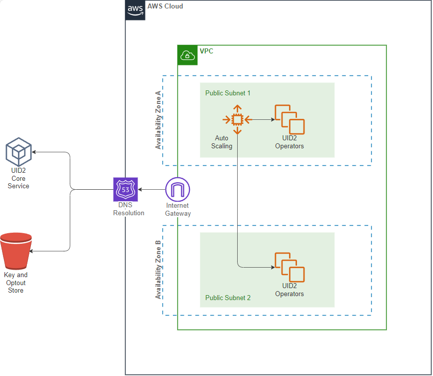

import Link from '@docusaurus/Link';
import ReleaseMatrix from '/docs/snippets/_private-operator-release-matrix.mdx';
import AttestFailure from '/docs/snippets/_private-operator-attest-failure.mdx';

# UID2 Private Operator for AWS Integration Guide

UID2 Operator は、UID2 エコシステムにおける API サーバーです。AWS Marketplace で稼働する Private Operator Service の場合、UID2 Operator ソリューションは[AWS Nitro](https://aws.amazon.com/ec2/nitro/) Enclave テクノロジーで強化されています。これは、UID2 情報を不正なアクセスから保護するための追加のセキュリティ対策です。

## UID2 Private Operator for AWS

:::note
[UID2 Private Operator for AWS](https://aws.amazon.com/marketplace/pp/prodview-wdbccsarov5la) は無償製品です。製品ページに表示されている費用は、必要なインフラの概算費用となります。
:::

UID2 Private Operator for AWS を契約することで、以下を利用できます:

- [Amazon Machine Image (AMI)](https://docs.aws.amazon.com/AWSEC2/latest/UserGuide/AMIs.html) UID2 Operator Service がインストールされ、ブートストラップの準備が整っている状態です:<br/>
  AMI には、UID2 Operator Service がすでにセットアップされた[Amazon Linux 2](https://aws.amazon.com/amazon-linux-2/?amazon-linux-whats-new.sort-by=item.additionalFields.postDateTime&amazon-linux-whats-new.sort-order=desc)オペレーティングシステムが含まれています。AMI をベースにした EC2 インスタンスが起動すると、AWS アカウントから設定を自動的に取得し、エンクレーブ内で UID2 Operator サーバーを起動します。
- [CloudFormation](https://aws.amazon.com/cloudformation/) template:<br/>
  このテンプレートでは、UID2 Operator AMI がデプロイ展開されます。

### Prerequisites

AWS で 1 つまたは複数の UID2 Operator をサブスクライブしてデプロイするには、次の手順を実行します:

1. UID2 Operator としてあなたの組織を登録します。
2. [最小限の権限](#minimal-iam-role-privileges) を持つ[IAM](https://aws.amazon.com/iam/)ロールで AWS アカウントを作成します。

#### Minimal IAM Role Privileges

ワンクリックデプロイを成功させるためには、AWS アカウントに以下のアクションを実行する権限が必要です:

```json
{
  "Version": "2012-10-17",
  "Statement": [
    {
      "Sid": "VisualEditor0",
      "Effect": "Allow",
      "Action": [
        "ec2:*",
        "kms:*",
        "autoscaling:*",
        "cloudformation:*",
        "iam:ListRoleTags",
        "secretsmanager:*",
        "iam:PutRolePolicy",
        "iam:AddRoleToInstanceProfile",
        "iam:ListRolePolicies",
        "iam:ListPolicies",
        "iam:GetRole",
        "iam:GetPolicy",
        "iam:DeleteRole",
        "iam:UpdateRoleDescription",
        "iam:TagPolicy",
        "iam:GetRolePolicy",
        "iam:CreateInstanceProfile",
        "iam:UntagRole",
        "iam:TagRole",
        "iam:ListInstanceProfilesForRole",
        "iam:PassRole",
        "iam:DeleteRolePolicy",
        "iam:ListPolicyTags",
        "iam:DeleteInstanceProfile",
        "iam:ListRoles",
        "iam:CreatePolicy",
        "iam:UntagPolicy",
        "iam:UpdateRole",
        "iam:UntagInstanceProfile",
        "iam:TagInstanceProfile",
        "iam:SetDefaultPolicyVersion",
        "iam:UpdateAssumeRolePolicy",
        "iam:GetPolicyVersion",
        "iam:RemoveRoleFromInstanceProfile",
        "iam:CreateRole",
        "iam:AttachRolePolicy",
        "iam:DetachRolePolicy",
        "iam:ListAttachedRolePolicies",
        "iam:DeletePolicy",
        "iam:ListInstanceProfileTags",
        "iam:CreatePolicyVersion",
        "iam:GetInstanceProfile",
        "iam:ListInstanceProfiles",
        "iam:ListPolicyVersions",
        "iam:DeletePolicyVersion",
        "iam:ListUserTags"
      ],
      "Resource": "*"
    }
  ]
}
```

### Resources Created

次の表は、[deployment](#deployment) 中に作成されるすべてのリソースの一覧です。

| Name | Type | Description |
|:------|:------|:-------------|
| `KMSKey` | `AWS::KMS::Key` | 秘密暗号化用のキー (設定文字列用) です。 |
| `SSMKeyAlias` | `AWS::KMS::Alias` | [KMS](https://aws.amazon.com/kms/)キーに簡単にアクセスする方法を提供するエイリアスです。 |
| `TokenSecret` | `AWS::SecretsManager::Secret` | Operator Key を含む暗号化されたコンフィギュレーションです。 |
| `WorkerRole` | `AWS::IAM::Role` | UID2 Operator が実行する IAM ロールです。ロールは、設定キーへのアクセスを提供します。 |
| `WorkerInstanceProfile` | `AWS::IAM::InstanceProfile` | Operator EC2 インスタンスにアタッチする Worker Role を持つインスタンスプロファイルです。 |
| `SecurityGroup` | `AWS::EC2::SecurityGroup` | オペレーターインスタンスに対するルールを提供するセキュリティグループポリシーです。[Security Group Policy](#security-group-policy) を参照してください。|
| `LaunchTemplate` | `AWS::EC2::LaunchTemplate` | すべての設定が配置された起動テンプレートです。このテンプレートから新しい UID2 Operator インスタンスを起動できます。|
| `AutoScalingGroup` | `AWS::AutoScaling::AutoScalingGroup` | 起動テンプレートがアタッチされている Auto Scaling Group(ASG)。必要であれば、これを使用して後でインスタンスの必要数を更新できます。 |

### Customization Options

以下は、[デプロイ](#deployment) の実行中または実行後にカスタマイズできる内容です。

- VPC: 新しい VPC とサブネットを設定するか、既存のものを使用するかのどちらかです。
- ルートボリュームサイズ (8G Minimum)
- SSH キー: UID2 Operator の EC2 インスタンスにアクセスする際に使用する SSH キーです。
- [Instance type](https://aws.amazon.com/ec2/instance-types/m5/): m5.2xlarge、m5.4xlarge、といった具合です。カスタマイズがない場合は、デフォルト値の m5.2xlarge を推奨します。

### Security Group Policy

:::note
ドメインに関連する証明書をエンクレーブに渡すのを避けるため、HTTPS の代わりにインバウンド HTTP が許可されています。これは、組織内部のプライベートネットワークで使用する場合、セキュアレイヤーのコストを回避することにもなります。
:::

| Port Number | Direction | Protocol | Description |
| ----------- | --------- | -------- | ------ |
| 80 | Inbound | HTTP     | Healthcheck エンドポイント `/ops/healthcheck` を含むすべての UID2 API を提供します。<br/>すべてが稼働している場合、エンドポイントは HTTP 200 を返し、レスポンスボディは `OK` となります。詳しくは、[Checking UID2 Operator Status](#checking-uid2-operator-status) を参照してください。 |
| 9080        | Inbound   | HTTP     | Prometheus metrics サービス (`/metrics`)。 |
| 443         | Outbound  | HTTPS    | UID2 Core Service を呼び出し、オプトアウトデータとキーストアを更新します。 |

### VPC Chart

次の図は、Private Operator をホストする仮想プライベートクラウドを示したものです。



## Deployment

UID2 Operator を AWS Marketplace にデプロイするには、以下の手順を実行します:

1. [Unified ID 2.0 Operator on AWS Marketplace](https://aws.amazon.com/marketplace/pp/prodview-wdbccsarov5la) をサブスクライブします。AWS がサブスクライブが完了するまで数分かかる場合があります。
2. **Configuration** をクリックし、構成値を指定します。

   ソフトウェアバージョンについては、[Operator Version](#operator-version) を参照し、AWS Version 列で値を選択します。
3. Configuration ページで **Launch** をクリックし、**Launch CloudFormation** アクションを選択します。
4. スタック作成ウィザードでテンプレートを指定し、**Next** をクリックします。テンプレートファイルの S3 パスが自動的に入力されます。
5. [スタックの詳細](#stack-details) を入力し、**Next** をクリックします。
6. [スタックのオプション](#stack-configuration-options) を設定し、**Next** をクリックします。
7. 入力した情報を確認し、必要に応じて変更します。
8. IAM ロールを作成する許可が求められた場合は、**I acknowledge that AWS CloudFormation might create IAM resources** チェックボックスを選択します。
9. **Create stack** をクリックします。

スタックの作成には数分かかります。Auto Scaling Group (ASG) が作成されたら、選択して EC2 インスタンスを確認できます。デフォルトでは、最初は 1 つのインスタンスのみが起動します。

### Operator Version

最新の ZIP ファイルは、次の表の AWS バージョン欄にリンクされています。

<ReleaseMatrix />

### Stack Details

以下の画像は、スタックの作成ウィザード ([デプロイ](#deployment) Step 5) の**Specify stack details**ページを示しています。次の表は、パラメータ値のリファレンスを提供します。


下段です:


次の表は、[デプロイ](#deployment) の Step 5 で指定するパラメータ値について説明したものです。

| Parameter | Description |
| :--- |:--- |
| Stack name | 好きな名前をつけてください。 |
| OPERATOR_KEY  | UID2 Admin チームから受け取った Operator Key です。 |
| UID2 Environment | 本番環境なら `prod`、インテグレーションインテグレーション環境なら `integ` を選択します。 |
| Instance Type | `m5.2xlarge` を推奨します。 |
| Instance root volume size  | 15GB 以上を推奨します。 |
| Key Name for SSH | デプロイされた EC2 インスタンスに SSH アクセスするための EC2 キーペアです。 |
| Trusted Network CIDR       | CIDR (Classless Inter-Domain Routing) 値は、オペレーターサービスにアクセスできる IP アドレス範囲を決定します。<br/>UID2 オペレーターへのアクセスを制限して、内部ネットワークまたはロードバランサーからのみアクセスできるようにするには、CIDR 値として内部 IP 範囲を指定します。 |


### Stack Configuration Options

次の図は、スタックの作成ウィザード ([Deployment](#deployment) Step 6) の**スタックオプションの設定**ページを示しています。


次の表は、[Deployment](#deployment) の Step 6 で指定するパラメータ値について説明したものです。

| Parameter | Description |
| :--- |:--- |
| Tags | (オプション) スタックにタグをつけます。 |
| Permissions | AWS Marketplace にサブスクライブする IAM ロールとスタックをデプロイする IAM ロールが分かれている場合、スタックをデプロイするために使用するロールの名前/ARN を入力します。 |
| Stack failure options | デプロイメントに失敗したときの処理を選択します。`Roll back all stack resources (すべてのスタックリソースをロールバックする)` オプションを推奨します。 |
| Advanced options | これらはオプションです。 |

## Creating a Load Balancer

ロードバランサーとターゲットオペレーターのオートスケーリンググループを作成するには、次の手順を実行します:

1. AWS コンソールで EC2 ダッシュボードに移動し、`Load Balancer` を検索します。
2. **Create Load Balancer** をクリックします。
3. Load balancer typesページの **Application Load Balancer** セクションで、**Create** をクリックします。
4. UID2 **Load balancer name** を入力します。パブリックインターネットから UID2 API にアクセスする必要があるかどうかに応じて、**Internet-facing** または **Internal** スキームを選択します。
5. ターゲットの **VPC** と、CloudFormationスタックで使用する少なくとも2つのサブネットを選択します。
6. **Security groups** の下にある **Create new security group** をクリックし、以下を実行します:
    1. `UID2SGALB` を **Security group name** として入力し、関連する **Description** も入力します。
    2. **Inbound rules** の下で、**Add rule** をクリックし、要件に応じて **HTTPS** タイプと適切な **Source** を選択します。
    3. **Create security group** をクリックします。
8. ロードバランサーのページに戻り、新しく作成した `UID2SGALB` セキュリティグループを選択します。
9. **Listeners and routing** の下にある、**Create target group** リンクをクリックし、以下を実行します:
    1. **Specify group details page** で、ターゲットタイプとして **Instances** を選択し、 **Target group name** として `UID2ALBTG` を入力します。
    2. **Protocol version** として **HTTP1** が選択されていることを確認します。
    3. **Health checks** の下で、**Health check path** に `/ops/healthcheck` を指定し、**Next** をクリックします。
    4. オートスケーリンググループが作成した UID2 Operator EC2 インスタンスを選択し、**Include as pending below** をクリックします。
    5. ターゲットのすべてのポートに `80` が含まれていることを確認します。
    6. **Create target group** をクリックします。
10. ロードバランサーのページに戻り、**Listeners and routing** の下にある、`UID2ALBTG` をデフォルトのアクションとして転送するターゲットグループとして選択します。新しく作成したターゲットグループが表示されるように、ターゲットグループをリフレッシュする必要があるかもしれないことに注意してください。リスナーの **Port** を `443` に変更します。
11. [AWS user guide](https://docs.aws.amazon.com/elasticloadbalancing/latest/application/create-https-listener.html) の指示に従って、HTTPS リスナーをセットアップします。
12. **Create load balancer** をクリックします。
13. ロードバランサーのステータスを確認するには、以下のセクションに進んでください: [Checking UID2 Operator Status](#checking-uid2-operator-status)

## Checking UID2 Operator Status

ロードバランサー配下の UID2 Operator のステータスを確認するには、次の手順を実行します:

1. **EC2 > Load balancers** で、ロードバランサーの **DNS name** 列を見て、ロードバランサーの DNS 名を特定します。
2. ブラウザで、`https://{dns-name-of-your-load-balancer}/ops/healthcheck` にアクセスします。`OK` のレスポンスであれば、Operator のステータスは良好です。

<AttestFailure />

## Upgrading the UID2 Operator

各オペレーターのバージョンを更新するたびに、Private Operator は、アップグレードのウィンドウを持つメール通知を受け取ります。アップグレードウィンドウの後、古いバージョンは非アクティブ化され、サポートされなくなります。

ここでは、アップグレードについて紹介します:

- 新しいバージョンの提供に関する情報は、[UID2 Operator on AWS Marketplace](https://aws.amazon.com/marketplace/pp/prodview-wdbccsarov5la) のページで提供されます。
- UID2 Operator をアップグレードするには、新しい CloudFormation スタックを作成します。詳しくは、[デプロイ](#deployment) を参照してください。

:::tip
スムーズな移行を行うには、まず新しいスタックを作成します。新しいスタックが起動し、サービスを提供する準備ができたら、古いスタックを削除してください。ロードバランサーを使用している場合は、まず新しいインスタンスを立ち上げて実行してから、DNS 名を以前のものから新しいものに変換してください。
:::

## Managing the Logs
以下のセクションは、ログを最大限に活用するためのヒントを提供します:

- [Where to Read Logs](#where-to-read-logs)
- [Default Log Settings](#default-log-settings)
- [Changing the Log Rotation Schedule](#changing-the-log-rotation-schedule)
- [Additional Commands for Logging](#additional-commands-for-logging)

### Where to Read Logs
ログにアクセスするには、EC2 インスタンスに SSH でログインします。ログは `/var/logs/` にあり、`operator.log-<timestamp rotated>` の形式です。

### Default Log Settings
UID2 system はログの生成に `syslog-ng` を使用し、ログのサイズが過大にならないようにログのローテーションと管理を行うために `logrotate` と cron ジョブを使用しています。以下のセクションでは、デフォルト設定とその背後にある理由について説明し、特定の要件に合わせてログローテーション設定をカスタマイズするためのガイダンスを提供します:

- [Log Rotation Configuration](#log-rotation-configuration)
- [Log Rotation Default Settings](#log-rotation-default-settings)
- [cronjob Configuration](#cronjob-configuration)

#### Log Rotation Configuration
Operator インスタンスがデプロイされると、デフォルトのログローテーション設定が適用されます:
- ログは毎日ローテーションされ、30個のログエントリが保持されるため、ログ履歴はログエントリが異常に大きくない限り30日分のデータに相当します。
- ログエントリが非常に大きい場合、ログサイズが24時間以内に30MBに達した場合、その時点でログがローテーションされます。

#### Log Rotation Default Settings

以下はデフォルトの logrotete の設定です。`/etc/logrotate.d/uid2operator.conf` に定義されています:
```
/var/log/operator.log*
{
        rotate 30
        daily
        maxsize 30M
        dateext dateformat -%Y-%m-%d-%s
        notifempty
        sharedscripts
        postrotate
                /usr/sbin/syslog-ng-ctl reload
        endscript
}
```

この設定の詳細については、[logrotate(8) - Linux man page](https://linux.die.net/man/8/logrotate) を参照するか、Linux 環境で `man logrotate` を実行してください。

#### cronjob Configuration
logrotate は、デフォルトで `/etc/cron.daily` に次のスクリプトを生成します:

```
#!/bin/sh
   
/usr/sbin/logrotate -s /var/lib/logrotate/logrotate.status /etc/logrotate.conf
EXITVALUE=$?
if [ $EXITVALUE != 0 ]; then
    /usr/bin/logger -t logrotate "ALERT exited abnormally with [$EXITVALUE]"
fi
exit 0
```

The following script in `/etc/cron.d` ensures that the logrotate check is run every minute:

```
# Run the minutely jobs
SHELL=/bin/bash
PATH=/sbin:/bin:/usr/sbin:/usr/bin
MAILTO=root
* * * * * root /usr/sbin/logrotate -s /var/lib/logrotate/logrotate.status /etc/logrotate.conf
```

これらはデフォルト設定です。以下はその理由です:
- スクリプトは `maxsize` 条件が頻繁にチェックされるようにします。
- コマンドは `/var/lib/logrotate/logrotate.status` を参照してログのステータスをチェックし、ログがローテーション条件に達したかどうかを確認して、`logrotate` が毎分実行されたときにも余分なローテーションが行われないようにします。

### Changing the Log Rotation Schedule
ログローテーションスケジュールを変更するには、`/etc/logrotate.d/uid2operator.conf` ファイルを更新します。

logrotate のドキュメントに従って指示に従ってください: [logrotate(8) - Linux man](https://linux.die.net/man/8/logrotate) ぺージを参照してください。

:::note
変更を反映するためにサービスを再起動する必要はありません。
:::

### Additional Commands for Logging

次の表は、ログを管理するために役立つ追加のコマンドを示しています。

| Action | Command |
| :--- | :--- |
| 何がローテーションされるかの詳細を提供します。 | `sudo logrotate -f /etc/logrotate.conf --debug` |
| スケジュールされた間隔を変更することなく、手動で `logrotate` を1回実行します。 |  `sudo logrotate -f /etc/logrotate.conf --force` |
| `syslog-ng` をリロードします。 |  `sudo /usr/sbin/syslog-ng-ctl reload` |

## Technical Support

製品のサブスクリプションやデプロイに問題がある場合は、[contact us](mailto:aws-mktpl-uid@thetradedesk.com) にお問い合わせください。
