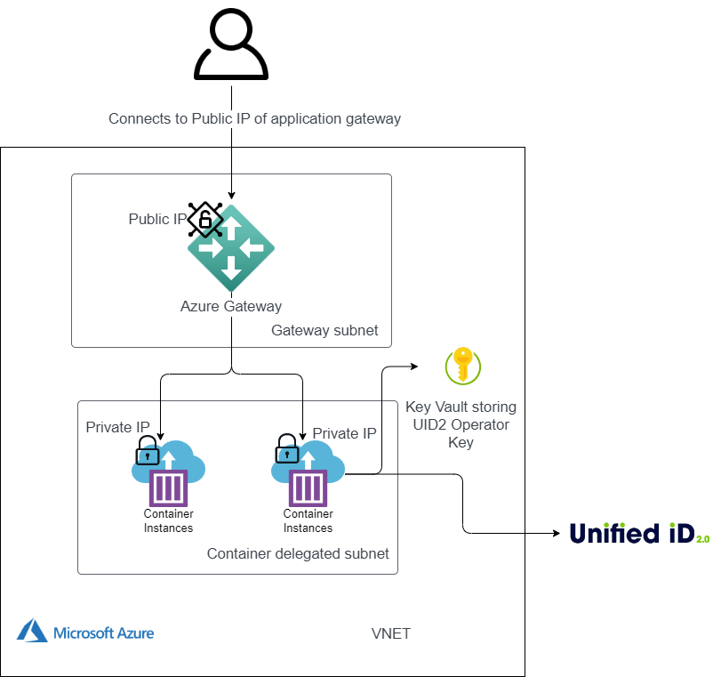

import Link from '@docusaurus/Link';
import SnptUpgradePolicy from '../snippets/_snpt-private-operator-upgrade-policy.mdx';
import SnptAttestFailure from '../snippets/_snpt-private-operator-attest-failure.mdx';

# UID2 Private Operator for Azure Integration Guide

UID2 Operator は、UID2 エコシステム内の API サーバーです。詳細は、[UID2 Operator](../ref-info/ref-operators-public-private.md) を参照してください。

このガイドでは、Microsoft Azureの機密コンピューティングオプションである [Confidential Containers](https://learn.microsoft.com/en-us/azure/confidential-computing/confidential-containers) のインスタンスで、<Link href="../ref-info/glossary-uid#gl-private-operator">Private Operator</Link> として UID2 Operator Service をセットアップするための情報を提供します。Confidential Containers インスタンスは、データ整合性、データ機密性、およびコード整合性などの本質的な機能を提供する、ハードウェアでバックアップされた信頼できる実行環境（Trusted Execution Environment：TEE）で実行されます。

UID2 Operator Confidential Containers インスタンスの Docker コンテナが起動すると、UID2 Core Service が Operator Service と Operator Service が実行されているエンクレーブ環境の真正性を検証できるように、アテステーション プロセスが完了します。

認証外成功すると、UID2 Core Service は、UID2 Operator を安全な UID2 Operator Confidential Containers インスタンスでブートストラップするためのソルトやキーなどのシード情報を提供します。

:::caution
UID2 Private Operator for Azure は、次の地域ではサポートされていません: ヨーロッパ、中国。
:::

## Operator Version

最新の ZIP ファイルは、次の表の Azure Download 列にリンクされています。

| Version Name | Version Number  | Release Notes | Azure Download |  Date | Deprecation Date |
| ------- | ------ | ------ | ------ | ------ | ------ |
| Q2 2025 | v5.55.9 | [v5.55.9](https://github.com/IABTechLab/uid2-operator/releases/tag/v5.55.9-r1) | [azure-cc-deployment-files-5.55.9-r1.zip](https://github.com/IABTechLab/uid2-operator/releases/download/v5.55.9-r1/azure-cc-deployment-files-5.55.9-r1.zip) | July 1, 2025 | July 1, 2026 |

:::note
For information about supported versions and deprecation dates, see [Private Operator Versions](../ref-info/deprecation-schedule.md#private-operator-versions).
:::

## Private Operator Upgrade Policy

<SnptUpgradePolicy />

## Prerequisites

Azure に UID2 Private Operator をデプロイする前に、次の前提条件を満たす必要があります:

- [Set Up UID2 Operator Account](#set-up-uid2-operator-account)
- [Install Azure CLI](#install-azure-cli)
- [Get the Required Azure Permissions](#install-azure-cli)

### Set Up UID2 Operator Account

UID2 Private Operator をデプロイする前に、UID2 Service の Private Operator として登録する必要があります。UID2 Private Operator として登録するには、UID2 連絡先に組織を UID2 Operator として登録するよう依頼します。誰に依頼すればよいかわからない場合は、[Contact Info](../getting-started/gs-account-setup.md#contact-info) を参照してください。

登録プロセスが完了すると、UID2 Service から UID2 Private Operator としての専用の Operator Key が送信されます。このキーは、UID2 Service との通信に使用されるもので、UID2 Service において Private Operator としてあなたを識別します。構成時に、このキーを `OPERATOR_KEY` の値として使用します。この値は、あなたの固有の識別子であり、パスワードでもあります。安全に保管し、共有しないでください。

:::note
デプロイ環境ごとに別々の Operator Key を受け取ります。
:::

### Install Azure CLI

Azure CLI をインストールします。詳細は、Azure ドキュメントの [Azure CLI のインストール方法](https://learn.microsoft.com/en-us/cli/azure/install-azure-cli) を参照してください。

### Get the Required Azure Permissions

リソースグループを作成するには、サブスクリプション所有者の権限が必要です。

これが完了したら、リソースグループレベルでのコントリビューター権限のみが必要です。

詳細は、Azure ドキュメントの [Azure roles](https://learn.microsoft.com/en-us/azure/role-based-access-control/rbac-and-directory-admin-roles#azure-roles) を参照してください。

前提条件のすべての手順が完了したら、UID2 Private Operator をデプロイする準備が整います。[Deployment](#deployment) を参照してください。

## Deployment Environments

以下の環境が利用可能です。ベストプラクティスとして、本番環境にデプロイする前に、インテグレーション環境で実装をテストして検証することを推奨します。

:::note
各環境に対して別々の `{OPERATOR_KEY}` 値が受け取れます。使用する環境に応じて正しいキーを使用してください。デプロイメントの成果物と処理の流れは、どちらの環境でも同じです。
:::

| Environment | Details |
| :--- | :--- |
| Integration (`integ`) | テスト専用。デバッグモードはインテグレーション環境で使用できます。 |
| Production (`prod`) | 本番のトラフックの管理。 |

## Deployment

新しい UID2 Private Operator for Azure をデプロイするには、次の手順を完了する必要があります:

- [Download ZIP File and Extract Files](#download-zip-file-and-extract-files)
- [Create Resource Group](#create-resource-group)
- [Complete Key Vault and Managed Identity Setup](#complete-key-vault-and-managed-identity-setup)
- [Set Up the VPC Network](#set-up-the-vpc-network)
- [Complete the UID2 Private Operator Setup](#complete-the-uid2-private-operator-setup)
- [Set Up the Gateway Load Balancer](#set-up-the-gateway-load-balancer)

### Download ZIP File and Extract Files

最初に、デプロイメントに必要なデプロイメントファイルを取得します:

1. 次の表の Azure Download 列にあるリンクをクリックして、最新バージョンの ZIP ファイルをダウンロードします。

1. ZIP ファイルを解凍して、デプロイメントに必要な次のファイルを取得します:

   - `vault.json` and `vault.parameters.json`
   - `vnet.json` and `vnet.parameters.json`
   - `operator.json` and `operator.parameters.json`
   - `gateway.json` and `gateway.parameters.json`

### Create Resource Group

Azure で UID2 Operator を実行するためのリソースグループを作成するには、次のコマンドを実行します:

```
az group create --name {RESOURCE_GROUP_NAME} --location {LOCATION}
```

:::info
すべてのリソースは、後で指定する `{RESOURCE_GROUP_NAME}` 値の名前の下にプロビジョニングされます。
:::

ロケーションには、いくつかの制限があります:
- UID2 Private Operator for Azure は、次の地域ではサポートされていません: Europe、China。

- Azure 仮想ネットワーク展開の可用性は、Azure ドキュメントの[Linux container groups](https://learn.microsoft.com/en-us/azure/container-instances/container-instances-resource-and-quota-limits#confidential-container-resources-preview) を確認し、Confidential Containers の地域サポートの可用性を確認してください。

- 場所のエイリアスを取得するには、次のコマンドを実行します。

```
az account list-locations -o table
```

### Complete Key Vault and Managed Identity Setup

次のステップは、[key vault](https://learn.microsoft.com/en-us/azure/key-vault/general/overview) を設定し、Operator Key を保存することです。

Key Vault を作成したら、[managed identity](https://learn.microsoft.com/en-us/entra/identity/managed-identities-azure-resources/overview) を作成し、Key Vault へのアクセス権を付与します。

後で、[Azure Container Instances](https://azure.microsoft.com/en-us/products/container-instances) (ACIs) がこの ID で起動します。

次の手順に従います:

1. `vault.parameters.json` ファイルを次の必要な値で更新します:

   | Parameter | Description |
   | :--- | :--- |
   | `vaultName` | Operator Key シークレットをホストするためのキー vault の名前。選択する名前はグローバルに一意である必要があります。 |
   | `operatorKeyValue` | アカウント設定の一環として UID チームから受け取った `OPERATOR_KEY` シークレット値。この値はあなたに固有であり、パスワードとして機能します。安全で秘密に保つ必要があります。 |

2. (オプション) デフォルトを受け入れたくない場合は、`vault.parameters.json` ファイルを次の値で更新します。これらのパラメータはデフォルト値を受け入れたくない場合にのみ更新する必要があります。

    Parameter | Description |
   | :--- | :--- |
   | `operatorIdentifier` | コンテナを起動するマネージド ID の名前。<br/>デフォルト: `uid-operator`。 |
   | `operatorKeyName` | Operator Key シークレット名。<br/>デフォルト: `operator-key`。 |

3. 次のコマンドを実行してデプロイメントをトリガーします:

   ```
   az deployment group create --name vault --resource-group {RESOURCE_GROUP_NAME} --parameters vault.parameters.json  --template-file vault.json
   ```

### Set Up the VPC Network

次のステップは、VPC ネットワークを設定することです。

Microsoft Azure で UID2 Private Operator をホストする Virtual Private Cloud (VPC) を示す次の図を参照してください。



次の手順に従います:

1. (オプション) デフォルトを受け入れたくない場合は、`vnet.parameters.json` ファイルを次の値で更新します。これらのパラメータはデフォルト値を受け入れたくない場合にのみ更新する必要があります。

    Parameter | Description |
   | :--- | :--- |
   | `vnetName` | Virtual Network 名。<br/>デフォルト: `unified-id-network` |
   | `computeSubnetName` | UID2 Operator を実行するサブネットの名前。<br/>デフォルト: `unified-id-subnet-operators` |
   | `gatewaySubnetName` | UID2 Gateway を実行するサブネットの名前。<br/>デフォルト: `unified-id-subnet-gateway` |
   | `VnetAddressPrefix` | Vnet アドレスプレフィックス。<br/>デフォルト: `10.0.0.0/20` |
   | `computeSubnetPrefix` | UID2 Operator を実行するサブネットに委任されたアドレスプレフィックス。<br/>デフォルト: `10.0.0.0/24` |
   | `gatewaySubnetPrefix` | UID2 Gateway を実行するサブネットのアドレスプレフィックス。<br/>デフォルト: `10.0.1.0/28` |

2. 次のコマンドを実行してデプロイメントをトリガーします:

   ```
   az deployment group create --name vnet --resource-group {RESOURCE_GROUP_NAME} --parameters vnet.parameters.json  --template-file vnet.json
   ```

### Complete the UID2 Private Operator Setup

次のステップは、VPC サブネットで複数の Azure Container Instances (ACIs) を起動することです。

次の手順に従います:

1. `operator.parameters.json` ファイルを次の必要な値で更新します:

   | Parameter | Description |
   | :--- | :--- |
   | `vaultName` | Operator Key シークレットをホストするためのキー vault の名前。選択する名前はグローバルに一意である必要があります。 |
   | `deploymentEnvironment` | デプロイ先の環境を示します: `integ` または `prod`。詳細は [Deployment Environments](#deployment-environments) を参照してください。 |

2. (オプション) デフォルトを受け入れたくない場合は、`operator.parameters.json` ファイルを次の値で更新します。これらのパラメータはデフォルト値を受け入れたくない場合にのみ更新する必要があります。

    Parameter | Description |
   | :--- | :--- |
   | `operatorKeyName` | Operator Key シークレット名。値は [Complete Key Vault and Managed Identity Setup](#complete-key-vault-and-managed-identity-setup) で指定した値と一致する必要があります。デフォルト値を受け入れた場合、値は `operator-key` です。 |
   | `operatorIdentifier` | コンテナを起動するマネージド ID の名前。値は [Complete Key Vault and Managed Identity Setup](#complete-key-vault-and-managed-identity-setup) で指定した値と一致する必要があります。デフォルト値を受け入れた場合、値は `uid-operator` です。 |
   | `vnetName` | Virtual Network 名。値は [Set Up the VPC Network](#set-up-the-vpc-network) で指定した値と一致する必要があります。デフォルト値を受け入れた場合、値は `unified-id-network` です。 |
   | `computeSubnetName` | UID2 Operator を実行するサブネットの名前。値は [Set Up the VPC Network](#set-up-the-vpc-network) で指定した値と一致する必要があります。デフォルト値を受け入れた場合、値は `unified-id-subnet-operators` です。 |
   | `count` | 起動するインスタンス数のカウント。デフォルトは `2` です。 |

3. 次のコマンドを実行してデプロイメントをトリガーします:

   ```
   az deployment group create --name operator --resource-group {RESOURCE_GROUP_NAME} --parameters operator.parameters.json  --template-file operator.json
   ```

4. 作成した ACI インスタンスの IP アドレスを取得するには、次のコマンドを実行します:

   ```
   az deployment group show -g {RESOURCE_GROUP_NAME} -n operator --query properties.outputs
   ```

   出力は次のようになります:
   
   ```
   { "ipAddress": { "type": "Array", "value": [ "10.0.0.5", "10.0.0.4" ] } }
   ```

### Set Up the Gateway Load Balancer

次のステップは、[Gateway Load Balancer](https://learn.microsoft.com/en-us/azure/load-balancer/gateway-overview) を設定し、作成した ACI のプライベート IP アドレスを使用して [backend pool](https://learn.microsoft.com/en-us/azure/load-balancer/backend-pool-management) として使用することです。

次の手順に従います:

1. `gateway.parameters.json` ファイルを次の必要な値で更新します:

   | Parameter | Description |
   | :--- | :--- |
   | `containerGroupIPs` | 作成した ACI インスタンスの IP アドレス。[Complete the UID2 Private Operator Setup](#complete-the-uid2-private-operator-setup) Step 4 の出力値として出力される値を使用します。 |

   たとえば、更新されたファイルは次のようになります:
   
   ```
   "containerGroupIPs":{
     "value":[
       "10.0.0.5",
       "10.0.0.4"
     ]
   }
   ```

2. (オプション) デフォルトを受け入れたくない場合は、`gateway.parameters.json` ファイルを次の値で更新します。これらのパラメータはデフォルト値を受け入れたくない場合にのみ更新する必要があります。

    Parameter | Description |
   | :--- | :--- |
   | `vnetName` | Virtual Network 名。値は [Set Up the VPC Network](#set-up-the-vpc-network) で指定した値と一致する必要があります。デフォルト値を受け入れた場合、値は `unified-id-network` です。 |
   | `gatewaySubnetName` | UID2 Gateway を実行するサブネットの名前。値は [Set Up the VPC Network](#set-up-the-vpc-network) で指定した値と一致する必要があります。デフォルト値を受け入れた場合、値は `unified-id-subnet-gateway` です。 |

3. 次のコマンドを実行してデプロイメントをトリガーします:

   ```
   az deployment group create --name gateway --resource-group {RESOURCE_GROUP_NAME} --parameters gateway.parameters.json  --template-file gateway.json
   ```

4. Gateway Load Balancer のパブリック IP アドレスを取得するには、次のコマンドを実行します:
   
   ```
   az deployment group show -g {RESOURCE_GROUP_NAME} -n gateway --query properties.outputs
   ```

   出力は次のようになります:

   ```
   { "gatewayIP": { "type": "String", "value": "20.163.172.56" } }
   ```

:::tip
コンテナを更新しても、Azure バックエンドプールは新しいコンテナの IP アドレスで自動的に更新されません。ソリューションは、Azure ドキュメントの [Automate infrastructure reconfiguration by using Azure](https://learn.microsoft.com/en-us/azure/architecture/web-apps/guides/networking/automation-application-gateway) を参照してください。
:::

:::caution
この例では、HTTP を使用して Gateway Load Balancer をデプロイします。SSL を設定することを強く推奨します。手順は、Azure ドキュメントの [Tutorial: Configure an Application Gateway with TLS termination using the Azure portal](https://learn.microsoft.com/en-us/azure/application-gateway/create-ssl-portal) を参照してください。
:::

## Running the Health Check

実装のヘルスチェックをテストするために、ヘルスチェックエンドポイントを呼び出します。

インテグレーション環境と本番環境でヘルスチェックを実行する方法は同じですが、エンドポイントが異なります。

次の手順に従います:

1. Gateway Load Balancer のパブリック IP アドレスを取得します。これは、[Set Up the Gateway Load Balancer](#set-up-the-gateway-load-balancer) Step 4 の出力値です。

2. オペレーターステータスをテストするために、ブラウザでヘルスチェックエンドポイントに移動します: `http://{LB_IP}/ops/healthcheck`。

   HTTP 200 と `OK` という応答本文が表示された場合、正常な状態です。

import AttestFailure from '../snippets/_snpt-private-operator-attest-failure.mdx';

<SnptAttestFailure />

### Scraping Metrics
Azure の Private Operator は、ポート 9080 で `/metrics` エンドポイントを介して [Prometheus-formatted metric](https://prometheus.io/docs/concepts/data_model/) を公開します。これらのメトリクスを収集して集計するために、Prometheus 互換のスクレイパーを使用できます。

スクレイパーは、Private Operator が実行されている VNet にアクセスできる必要があります。ロードバランサーに `/metrics` エンドポイントへのアクセスを許可することは勧めません。

## Upgrading

UID2 Azure Confidential Containers の新しいバージョンがリリースされると、Private Operator は新しいリリースリンクを含む更新通知のメールを受信します。アップグレードのためのウィンドウがあり、その後、古いバージョンは非アクティブ化され、サポートされなくなります。

アップグレードするには、次の手順を完了します:

1. [Download ZIP File and Extract Files](#download-zip-file-and-extract-files) の手順に従って、新しいバージョンのデプロイメントファイルをダウンロードし、解凍します。

2. [Complete the UID2 Private Operator Setup](#complete-the-uid2-private-operator-setup) の手順に従って、新しいバージョンのファイルを使用して ACI をデプロイします。

3. [Set Up the Gateway Load Balancer](#set-up-the-gateway-load-balancer) の手順に従って、新しい ACI を Gateway Load Balancer に追加します。

4. 新しい ACI のヘルスチェックを確認し、ステータスが healthy であることを確認します:

   ```
   az network application-gateway show-backend-health --resource-group {RESOURCE_GROUP_NAME} --name uid-operator-gateway
   ```

5. Gateway Load Balancer から古い ACI を削除します:　 [Set Up the Gateway Load Balancer](#set-up-the-gateway-load-balancer)　の手順に従って、古い ACI をバックエンドプールから削除します。

6. 以下のコマンドを実行して、古い ACI をシャットダウンします:

   ```
   for i in {0..COUNT}; az container delete --name uid-operator-OLD-VERSION-$i --resource-group {RESOURCE_GROUP} --yes
   ```

## UID2 Operator Error Codes

以下の表は、Private Operator 起動シーケンス中に発生する可能性のあるエラーを一覧表示しています。

:::note
Private Operator 起動時のエラーコードは、リリース v5.49.7 以降のバージョンに適用されます。
:::

| Error Code | Issue | Steps to Resolve |
| :--- | :--- | :--- |
| E02 | OperatorKeyNotFoundError | Operator Key を格納するシークレットボールトとシークレット名が正しく構成されていることを確認してください。`VAULT_NAME` と `OPERATOR_KEY_SECRET_NAME` として設定されていることを確認してください。 |
| E03 | ConfigurationMissingError | 構成に必要な属性が不足しています。詳細は、ログを参照し、Azure オペレーターを実行する前に不足している属性を更新してください。 |
| E04 | ConfigurationValueError | 構成値が無効です。構成値が必要な形式と環境に一致していることを確認してください。Note: `debug_mode = true` は `integ` 環境でのみ許可されます。詳細はログを確認してください。 |
| E05 | OperatorKeyValidationError | Operator Key が環境に適しており、提供されたものと一致していることを確認してください。 |
| E06 | UID2ServicesUnreachableError | UID2 Core および Opt-out サービスの IP アドレスをアウトバウンドファイアウォールで許可します。IP アドレスと DNS の詳細は、ログを参照してください。 |
| E08 | OperatorKeyPermissionError | コンテナを起動するマネージド ID (operatorIdentifier パラメータで指定) は、オペレーターキーが格納されているキーボールトへのアクセス権を持っている必要があります。`operatorIdentifier` の値は、すべての構成 JSON ファイルで同じである必要があります。 |