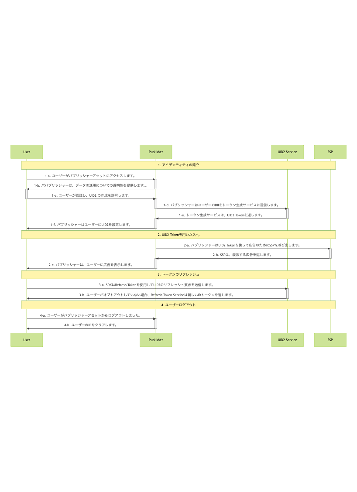

# UID2 SDK for JavaScript Integration Guide (2.x and earlier versions)

:::tip
このインテグレーションガイドは、UID2 SDK for JavaScript の旧バージョン用です。以前のバージョンをお使いの場合は、アップグレードすることをお勧めします。移行ガイドを含む [UID2 SDK for JavaScriptリファレンスガイド](../sdks/client-side-identity.md) を参照してください。
:::

このガイドは、UID2 対応のシングルサインオンや ID プロバイダーではなく、UID2 と直接インテグレーションしながら、RTB ビッドストリーム用に UID2 を使用して ID トークンを生成したいウェブアセットを持つパブリッシャーを対象としています。

- SDK の技術的な詳細については、[UID2 SDK for JavaScript Reference Guide](../sdks/client-side-identity.md) を参照してください。
- [サンプルアプリケーション](https://example-jssdk-integ.uidapi.com/) と関連ドキュメントは、[UID2 SDK Integration Example](https://github.com/IABTechLab/uid2-examples/blob/main/publisher/standard/README.md) ガイドを参照してください。

<!-- It includes the following sections:

- [Introduction](#introduction)
- [Integration Steps ](#integration-steps)
  - [Establish Identity: User Login](#establish-identity-user-login)
  - [Bid Using UID2 Tokens](#bid-using-uid2-tokens)
  - [Refresh Tokens](#refresh-tokens)
  - [Clear Identity: User Logout](#clear-identity-user-logout)
- [FAQs](#faqs) -->

## Introduction

このガイドでは、SDK を使用せずにインテグレーションを行う場合に考慮すべき [基本的なステップ](#integration-steps) の概要を説明します。例えば、ユーザーのログインとログアウトの実装方法、UID2 ID 情報の管理方法とターゲティング広告への使用方法、トークンのリフレッシュ方法、紛失した ID の処理方法、ユーザーのオプトアウトの処理方法などを決定する必要があります。[FAQ](#faqs) も参照してください。

UID2 を使用してクライアントの ID を確立し、Advertising Token を取得するプロセスを容易にするために、このガイドで提供する Web インテグレーション手順は、JavaScript 用の UID2 SDK に依存しています。このガイドで説明するインテグレーション手順と SDK の使用方法(現在はメールアドレスのみ)を示す [example application](https://example-jssdk-integ.uidapi.com/) を以下に示します。アプリケーションのドキュメントについては、[UID2 SDK Integration Example](https://github.com/IABTechLab/uid2-examples/blob/main/publisher/standard/README.md) を参照してください。

>IMPORTANT: SDKは現在、ファーストパーティ Cookie にトークンを保存します。このような実装の詳細は将来変更される可能性があります。潜在的な問題を回避するため、ID 管理には [Client-Side JavaScript SDK](../sdks/client-side-identity.md#api-reference) に依存するようにしてください。

UID2 SDK for JavaScript を使用しないパブリッシャー向けのインテグレーションシナリオについては、[Publisher Integration Guide, Server-Only](custom-publisher-integration.md) を参照してください。

>NOTE: Google Ad Manager を使用していて、セキュアシグナル機能を使用したい場合は、まず本ガイドの手順に従い、次に [Google Ad Manager Secure Signals Integration Guide](google-ss-integration.md) の追加手順に従ってください。

## Integration Steps 

以下の図は、ユーザーがパブリッシャーと UID2 Token を確立するために必要なステップと、UID2 Token が RTB ビッドストリームとどのようにインテグレーションされるかを概説しています。



以下のセクションでは、図中の各ステップについての詳細を説明します:
 
 1. [Establish identity: user login](#establish-identity-user-login)
 2. [Bid using UID2 tokens](#bid-using-uid2-tokens)
 3. [Refresh tokens](#refresh-tokens)
 4. [Clear Identity: user logout](#clear-identity-user-logout)

### Establish Identity: User Login

Step 1-c で認証を行い、ユーザーに利用規約を受け入れてもらい、パブリッシャーがメールアドレスや電話番号を認証した後、Server-Side で UID2 Token を生成する必要があります。次の表は、トークン生成ステップの詳細です。

| Step | Endpoint/SDK | Description |
| :--- | :--- | :--- |
| 1-d | [POST /token/generate](../endpoints/post-token-generate.md) | ユーザーが認証され、UID2 の作成が許可されたら、[POST /token/generate](../endpoints/post-token-generate.md) エンドポイントを使用して、ユーザーの正規化したメールアドレスまたは電話番号を使用して UID2 Token を生成します。|
| 1-e | [POST /token/generate](../endpoints/post-token-generate.md) | ユーザーのメールアドレス、電話番号、またはそれぞれのハッシュから生成された UID2 Token を返します。 |
| 1-f | UID2 SDK for JavaScript | Step 1-e で返された UID2 Token を、SDK の [init()関数](../sdks/client-side-identity.md#initopts-object-void) の`identity` プロパティで SDK に送信し、以下に示すように [コールバック関数](../sdks/client-side-identity.md#callback-function) を指定します。このメカニズムにより、ユーザーがログアウトするまで、UID2 Token がターゲティング広告に利用できるようになります。 |


```html
<script>
 __uid2.init({
   callback : function (state) {...}, // Check advertising token and its status within the passed state and initiate targeted advertising. 
   identity : {...} // The `body` property value from the token/generate API response.
 });
</script>
```

例えば:

```html
<script>
 __uid2.init({
   callback : onUid2IdentityUpdated,
   identity : {
        "advertising_token": "AgmZ4dZgeuXXl6DhoXqbRXQbHlHhA96leN94U1uavZVspwKXlfWETZ3b/besPFFvJxNLLySg4QEYHUAiyUrNncgnm7ppu0mi6wU2CW6hssiuEkKfstbo9XWgRUbWNTM+ewMzXXM8G9j8Q=",
        "refresh_token": "Mr2F8AAAF2cskumF8AAAF2cskumF8AAAADXwFq/90PYmajV0IPrvo51Biqh7/M+JOuhfBY8KGUn//GsmZr9nf+jIWMUO4diOA92kCTF69JdP71Ooo+yF3V5yy70UDP6punSEGmhf5XSKFzjQssCtlHnKrJwqFGKpJkYA==",
        "identity_expires": 1633643601000,
        "refresh_from": 1633643001000,
        "refresh_expires": 1636322000000
    }
 });
</script>
```

SDK は、指定された [callback function](../sdks/client-side-identity.md#callback-function) (ID の可用性を示す) を呼び出し、確立された ID をClient-Side で入札可能な状態にします。

### Bid Using UID2 Tokens

SDK は、有効な ID のステータスと利用可能性に基づいて、バックグラウンドでのトークンの自動更新を設定し、ID 情報を [ファーストパーティクッキー](../sdks/client-side-identity.md#uid2-cookie-formate) に格納し、ターゲティング広告のリクエストを開始するために使用します。

| Step | Endpoint/SDK | Description |
| :--- | :--- | :--- |
| 2-a | UID2 SDK for JavaScript | 以下に示すように、[getAdvertisingToken() function](../sdks/client-side-identity.md#getadvertisingtoken-string) を使用して、現在のユーザーの Advertising Token を取得します。 |

>NOTE: UID2 Token が SSP から DSP に送信される際に、ビッドストリームでどのように見えるかの例については、[What does a UID2 token look like in the bid stream?](../getting-started/gs-faqs.md#what-does-a-uid2-token-look-like-in-the-bid-stream) を参照してください。

```html
<script>
  let advertisingToken = __uid2.getAdvertisingToken();
</script>
```

>TIP: 返された Advertising Token をどのように SSP に渡すかを検討する必要があります。

### Refresh Tokens

初期化の一環として、SDK は ID の [token auto-refresh](../sdks/client-side-identity.md#background-token-auto-refresh) を設定します。これは、ID のタイムスタンプまたは断続的なエラーによるリフレッシュの失敗によってバックグラウンドでトリガーされます。

| Step | Endpoint/SDK | Description |
| :--- | :--- | :--- |
| 3-a | [UID2 SDK for JavaScript](../sdks/client-side-identity.md) | SDK はバックグラウンドで自動的に UID2 Token をリフレッシュします。手動で操作する必要はありません。 |
| 3-b | [UID2 SDK for JavaScript](../sdks/client-side-identity.md) | ユーザーがオプトアウトしていない場合、[POST /token/refresh](../endpoints/post-token-refresh.md) は自動的に新しい ID トークンを返します。 |

### Clear Identity: User Logout

ユーザーがパブリッシャーのサイトからログアウトすると、クライアントのライフサイクルは完了します(UID2 ではありません)。これによってクライアントのアイデンティティセッションが閉じられ、ファーストパーティクッキーの情報が消去されます。

| Step | Endpoint/SDK | Description |
| :--- | :--- | :--- |
| 4-a | N/A | ユーザーはパブリッシャーのアセットからログアウトします。 |
| 4-b | [UID2 SDK for JavaScript](../sdks/client-side-identity.md) | 以下のように、[disconnect() function](../sdks/client-side-identity.md#disconnect-void) を使用して、ファーストパーティクッキーから UID2 をクリアし、クライアントのライフサイクルを切断します。 |

```html
<script>
  __uid2.disconnect();
</script>
```

## FAQs

パブリッシャー向けのよくある質問については、[FAQs for Publishers](../getting-started/gs-faqs.md#faqs-for-publishers) を参照してください。