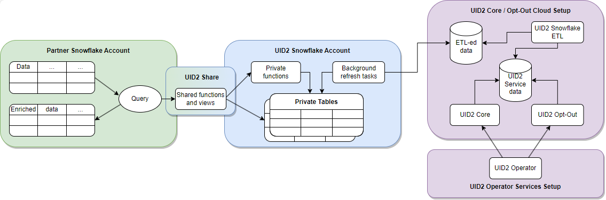

import Link from '@docusaurus/Link';

# Snowflake Integration Guide

[Snowflake](https://www.snowflake.com/) は、パートナーがデータを保存し、UID2 フレームワークとインテグレーションするためのクラウドデータウェアハウスソリューションです。Snowflake を使用することで、UID2 は機密性の高い <Link href="../ref-info/glossary-uid#gl-dii">directly identifying information (DII)</Link> を公開することなく、認可された消費者識別子データを安全に共有できます。消費者識別子データを直接 Operator Web Services に問い合わせることもできますが、Snowflake UID2 とのインテグレーションにより、よりシームレスな体験が可能になります。

UID2 の以下のリストが Snowflake marketplace で入手可能です:
- 広告主向け: [Unified ID 2.0: Advertiser Identity Solution](https://app.snowflake.com/marketplace/listing/GZT0ZRYXTMV/unified-id-2-0-unified-id-2-0-advertiser-identity-solution?originTab=provider&providerName=Unified+ID+2.0)
- データプロバイダー向け: [Unified ID 2.0: Data Provider Identity Solution](https://app.snowflake.com/marketplace/listing/GZT0ZRYXTN0/unified-id-2-0-unified-id-2-0-data-provider-identity-solution?originTab=provider&providerName=Unified+ID+2.0)

## Functionality

次の表は、UID2 Snowflake インテグレーション で利用可能な機能をまとめたものです。

| Encrypt Raw UID2 to UID2 Token | Decrypt UID2 Token to Raw UID2 | Generate UID2 Token from DII | Refresh UID2 Token | Map DII to Raw UID2s |
| :--- |  :--- | :--- | :--- | :--- |
| &#9989; | &#9989; | &#8212;* | &#8212; | &#9989; |

*Snowflake を使用して DII から直接 UID2 Token を生成することはできません。ただし、DII を raw UID2 に変換し、raw UID2 を UID2 Tokenに暗号化することはできます。

:::note
<Link href="../ref-info/glossary-uid#gl-bidstream">ビッドストリーム</Link>で UID2 Token を共有するパブリッシャーの場合は、[Tokenized Sharing in the Bidstream](../sharing/sharing-tokenized-from-data-bid-stream.md) を参照してください
:::

## Workflow Diagram

次の図は、Snowflake が UID2 インテグレーションプロセスにどのように関わるかを示しています:



|Partner Snowflake Account|UID2 Snowflake Account|UID2 Core Opt-Out Cloud Setup|
| :--- | :--- | :--- |
| パートナーとして、Snowflake アカウントを設定してデータをホストし、UID2 Share を通じて関数やビューを使うことで、UID2 インテグレーションに関与できます。 | Snowflake アカウントでホストされている UID2 インテグレーションでは、プライベートテーブルからデータを引き出す許可をされた関数とビューへのアクセスが許可されます。プライベートテーブルにはアクセスできません。UID2 Share では、UID2 関連のタスクを実行するために必要な重要なデータのみが公開されます。 | ETL (抽出・変換・ロード) ジョブは、UID2 Core/Optout Snowflake ストレージを常に更新し、UID2 Operator Web Services を動かす内部データを提供します。Operator Web Services で使用されるデータは、UID2 Share からも入手できます。 |
| Shared 関数とビューを使用する場合、Snowflake にトランザクションのコストを支払います。 | UID2 Snowflake アカウントで保護されたこれらのプライベートテーブルは、UID2 関連のタスクを完了するために使用される内部データを保持する UID2 Core/Optout Snowflake ストレージと自動的に同期されます。 |  |

## Access the UID2 Shares

UID2 Shareへのアクセスは、[Snowflake Data Marketplace](https://www.snowflake.com/data-marketplace/) を通して行います。ここでは、選択した UID2 パーソナライズドリストに基づいて特定のデータセットをリクエストすることができます。

Snowflakeデータマーケットプレイスでは、UID2 用に2つのパーソナライズされたリストが提供されています:
- 広告主/ブランド向けの [Unified ID 2.0 Advertiser Identity Solution](https://app.snowflake.com/marketplace/listing/GZT0ZRYXTMV)
- データプロバイダー向けの [Unified ID 2.0 Data Provider Identity Solution](https://app.snowflake.com/marketplace/listing/GZT0ZRYXTN0)

:::important
データをリクエストするには、Snowflake アカウントに`ACCOUNTADMIN` ロール権限が必要です。
:::

UID2 Share へのアクセスを要求するには、次の手順を実行します。

1. Snowflake Data Marketplace にログインし、関心のある UID2 ソリューションを選択します:
   - [Unified ID 2.0 Advertiser Identity Solution](https://app.snowflake.com/marketplace/listing/GZT0ZRYXTMV)
   - [Unified ID 2.0 Data Provider Identity Solution](https://app.snowflake.com/marketplace/listing/GZT0ZRYXTN0)
2. **パーソナライズドデータ** セクションで、**データのリクエスト** をクリックします。
3. 画面の指示に従って、連絡先やその他の必要情報を確認し、入力してください。
4. The Trade Desk の既存顧客で _Advertiser_ Identity Solution に興味がある場合は、データリクエストフォームの **Message** 欄に The Trade Desk が発行したパートナー ID および広告主 ID を記載してください。
5. フォームを送信します。

リクエストを受け取った後、UID2 Administrator が適切なアクセス方法をご連絡します。Snowflake でのデータリクエストの管理についての詳細は [Snowflake documentation](https://docs.snowflake.com/en/user-guide/data-marketplace-consumer.html) を参照してください。


## Shared Objects

選択した UID2 ソリューションに関係なく、以下の関数を使って、DII を UID2 にマッピングできます:

- `FN_T_UID2_IDENTITY_MAP` ([Map DII](#map-dii) を参照してください)

以下の関数は非推奨となり、`FN_T_UID2_IDENTITY_MAP` が優先されます。これらの関数はまだ使用できますが、  `FN_T_UID2_IDENTITY_MAP` の方が優れています。すでにこれらの関数を使用している場合は、できるだけ早くアップグレードすることを勧めます。

- `FN_T_UID2_IDENTITY_MAP_EMAIL` (非推奨)
- `FN_T_UID2_IDENTITY_MAP_EMAIL_HASH` (非推奨)

:::note
非推奨の関数を使用していて、新しい関数への移行の手助けが必要な場合は、[Migration Guide](#migration-guide) を参照してください。
:::

再生成が必要な UID2 を特定するには、UID Share から `UID2_SALT_BUCKETS` ビューを使用します。詳しくは、[Regenerate UID2s](#regenerate-uid2s) を参照してください。

UID2 Sharing 参加者には、以下の機能も利用できます:
- `FN_T_UID2_ENCRYPT` (See [Encrypt Tokens](#encrypt-tokens))
- `FN_T_UID2_DECRYPT` (See [Decrypt Tokens](#decrypt-tokens))

詳細は [Usage for UID2 Sharers](#usage-for-uid2-sharers) を参照してください。

### Database and Schema Names

以下のセクションでは、各ソリューションのクエリ例を示します。これらは、データベースとスキーマ名の変数を除けば、同じものです:

```
{DATABASE_NAME}.{SCHEMA_NAME}
```
例:
```
select UID2, BUCKET_ID, UNMAPPED from table({DATABASE_NAME}.{SCHEMA_NAME}.FN_T_UID2_IDENTITY_MAP('validate@example.com', 'email'));
```

すべてのクエリ例では、各名前変数に以下のデフォルト値を使用しています:

| Variable |Advertiser Solution Default Value | Data Provider Solution Default Value| Comments |
| :--- | :--- | :--- | :--- |
| `{DATABASE_NAME}` | `UID2_PROD_ADV_SH` | `UID2_PROD_DP_SH` | 必要であれば、選択した UID2 Share へのアクセス権が与えられた後に新しいデータベースを作成する際に、デフォルトのデータベース名を変更できます。 |
| `{SCHEMA_NAME}`   | `ADV` | `DP` | これはイミュータブルです。 |

### Map DII

すべてのタイプの <Link href="../ref-info/glossary-uid#gl-dii">DII</Link> をマッピングするには、`FN_T_UID2_IDENTITY_MAP` 関数を使用します。

DII がメールアドレスの場合、サービスは UID2 [メールアドレスの正規化](../getting-started/gs-normalization-encoding.md#email-address-normalization) 規則を使用して正規化されます。

DII が電話番号の場合、UID2 [電話番号正規化](../getting-started/gs-normalization-encoding.md#phone-number-normalization) ルールを使用して、サービスに送信する前に正規化する必要があります。

| Argument     | Data Type    | Description                                                         |
| :----------- | :----------- | :------------------------------------------------------------------ |
| `INPUT`      | varchar(256) | UID2とセカンドレベルレベルのバケット ID にマッピングするDII。 |
| `INPUT_TYPE` | varchar(256) | マッピングするDIIのタイプ。指定できる値: `email`, `email_hash`, `phone`, `phone_hash` |

クエリに成功すると、指定された DII について以下の情報が返されます。

|Column Name|Data Type|Description|
| :--- | :--- | :--- |
| `UID2`      | TEXT | DII は正常にマッピングされました: <br/>DII は正常にマップされませんでした: `NULL`。 |
| `BUCKET_ID` | TEXT | DIIは正常にマップされました: UID2 の生成に使われたセカンドレベルのソルトバケットの ID。この ID は `UID2_SALT_BUCKETS` ビューのバケットIDに対応します。<br/>DIIは正常にマップされませんでした: `NULL`。 |
| `UNMAPPED`  | TEXT |  DII は正常にマッピングされました: `NULL`<br/>DII は正常にマップされませんでした: `NULL`:  DII は正常にマップされませんでした: 識別子がマップされなかった理由: `OPTOUT`、`INVALID IDENTIFIER`、`INVALID INPUT TYPE` のいずれか。詳細は [Values for the UNMAPPED Column](#values-for-the-unmapped-column) を参照してください。 |

#### Values for the UNMAPPED Column

`UNMAPPED`に指定できる値は以下の通りです:

| Value | Meaning |
| :-- | :-- |
| `NULL` | DII は正常にマッピングされました。 |
| `OPTOUT` | ユーザはオプトアウトしました。 |
| `INVALID IDENTIFIER` | メールアドレスまたは電話番号が無効です。 |
| `INVALID INPUT TYPE` | `INPUT_TYPE` の値が無効です。INPUT_TYPE の値は以下のいずれかでなければなりません: `email`、`email_hash`、`phone`、`phone_hash`。 |

#### Examples

このセクションのマッピングリクエストの例:

- [Single Unhashed Email](#mapping-request-example---single-unhashed-email)
- [Multiple Unhashed Emails](#mapping-request-example---multiple-unhashed-emails)
- [Single Unhashed Phone Number](#mapping-request-example---single-unhashed-phone-number)
- [Multiple Unhashed Phone Numbers](#mapping-request-example---multiple-unhashed-phone-numbers)
- [Single Hashed Email](#mapping-request-example---single-hashed-email)
- [Multiple Hashed Emails](#mapping-request-example---multiple-hashed-emails)
- [Single Hashed Phone Number](#mapping-request-example---single-hashed-phone-number)
- [Multiple Hashed Phone Numbers](#mapping-request-example---multiple-hashed-phone-numbers)

:::note
これらの例の入出力データは、説明のみを目的とした架空のものです。提供された値は実際の値ではありません。
:::

#### Mapping Request Example - Single Unhashed Email

次のクエリは、[デフォルトのデータベースとスキーマ名](#database-and-schema-names) を使用して、単一のメールアドレスをマッピングする方法を示しています。

単一のメールアドレスに対する広告主ソリューションのクエリー:

```
select UID2, BUCKET_ID, UNMAPPED from table(UID2_PROD_ADV_SH.ADV.FN_T_UID2_IDENTITY_MAP('validate@example.com', 'email'));
```

単一のメールアドレスに対するデータプロバイダーソリューションのクエリー:

```
select UID2, BUCKET_ID, UNMAPPED from table(UID2_PROD_DP_SH.DP.FN_T_UID2_IDENTITY_MAP('validate@example.com', 'email'));
```

単一のメールアドレスに対するクエリー結果:

```
+----------------------------------------------+------------+----------+
| UID2                                         | BUCKET_ID  | UNMAPPED |
+----------------------------------------------+------------+----------+
| 2ODl112/VS3x2vL+kG1439nPb7XNngLvOWiZGaMhdcU= | ad1ANEmVZ  | NULL     |
+----------------------------------------------+------------+----------+
```

#### Mapping Request Example - Multiple Unhashed Emails

以下のクエリは、[デフォルトのデータベースとスキーマ名](#database-and-schema-names) を使用して、複数のメールアドレスをマッピングする方法を示しています。

複数のメールアドレスに対する広告主ソリューションのクエリー:

```
select a.ID, a.EMAIL, m.UID2, m.BUCKET_ID, m.UNMAPPED from AUDIENCE a LEFT JOIN(
    select ID, t.* from AUDIENCE, lateral UID2_PROD_ADV_SH.ADV.FN_T_UID2_IDENTITY_MAP(EMAIL, 'email') t) m
    on a.ID=m.ID;
```

複数のメールアドレスに対するデータプロバイダーソリューションのクエリー:

```
select a.ID, a.EMAIL, m.UID2, m.BUCKET_ID, UNMAPPED from AUDIENCE a LEFT JOIN(
    select ID, t.* from AUDIENCE, lateral UID2_PROD_DP_SH.DP.FN_T_UID2_IDENTITY_MAP(EMAIL, 'email') t) m
    on a.ID=m.ID;
```

複数のメールアドレスに対するクエリー結果:

次の表は、`NULL` または不適切な書式のメールアドレスに対する `NULL` 値を含む、レスポンスの各項目です。

```
+----+--------------------+----------------------------------------------+------------+--------------------+
| ID | EMAIL              | UID2                                         | BUCKET_ID  | UNMAPPED           |
+----+--------------------+----------------------------------------------+------------+--------------------+
|  1 | validate@example.com | 2ODl112/VS3x2vL+kG1439nPb7XNngLvOWiZGaMhdcU= | ad1ANEmVZ  | NULL               |
|  2 | test@uidapi.com    | IbW4n6LIvtDj/8fCESlU0QG9K/fH63UdcTkJpAG8fIQ= | a30od4mNRd | NULL               |
|  3 | invalid-email      | NULL                                         | NULL       | INVALID IDENTIFIER |
|  4 | NULL               | NULL                                         | NULL       | INVALID IDENTIFIER |
+----+--------------------+----------------------------------------------+------------+--------------------+
```

#### Mapping Request Example - Single Unhashed Phone Number

以下のクエリは、[デフォルトのデータベース名とスキーマ名](#database-and-schema-names) を使って電話番号をマッピングする方法を示しています。

電話番号は、UID2 [電話番号正規化](../getting-started/gs-normalization-encoding.md#phone-number-normalization) ルールを使って正規化する必要があります。

単一の電話番号に対する広告主ソリューションのクエリー:

```
select UID2, BUCKET_ID, UNMAPPED from table(UID2_PROD_ADV_SH.ADV.FN_T_UID2_IDENTITY_MAP('+12345678901', 'phone'));
```

単一の電話番号に対するデータプロバイダーソリューションのクエリー:

```
select UID2, BUCKET_ID, UNMAPPED from table(UID2_PROD_DP_SH.DP.FN_T_UID2_IDENTITY_MAP('+12345678901', 'phone'));
```

単一の電話番号に対するクエリー結果:

```
+----------------------------------------------+------------+----------+
| UID2                                         | BUCKET_ID  | UNMAPPED |
+----------------------------------------------+------------+----------+
| 2ODl112/VS3x2vL+kG1439nPb7XNngLvOWiZGaMhdcU= | ad1ANEmVZ  | NULL     |
+----------------------------------------------+------------+----------+
```

#### Mapping Request Example - Multiple Unhashed Phone Numbers

以下のクエリは、[デフォルトのデータベース名とスキーマ名](#database-and-schema-names) を使用して、複数の電話番号をマップする方法を示しています。

電話番号は UID2 の[電話番号正規化](../getting-started/gs-normalization-encoding.md#phone-number-normalization) ルールを使って正規化する必要があります。

複数の電話番号に対する広告主ソリューションのクエリー:

```
select a.ID, a.PHONE, m.UID2, m.BUCKET_ID, m.UNMAPPED from AUDIENCE a LEFT JOIN(
    select ID, t.* from AUDIENCE, lateral UID2_PROD_ADV_SH.ADV.FN_T_UID2_IDENTITY_MAP(PHONE, 'phone') t) m
    on a.ID=m.ID;
```

複数の電話番号に対するデータプロバイダーソリューションのクエリー:

```
select a.ID, a.PHONE, m.UID2, m.BUCKET_ID, UNMAPPED from AUDIENCE a LEFT JOIN(
    select ID, t.* from AUDIENCE, lateral UID2_PROD_DP_SH.DP.FN_T_UID2_IDENTITY_MAP(PHONE, 'phone') t) m
    on a.ID=m.ID;
```

複数の電話番号に対するクエリー結果:

The following table identifies each item in the response, including `NULL` values for `NULL` or invalid phone numbers.

```
+----+--------------+----------------------------------------------+------------+--------------------+
| ID | PHONE        | UID2                                         | BUCKET_ID  | UNMAPPED           |
+----+--------------+----------------------------------------------+------------+--------------------+
|  1 | +12345678901 | 2ODl112/VS3x2vL+kG1439nPb7XNngLvOWiZGaMhdcU= | ad1ANEmVZ  | NULL               |
|  2 | +61491570006 | IbW4n6LIvtDj/8fCESlU0QG9K/fH63UdcTkJpAG8fIQ= | a30od4mNRd | NULL               |
|  3 | 1234         | NULL                                         | NULL       | INVALID IDENTIFIER |
|  4 | NULL         | NULL                                         | NULL       | INVALID IDENTIFIER |
+----+--------------+----------------------------------------------+------------+--------------------+
```

#### Mapping Request Example - Single Hashed Email

以下のクエリは、[デフォルトのデータベースとスキーマ名](#database-and-schema-names) を使用して、単一のメールアドレスハッシュをマップする方法を示しています。

単一のハッシュ化されたメールアドレスに対する広告主ソリューションのクエリー:

```
select UID2, BUCKET_ID, UNMAPPED from table(UID2_PROD_ADV_SH.ADV.FN_T_UID2_IDENTITY_MAP(BASE64_ENCODE(SHA2_BINARY('validate@example.com', 256)), 'email_hash'));
```

単一のハッシュ化されたメールアドレスに対するデータプロバイダーソリューションのクエリー:

```
select UID2, BUCKET_ID, UNMAPPED from table(UID2_PROD_DP_SH.DP.FN_T_UID2_IDENTITY_MAP(BASE64_ENCODE(SHA2_BINARY('validate@example.com', 256)), 'email_hash'));
```

単一のハッシュ化されたメールアドレスに対するクエリー結果:

```
+----------------------------------------------+------------+----------+
| UID2                                         | BUCKET_ID  | UNMAPPED |
+----------------------------------------------+------------+----------+
| 2ODl112/VS3x2vL+kG1439nPb7XNngLvOWiZGaMhdcU= | ad1ANEmVZ  | NULL     |
+----------------------------------------------+------------+----------+
```

#### Mapping Request Example - Multiple Hashed Emails

以下のクエリは、[デフォルトのデータベースとスキーマ名](#database-and-schema-names) を使用して、複数のメールアドレスハッシュをマッピングする方法を示しています。

複数のハッシュ化されたメールアドレスに対する広告主ソリューションのクエリー:

```
select a.ID, a.EMAIL_HASH, m.UID2, m.BUCKET_ID, m.UNMAPPED from AUDIENCE a LEFT JOIN(
    select ID, t.* from AUDIENCE, lateral UID2_PROD_ADV_SH.ADV.FN_T_UID2_IDENTITY_MAP(EMAIL_HASH, 'email_hash') t) m
    on a.ID=m.ID;
```

複数のハッシュ化されたメールアドレスに対するデータプロバイダーソリューションのクエリー:

```
select a.ID, a.EMAIL_HASH, m.UID2, m.BUCKET_ID, m.UNMAPPED from AUDIENCE a LEFT JOIN(
    select ID, t.* from AUDIENCE, lateral UID2_PROD_DP_SH.DP.FN_T_UID2_IDENTITY_MAP(EMAIL_HASH, 'email_hash') t) m
    on a.ID=m.ID;
```

複数のハッシュ化されたメールアドレスに対するクエリー結果:

次の表は、`NULL` ハッシュの `NULL` 値を含め、レスポンスの各項目を示しています。

```
+----+----------------------------------------------+----------------------------------------------+------------+--------------------+
| ID | EMAIL_HASH                                   | UID2                                         | BUCKET_ID  | UNMAPPED           |
+----+----------------------------------------------+----------------------------------------------+------------+--------------------+
|  1 | LdhtUlMQ58ZZy5YUqGPRQw5xUMS5dXG5ocJHYJHbAKI= | 2ODl112/VS3x2vL+kG1439nPb7XNngLvOWiZGaMhdcU= | ad1ANEmVZ  | NULL               |
|  2 | NULL                                         | NULL                                         | NULL       | INVALID IDENTIFIER |
|  3 |/XJSTajB68SCUyuc3ePyxSLNhxrMKvJcjndq8TuwW5g=  | IbW4n6LIvtDj/8fCESlU0QG9K/fH63UdcTkJpAG8fIQ= | a30od4mNRd | NULL               |
+----+----------------------------------------------+----------------------------------------------+------------+--------------------+
```

#### Mapping Request Example - Single Hashed Phone Number

以下のクエリは、[デフォルトのデータベース名とスキーマ名](#database-and-schema-names) を使用して、単一の電話番号ハッシュをマップする方法を示しています。

単一のハッシュ化された電話番号に対する広告主ソリューションのクエリー:

```
select UID2, BUCKET_ID, UNMAPPED from table(UID2_PROD_ADV_SH.ADV.FN_T_UID2_IDENTITY_MAP(BASE64_ENCODE(SHA2_BINARY('+12345678901', 256)), 'phone_hash'));
```

単一のハッシュ化された電話番号に対するデータプロバイダーソリューションのクエリー:

```
select UID2, BUCKET_ID, UNMAPPED from table(UID2_PROD_DP_SH.DP.FN_T_UID2_IDENTITY_MAP(BASE64_ENCODE(SHA2_BINARY('+12345678901', 256)), 'phone_hash'));
```

単一のハッシュ化された電話番号に対するクエリー結果:

```
+----------------------------------------------+------------+----------+
| UID2                                         | BUCKET_ID  | UNMAPPED |
+----------------------------------------------+------------+----------+
| 2ODl112/VS3x2vL+kG1439nPb7XNngLvOWiZGaMhdcU= | ad1ANEmVZ  | NULL     |
+----------------------------------------------+------------+----------+
```

#### Mapping Request Example - Multiple Hashed Phone Numbers

以下のクエリは、[デフォルトのデータベース名とスキーマ名](#database-and-schema-names) を使用して、複数の電話番号ハッシュをマップする方法を示しています。

複数のハッシュ化された電話番号に対する広告主ソリューションのクエリー:

```
select a.ID, a.PHONE_HASH, m.UID2, m.BUCKET_ID, m.UNMAPPED from AUDIENCE a LEFT JOIN(
    select ID, t.* from AUDIENCE, lateral UID2_PROD_ADV_SH.ADV.FN_T_UID2_IDENTITY_MAP(PHONE_HASH, 'phone_hash') t) m
    on a.ID=m.ID;
```

複数のハッシュ化された電話番号に対するデータプロバイダーソリューションのクエリー:

```
select a.ID, a.PHONE_HASH, m.UID2, m.BUCKET_ID, m.UNMAPPED from AUDIENCE a LEFT JOIN(
    select ID, t.* from AUDIENCE, lateral UID2_PROD_DP_SH.DP.FN_T_UID2_IDENTITY_MAP(PHONE_HASH, 'phone_hash') t) m
    on a.ID=m.ID;
```

複数のハッシュ化された電話番号に対するクエリー結果:

次の表は、`NULL` ハッシュの `NULL` 値を含め、レスポンスの各項目を示しています。

```
+----+----------------------------------------------+----------------------------------------------+------------+--------------------+
| ID | PHONE_HASH                                   | UID2                                         | BUCKET_ID  | UNMAPPED           |
+----+----------------------------------------------+----------------------------------------------+------------+--------------------+
|  1 | LdhtUlMQ58ZZy5YUqGPRQw5xUMS5dXG5ocJHYJHbAKI= | 2ODl112/VS3x2vL+kG1439nPb7XNngLvOWiZGaMhdcU= | ad1ANEmVZ  | NULL               |
|  2 | NULL                                         | NULL                                         | NULL       | INVALID IDENTIFIER |
|  3 |/XJSTajB68SCUyuc3ePyxSLNhxrMKvJcjndq8TuwW5g=  | IbW4n6LIvtDj/8fCESlU0QG9K/fH63UdcTkJpAG8fIQ= | a30od4mNRd | NULL               |
+----+----------------------------------------------+----------------------------------------------+------------+--------------------+
```

### Regenerate UID2s

`UID2_SALT_BUCKETS` ビュークエリは、セカンドレベルのソルトバケットが最後に更新された日時を返します。セカンドレベルのソルトは UID2 を生成する際に使用されます。バケット内のソルトが更新されると、それまで生成されていた UID2 が古くなり、同じユーザーに対して他者が生成した UID2 とは一致しなくなります。

どの UID2 が再生成を必要としているかを判断するには、生成されたときのタイムスタンプを、セカンドレベルのソルトバケット更新の最新のタイムスタンプと比較します。

|Column Name|Data Type|Description|
| :--- | :--- | :--- |
| `BUCKET_ID` | TEXT | セカンドレベルのソルトバケットの ID です。この ID は、ID マップ関数が返す `BUCKET_ID` と同じものです。`BUCKET_ID` をキーとして、関数呼び出しの結果とこのビュー呼び出しの結果の間のジョインクエリを実行します。 |
| `LAST_SALT_UPDATE_UTC` | TIMESTAMP_NTZ | バケット内のソルトが最後に更新された時刻です。この値は UTC タイムゾーンで表現されます。 |

次の例は、入力テーブルと、セカンドレベルのソルトが更新されたために再生成が必要なテーブルの UID2 を見つけるために使用されるクエリを示しています。

#### Targeted Input Table

このシナリオ例では、広告主/データプロバイダーは UID2 を `AUDIENCE_WITH_UID2` という名前のテーブルに格納しています。最後の列 `LAST_UID2_UPDATE_UTC` は、UID2 が生成された時刻を記録するために使用されます。UID2 が生成されていない場合、3番目の例に示すように値は `NULL` となります。広告主/データプロバイダーはこのタイムスタンプ値を使って、どのUID2 を再生成する必要があるかを判断できます。

```
select * from AUDIENCE_WITH_UID2;
```
```
+----+--------------------+----------------------------------------------+------------+-------------------------+
| ID | EMAIL              | UID2                                         | BUCKET_ID  | LAST_UID2_UPDATE_UTC    |
+----+--------------------+----------------------------------------------+------------+-------------------------+
|  1 | validate@example.com | 2ODl112/VS3x2vL+kG1439nPb7XNngLvOWiZGaMhdcU= | ad1ANEmVZ  | 2021-03-01 00:00:00.000 |
|  2 | test1@uidapi.com   | Q4A5ZBuBCYfuV3Wd8Fdsx2+i33v7jyFcQbcMG/LH4eM= | ad1ANEmVZ  | 2021-03-03 00:00:00.000 |
|  3 | test2@uidapi.com   | NULL                                         | NULL       | NULL                    |
+----+--------------------+----------------------------------------------+------------+-------------------------+
```

欠落しているまたは古い UID2 を見つけるには、[デフォルトのデータベースとスキーマ名](#database-and-schema-names) を使用する次のクエリ例を使用します。

広告主ソリューションのクエリー:

```
select a.*, b.LAST_SALT_UPDATE_UTC
  from AUDIENCE_WITH_UID2 a LEFT OUTER JOIN UID2_PROD_ADV_SH.ADV.UID2_SALT_BUCKETS b
  on a.BUCKET_ID=b.BUCKET_ID
  where a.LAST_UID2_UPDATE_UTC < b.LAST_SALT_UPDATE_UTC or a.UID2 IS NULL;
```

データプロバイダーソリューションのクエリー:

```
select a.*, b.LAST_SALT_UPDATE_UTC
  from AUDIENCE_WITH_UID2 a LEFT OUTER JOIN UID2_PROD_DP_SH.DP.UID2_SALT_BUCKETS b
  on a.BUCKET_ID=b.BUCKET_ID
  where a.LAST_UID2_UPDATE_UTC < b.LAST_SALT_UPDATE_UTC or a.UID2 IS NULL;
```

クエリー結果:

次の表は、レスポンスに含まれる各項目を表たものです。以下の ID1 の例で示すように、結果には EMAIL、`UID2`、`BUCKET_ID`、`LAST_UID2_UPDATE_UTC`、`LAST_SALT_UPDATE_UTC`が含まれます。ID 2 は、対応する UID2 が最後のバケット更新の後に生成されたため、情報は返されません。ID 3 は、UID2 が存在しないため、`NULL`値が返されます。

```
+----+--------------------+----------------------------------------------+------------+-------------------------+-------------------------+
| ID | EMAIL              | UID2                                         | BUCKET_ID  | LAST_UID2_UPDATE_UTC    | LAST_SALT_UPDATE_UTC    |
+----+--------------------+----------------------------------------------+------------+-------------------------+-------------------------+
|  1 | validate@example.com | 2ODl112/VS3x2vL+kG1439nPb7XNngLvOWiZGaMhdcU= | ad1ANEmVZ  | 2021-03-01 00:00:00.000 | 2021-03-02 00:00:00.000 |
|  3 | test2@uidapi.com   | NULL                                         | NULL       | NULL                    | NULL                    |
+----+--------------------+----------------------------------------------+------------+-------------------------+-------------------------+
```

## Migration Guide

`FN_T_UID2_IDENTITY_MAP_EMAIL` 関数と `FN_T_UID2_IDENTITY_MAP_EMAIL_HASH` 関数を使用している場合は、できるだけ早く `FN_T_UID2_IDENTITY_MAP` 関数に移行することを勧めます。この関数は、他の2つの関数が行うことをすべて行い、その他の改良も組み込まれています。

`FN_T_UID2_IDENTITY_MAP` 関数の利点:

- 電話番号とハッシュ化された電話番号の両方のマッピングをサポートしています。
- ユーザーのオプトアウトをサポートしました。
- `UNMAPPED` という新しいカラムが追加されました。何らかの理由で DII を UID2 にマッピングできない場合、この列にはその理由についての情報が含まれます。詳細は [Values for the UNMAPPED Column](#values-for-the-unmapped-column) を参照してください。

このセクションには、新機能へのアップグレードに役立つ以下の情報が含まれています:

- [既存のコードの変更](#changing-existing-code) 
- [UNMAPPEDカラムの値を使う](#using-the-values-for-the-unmapped-column)

### Changing Existing Code

このセクションのコードスニペットは、以前の関数がどのように実装されているか、そして新しい関数を使用するためにどのように更新できるかを示す Before / After の例です。

#### Example for mapping unhashed emails

Before:

```
FN_T_UID2_IDENTITY_MAP_EMAIL(EMAIL)
```

After:

```
FN_T_UID2_IDENTITY_MAP(EMAIL, 'email')
```

#### Example for mapping unhashed emails

Before:

```
FN_T_UID2_IDENTITY_MAP_EMAIL_HASH(EMAIL_HASH)
```

After:

```
FN_T_UID2_IDENTITY_MAP(EMAIL_HASH, 'email_hash')
```

### Using the Values for the UNMAPPED Column
新しい関数を実装したら、`FN_T_UID2_IDENTITY_MAP`が返す `UNMAPPED` カラムをチェックすることができます。DII が UID2 にマッピングできなかった場合、この列にはその理由が示されます。

値とその説明の詳細は [Values for the UNMAPPED Column](#values-for-the-unmapped-column) を参照してください。

## Usage for UID2 Sharers

UID2 <Link href="../ref-info/glossary-uid#gl-sharing-participant">共有参加者</Link> とは、送信者または受信者として共有に参加し、UID2を他の参加者と共有する企業のことです。

広告主やデータプロバイダーは、Snowflake (Tokenized Sharing) を介して、UID2 を他の UID2 共有許可参加者と共有することができます。これらの参加者は、[raw UID2](../ref-info/glossary-uid#gl-raw-uid2) を <Link href="../ref-info/glossary-uid#gl-uid2-token">UID2 Token</Link> に暗号化し、それを別の参加者に送信してピクセルで共有することができます（[Tokenized Sharing in Pixels](../sharing/sharing-tokenized-from-data-pixel.md) を参照してください）。Snowflake 内でピクセル単位でデータを送信しない場合でも、[Security Requirements for UID2 Sharing](../sharing/sharing-security.md) に記載されている要件に従う限り、UID2 Sharing に参加することができます。

:::caution
このプロセスで生成される UID2 Token は共有専用です&#8212;ビッドストリームでは使用できません。ビッドストリーム用のトークン生成には別のワークフローがあります: [Tokenized Sharing in the Bidstream](../sharing/sharing-tokenized-from-data-bid-stream.md) を参照してください。
:::

Snowflake 内でピクセルまたはビッドストリームでデータを送信しない場合、[Security Requirements for UID2 Sharing](../sharing/sharing-security.md) に記載されている要件に従う限り、生のUID2共有に参加することもできます。

以下のアクティビティは Tokenized Sharing に対応しています:

- [Encrypt Tokens](#encrypt-tokens)
- [Decrypt Tokens](#decrypt-tokens)

### Encrypt Tokens

raw UID2 を UID2 Token に暗号化するには、関数 `FN_T_UID2_ENCRYPT` を使用します。該当する接頭辞を使用して自分の役割を示します:s
- 広告主の場合: `ADV.FN_T_UID2_ENCRYPT`
- データプロバイダーの場合: `DP.FN_T_UID2_ENCRYPT`

|Argument|Data Type|Description|
| :--- | :--- | :--- |
| `RAW_UID2` | varchar(128) | UID2 Token に暗号化する raw UID2。 |

クエリーに成功すると、指定された raw UID2 について以下の情報が返されます。

|Column Name|Data Type|Description|
| :--- | :--- | :--- |
| `UID2_TOKEN` | TEXT | 値は次のいずれかです:<ul><li>暗号化成功: raw UID2 を含む UID2 Token。</li><li>暗号化失敗: `NULL`</li></ul> |
| `ENCRYPTION_STATUS` | TEXT | 値は次のいずれかです。<ul><li>暗号化成功: `NULL`</li><li>暗号化失敗: raw UID2 が暗号化されなかった理由。例: `INVALID_RAW_UID2` または `INVALID NOT_AUTHORIZED_FOR_MASTER_KEY`。<br/>詳細は [Values for the ENCRYPTION_STATUS Column](#values-for-the-encryption_status-column) を参照してください。</li></ul> |

#### Values for the ENCRYPTION_STATUS Column

次の表は、`ENCRYPTION_STATUS` 列の有効な値です。

| Value | Meaning |
| :-- | :-- |
| `NULL` | The raw UID2 was successfully encrypted. |
| `MISSING_OR_INVALID_RAW_UID2` | raw UID2 の暗号化に成功しました。 |
| `INVALID_RAW_UID2` | raw UID2 が無効です。 |
| `MISMATCHING_IDENTITY_SCOPE` | raw UID2 が不正な ID スコープに属している。例えば、UID2 が期待されているところに EUID が渡されているなど。|
| `NOT_AUTHORIZED_FOR_MASTER_KEY` | 呼び出し元が必要な <a href="../ref-info/glossary-uid#gl-encryption-key">暗号化キー</a> にアクセスできません。UID2 の管理者に連絡してください。 |
| `NOT_AUTHORIZED_FOR_SITE_KEY` | 呼び出し元が必要な暗号化キーにアクセスできません。UID2 の管理者に連絡してください。 |

#### Encrypt Token Request Example - Single Raw UID2

以下のクエリは、[default database and schema names](#database-and-schema-names) を使用して、単一の raw UID2 を UID2 Token に暗号化する方法を示しています。

単一の raw UID2 に対する広告主ソリューションクエリ:

```
select UID2_TOKEN, ENCRYPTION_STATUS from table(UID2_PROD_ADV_SH.ADV.FN_T_UID2_ENCRYPT('2ODl112/VS3x2vL+kG1439nPb7XNngLvOWiZGaMhdcU='));
```

単一の raw UID2 に対するデータプロバイダのソリューションクエリ:

```
select UID2_TOKEN, ENCRYPTION_STATUS from table(UID2_PROD_DP_SH.DP.FN_T_UID2_ENCRYPT('2ODl112/VS3x2vL+kG1439nPb7XNngLvOWiZGaMhdcU='));
```

単一の raw UID2 に対するクエリー結果:

```
+------------------------+-------------------+
| UID2_TOKEN             | ENCRYPTION_STATUS |
+--------------------------------------------+
| A41234<rest of token>  | NULL              |
+--------------------------------------------+
```

#### Encrypt Token Request Example - Multiple Raw UID2s

以下のクエリは、[default database and schema names](#database-and-schema-names) を使用して、複数の raw UID2 を暗号化する方法を示しています。

複数の raw UID2 に対する広告主ソリューションのクエリ:

```
select a.RAW_UID2, t.UID2_TOKEN, t.ENCRYPTION_STATUS from AUDIENCE_WITH_UID2 a, lateral UID2_PROD_ADV_SH.ADV.FN_T_UID2_ENCRYPT(a.RAW_UID2) t;
```

複数の raw UID2 に対するデータプロバイダのソリューションクエリ:

```
select a.RAW_UID2, t.UID2_TOKEN, t.ENCRYPTION_STATUS from AUDIENCE_WITH_UID2 a, lateral UID2_PROD_DP_SH.DP.FN_T_UID2_ENCRYPT(a.RAW_UID2) t;
```

複数の raw UID2 に対するクエリー結果:

次の表は、raw UID2 が `NULL` の場合の `NULL` 値を含め、レスポンスの各項目を示しています。

```
+----+----------------------------------------------+-----------------------+-----------------------------+
| ID | RAW_UID2                                     | UID2_TOKEN            | ENCRYPTION_STATUS           |
+----+----------------------------------------------+-----------------------+-----------------------------+
|  1 | 2ODl112/VS3x2vL+kG1439nPb7XNngLvOWiZGaMhdcU= | A41234<rest of token> | NULL                        |
|  2 | NULL                                         | NULL                  | MISSING_OR_INVALID_RAW_UID2 |
|  3 | BXJSTajB68SCUyuc3ePyxSLNhxrMKvJcjndq8TuwW5g5 | B45678<rest of token> | NULL                        |
+----+----------------------------------------------+-----------------------+-----------------------------+
```

### Decrypt Tokens

UID2 Token を raw UID2 に復号するには、関数 `FN_T_UID2_DECRYPT` を使用します。該当する接頭辞を使用して自分の役割を示します:
- 広告主の場合: `ADV.FN_T_UID2_DECRYPT`
- データプロバイダーの場合: `DP.FN_T_UID2_DECRYPT`

|Argument|Data Type|Description|
| :--- | :--- | :--- |
| `UID2_TOKEN` | varchar(512) | raw UID2 に復号する UID2 Token です。 |

クエリーに成功すると、指定された UID2 Token について以下の情報が返されます。

|Column Name|Data Type|Description|
| :--- | :--- | :--- |
| `UID2` | TEXT | 値は次のいずれかです:<ul><li>復号化成功: UID2 Token に対応する raw UID2。</li><li>復号化失敗: `NULL`.</li></ul> |
| `SITE_ID` | INT | 値は次のいずれかです:<ul><li>復号化成功: トークンを暗号化した UID2 参加者の識別子。</li><li>復号化失敗: `NULL`.</li></ul> |
| `DECRYPTION_STATUS` | TEXT | 値は次のいずれかです:<ul><li>復号化成功: `NULL`.</li><li>暗号化失敗: UID2 Token が復号化されなかった理由。例えば、`EXPIRED_TOKEN` です。<br/>詳細は [Values for the DECRYPTION_STATUS Column](#values-for-the-decryption_status-column) を参照してください。</li></ul> |

:::note
UID2 Token がうまく復号化できない場合、この関数は行を返しません。
:::

#### Values for the DECRYPTION_STATUS Column

次の表は、`DECRYPTION_STATUS` 列の有効な値です。

| Value | Meaning |
| :-- | :-- |
| `NULL` | UID2トークンは正常に復号化されました。 |
| `EXPIRED_TOKEN` | UID2 Token の有効期限が切れています。 |

#### Decrypt Token Request Example&#8212;Single UID2 Token

以下のクエリは、[default database and schema names](#database-and-schema-names) を使用して、単一の UID2 Token を raw UID2 に復号する方法を示しています。

単一の UID2 Token に対する広告主ソリューションクエリ:

```
select UID2, SITE_ID, DECRYPTION_STATUS from table(UID2_PROD_ADV_SH.ADV.FN_T_UID2_DECRYPT('A41234<rest of token>'));
```

単一の UID2 Token に対するデータプロバイダのソリューションクエリ:

```
select UID2, SITE_ID, DECRYPTION_STATUS from table(UID2_PROD_DP_SH.DP.FN_T_UID2_DECRYPT('A41234<rest of token>'));
```

単一の UID2 Token に対するクエリー結果:

```
+----------------------------------------------+-------------------+
| UID2                                         | DECRYPTION_STATUS |
+----------------------------------------------+-------------------+
| 2ODl112/VS3x2vL+kG1439nPb7XNngLvOWiZGaMhdcU= | NULL              |
+----------------------------------------------+-------------------+
```

#### Decrypt Token Request Example&#8212;Multiple UID2 Tokens

以下のクエリは、[default database and schema names](#database-and-schema-names) を使用して、複数の UID2 Token を復号化する方法を示しています。

複数の UID2 Token に対する広告主ソリューションクエリ:

```
select a.ID, b.UID2, b.SITE_ID, CASE WHEN b.UID2 IS NULL THEN 'DECRYPT_FAILED' ELSE b.DECRYPTION_STATUS END as DECRYPTION_STATUS
  from TEST_IMPRESSION_DATA a LEFT OUTER JOIN (
    select ID, t.* from TEST_IMPRESSION_DATA, lateral UID2_PROD_ADV_SH.ADV.FN_T_UID2_DECRYPT(UID2_TOKEN) t) b
  on a.ID=b.ID;
```

複数の UID2 Token に対するデータプロバイダのソリューションクエリ:

```
select a.ID, b.UID2, b.SITE_ID, CASE WHEN b.UID2 IS NULL THEN 'DECRYPT_FAILED' ELSE b.DECRYPTION_STATUS END as DECRYPTION_STATUS
  from TEST_IMPRESSION_DATA a LEFT OUTER JOIN (
    select ID, t.* from TEST_IMPRESSION_DATA, lateral UID2_PROD_DP_SH.DP.FN_T_UID2_DECRYPT(UID2_TOKEN) t) b
  on a.ID=b.ID;
```

複数の UID2 Token に対するクエリー結果:

次の表は、`NULL` 値や期限切れの UID2 Token など、レスポンスの各項目を示しています。

```
+----+----------------------------------------------+----------+-------------------+
| ID | UID2                                         | SITE_ID  | DECRYPTION_STATUS |
+----+----------------------------------------------+----------+-------------------+
|  1 | 2ODl112/VS3x2vL+kG1439nPb7XNngLvOWiZGaMhdcU= | 12345    | NULL              |
|  2 | NULL                                         | NULL     | DECRYPT_FAILED    |
|  3 | BXJSTajB68SCUyuc3ePyxSLNhxrMKvJcjndq8TuwW5g5 | 23456    | NULL              |
|  4 | NULL                                         | NULL     | EXPIRED_TOKEN     |
|  5 | 2ODl112/VS3x2vL+kG1439nPb7XNngLvOWiZGaMhdcU= | 12345    | NULL              |
+----+----------------------------------------------+----------+-------------------+
```

### UID2 Sharing Example

以下の手順では、送信者と受信者の両方が Snowflake を使用している場合に、sharing がどのように機能するかの例を示しています。このシナリオ例では、広告主(送信者) が raw UID2 (`AUDIENCE_WITH_UID2`) を持つオーディエンステーブルを持っており、[Snowflake Secure Data Sharing](https://docs.snowflake.com/en/user-guide/data-sharing-intro) 機能を使ってテーブル内のデータをデータプロバイダー(受信者) が利用できるようにしたいと考えています。


#### Sender Instructions

 1. `AUDIENCE_WITH_UID2_TOKENS` という名前の新しいテーブルを作成します。
 2. `AUDIENCE_WITH_UID2S` テーブルの raw UID2 を暗号化し、その結果を `AUDIENCE_WITH_UID2_TOKENS` テーブルに格納します。例えば、以下のクエリはこのタスクを達成するのに役立ちます:
    ```
    insert into AUDIENCE_WITH_UID2_TOKENS select a.ID, t.UID2_TOKEN from AUDIENCE_WITH_UID2S a, lateral UID2_PROD_ADV_SH.ADV.FN_T_UID2_ENCRYPT(a.RAW_UID2) t;
    ```
 3. 安全な共有を作成し、`AUDIENCE_WITH_UID2_TOKENS` テーブルへのアクセス権を付与します。
 4. 受信者に安全な共有へのアクセスを許可します。

:::warning
共有した UID2 Token の期限切れを避けるため、送信者は暗号化後できるだけ早く、新しく暗号化された UID2 Token を受信者に送るべきです。
:::

#### Receiver Instructions

 1. 送信者がアクセス権を提供した安全な共有からデータベースを作成します。
 2. `RECEIVED_AUDIENCE_WITH_UID2` という新しいテーブルを作成します。
 3. 共有された `AUDIENCE_WITH_UID2_TOKENS` テーブルからトークンを復号化し、その結果を `RECEIVED_AUDIENCE_WITH_UID2` テーブルに格納します。例えば、以下のようなクエリが考えられます:
    ```
    insert into RECEIVED_AUDIENCE_WITH_UID2
      select a.ID, b.UID2, CASE WHEN b.UID2 IS NULL THEN 'DECRYPT_FAILED' ELSE b.DECRYPTION_STATUS END as DECRYPTION_STATUS
        from AUDIENCE_WITH_UID2_TOKENS a LEFT OUTER JOIN (
          select ID, t.* from AUDIENCE_WITH_UID2_TOKENS, lateral UID2_PROD_DP_SH.DP.FN_T_UID2_DECRYPT(UID2_TOKEN) t) b
        on a.ID=b.ID;
    ```

:::warning
共有された UID2 Token の期限切れを避けるため、受信者は、送信者から UID2 Token が利用可能になり次第、復号化すべきです。
:::
