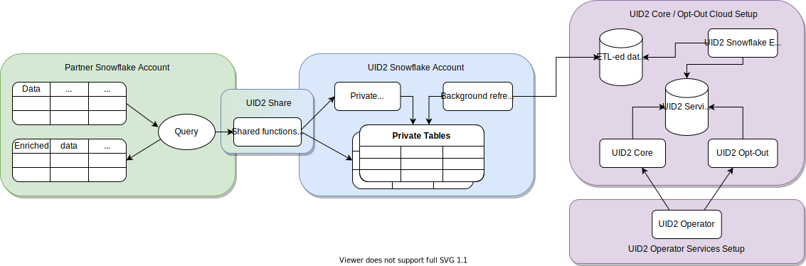

# Snowflake Integration Guide

[Snowflake](https://www.snowflake.com/?lang=ja) はクラウドデータウェアハウスソリューションで、パートナーとして顧客のデータを保存し、UID2 フレームワークとインテグレーションできます。Snowflake を使用することで、UID2 は、機密性の高い個人を識別できる情報(DII)を公開することなく、認可された消費者識別子データを安全に共有できます。消費者識別子データを直接 Operator Web Services に問い合わせることもできますが、Snowflake UID2 とのインテグレーションにより、よりシームレスな体験が可能になります。

次の図は、Snowflake が UID2 インテグレーションプロセスにどのように関わるかを示しています:



| Partner Snowflake Account                                                                                                                                    | UID2 Snowflake Account                                                                                                                                                                                                                                                                               | UID2 Core Opt-out Cloud Setup                                                                                                                                                                                                    |
| :----------------------------------------------------------------------------------------------------------------------------------------------------------- | :--------------------------------------------------------------------------------------------------------------------------------------------------------------------------------------------------------------------------------------------------------------------------------------------------- | :------------------------------------------------------------------------------------------------------------------------------------------------------------------------------------------------------------------------------- |
| パートナーは、Snowflake アカウントを設定してデータをホストし、UID2 Share を通じて関数やビューを使うことで、UID2 インテグレーションに関与できます。 | Snowflake アカウントでホストされている UID2 インテグレーションでは、プライベートテーブルからデータを引き出す認可をされた関数とビューへのアクセスが許可されます。プライベートテーブルにはアクセスできません。UID2 Share では、UID2 関連のタスクを実行するために必要な重要なデータのみが公開されます。 | ETL (Extract Transform Load) ジョブは、UID2 Core/Optout Snowflake ストレージを常に更新し、UID2 Operator Web Services を動かす内部データを提供します。Operator Web Services で使用されるデータは、UID2 Share からも入手できます。 |
| Shared 関数とビューを使用する場合、Snowflake にトランザクションのコストを支払います。                                                                        | UID2 Snowflake アカウントで保護されたこれらのプライベートテーブルは、UID2 関連のタスクを完了するために使用される内部データを保持する UID2 Core/Optout Snowflake ストレージと自動的に同期されます。                                                                                                   |                                                                                                                                                                                                                                  |

## Access the UID2 Shares

UID2 Share へのアクセスは、[Snowflake Data Marketplace](https://www.snowflake.com/data-marketplace/)を通して行います。ここでは、選択した UID2 個別リストに基づき、特定のデータセットをリクエストできます。現在、Snowflake Data Marketplace では、広告主/ブランド向けとデータプロバイダー向けの 2 種類の UID2 専用リスティングが提供されています。

> IMPORTANT: データをリクエストするには、Snowflake アカウントに`ACCOUNTADMIN`ロール権限が必要です。

UID2 Share へのアクセスを要求するには、次の手順を実行します。

1. Snowflake Data Marketplace にログインし、関心のある UID2 ソリューションを選択します:
   - [Unified ID 2.0 Advertiser Identity Solution](https://app.snowflake.com/marketplace/listing/GZT0ZRYXTMV)
   - [Unified ID 2.0 Data Provider Identity Solution](https://app.snowflake.com/marketplace/listing/GZT0ZRYXTN0)
2. **パーソナライズドデータ** セクションで、**データのリクエスト** をクリックします。
3. 画面の指示にしたがって、連絡先やその他の必要な情報を確認し、提供します。
4. The Trade Desk の既存顧客で _Advertiser_ Identity Solution に興味がある場合は、データリクエストフォームの **Message** 欄に The Trade Desk が発行したパートナー ID および広告主 ID を記載してください。
5. フォームを送信します。

リクエストを受け取った後、UID2 Administrator が適切なアクセス方法をご連絡します。Snowflake でのデータリクエストの管理について詳しくは、[Snowflake documentation](https://docs.snowflake.com/en/user-guide/data-marketplace-consumer.html)を参照してください。

## Shared Objects

選択した UID2 ソリューションに関係なく、以下の関数を使って単一または複数のメールアドレスやメールアドレスハッシュを UID2 にマッピングできます:

- `FN_T_UID2_IDENTITY_MAP_EMAIL` (See [Map Email Addresses](#map-email-addresses))
- `FN_T_UID2_IDENTITY_MAP_EMAIL_HASH` (See [Map Email Address Hashes](#map-email-address-hashes))

再生成が必要な UID2 を特定するには、UID Share から `UID2_SALT_BUCKETS` ビューを使用します。詳しくは、[Regenerate UID2s](#regenerate-uid2s) を参照してください。

### Database and Schema Names

以下のセクションでは、各ソリューションのクエリ例を示します。これらは、データベースとスキーマ名の変数を除けば、同じものです:

```
{DATABASE_NAME}.{SCHEMA_NAME}
```

例:

```
select UID2, BUCKET_ID from table({DATABASE_NAME}.{SCHEMA_NAME}.FN_T_UID2_IDENTITY_MAP_EMAIL('validate@email.com'));
```

すべてのクエリ例では、各名前変数に以下のデフォルト値を使用しています:

| Variable          | Advertiser Solution Default Value | Data Provider Solution Default Value | Comments                                                                                                                                               |
| :---------------- | :-------------------------------- | :----------------------------------- | :----------------------------------------------------------------------------------------------------------------------------------------------------- |
| `{DATABASE_NAME}` | `UID2_PROD_ADV_SH`                | `UID2_PROD_DP_SH`                    | 必要であれば、選択した UID2 Share へのアクセス権が与えられた後に新しいデータベースを作成する際に、デフォルトのデータベース名を変更できます。 |
| `{SCHEMA_NAME}`   | `ADV`                             | `DP`                                 | これはイミュータブルです。                                                                                                                             |

### Map Email Addresses

単一のメールアドレスまたは複数のメールアドレスを、対応する UID2 とセカンドレベルのソルトバケット ID にマッピングするには、 `FN_T_UID2_IDENTITY_MAP_EMAIL` 関数を使用します。これはメールアドレスを引数にとり、UID2 [Email Address Normalization](../getting-started/gs-normalization-encoding#email-address-normalization) の規則にしたがって正規化します。

| Argument | Data Type    | Description                                                         |
| :------- | :----------- | :------------------------------------------------------------------ |
| `EMAIL`  | varchar(128) | UID2 およびセカンドレベルのバケット ID に対応させるメールアドレス。 |

クエリに成功すると、指定されたメールアドレスについて以下の情報が返されます。

> NOTE: リクエストに含まれる無効なメールアドレスに対しては、`NULL`値が返されます。

| Column Name | Data Type | Description                                                                                                                              |
| :---------- | :-------- | :--------------------------------------------------------------------------------------------------------------------------------------- |
| `UID2`      | TEXT      | メールアドレスに関連付けられた UID2 です。                                                                                               |
| `BUCKET_ID` | TEXT      | UID2 を生成するために使用する、セカンドレベルのソルトバケット ID です。この ID は `UID2_SALT_BUCKETS` ビューのバケット ID に対応します。 |

#### Single Email Mapping Request Example

次のクエリは、[デフォルトのデータベースとスキーマ名](#database-and-schema-names) を使用して、単一のメールアドレスをマッピングする方法を示しています。

##### Advertiser Solution Query

```
select UID2, BUCKET_ID from table(UID2_PROD_ADV_SH.ADV.FN_T_UID2_IDENTITY_MAP_EMAIL('validate@email.com'));
```

##### Data Provider Solution Query

```
select UID2, BUCKET_ID from table(UID2_PROD_DP_SH.DP.FN_T_UID2_IDENTITY_MAP_EMAIL('validate@email.com'));
```

##### Results

```
+----------------------------------------------+------------+
| UID2                                         | BUCKET_ID  |
+----------------------------------------------+------------+
| 2ODl112/VS3x2vL+kG1439nPb7XNngLvOWiZGaMhdcU= | ad1ANEmVZ  |
+----------------------------------------------+------------+
```

#### Multiple Emails Mapping Request Example

以下のクエリは、[デフォルトのデータベースとスキーマ名](#database-and-schema-names) を使用して、複数のメールアドレスをマッピングする方法を示しています。

##### Advertiser Solution Query

```
select a.ID, a.EMAIL, m.UID2, m.BUCKET_ID from AUDIENCE a LEFT JOIN(
    select ID, t.* from AUDIENCE, lateral UID2_PROD_ADV_SH.ADV.FN_T_UID2_IDENTITY_MAP_EMAIL(EMAIL) t) m
    on a.ID=m.ID;
```

##### Data Provider Solution Query

```
select a.ID, a.EMAIL, m.UID2, m.BUCKET_ID from AUDIENCE a LEFT JOIN(
    select ID, t.* from AUDIENCE, lateral UID2_PROD_DP_SH.DP.FN_T_UID2_IDENTITY_MAP_EMAIL(EMAIL) t) m
    on a.ID=m.ID;
```

##### Results

次の表は、不適切にフォーマットされたメールアドレスのための `NULL` 値を含む、応答の各項目です。

```
+----+--------------------+----------------------------------------------+------------+
| ID | EMAIL              | UID2                                         | BUCKET_ID  |
+----+--------------------+----------------------------------------------+------------+
|  1 | validate@email.com | 2ODl112/VS3x2vL+kG1439nPb7XNngLvOWiZGaMhdcU= | ad1ANEmVZ  |
|  2 | test@uidapi.com    | IbW4n6LIvtDj/8fCESlU0QG9K/fH63UdcTkJpAG8fIQ= | a30od4mNRd |
|  3 | NULL               | NULL                                         | NULL       |
+----+--------------------+----------------------------------------------+------------+
```

### Map Email Address Hashes

1 つあるいは複数のメールアドレスハッシュを、対応する UID2 とセカンドレベルのソルトバケット ID にマッピングするには、メールアドレスハッシュを引数にとる `FN_T_UID2_IDENTITY_MAP_EMAIL_HASH` 関数を使用します。

| Argument     | Data Type    | Description                                                                                                                                                                                                                                                                                                                |
| :----------- | :----------- | :------------------------------------------------------------------------------------------------------------------------------------------------------------------------------------------------------------------------------------------------------------------------------------------------------------------------- |
| `EMAIL_HASH` | varchar(128) | ユーザーの正規化されたメールアドレスの SHA-256 ハッシュを Base64 でエンコードしたものです。[Email Address Normalization](../getting-started/gs-normalization-encoding#email-address-normalization) ルールを用いて、メールアドレスハッシュが正しくフォーマットされていることを確認します。正規化されたメールアドレスから計算されたハッシュを使用します。 |

問い合わせに成功すると、指定されたメールアドレスハッシュについて、以下の情報が返されます。

> NOTE: リクエストに含まれる不適切な形式のメールアドレスハッシュに対しては、 `NULL` 値が返されます。

| Column Name | Data Type | Description                                                                                                                                  |
| :---------- | :-------- | :------------------------------------------------------------------------------------------------------------------------------------------- |
| `UID2`      | TEXT      | メールアドレスに関連付けられた UID2 です。                                                                                                   |
| `BUCKET_ID` | TEXT      | UID2 を生成するために使用された、セカンドレベルのソルトバケットの ID です。この ID は `UID2_SALT_BUCKETS` ビューのバケット ID に対応します。 |

#### Single Email Hash Mapping Request Example

以下のクエリは、[デフォルトのデータベースとスキーマ名](#database-and-schema-names) を使用して、単一のメールアドレスハッシュをマップする方法を示しています。

##### Advertiser Solution Query

```
select UID2, BUCKET_ID from table(UID2_PROD_ADV_SH.ADV.FN_T_UID2_IDENTITY_MAP_EMAIL(BASE64_ENCODE(SHA2_BINARY('validate@email.com', 256))));
```

##### Data Provider Solution Query

```
select UID2, BUCKET_ID from table(UID2_PROD_DP_SH.DP.FN_T_UID2_IDENTITY_MAP_EMAIL(BASE64_ENCODE(SHA2_BINARY('validate@email.com', 256))));
```

##### Results

```
+----------------------------------------------+------------+
| UID2                                         | BUCKET_ID  |
+----------------------------------------------+------------+
| 2ODl112/VS3x2vL+kG1439nPb7XNngLvOWiZGaMhdcU= | ad1ANEmVZ  |
+----------------------------------------------+------------+
```

#### Multiple Email Hashes Mapping Request Example

以下のクエリは、[デフォルトのデータベースとスキーマ名](#database-and-schema-names) を使用して、複数のメールアドレスハッシュをマッピングする方法を示しています。

##### Advertiser Solution Query

```
select a.ID, a.EMAIL_HASH, m.UID2, m.BUCKET_ID from AUDIENCE a LEFT JOIN(
    select ID, t.* from AUDIENCE, lateral UID2_PROD_ADV_SH.ADV.FN_T_UID2_IDENTITY_MAP_EMAIL_HASH(EMAIL_HASH) t) m
    on a.ID=m.ID;
```

##### Data Provider Solution Query

```
select a.ID, a.EMAIL_HASH, m.UID2, m.BUCKET_ID from AUDIENCE a LEFT JOIN(
    select ID, t.* from AUDIENCE, lateral UID2_PROD_DP_SH.DP.FN_T_UID2_IDENTITY_MAP_EMAIL_HASH(EMAIL_HASH) t) m
    on a.ID=m.ID;
```

##### Results

次の表は、不適切にフォーマットされたメールアドレスハッシュのための `NULL` 値を含む、応答の各項目を示しています。

```
+----+----------------------------------------------+----------------------------------------------+------------+
| ID | EMAIL_HASH                                   | UID2                                         | BUCKET_ID  |
+----+----------------------------------------------+----------------------------------------------+------------+
|  1 | LdhtUlMQ58ZZy5YUqGPRQw5xUMS5dXG5ocJHYJHbAKI= | 2ODl112/VS3x2vL+kG1439nPb7XNngLvOWiZGaMhdcU= | ad1ANEmVZ  |
|  2 | NULL                                         | NULL                                         | NULL       |
|  3 |/XJSTajB68SCUyuc3ePyxSLNhxrMKvJcjndq8TuwW5g=  | IbW4n6LIvtDj/8fCESlU0QG9K/fH63UdcTkJpAG8fIQ= | a30od4mNRd |
+----+----------------------------------------------+----------------------------------------------+------------+
```

### Regenerate UID2s

`UID2_SALT_BUCKETS` ビュークエリは、セカンドレベルのソルトバケットが最後に更新された日時を返します。セカンドレベルのソルトは UID2 を生成する際に使用されます。バケット内のソルトが更新されると、それまで生成されていた UID2 が古くなり、同じユーザーに対して他者が生成した UID2 とは一致しなくなります。

どの UID2 が再生成を必要としているかを判断するには、生成されたときのタイムスタンプを、セカンドレベルのソルトバケット更新の最新のタイムスタンプと比較します。

| Column Name            | Data Type     | Description                                                                                                                                                                                                    |
| :--------------------- | :------------ | :------------------------------------------------------------------------------------------------------------------------------------------------------------------------------------------------------------- |
| `BUCKET_ID`            | TEXT          | セカンドレベルのソルトバケットの ID です。この ID は、ID マップ関数が返す `BUCKET_ID` と同じものです。`BUCKET_ID` をキーとして、関数呼び出しの結果とこのビュー呼び出しの結果の間のジョインクエリを実行します。 |
| `LAST_SALT_UPDATE_UTC` | TIMESTAMP_NTZ | バケット内のソルトが最後に更新された時刻です。この値は UTC タイムゾーンで表現されます。                                                                                                                        |

次の例は、入力テーブルと、テーブル内の UID2 のうち、のソルトの更新により再生成が必要なものを見つけるためのクエリを示しています。

#### Targeted Input Table

```
select * from AUDIENCE_WITH_UID2;
```

```
+----+--------------------+----------------------------------------------+------------+-------------------------+
| ID | EMAIL              | UID2                                         | BUCKET_ID  | LAST_UID2_UPDATE_UTC    |
+----+--------------------+----------------------------------------------+------------+-------------------------+
|  1 | validate@email.com | 2ODl112/VS3x2vL+kG1439nPb7XNngLvOWiZGaMhdcU= | ad1ANEmVZ  | 2021-03-01 00:00:00.000 |
|  2 | test1@uidapi.com   | Q4A5ZBuBCYfuV3Wd8Fdsx2+i33v7jyFcQbcMG/LH4eM= | ad1ANEmVZ  | 2021-03-03 00:00:00.000 |
|  3 | test2@uidapi.com   | NULL                                         | NULL       | NULL                    |
+----+--------------------+----------------------------------------------+------------+-------------------------+
```

欠落しているまたは古い UID2 を見つけるには、[デフォルトのデータベースとスキーマ名](#database-and-schema-names) を使用する次のクエリ例を使用します。

##### Advertiser Solution Query

```
select a.*, b.LAST_SALT_UPDATE_UTC
  from AUDIENCE_WITH_UID2 a LEFT OUTER JOIN UID2_PROD_ADV_SH.ADV.UID2_SALT_BUCKETS b
  on a.BUCKET_ID=b.BUCKET_ID
  where a.LAST_UID2_UPDATE_UTC < b.LAST_SALT_UPDATE_UTC or a.UID2 IS NULL;
```

##### Data Provider Solution Query

```
select a.*, b.LAST_SALT_UPDATE_UTC
  from AUDIENCE_WITH_UID2 a LEFT OUTER JOIN UID2_PROD_DP_SH.DP.UID2_SALT_BUCKETS b
  on a.BUCKET_ID=b.BUCKET_ID
  where a.LAST_UID2_UPDATE_UTC < b.LAST_SALT_UPDATE_UTC or a.UID2 IS NULL;
```

##### Results

以下の表は、レスポンスに含まれる各項目を表たものです。以下の ID1 の例で示すように、結果には EMAIL、`UID2`、`BUCKET_ID`、`LAST_UID2_UPDATE_UTC`、`LAST_SALT_UPDATE_UTC`が含まれます。ID 2 は、対応する UID2 が最後のバケット更新の後に生成されたため、情報は返されません。ID 3 は、UID2 が存在しないため、`NULL`値が返されます。

```
+----+--------------------+----------------------------------------------+------------+-------------------------+-------------------------+
| ID | EMAIL              | UID2                                         | BUCKET_ID  | LAST_UID2_UPDATE_UTC    | LAST_SALT_UPDATE_UTC    |
+----+--------------------+----------------------------------------------+------------+-------------------------+-------------------------+
|  1 | validate@email.com | 2ODl112/VS3x2vL+kG1439nPb7XNngLvOWiZGaMhdcU= | ad1ANEmVZ  | 2021-03-01 00:00:00.000 | 2021-03-02 00:00:00.000 |
|  3 | test2@uidapi.com   | NULL                                         | NULL       | NULL                    | NULL                    |
+----+--------------------+----------------------------------------------+------------+-------------------------+-------------------------+
```
