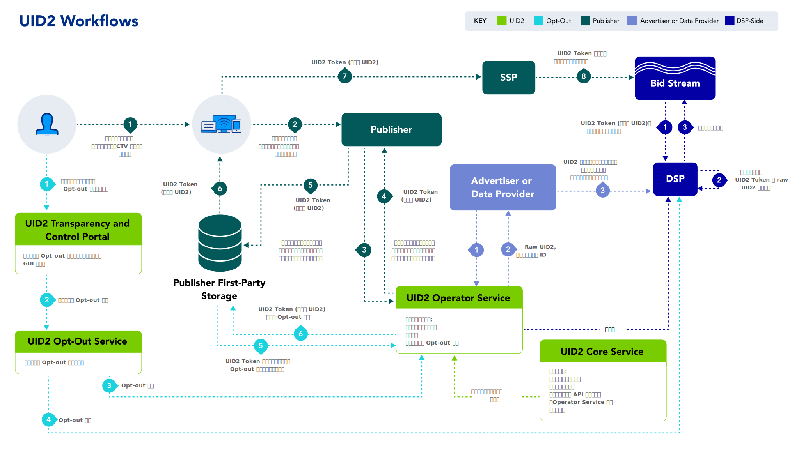

import Link from '@docusaurus/Link';

# Unified ID 2.0 Overview

UID2 は、広告エコシステム全体の多くの [参加者](overviews/participants-overview.md#uid2-external-participants) がオープンインターネット上で広告機会を得るための決定論的な ID を可能にするフレームワークです。UID2 フレームワークにより、パブリッシャーのウェブサイト、モバイルアプリ、Connected TV (CTV)アプリからのログイン体験が、プログラマティックワークフローを通じて収益化できるようになります。独自の名前空間を持つオープンソースのスタンドアローンソリューションとして構築されたこのフレームワークは、ローカル市場の要件に合わせて設計された透明性とプライバシー制御をユーザーに提供します。

:::note
「UID2」という用語は、フレームワークと実際の識別子のいずれかを指すことがあります。特に断りのない限り、このページでは UID2 フレームワークの概要を説明します。
:::

### Guiding Principles

UID2 フレームワークは、以下の原則を基本としています:

- **First-party relationships**: UID2 により、広告主はオープンインターネット上のパブリッシャーウェブサイトでファーストパーティデータを有効にできます。

- **Non-proprietary (universal) standard**: 適切な参加契約を締結した広告エコシステムのすべての [参加者](overviews/participants-overview.md#uid2-external-participants) が UID2 にアクセスできます。

- **Open source**: [UID2 Component Services](overviews/participants-overview.md#uid2-component-services) のソースコードは一般に公開されています。

- **Interoperable**: このフレームワークにより、他の ID ソリューション (商用およびプロプライエタリ) が UID2 Token をインテグレーションし、提供できるようになります。

- **Secure and encrypted data**: UID2 は、ユーザーやその他の参加者のデータを保護するために、複数のセキュリティレイヤを利用しています。

- **Consumer control**: 消費者はいつでも [Transparency and Control Portal](https://www.transparentadvertising.com/) を通じて UID2 からの脱退を選択できます。

### Technical Design Principles

UID2 フレームワークは、以下の技術原則に基づいて構築されています:

- **Distributed integration**: 複数の認証済みインテグレーションパスにより、パブリッシャー、広告主、サードパーティデータプロバイダーが UID2 Token を管理および交換するためのオプションが提供されます。

- **Decentralized storage**: このフレームワークでは、個人に関するデータ (<Link href="ref-info/glossary-uid#gl-dii">DII</Link>) のマッピングを一元的に保管することはありません。すべての参加者が自分自身のデータのみを管理します。

- **Lean infrastructure**: UID2 システムは軽量で安価に運用できます。

- **Internet scale**: UID2 インフラは、継続的に増加する[参加者](overviews/participants-overview.md#uid2-external-participants) のニーズに対応し、特定の地域の性能要求に応えるために拡張できます。

- **Self-reliant**: UID2 は、リアルタイムビディング (RTB) データの処理において外部サービスに依存しません。

<!-- ## Elements of the UID2 Infrastructure

以下のセクションでは、UID2 フレームワークのインフラストラクチャの主要な要素について説明し、図解します:

- [UID2 Identifier Types (UID2 識別子タイプ)](#uid2-identifier-types)
- [Components (コンポーネント)](#components)
- [Participants (参加者)](#participants)
- [Workflows (ワークフロー)](#workflows) -->

<!-- ### UID2 Identifier Types

UID2 は、メールアドレスや電話番号など、<Link href="ref-info/glossary-uid#gl-dii">directly identifying information (DII)</Link> を基にした決定論的な ID です。UID2 には、raw UID2 と UID2 Token (Advertising Token とも呼ばれます) の 2 種類があります。次の表で、それぞれのタイプについて説明します。

| ID Type | Shared in Bidstream? | Description |
| :--- | :--- | :--- |
| **Raw UID2** | No | UID2 API または SDK を使用して作成された、暗号化されていない英数字の識別子。ユーザーの検証可能な個人情報(ハッシュ化またはハッシュ化されていないメールアドレスや電話番号など)を入力する。データが漏洩しないように、入力値はハッシュ化されていない場合はハッシュ化され、その後、シークレットの<Link href="ref-info/glossary-uid#gl-salt">ソルト</Link> 値を使用して再度ハッシュ化され、raw UID2 が作成されます。raw UID2を作成するプロセスは、広告主、第三者データプロバイダー、およびデマンドサイドプラットフォーム（DSP）が保存できる安全で不可視の値を作成するように設計されています。 raw UID2 は大文字と小文字を区別します。 例: 架空のメールアドレス `user@example.com` の raw UID2 をリクエストした結果、次の値が得られました: `E2dxEv3oMBzNHPw5iUVmwH2Hv+60D4AXYe+2ge9U0No=` |
| **UID2 Token (Advertising Token)** | Yes | Raw UID2 を暗号化したものです。UID2 Token は、ハッシュ化またはハッシュ化されていないメールアドレスや電話番号から生成され、raw UID2 に変換された後、ビッドストリームでの保護を確実にするために暗号化されます。 UID2 Token は、パブリッシャーやパブリッシャーサービスプロバイダーが使用するように設計されています。サプライサイドプラットフォーム(SSP)は<Link href="ref-info/glossary-uid#gl-bidstream">ビッドストリーム</Link>で UID2 Token を渡し、DSP はビッドリクエスト時にそれを復号化します。 UID2 Token は大文字と小文字を区別します。 例：`user@example.com`という架空のメールアドレスの UID2 Token をリクエストした結果、次のような値が得られました：  `AAAABrexFHvQVhNJqu+y/ua7rsgShF8e9NUXUJOZFmeFRD8TAsJadaLfOlLkwC5iSxcOKWFD9YwMBzbbcPa92CInba+bcPTaAFNmM2ZpIHgGy6lDcNPzvEnPQh/5fyZ3MD44SX/tHyIXa0R2OBAOLBA1A81r3jefhSsxZdyyBF58KtnaX6UbaeOEaguOfMnJdmhaPeWKj33v7vGfROWtxDWmi6wvGL5lHTX9H6iIZ9i1WSsemYPUgmoDOQeT7nzllJK968OECFj5LkCazDN3pCrYSeuJby9o0fMuSZNxzp6EVzi6XVED4ETtzpcaY0AArzzdh0IXV9MgH8jyg7bJSUWXQG+8kMPZzwbs9EB+7ddAUOLZL/GBna8Hm3Im03EjN3sJ` |

:::note
これらの例で使用されている架空のメールアドレス `user@example.com` に対応する Refresh Token は次のとおりです: `AAAABrexFHvQVhNJqu+y/ua7rsgShF8e9NUXUJOZFmeFRD8TAsJadaLfOlLkwC5iSxcOKWFD9YwMBzbbcPa92CInba+bcPTaAFNmM2ZpIHgGy6lDcNPzvEnPQh/5fyZ3MD44SX/tHyIXa0R2OBAOLBA1A81r3jefhSsxZdyyBF58KtnaX6UbaeOEaguOfMnJdmhaPeWKj33v7vGfROWtxDWmi6wvGL5lHTX9H6iIZ9i1WSsemYPUgmoDOQeT7nzllJK968OECFj5LkCazDN3pCrYSeuJby9o0fMuSZNxzp6EVzi6XVED4ETtzpcaY0AArzzdh0IXV9MgH8jyg7bJSUWXQG+8kMPZzwbs9EB+7ddAUOLZL/GBna8Hm3Im03EjN3sJ`.
::: -->

### Components

詳細については、[UID2 Component Services](overviews/participants-overview.md#uid2-component-services)

<!-- ### Participants 

UID2 は透明で相互運用可能なアプローチにより、広告エコシステム全体、すなわち広告主、パブリッシャー、DSP、SSP、シングルサインオン (SSO)プロバイダー、カスタマーデータプラットフォーム (CDP)、同意管理プロバイダー (CMP)、ID プロバイダー、サードパーティデータプロバイダー、測定プロバイダーなどの多くの参加者に協調フレームワークを提供しています。

次の表は、UID2 [ワークフロー](#workflows)における主要参加者とその役割の一覧です。

| Participant | Role Description |
| :--- | :--- |
| **Core Administrator** | UID2 Core Service およびその他の [コンポーネント](#components) を管理する組織 (現在は The Trade Desk)。たとえば、UID2 Operator に暗号キーとソルトを配布し、Operator や DSP にユーザーのオプトアウトリクエストを送ります。 |
| **Operators** | <Link href="ref-info/glossary-uid#gl-operator-service">Operator Service</Link> (UID2 API 経由で) を実行する組織。オペレーターは、定期的に UID2 Core Service から最新の暗号化キーとソルトを受け取り、<Link href="ref-info/glossary-uid#gl-dii">directly identifying information (DII)</Link> をソルトおよびハッシュ化して raw UID2 を返し、raw UID2 を暗号化して UID2 Token を生成し、UID2 Token の復号キーを配布します。 Public Operator (Open Operator) は、Operator Service のパブリックインスタンスを実行します。たとえば、The Trade Desk は現在、UID2 Framework の Public Operator として機能しており、すべての参加者が利用できます。他の Public Operator が利用可能な場合、参加者はどのオペレーターと連携するかを選択できます。 参加者は誰でも、UID2 を生成および管理する Private Operator になることもできます。 |
| **DSPs**  | DSP は UID2 システムとインテグレーションして、広告主から (ファーストパーティデータとして)、またサードパーティデータプロバイダーから (サードパーティデータとして)UID2 を受け取り、それらを活用してビッドストリーム中の UID2 に対する入札情報を提供します。 |
| **Data Providers** | ユーザーデータを収集し、それを他の UID2 参加者&#8212;たとえば、広告主、ID グラフプロバイダー、サードパーティデータプロバイダー&#8212;にプッシュする組織。 |
| **Advertisers** | さまざまなパブリッシャーサイトでインプレッションを購入し、DSP を使用して、購入する広告インプレッションとその入札価格を決定している組織です。 |
| **Publishers** | UID2 Token を SSP 経由でビッドストリームに伝達する組織 - たとえば、ID プロバイダー、パブリッシャー、SSO プロバイダーなど。パブリッシャーは、SSO プロバイダーか、UID2 と相互運用可能な独立系 ID プロバイダーのいずれかと連携することを選択できます。独立系 ID プロバイダーは、パブリッシャーに代わって UID2 インテグレーションを行えます。 |
| **Consumers** | メールアドレスや電話番号から UID2 Token または raw UID2 を生成したユーザー。消費者は [Transparency and Control Portal](https://www.transparentadvertising.com/) で UID2 をオプトアウトできます。 |

### Workflows

次の表は、UID2 フレームワークの主要な 4 つのワークフローと、その概要へのリンクです。また、各ワークフローの図、インテグレーション手順、FAQ、その他の関連情報を含むインテグレーションガイドへのリンクも掲載しています。

| Workflow | Intended Primary Participants | Integration Guides |
| :--- |:--- |:--- |
| [Workflow for DSPs](overviews/overview-dsps.md#workflow-for-dsps) (Buy-Side) | ビッドストリームで UID2 Token の取引を行う DSP。 | [DSP Integrations](guides/summary-guides#dsp-integrations) を参照。 |
| [Workflow for Advertisers](overviews/overview-advertisers.md#workflow-for-advertisers) and [Workflow for Data Providers](overviews/overview-data-providers.md#workflow-for-data-providers) | ユーザーデータを収集し、DSPにプッシュする組織。 | [Advertiser/Data Provider Integrations](guides/summary-guides#advertiserdata-provider-integrations) を参照。 |
| [Workflow for Publishers](overviews/overview-publishers.md#workflow-for-publishers) | UID2 Token を SSP を介してビッドストリームに渡す組織。 NOTE: パブリッシャーは、Prebid を使用してインテグレーションするか、SDK for JavaScrip を使用するか、SDK を使用せずに独自の server-only インテグレーションを行うかを選択できます。 | [Publisher Integrations](guides/summary-guides#publisher-integrations) を参照。 |
| [Opt-Out Workflow](getting-started/gs-opt-out.md#opt-out-workflow) | パブリッシャーや SSO プロバイダー、その他の ID プロバイダーと関わる消費者。 | N/A |

次の図は、4 つのワークフローをすべてまとめたものです。各ワークフローについて、[参加者](overviews/participants-overview.md#uid2-external-participants)、[コンポーネント](#components)、[UID2 識別子タイプ](#uid2-identifier-types)、および番号付きステップが色分けされています。

 -->

## FAQs

[Frequently Asked Questions](getting-started/gs-faqs.md) を参照してください.

## License
All work and artifacts are licensed under the [Apache License, Version 2.0](http://www.apache.org/licenses/LICENSE-2.0.txt).
