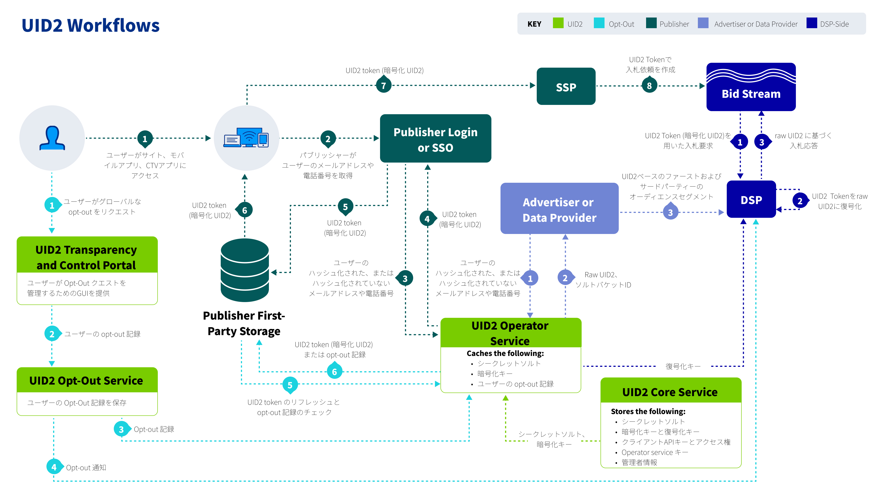

# Unified ID 2.0 Overview

このページでは、Unified ID 2.0 (UID2) フレームワークの概要について説明しています。

<!-- It includes the following:
- [Introduction](#introduction)
  - [Guiding Principles](#guiding-principles)
  - [Technical Design Principles](#technical-design-principles)
- [Elements of the UID2 Infrastructure](#elements-of-the-uid2-infrastructure)
  - [UID2 Identifier Types](#uid2-identifier-types)
  - [Components](#components)
  - [Participants](#participants)
  - [Workflows](#workflows)
- [FAQs](#faqs)
- [License](#license) -->

## Introduction

UID2 は、広告エコシステム全体の多くの [参加者](#participants) にとって、オープンインターネット上の広告機会に対する決定論的な ID を可能にするフレームワークです。UID2 フレームワークにより、パブリッシャーのウェブサイト、モバイルアプリ、Connected TV (CTV)アプリからのログイン体験が、プログラマティックワークフローを通じて収益化できるようになります。独自の名前空間を持つオープンソースのスタンドアローンソリューションとして構築されたこのフレームワークは、ローカル市場の要件に合わせて設計された透明性とプライバシー制御をユーザーに提供します。

> NOTE: 「UID2」という用語は、フレームワークと実際の識別子のいずれかを指すことがあります。特に断りのない限り、このページでは UID2 フレームワークの概要を説明します。

### Guiding Principles

UID2 フレームワークは、以下の原則を基本としています:

- **First-party relationships**: UID2 により、広告主はオープンインターネット上のパブリッシャーウェブサイトでファーストパーティデータを有効にできます。

- **Non-proprietary (universal) standard**: 行動規範に従うことに同意した広告エコシステムのすべての [参加者](#participants) は、UID2 にアクセスできます。

- **Open source**: UID2 の[コンポーネント](#components)のソースコードは一般に公開されています。

- **Interoperable**: このフレームワークにより、他の ID ソリューション (商用およびプロプライエタリ)が UID2 Token をインテグレーションし、提供できるようになります。

- **Secure and encrypted data**: UID2 は、ユーザーやその他の参加者のデータを保護するために、複数のセキュリティレイヤを利用しています。

- **Consumer control**: 消費者はいつでも [Transparency and Control Portal](https://www.transparentadvertising.com/) を通じて UID2 からの脱退を選択できます。

### Technical Design Principles

UID2 フレームワークは、以下の技術原則に基づいて構築されています:

- **Distributed integration**: 複数の認証済みインテグレーションパスにより、パブリッシャー、広告主、サードパーティデータプロバイダーが UID2 Token を管理および交換するためのオプションが提供されます。

- **Decentralized storage**: このフレームワークでは、個人データのマッピングを一元的に保管することはありません。すべての参加者が自分自身のデータのみを管理します。

- **Lean infrastructure**: UID2 システムは軽量で安価に運用できます。

- **Internet scale**: UID2 インフラは、継続的に増加する[参加者](#participants)のニーズに対応し、特定の地域の性能要求に応えるために拡張できます。

- **Self-reliant**: UID2 は、リアルタイム・ビッディング (RTB)データの処理において外部サービスに依存しません。

## Elements of the UID2 Infrastructure

以下のセクションでは、UID2 フレームワークのインフラストラクチャの主要な要素について説明し、図解します:

- [UID2 Identifier Types (UID2 識別子タイプ)](#uid2-identifier-types)
- [Components (コンポーネント)](#components)
- [Participants (参加者)](#participants)
- [Workflows (ワークフロー)](#workflows)

### UID2 Identifier Types

UID2 は、メールアドレスや電話番号など、[directly identifying information (DII)](ref-info/glossary-uid.md#gl-dii) を基にした決定論的な ID です。UID2 には、raw UID2 と UID2 Token (Advertising Token とも呼ばれます)の 2 種類があります。以下の表で、それぞれのタイプについて説明します。

| ID Type | Shared in Bid Stream? | Description |
| :--- | :--- | :--- |
| **Raw UID2** | No | UID2 API または SDK を通じて、ハッシュ化またはハッシュ化されていないメールアドレスや電話番号など、ユーザーの検証可能な個人データを入力として作成される暗号化されていない英数字の識別子です。 元の個人データの再識別を防ぐために、入力値はハッシュ化およびソルト化されて raw UID2 が作成されます。raw UID2 を作成するプロセスは、広告主、第三者データプロバイダー、およびデマンドサイドプラットフォーム (DSP)が保管できる、安全で不透明な値を作成するように設計されています。 raw UID2 は大文字と小文字を区別します。                                                                   |
| **UID2 Token (Advertising Token)** | Yes | raw UID2 を暗号化したものです。UID Token は、ハッシュ化またはハッシュ化されていないメールアドレスや電話番号から生成され、raw UID2 に変換された後、ビッドストリームでの保護を確実にするために暗号化されます。 UID2 Token は、パブリッシャーやパブリッシャーサービスプロバイダーが使用するよう設計されています。 UID2 Token は、パブリッシャーまたはパブリッシャーサービスプロバイダーが使用するように設計されています。サプライサイドプラットフォーム (SSP)はビッドストリームで UID2 Token を渡し、DSP は入札要求時にそれを復号化します。 UID2 Token は大文字と小文字を区別します。 |

### Components

UID2 フレームワークは以下のコンポーネントで構成されており、現在、すべて The Trade Desk が管理しています。

| Component | Description |
| :--- | :--- |
| **Core Service** | UID2エコシステムのソルト、暗号化キー、その他の関連データへのアクセスを管理する一元的なサービスです。 |
| **Operator Service** | UID2 Core Service からの暗号鍵とソルトの管理・保管、ユーザーの個人情報のハッシュ化、raw UID2 の暗号化、UID2 Token の復号を可能にするサービスです。 Open Operator は、オペレーターサービスのパブリックインスタンスを実行し、関連するすべての UID2 参加者が利用できるようにします。また、オペレーターサービスのプライベートなインスタンスを自分たちだけのために実行する Closed Operator も存在します。どのインスタンスも、誰がサービスを運営するかに関わらず、重要な UID2 データを安全に保ち、相互運用できるように保護設計されています。 |
| **Opt-Out Service** | ユーザーのオプトアウトリクエストを管理・保存し、パブリッシャー、オペレーターのサービスインスタンス、DSP に配信するグローバルサービスです。 |
| **Transparency and Control Portal** | ユーザー向けウェブサイト [https://www.transparentadvertising.com/](https://www.transparentadvertising.com/) では、消費者がいつでも UID2 からの脱退を選択できるようになっています。 |

### Participants

UID2 は透明で相互運用可能なアプローチにより、広告エコシステム全体、すなわち広告主、パブリッシャー、DSP、SSP、シングルサインオン (SSO)プロバイダー、カスタマーデータプラットフォーム (CDP)、同意管理プロバイダー (CMP)、ID プロバイダー、サードパーティデータプロバイダー、測定プロバイダーなどの多くの参加者に協調フレームワークを提供しています。

以下の表は、UID2 [ワークフロー](#workflows)における主要参加者とその役割の一覧です。

| Participant | Role Description |
| :--- | :--- |
| **Core Administrator** | UID2 Core Service およびその他の [コンポーネント](#components) を管理する組織 (現在は The Trade Desk)。例えば、UID2 Operator に暗号キーとソルトを配布し、Operator や DSP にユーザーのオプトアウトリクエストを送ります。 |
| **Operators** | Operator Service を実行する組織 (UID2 API 経由)。Operator は、UID2 Core Service から暗号化キーとソルトを受け取って保管し、個人データをソルトおよびハッシュ化して UID2 Token を返し、raw UID2 を暗号化して UID2 Token 生成し、UID2 Token 復号鍵を配布します。 Open Operator は、オペレーターサービスのパブリックインスタンスを実行しています。例えば、The Trade Desk は現在、UID2 フレームワークのOpen Operatorとして、すべての参加者が利用できるようになっています。他のOpen Operatorが利用可能な場合、参加者はどのオペレーターと作業するかを選択できます。 どの参加者も、UID2 を生成および管理する Closed Operator になることを選択することも可能です。 |
| **DSPs**  | DSP は UID2 システムとインテグレーションして、広告主から (ファーストパーティデータとして)、またサードパーティデータプロバイダーから (サードパーティデータとして)UID2 を受け取り、それらを活用してビッドストリーム中の UID2 に対する入札情報を提供します。 |
| **Data Providers** | ユーザーデータを収集し、DSP にプッシュする組織 - 例えば、広告主、ID グラフプロバイダー、サードパーティデータプロバイダーなどです。 |
| **Advertisers** | さまざまなパブリッシャーサイトでインプレッションを購入し、DSP を使用して、購入する広告インプレッションとその入札価格を決定している組織です。 |
| **Publishers** | UID2 Token を SSP 経由でビッドストリームに伝達する組織 - 例えば、ID プロバイダー、パブリッシャー、SSO プロバイダーなど。パブリッシャーは、SSO プロバイダーか、UID2 と相互運用可能な独立系 ID プロバイダーのいずれかと連携することを選択できます。独立系 ID プロバイダーは、パブリッシャーに代わって UID2 インテグレーションを行えます。 |
| **Consumers** | パブリッシャーまたはその ID プロバイダーと関わるユーザー。ユーザーは、[Transparency and Control Portal](https://www.transparentadvertising.com/) で UID2 をオプトアウトできます。 |

### Workflows

以下の表は、UID2 フレームワークの主要な 4 つのワークフローと、その概要へのリンクです。また、各ワークフローの図、インテグレーション手順、FAQ、その他の関連情報を含むインテグレーションガイドへのリンクも掲載しています。

| Workflow | Intended Primary Participants | Integration Guides |
| :--- |:--- |:--- |
| [Workflow for DSPs](overviews/overview-dsps.md#workflow-for-dsps) (Buy-Side) | ビッドストリームで UID2 Token の取引を行う DSP。 | [DSP Integrations](guides/summary-guides#dsp-integrations) を参照。 |
| [Workflow for Advertisers](overviews/overview-advertisers.md#workflow-for-advertisers) and [Workflow for Data Providers](overviews/overview-data-providers.md#workflow-for-data-providers) | ユーザーデータを収集し、DSPにプッシュする組織。 | [Advertiser/Data Provider Integrations](guides/summary-guides#advertiserdata-provider-integrations) を参照。 |
| [Workflow for Publishers](overviews/overview-publishers.md#workflow-for-publishers) | UID2 Token を SSP を介してビッドストリームに渡す組織。  NOTE: パブリッシャーは、Prebid を使用してインテグレーションするか、UID2 SDK for JavaScrip を使用するか、SDK を使用せずに独自の server-only インテグレーションを行うかを選択できます。 | [Publisher Integrations](guides/summary-guides#publisher-integrations) を参照。 |
| [Opt-Out Workflow](getting-started/gs-opt-out.md#opt-out-workflow) | パブリッシャーや SSO プロバイダー、その他の ID プロバイダーと関わる消費者。 | N/A |

次の図は、4 つのワークフローをすべてまとめたものです。各ワークフローについて、[参加者](#participants)、[コンポーネント](#components)、[UID2 識別子タイプ](#uid2-identifier-types)、および番号付きステップが色分けされています。

## FAQs

[Frequently Asked Questions](getting-started/gs-faqs.md)を参照してください.

## License

All work and artifacts are licensed under the [Apache License, Version 2.0](http://www.apache.org/licenses/LICENSE-2.0.txt).
