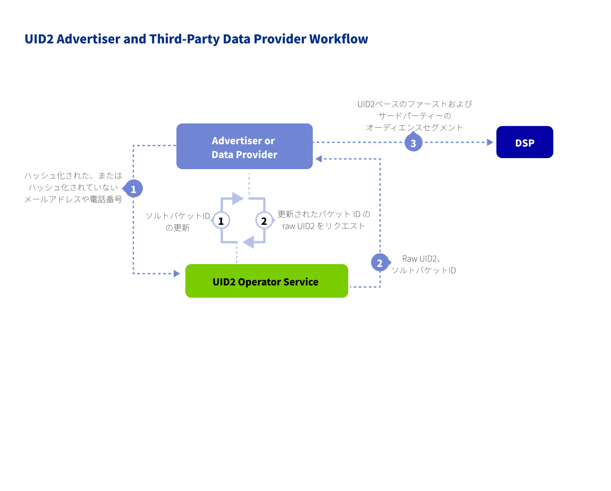

広告主は、Unified ID 2.0によってファーストパーティデータ戦術をアップグレードし、1つの識別子でデバイスをまたいだオムニチャネルキャンペーンを実現できます。

以下のセクションでは、UID2 を採用する広告主のためのワークフロー、インテグレーションタイプ、ドキュメントを説明します。

## Audience

このページは、ファーストパーティデータを活用して、より耐久性のあるアイデンティティ戦略や、より優れたアドレサビリティを実現したい広告主向けのページです。

## Benefits of UID2 for Advertisers

広告戦略の一部として UID2 を使用することで得られるメリットの一部を次に示します:
- メディア購入プラットフォームで、プライバシーに配慮した形の CRM データを使用することができます。
- 世帯および個人レベルでの ID 解決を簡素化します。
- チャンネルやデバイスを問わず、フリケンシーや抑制されたオーディエンスを管理します。
- クッキーが存在しないコネクテッドTVやモバイルアプリでの ID ユースケースをサポートします。
- キャンペーンをより総合的にターゲットし測定します。
- 消費者のプライバシー管理を改善することを目的として、オプトアウトを提供します。

## Resources

広告主が UID2 を実装するために、以下のドキュメントリソースを用意しています。

| Integration Type| Documentation | Content Description | Audience |
| :--- | :--- | :--- | :--- |
| ユーザーデータを収集し、それを他の UID2 参加者にプッシュする組織のためのインテグレーション手順 | [Advertiser/Data Provider Integration Guide](../guides/advertiser-dataprovider-guide.md) | 広告主とデータプロバイダーのためのインテグレーションガイドで、オーディエンスの構築とターゲティングのための ID マッピングのためのインテグレーションワークフローを網羅しています。 | Advertisers Data Providers |
| Snowflake | [Snowflake Integration Guide](../guides/snowflake_integration.md) | Snowflakeでメールアドレスから UID を生成する手順です。 | Advertisers Data Providers |

## Workflow for Advertisers

以下の図は、広告主が UID2 を実装するための UID2 ワークフローです。

## Getting Started

次の手順で始めます:

1. [アクセスリクエスト](/request-access)ページにあるフォームに記入して、UID2へのアクセスをリクエストします。

   担当者が連絡し、ニーズを伺い、適切なステップをアドバイスします。
1. [参加者](../intro.md#participants)の役割を決めます。
1. どの実装オプションを使用するかを決めます。
1. 認証情報を受け取り（[API keys](../getting-started/gs-api-keys.md) を参照）、選択したオプションのインテグレーションガイドの指示に従います。

     Note：リクエストメッセージは必ずUID2まで暗号化してください。詳細は、[リクエストの暗号化とレスポンスの復号化](../getting-started/gs-encryption-decryption.md)を参照してください。
1. テストします。
1. 本番稼働します。

## Frequently Asked Questions for Advertisers

UID2フレームワークを使用する広告主向けのFAQ一覧は、[広告主およびデータプロバイダー向けFAQ](../getting-started/gs-faqs.md#faqs-for-advertisers-and-data-providers) を参照してください。

すべてのリストは、[よくある質問](../getting-started/gs-faqs.md)を参照してください。
