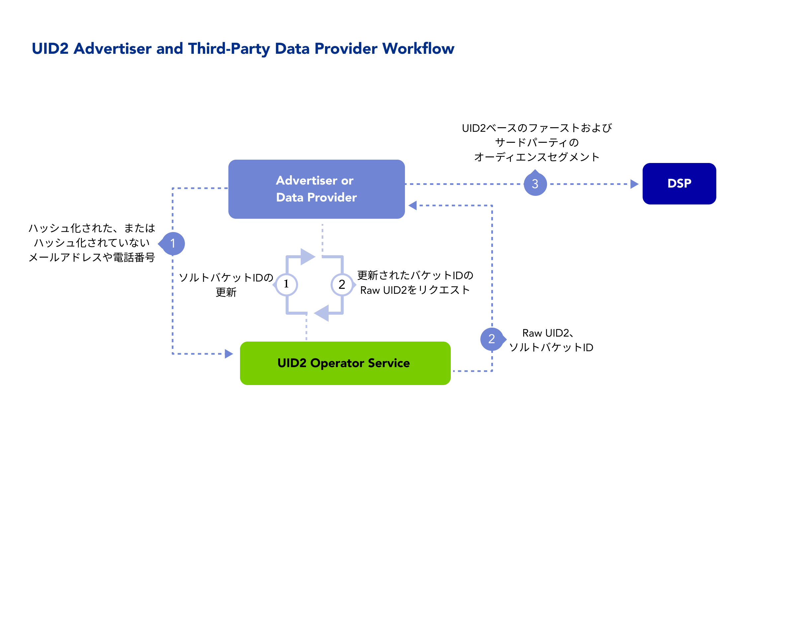

import Link from '@docusaurus/Link';

データおよび測定プロバイダーとして、Unified ID 2.0(UID2) を 採用し、より耐久性のある、オムニチャネルおよびクロスデバイス識別子でデータを接続することで、ID の断片化を減らし、顧客のユースケースを満たすことができます。

このソリューションは、以下のようなオンラインまたはオフライン広告用のデータまたは関連サービスを提供している場合に適しています:
- データオンボーディング
- サードパーティオーディエンス
- アイデンティティーの解決とグラフ
- 測定とアトリビューション

UID2 を採用するデータプロバイダーにとっての利点、ワークフロー、ドキュメント、その他のリソース、および UID2 を開始するための手順について説明します。

:::note
UID2 のドキュメント一式に左サイドバーからアクセスしたい場合は、[Unified ID 2.0 Overview](../intro.md) を参照してください。
:::

## Benefits of UID2 for Data Providers

UID2 を使用することで、データプロバイダーとして得られる利点の一部を次に示します。以下が可能です:
- 消費者のプライバシーを管理するためのオプトアウトを提供する、よりプライバシーに配慮した識別子にアップグレードします。
- 解決、活性化、測定のためのプラットフォームとチャネル間の接続 ID スレッドの使用を促進します。
- 広告主が決定論的な ID を使用して、オーディエンスセグメントを将来にわたって保護することを目指します。
- オンラインとオフラインのデータを共通の ID で接続し、より精度の高いものを目指します。
- サードパーティクッキーの有無にかかわらず、キャンペーンをより正確に測定します。

## Workflow for Data Providers

以下のステップは、ユーザーデータを収集し DSP にプッシュする組織 (広告主、ID グラフプロバイダー、サードパーティデータプロバイダーなど) を対象としたワークフローのアウトラインを提供するものです。

バックグラウンドで以下の処理が行われます:
* 広告主やデータプロバイダーは、ローテーションされたソルトバケットの UID2 Operator を監視し、必要に応じて UID2 を更新します。

以下のステップは、データプロバイダーが UID2 とインテグレーションする方法の一例です:

1. データプロバイダーが、ユーザーの [directly identifying information (DII)](../ref-info/glossary-uid.md#gl-dii) を UID2 Operator に送信します。
2. UID2 Operator は、raw UID2 とソルトバケット ID を生成して返します。
3. データプロバイダーは UID2 とソルトバケット ID を保存し、UID2 ベースのファーストパーティおよびサードパーティのオーディエンスセグメントを DSP に送信します。

   Server-side: 広告主またはデータプロバイダーは、UID2 をマッピングテーブル、DMP、データレイク、またはその他の Server-Side アプリケーションに格納します。

## Getting Started

次の手順で始めます:

1. [アクセスリクエスト](/request-access)ページにあるフォームに記入して、UID2へのアクセスをリクエストします。

   担当者が連絡し、ニーズを伺い、適切なステップをアドバイスします。
1. [参加者](participants-overview.md#uid2-external-participants) の役割を決めます。
1. どの実装オプションを使用するかを決めます。
1. 認証情報を受け取り ([UID2 Credentials](../getting-started/gs-credentials.md) を参照)、選択したオプションのインテグレーションガイドの指示に従います。

   :::note
   UID2 へのリクエストメッセージは必ず暗号化してください。詳細は [リクエストの暗号化とレスポンスの復号化](../getting-started/gs-encryption-decryption.md) を参照してください。
   :::
1. テストします。
1. 本番稼働します。

## Implementation Resources

広告主やデータプロバイダーが UID2 を実装するために、以下のドキュメントリソースを利用できます。

| Integration Type| Documentation | Content Description |
| :--- | :--- | :--- |
| ユーザーデータを収集し、他の EUID 参加者にプッシュする組織向けのインテグレーションオプションの概要 | [Advertiser/Data Provider Integration Overview](../guides/integration-advertiser-dataprovider-overview.md) | このガイドでは、オーディエンス構築およびターゲティングのための ID マッピングのインテグレーションワークフローについて説明します。 |
| Snowflake | [Snowflake Integration Guide](../guides/integration-snowflake.md) | このガイドでは、Snowflake を使ってメールアドレスから UID2 を生成する手順を説明します。 |
| AWS Entity Resolution | [AWS Entity Resolution Integration Guide](../guides/integration-aws-entity-resolution.md) | このガイドでは、AWS Entity Resolution を使用して UID2 とインテグレーションする手順を説明します。 |
| UID2 HTTP エンドポイントのみを使用して、ユーザーデータを収集し、他の EUID 参加者に送信する組織向けのインテグレーション手順 | [Advertiser/Data Provider Integration to HTTP Endpoints](../guides/integration-advertiser-dataprovider-endpoints.md) | このガイドでは、広告主やデータプロバイダーが UID2 HTTP エンドポイントを呼び出すためのコードを記述して UID2 とインテグレーションする手順について説明します。SDK、Snowflake、AWS Entity Resolution などの他の実装オプションを使用せずに UID2 とインテグレーションする広告主やデータプロバイダー向けのインテグレーション手順をカバーします。 |
| Client-Side JavaScript SDK を使用してトラッキングピクセルに UID2 Token を追加する広告主やデータプロバイダー向けのインテグレーション手順 | [Client-Side Integration Guide for JavaScript](../guides/integration-javascript-client-side.md) | このガイドでは、JavaScript Client-Side の変更のみを使用して UID2 Token (Advertising Token) を生成する手順について説明します。<!-- UID2_only: Not applicable for EUID --> |

## FAQs for Data Providers

UID2 フレームワークを使用するデータプロバイダー向けのよくある質問のリストは、[FAQs for Advertisers and Data Providers](../getting-started/gs-faqs.md#faqs-for-advertisers-and-data-providers) を参照してください。
