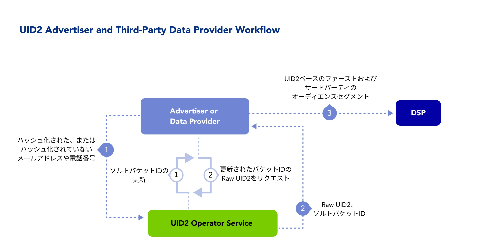

データおよび測定プロバイダーは、Unified ID 2.0 を採用してデータをより耐久性のある、オムニチャネルおよびクロスデバイスの識別子で接続し、顧客のユースケースを満たすことによって、ID の断片化を減らすことができます。

以下のセクションでは、UID2 を採用するデータプロバイダー向けのワークフロー、インテグレーションタイプ、ドキュメントを説明します。

## Audience

このページは、オンラインまたはオフライン広告のデータまたは関連サービスを提供するパートナー (以下のプロバイダーなど)を対象としています:
- データオンボーディング
- サードパーティオーディエンス
- アイデンティティーの解決とグラフ
- 測定とアトリビューション

## Benefits of UID2 for Data Providers

UID2 を使用するデータプロバイダーが得られるメリットの一部を次に示します:
- 消費者のプライバシーを管理するためのオプトアウトを提供する、よりプライバシーに配慮した識別子にアップグレードすることができます。
- 解決、活性化、測定のためのプラットフォームとチャネル間の接続 ID スレッドの使用を促進します。
- 広告主が決定論的な ID を使用して、オーディエンス・セグメントを将来にわたって保護することを目指します。
- オンラインとオフラインのデータを共通の ID で接続し、より精度の高いものを目指します。
- サードパーティクッキーの有無にかかわらず、キャンペーンをより正確に測定します。

## Resources

データプロバイダーが UID2 を実装するために、以下のドキュメントリソースを利用できます。

| Integration Type| Documentation | Content Description | Audience |
| :--- | :--- | :--- | :--- |
| インテグレーションガイド | [Advertiser/Data Provider Integration Guide](../guides/advertiser-dataprovider-guide.md) | 広告主とデータプロバイダーのためのインテグレーションガイドで、オーディエンスの構築とターゲティングのための ID マッピングのためのインテグレーションワークフローを網羅しています。 | Advertisers, Data Providers |
| Snowflake | [Snowflake Integration Guide](../guides/snowflake_integration.md) | Snowflakeでメールアドレスから UID を生成する手順です。 | Advertisers, Data Providers |

## Workflow for Data Providers

以下のステップは、ユーザーデータを収集し DSP にプッシュする組織 (広告主、ID グラフプロバイダー、サードパーティデータプロバイダーなど)を対象としたワークフローのアウトラインを提供するものです。

バックグラウンドで以下の処理が行われます:
* データプロバイダーは、ローテーションされたソルトバケットの UID2 Operator を監視し、必要に応じて UID2 を更新します。

以下のステップは、広告主やデータプロバイダーが UID2 とインテグレーションする方法の一例です:

1. データプロバイダーが、同意を得たユーザーの [directly identifying information (DII)](../ref-info/glossary-uid.md#gl-dii) を UID2 Operator に送信します。
2. UID2 Operator は、raw UID2 とソルトバケット ID を生成して返します。
3. データプロバイダーは UID2 とソルトバケット ID を保存し、UID2 ベースのファーストパーティおよびサードパーティのオーディエンスセグメントをDSPに送信します。
4. データプロバイダーは、行動規範で定義された許可されたトランスポートプロトコルを使用して、UID2 を DSP に送信します。
5. データプロバイダーは、UID2 Operator がローテーションしたソルトバケットを監視し、必要に応じて UID2 を更新します。

<!-- ## Integration Requirements

ユーザーの DII から UID2 を生成するためには、サードパーティデータプロバイダーは以下の要件を満たしている必要があります。

- UID2 Operator とインテグレーションして UID2 を生成し、ソルトバケットのローテーションを処理すること。
- UID2 Operator の API にアクセスできること。 広告主によっては、CDP、データオンボーダー、またはその他のサービスプロバイダーを経由する場合もあります。

詳細は、[Advertiser/Data Provider Integration Guide](/guides/advertiser-dataprovider-guide.md) を参照してください。 -->

## Getting Started

次の手順で始めます:

1. [アクセスリクエスト](/request-access)ページにあるフォームに記入して、UID2へのアクセスをリクエストします。

   担当者が連絡し、ニーズを伺い、適切なステップをアドバイスします。
1. [参加者](../intro.md#participants)の役割を決めます。
1. どの実装オプションを使用するかを決めます。
1. 1. 認証情報を受け取り ([API keys](../getting-started/gs-api-keys.md) を参照)、選択したオプションのインテグレーションガイドの指示に従います。

    Note: リクエストメッセージは必ずUID2まで暗号化してください。詳細は、[リクエストの暗号化とレスポンスの復号化](../getting-started/gs-encryption-decryption.md)を参照してください。
1. テストします。
1. 本番稼働します。

## FAQs for Data Providers

UID2 フレームワークを使用するデータプロバイダー向けのよくある質問のリストは、[FAQs for Advertisers and Data Providers](../getting-started/gs-faqs.md#faqs-for-advertisers-and-data-providers) を参照してください。