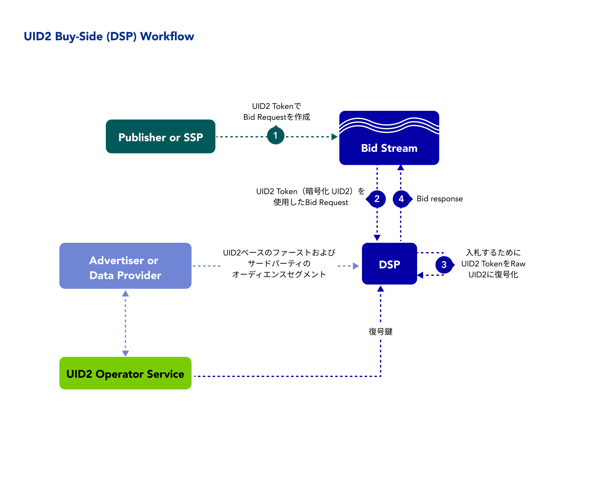

import Link from '@docusaurus/Link';

デマンドサイドプラットフォーム(DSP、メディアバイイングプラットフォーム) として、Unified ID 2.0(UID2) を活用した ID 戦略を実施することで、以下を促進することができます:

- 広告主のためのファーストパーティデータの有効化
- パブリッシャー向けインベントリ収益化

UID2 を採用する DSP のメリット、ワークフロー、ドキュメント、その他のリソース、および UID2 を開始するための手順について説明します。

:::note
UID2 のドキュメント一式に左サイドバーからアクセスしたい場合は、[Unified ID 2.0 Overview](../intro.md) を参照してください。
:::

## Benefits of UID2 for DSPs

以下は、UID2 を使用する DSP の利点を次に示します。以下が可能です:
- 認証された ID で ID 解決をアップグレードします。
- サードパーティークッキーへの依存度を低減します。
- オムニチャネルやクロスデバイスのフリケンシー管理と抑制を実行します。
- よりプライバシーに配慮した ID 暗号化規格により、ファーストパーティデータの活性化を促進します。
- 決定論的データによる将来性のあるモデルの開発を目指します。
- アドレサブルなオーディエンスターゲティングを維持します。
- 消費者のプライバシー管理を向上させることを目的に、オプトアウトを提供します。
- サードパーティクッキーの有無にかかわらず、キャンペーンをより正確に測定します。

## Workflow for DSPs

以下のステップは、<Link href="../ref-info/glossary-uid#gl-bidstream">ビッドストリーム</Link>の UID2 で取引を行う DSP を想定したワークフローのアウトラインです。

バックグラウンドで以下の処理が行われます:
- 広告主またはデータプロバイダーは、ファーストパーティおよびサードパーティのオーディエンスセグメントを DSP に渡します。
- DSP は、UID2 Operator と同期し、復号化キーを受け取ります。
- DSP は、UID2 Operator からのオプトアウト要求を受け取ります。

各入札/広告インプレッションには次のステップがあります:

1. ビッドリクエストが UID2 Token とともにビッドストリームに渡されます。
2. DSP はビッドストリームから UID2 Token を持つビッドリクエストを受信します。
3. DSP は
   - UID2 Token を復号して raw UID2 にします。
   - ユーザーがオプトアウトしたかどうかを確認し、オプトアウトした場合は入札を行いません。
   - raw UID2 をオーディエンスセグメントにマッチさせます。
4. DSP は UID2 Token を付加した入札レスポンスをビッドストリームに送信します。

## Getting Started

次の手順で始めます:

1. [アクセスリクエスト](/request-access) ページにあるフォームに記入して、UID2へのアクセスをリクエストします。
2. UID2 のオプトアウト情報を受け取るための Webhook を実装し、Webhook を UID2 Admimnistrator と共有します。
3. Webhook 経由でオプトアウトフィードを受信していることを確認します。 

    Webhook が設置されたら、認証情報を受け取ります ([UID2 Credentials](../getting-started/gs-credentials.md) を参照してください)。
4. どの実装オプションを使用するかを決定します。
5. SDK を使用している場合は、SDKをダウンロードします。該当する SDK のガイドを参照してください。
6. 選択したオプションの実装ガイドに記載されている手順に従います。

    :::note
    UID2 へのリクエストメッセージは必ず暗号化してください。詳細は [リクエストの暗号化とレスポンスの復号化](../getting-started/gs-encryption-decryption.md) を参照してください。
    :::
7. (条件付き) CRM オンボーディングソリューションを実装する場合は、データプロバイダワークフローのための資格情報の別のセットを要求します。[UID2 Credentials](../getting-started/gs-credentials.md) を参照してください。
8. テストします。
9. 本番稼働します。

## Implementation Resources

UID2 を実装する DSP には、以下のドキュメントリソースが用意されています。

| Type| Documentation | Content Description |
| :--- | :--- | :--- |
| SDK for Java | [SDK for Java Reference Guide](../sdks/sdk-ref-java.md) | Java Server-Side を使用し、UID2 Advertising Token を復号して raw UID2 にアクセスしたい人のための SDK。 |
| SDK for Python | [SDK for Python Reference Guide](../sdks/sdk-ref-python.md) | Python Server-Side を使用し、UID2 Advertising Token を復号して raw UID2 にアクセスしたい人のための SDK。 |
| SDK for C# / .NET | [SDK for C# / .NET Reference Guide](../sdks/sdk-ref-csharp-dotnet.md) | .NET Server-Side を使用し、UID2 Advertising Token を復号して raw UID2 にアクセスしたい人のための SDK。 |
| SDK for C++ | [SDK for C++ Reference Guide](../sdks/sdk-ref-cplusplus.md) | C++ Server-Side を使用し、UID2 Advertising Token を復号して raw UID2 にアクセスしたい人のための SDK。 |
| Integration Guide | [DSP Integration Guide](../guides/dsp-guide.md) | DSP 向けのこのインテグレーションガイドでは、入札のための UID2 の取り扱いと、ユーザーのオプトアウトの受け入れについて説明します。 |
| DSP Direct Integration Instructions | [DSP Direct Integration Tips](../guides/integration-dsp-no-sdk.md) | UID2 SDK のいずれも使用せずにインテグレーションすることを希望する DSP 向けの手順。 |

<!-- ## Integration Requirements

To integrate with UID2 to receive UID2s from brands (as first-party data) and data providers (as third-party data) and leverage them to inform bidding on UID2s in the bidstream, the buy-side participants must meet the following requirements:

- Accept data in the form of UID2s
- Bid on data in the form of UID2s
- Build a webhook for honoring opt-out requests
- Sync <a href="../ref-info/glossary-uid#gl-encryption-key">encryption key</a> daily with the UID2 Administrator

For details, see [DSP Integration Guide](../guides/dsp-guide.md).

Optionally, if DSPs want to generate UID2s themselves from DII, they can also follow the [Third-Party Data Provider Workflow](overview-data-providers.md#workflow-for-data-providers). -->

## FAQs for DSPs

UID2 フレームワークを使用する DSP に関するよくある質問については [FAQs for DSPs](../getting-started/gs-faqs.md#faqs-for-dsps) を参照してください。
