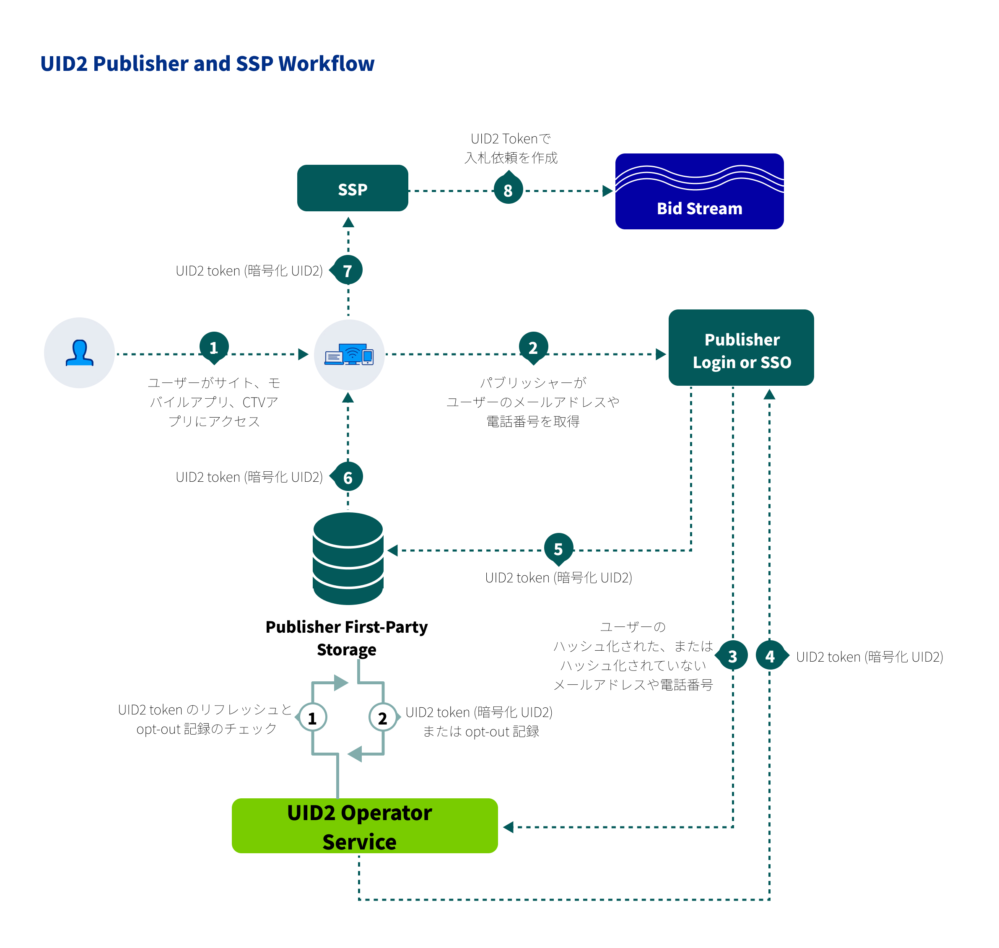

パブリッシャーは、Unified ID 2.0 のクロスデバイスでのプレゼンスの恩恵を受け、すべてのインベントリで一貫した ID ファブリックを活用できます。

このページには、UID2を採用するパブリッシャー向けのワークフロー、インテグレーションタイプ、ドキュメントリソースに関する情報が含まれています。

## Audience

このページは、以下のUID2参加者のためのものです：

- UID2 を使用して RTB ビッドストリーム用の ID トークンを生成したいが、UID2 対応のシングルサインオンや ID プロバイダーではなく、UID2 と直接インテグレーションしたいウェブアセットを持つパブリッシャー。
- UID2 Token を SSP 経由でビッドストリームに伝播させるすべての組織&#8212;例えば、ID プロバイダーや SSO プロバイダーなどです。

<!-- - Data clean rooms. -->

パブリッシャーは、さまざまな方法で UID2 とのインテグレーションを選択することができます:

- SDK を使用するか、UID2 API を使用して、UID2 と直接インテグレーションする。
- SSO プロバイダを使用する。
- パブリッシャーに代わって UID2 インテグレーションを管理する独立した ID プロバイダーと連携する。

## Benefits of UID2 for Publishers

UID2 とインテグレーションすることで得られるメリットの一部を次に示します:
- デスクトップ、モバイル、CTVで、単一の識別子でアドレサブルなオーディエンスターゲティング。
- デバイスをまたいだフリケンシー。
- より適切なコンテンツのリコメンデーション。
- 関連するコンテンツでパーソナライズされた広告体験を提供する機能。
- 消費者のプライバシー管理を向上させることを目的とした、オプトアウトを提供する機能。

## Resources

The following documentation resources are available for publishers to implement UID2.

| Integration Type| Documentation | Content Description | Audience |
| :--- | :--- | :--- | :--- |
| Client-Side (Web) SDK | [UID2 SDK for JavaScript](../sdks/client-side-identity.md) | UID2 を使用したクライアント ID の確立と、パブリッシャーの Advertising Token の取得プロセスを容易にするクライアントサイドJavaScript SDKです。 | Publishers |
| Client-Side (Web) Integration Guide | [UID2 SDK for JavaScript Integration Guide](../guides/publisher-client-side.md) | パブリッシャー向けのこのインテグレーションガイドは、[UID2 SDK for JavaScript](../sdks/client-side-identity.md) を使用する標準的なウェブインテグレーションシナリオを説明しています。 | Publishers |
| Server-Side Integration Guide  | [Publisher Integration Guide, Server-Only](../guides/custom-publisher-integration.md) | このインテグレーションガイドは、[UID2 SDK for JavaScript](../sdks/client-side-identity.md) を使用していないパブリッシャー向けです。| Publishers |
| Publisher/SSP Integration with GAM | [Publisher - Google Ad Manager Secure Signals](../guides/google-ss-integration.md) | このインテグレーションガイドでは、パブリッシャーが UID2 を Google Ad Manager の セキュアシグナル機能（旧称：Encrypted Signals for Publishers、ESP）と併用する際に必要な追加手順について説明しています。 | Publishers |
| Operator | [UID2 Operator - AWS Marketplace Integration Guide](../guides/operator-guide-aws-marketplace.md) | AWS MarketplaceのPrivate Operatorサービスを設定する手順です。 | Private Operators Publishers |
| Operator| [UID2 Operator - Google Cloud Platform Confidential Computing package](../guides/operator-guide-gcp-enclave.md) | Google Cloud Platform Confidential Computing パッケージ（GCP）の設定方法について説明しています。 | Private Operators Publishers |
| Operator Integration Guide | [Operator - Microsoft Azure](../guides/operator-guide-azure-enclave.md) | IMPORTANT: このドキュメントは現在、PoCの段階です。  Microsoft Azure Confidential Computing プラットフォーム上で実行する Private Operator Service のセットアップ手順です。  | Private Operators Publishers |

## Workflow for Publishers

以下の図は、パブリッシャー向けの UID2 ワークフローです。

<!-- (LP/BB/GWH: the above URl works as relative but as /docs/ caused build failure. Need to debug that. 3/13) -->

詳しくは、[パブリッシャーワークフローの概要](../workflows/workflow-overview-supply-side.md)を参照してください。

## Getting Started

次の手順で始めます:

1. [アクセスリクエスト](/request-access)ページにあるフォームに記入して、UID2へのアクセスをリクエストします。
1. UID2 とインテグレーションしたいプロパティを特定します。
1. UID2 契約書にサインします。
1. UID2認証キー（[APIキー](../getting-started/gs-api-keys.md)）を受け取ります。
1. SDK　を使用するか、UID2 API　と直接インテグレーションを行い、該当するドキュメントを使用して、UID2　へのインテグレーションを構築します。

     NOTE: リクエストメッセージは必ずUID2まで暗号化してください。詳細は、[リクエストの暗号化とレスポンスの復号化](../getting-started/gs-encryption-decryption.md)を参照してください。
1. テストします:

    入札リクエストで UID2 を適切に渡すために、SSP と協力します。
    
    リクエストの中で UID2 が正しく生成され、渡されていることを確認します。
1. 本番稼働します。

## Frequently Asked Questions for Publishers

パブリッシャー向け FAQ の一覧は、以下のいずれかを参照してください：

- [SDK を使用しているパブリッシャー向け FAQ](../getting-started/gs-faqs.md#faqs-for-publishers-using-an-sdk)
- [SDK を使用していないパブリッシャー向け FAQ](../getting-started/gs-faqs.md#faqs-for-publishers-not-using-an-sdk)

すべてのリストは、[よくある質問](../getting-started/gs-faqs.md)を参照してください。
