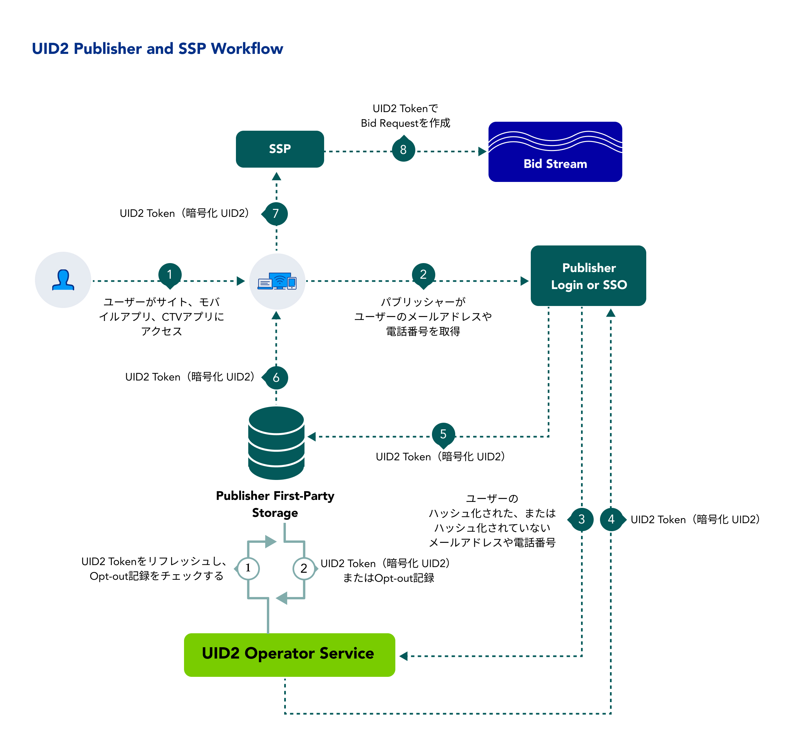

import Link from '@docusaurus/Link';

パブリッシャーとして、Unified ID 2.0 (UID2) のクロスデバイスプレゼンスの恩恵を受け、すべてのインベントリで一貫した ID ファブリックを活用することができます。

UID2 を採用するパブリッシャーにとってのメリット、ワークフロー、ドキュメント、その他のリソース、および UID2 の導入手順について説明します。

:::note
UID2 のドキュメント一式に左サイドバーからアクセスしたい場合は、[Unified ID 2.0 Overview](../intro.md) を参照してください。
:::

## Benefits of UID2 for Publishers

UID2 とインテグレーションすることで得られるメリットの一部を次に示します:
- デスクトップ、モバイル、CTVで、単一の識別子でアドレサブルなオーディエンスターゲティング。
- デバイスをまたいだフリケンシー。
- より適切なコンテンツのリコメンデーション。
- 関連するコンテンツでパーソナライズされた広告体験を提供する機能。
- 消費者のプライバシー管理を向上させることを目的とした、オプトアウトを提供する機能。

## Workflow for Publishers

以下の手順は、ID プロバイダー、パブリッシャー、SSO プロバイダーなど、SSP を介して UID2 Token を<Link href="../ref-info/glossary-uid#gl-bidstream">ビッドストリーム</Link>に伝播する組織を想定したワークフローの概要です。パブリッシャーは、UID2 と相互運用可能で、パブリッシャーに代わって UID2 インテグレーションを処理できる SSO プロバイダーまたは独立した ID プロバイダーと連携することを選択できます。

1. ユーザーがパブリッシャーのウェブサイト、モバイルアプリ、CTV アプリにアクセスします。
2. パブリッシャーは、オデータの取り扱いに関する透明性を提供し、ログインまたはその他の手段で、メールアドレスまたは電話番号の提供をユーザーに求めます。
3. ユーザーがメールアドレスまたは電話番号を提供すると、パブリッシャーは SDK または直接 API インテグレーションを介して、それを UID2 Operator に送信します。

   パブリッシャーは、SSO プロバイダーまたは ID プロバイダーが自分たちに代わって <Link href="../ref-info/glossary-uid#gl-dii">DII</Link> を渡すことを承認できます。
4. UID2 Operator:
   - メールアドレスまたは電話番号を受け取ります。
   - ソルト化、ハッシュ化、暗号化処理を行います。
   - UID2 Token を返します。
5. パブリッシャーが UID2 Token を保存し、リアルタイムビディングの際に SSP と共有します。
   - Server-Side: パブリッシャーは、トークンをマッピングテーブル、DMP、データレイク、またはその他の Server-Side アプリケーションに格納します。
   - Client-Side: パブリッシャーは、トークンを Client-Side アプリ、またはファーストパーティクッキーとしてユーザーのブラウザに保存します。
6. パブリッシャーが UID2 Token をストレージから取得します。
6. パブリッシャーは UID2 Token を SSP に送信します。
7. SSP は UID2 Token を含むビッドリクエストをビッドストリームに入れます。

<!-- The publisher requests updated UID2 tokens using a refresh token. When applicable, the refresh token includes a user’s opt-out request. -->

## Getting Started

次の手順で始めます:

1. [Request Access](/request-access) ページのフォームに記入して、UID2 へのアクセスをリクエストします。
1. UID2 とインテグレーションしたいプロパティを特定します。
1. UID2 契約を締結します。
1. Client-Side と Server-Side のどちらのインテグレーションを希望するかを決定し、UID2 の担当者に伝えてください。
1. UID2 credential([UID2 Credentials](../getting-started/gs-credentials.md)) を受け取ります。
1. 該当する [implementation resources](#implementation-resources) を使用して、SDK または UID2 と直接インテグレーションしてください。

   :::note
   UID2 へのリクエストメッセージは必ず暗号化してください。詳細については、[Encrypting Requests and Decrypting Responses](../getting-started/gs-encryption-decryption.md) を参照してください。
   :::

1. テスト: 

   - ビッドリクエストで UID2 Token が正しく生成され、渡されていることを確認します。
   - 必要に応じてトラブルシューティングを行い、ビッドリクエストで UID2 Token が正しく渡されるように SSP と協力します。
1. 本番稼動します。

## Implementation Resources

パブリッシャーが UID2 を実装するために利用できるリソースは以下の通りです:

- [Web Integrations](#web-integrations)
- [Mobile Integrations](#mobile-integrations)
- [CTV Integrations](#ctv-integrations)
- [Prebid Integrations](#prebid-integrations)
- [Google Ad Manager Integrations](#google-ad-manager-integrations)

### Web Integrations

以下のリソースは、パブリッシャーの Web インテグレーションに利用できます。

:::tip
Web インテグレーションオプションの詳細については、[Web Integration Overview](../guides/integration-options-publisher-web.md) を参照してください。
:::

| Integration Type| Documentation | Content Description |
| :--- | :--- | :--- |
| Prebid.js (Overview) | [UID2 Integration Overview for Prebid.js](../guides/integration-prebid.md) | UID2 とインテグレーションし、RTB ビッドストリームで Prebid.js から渡されるUID2 Token を生成したいパブリッシャー向けのインテグレーションオプションの概要です。 |
| Prebid.js Client-Side Integration | [UID2 Client-Side Integration Guide for Prebid.js](../guides/integration-prebid-client-side.md) | 最も簡単な実装方法であるClient-Side で UID2 Token をリクエストし、Prebid.js に以下を管理させることを選択したいパブリッシャー向けのガイドです: <ul><li>トークンの生成とトークンのリフレッシュ。</li><li>トークンを RTB ビッドストリームに渡す。</li></ul> |
| Prebid.js Client-Server Integration | [UID2 Client-Server Integration Guide for Prebid.js](../guides/integration-prebid-server-side.md) | UID2 とインテグレーションし、RTB ビッドストリームで Prebid.js から渡される UID2 Token を生成したいが、トークンを Server-Side で生成したいパブリッシャー向けのガイドです: 例えば、Private Operator を利用しているパブリッシャーなど。 |
| JavaScript (Overview) | [UID2 Integration Overview for JavaScript](../guides/integration-javascript.md) | JavaScript SDK を使って UID2 とインテグレーションしたいパブリッシャー向けのオプションの概要です。 |
| JavaScript Client-Side Integration | [Client-Side Integration Guide for JavaScript](../guides/publisher-client-side.md) | Client-Side の JavaScript の変更だけで UID2 とインテグレーションしたいパブリッシャー向けのガイドで、最も簡単な実装方法です。 UID2 SDK for JavaScript は、トークン生成とトークンリフレッシュを自動的に管理します。 |
| JavaScript Client-Server Integration | [Client-Server Integration Guide for JavaScript](../guides/integration-javascript-server-side.md) | UID2 SDK for JavaScript を使用し、トークンを Server-Side で生成してパブリッシャーのウェブページに渡す必要がある、標準的なWeb インテグレーションシナリオを網羅したパブリッシャーガイドです。 |
| Server-Side Integration | [Publisher Integration Guide, Server-Side](../guides/custom-publisher-integration.md) | [UID2 SDK for JavaScript](../sdks/client-side-identity.md) を使用しないパブリッシャー向けのガイドです。 |
| Publisher/SSP Integration with GAM | [Google Ad Manager Secure Signals Integration Guide](../guides/google-ss-integration.md) | パブリッシャーが UID2 を Google Ad Manager のセキュアシグナル機能(旧称: Encrypted Signals for Publishers、ESP) で使用する際に必要な追加手順について説明したガイドです。 |

### Mobile Integrations

以下のリソースは、Android または iOS デバイスをサポートするパブリッシャーのインテグレーションに利用できます。

| Integration Type| Documentation | Content Description |
| :--- | :--- | :--- |
| Android/iOS (Overview) | [Mobile Integration Overview for Android and iOS](../guides/integration-mobile-overview.md) | UID2 SDK for Android または UID2 SDK for iOS を使用して UID2 とインテグレーションしたいモバイルアプリパブリッシャー向けのオプションの概要です。 |
| Android/iOS, Client-Side Integration | [Client-Side Integration Guide for Mobile](../guides/integration-mobile-client-side.md) | モバイルアプリ内のみの変更で UID2 とインテグレーションしたいモバイルアプリパブリッシャー向けのインテグレーションガイドです（Server-Side の変更はありません）。 |
| Android/iOS, Client-Server Integration | [Client-Server Integration Guide for Mobile](../guides/integration-mobile-client-server.md) | UID2 とインテグレーションしたいモバイルアプリのパブリッシャー向けのインテグレーションガイドです:<ol><li>UID2 Token を Server-Side で生成するには、PublicまたはPrivate Operatorを使用します。</li><li>その結果、<Link href="../ref-info/glossary-uid#gl-identity">identities</Link> をモバイルアプリに渡し、ビッドストリームに渡します。</li></ol> |

### CTV Integrations

CTV をサポートするパブリッシャーのインテグレーションに利用できるリソースは以下の通りです。

| Integration Type| Documentation | Content Description |
| :--- | :--- | :--- |
| CTV | [CTV Integration Guide](../guides/integration-ctv-guide.md) | CTV インテグレーションオプションの概要と、追加情報および手順へのリンク。 |

### Prebid Integrations

Prebid とインテグレーションするパブリッシャーには、以下のリソースがあります。

| Integration Type| Documentation | Content Description |
| :--- | :--- | :--- |
| Prebid.js (Overview) | [UID2 Integration Overview for Prebid.js](../guides/integration-prebid.md) | UID2 とインテグレーションし、RTB ビッドストリームで Prebid.js から渡される UID2 Token を生成したいパブリッシャー向けのインテグレーションオプションの概要。 |
| Prebid.js Client-Side Integration | [UID2 Client-Side Integration Guide for Prebid.js](../guides/integration-prebid-client-side.md) | 最も簡単な実装方法である Client-Side で UID2 Token をリクエストし、Prebid.js に以下を管理させることを選択したいパブリッシャー向けのガイドです: <ul><li>トークン生成とトークンリフレッシュ。</li><li>トークンを RTB ビッドストリームに渡す。</li></ul> |
| Prebid.js Client-Server Integration | [UID2 Client-Server Integration Guide for Prebid.js](../guides/integration-prebid-server-side.md) | UID2 とインテグレーションし、RTB ビッドストリームで Prebid.js から渡される UID2 Token を生成したいが、トークンを Server-Side で生成したいパブリッシャー向けのガイドです: 例えば、Private Operatorを使用しているパブリッシャーなどです。 |

### Google Ad Manager Integrations

以下のリソースは、パブリッシャーの Google Ad Manager とのインテグレーションに利用できます。

| Integration Type| Documentation | Content Description |
| :--- | :--- | :--- |
| Publisher/SSP Integration with GAM | [Google Ad Manager Secure Signals Integration Guide](../guides/google-ss-integration.md) | パブリッシャーが UID2 を Google Ad Manager のセキュアシグナル機能(旧称: Encrypted Signals for Publishers、ESP) で使用する際に必要な追加手順について説明したガイドです。 |
| GMA for Android | [UID2 GMA Plugin for Android Integration Guide](../guides/mobile-plugin-gma-android.md) | Google Mobile Ads(GMA)SDK を使用するパブリッシャーが、Android アプリからの広告リクエストに UID2 Token を使うためのガイドです。 |
| GMA for iOS | [UID2 GMA Plugin for iOS Integration Guide](../guides/mobile-plugin-gma-ios.md) | Google Mobile Ads (GMA) SDK を使用するパブリッシャーが、iOS アプリからの広告リクエストに UID2 Token を使うためのガイドです。 |
| IMA for Android | [UID2 IMA Plugin for Android Integration Guide](../guides/mobile-plugin-ima-android.md) | Google Interactive Media Ads (IMA) SDK を使用するパブリッシャーが、Android アプリからの広告リクエストに UID2 Token を使うためのガイドです。 | Publishers |
| IMA for iOS | [UID2 IMA Plugin for iOS Integration Guide](../guides/mobile-plugin-ima-ios.md) | Google Interactive Media Ads (IMA) SDK を使用するパブリッシャーが、iOS アプリからの広告リクエストに UID2 Token を使うためのガイドです。 |

## FAQs for Publishers

UID2 フレームワークを使用するうパブリッシャー向けのよくある質問のリストは、[FAQs for Publishers](../getting-started/gs-faqs.md#faqs-for-publishers) を参照してください。
