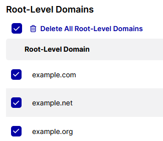
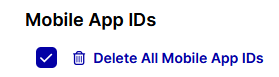

# Client-Side Integration

UID2 Portal では、Client-Side でトークンを生成する実装オプションを使用する場合、次の表に示す各値の 1 つ以上を定義する必要があります。

| Value | Details | Documentation Link |
| :--- | :--- | :--- |
| Key pair | 少なくとも一つ。実装では、公開鍵を共有します。 | [Subscription ID and Public Key](getting-started/gs-credentials.md#subscription-id-and-public-key) |
| Domain | 少なくとも1つ。ルートレベルドメインの完全なリストを提供します。 | [Client-Side Web Integrations](../getting-started/gs-account-setup.md#client-side-web-integrations) |
| Mobile App ID | Mobile | Android App ID、iOS/tvOS Bundle ID、iOS App Store IDなど、モバイルアプリに適用されるID。 | [Client-Side Mobile Integrations](../getting-started/gs-account-setup.md#client-side-mobile-integrations) |

:::important
サイトのルートレベルドメインの完全なリストを提供することが重要です。これは、クライアントサイドの実装にのみ関連するセキュリティ対策です。UID2 Portal で定義されていないドメインの場合、そのドメインからの UID2 Token リクエストは失敗します。
:::

Client-Side インテグレーションページでは、これらの値を設定および管理するためのすべてのアクティビティを実行できます。次の内容が含まれます:
- [Adding and Managing Key Pairs](#adding-and-managing-key-pairs)
- [Adding and Managing Root-Level Domains](#adding-and-managing-root-level-domains)
- [Adding and Managing Mobile App IDs](#adding-and-managing-mobile-app-ids)

:::note
Client-Side インテグレーションページに移動すると、少なくとも 1 つのキーペアと、少なくとも 1 つのトップレベル（ルートレベル）ドメインを作成していない場合、不足している構成項目を提供するよう促されます。
:::

## Client-Side Implementation Options

Client-Side の実装オプションは、次の表に示すとおりです。利用可能なオプションは、あなたの役割によって異なります。

| Client-Side Implementation Option | Available For (Role) | Documentation Link |
| :--- | :--- | :--- |
| UID2 JavaScript SDK | Publishers, Advertisers | [Client-Side Integration Guide for JavaScript](../guides/integration-javascript-client-side.md) |
| Prebid.js client-side integration | Publishers only |[UID2 Client-Side Integration Guide for Prebid.js](../guides/integration-prebid-client-side.md) |
| UID2 Mobile SDK | Publishers only |[UID2 Client-Side Integration Guide for Mobile](../guides/integration-mobile-client-side.md) |

## Adding and Managing Key Pairs

Client-Side インテグレーションページでは、キーペアを設定および管理するための次のアクティビティを実行できます:

- [Adding a Key Pair](#adding-a-key-pair)
- [Copying or Viewing a Public Key](#copying-or-viewing-a-public-key)
- [Changing the Name of a Key Pair](#changing-the-name-of-a-key-pair)
- [Deleting a Key Pair](#deleting-a-key-pair)

### Adding a Key Pair

キーペアを追加するには、次の手順を実行します:

1. UID2 Portal アカウントにログインします。
1. **Client-Side Integration** ページに移動し、**Add Key Pair** をクリックします。
1. **Add Key Pair** オーバーレイで名前を入力し、**Add Key Pair** をクリックします。

   **Client-Side Integration** ページに、名前、Subscription ID、Public key、および作成日が表示されます。

### Copying or Viewing a Public Key

Client-Side インテグレーションページでキーペアを作成すると、公開鍵を共有できます。UID2 Service は、メッセージを認証するために、対応する秘密鍵と他の値を使用します。

Public key を表示またはコピーするには、次の手順を実行します:

1. UID2 Portal で、**Client-Side Integration** ページに移動します。
1. リストでキーペアを見つけ、次のいずれかを実行します:

   - **Public Key** 列の  (View Public Key アイコン) をクリックして、ポップアップでキーを表示します。
   - **Public Key** 列の  (Copy Public Key to Clipboard アイコン) をクリックします。

     公開鍵を安全な場所に保存します。

### Changing the Name of a Key Pair

キーペアを作成した後は、名前のみを変更できます。値を変更するには、新しいキーペアを作成する必要があります。

キーペアの名前を変更するには、次の手順を実行します:

1. UID2 Portal で、**Client-Side Integration** ページに移動します。
1. リストでキーを見つけます。
1. **Actions** 列で  (Edit アイコン) をクリックします。
1. 名前を更新し、**Save Key Pair** をクリックします。

### Deleting a Key Pair

キーペアを削除するには、次の手順を実行します:

1. リストでキーを見つけ、**Actions** 列で  (Delete アイコン) をクリックします。
1. 確認メッセージで、キーペアを削除することを確認するために Subscription ID を入力します。画面からコピーして貼り付けることができます。
1. **Delete Key Pair** をクリックします。

   キーペアはリストから削除され、有効ではなくなります。

## Adding and Managing Root-Level Domains

Client-Side インテグレーションページでは、次のアクティビティを実行して、ドメインを設定および管理できます:

- [Adding Domains](#adding-domains)
- [Updating a Domain](#updating-a-domain)
- [Deleting a Domain](#deleting-a-domain)
- [Deleting Multiple Domains](#deleting-multiple-domains)

### Adding Domains

ルートレベルのドメイン名の完全なリストを提供することが重要です。UID2 Token リクエストは、UID2 Portal で設定されたドメインからのみ受け付けられます。

:::tip
ルートレベルドメインのみがアカウント設定に必要です。たとえば、example.com、shop.example.com、example.org の Client-Side でトークンを生成するために UID2 を実装する場合、ドメイン名 example.com と example.org だけを提供します。
:::

1 つ以上のトップレベル（ルートレベル）ドメインを追加するには、次の手順を実行します:

1. UID2 Portal アカウントにログインします。
1. **Client-Side Integration** ページに移動し、**Add Domains** をクリックします。
1. **Add Domains** オーバーレイで、ドメインのリストを入力または貼り付けます。注:

   - ドメインのリストの区切り文字として、次のものが有効です: カンマ、セミコロン、スペース、タブ、または改行。
   - 追加するドメインはデフォルトでリストに追加されます。既存のリストを置き換える場合は、**Replace all existing domains with the new ones** をチェックします。

1. **Add Domains** をクリックします。
   
      **Client-Side Integration** ページが更新されます。

### Updating a Domain

リスト上のドメイン名を更新するには、次の手順を実行します:

1. UID2 Portal で、**Client-Side Integration** ページに移動します。
1. ドメインを更新する必要がある場合は、**Root-Level Domains** セクションに移動します。必要に応じて、リスト内のドメインを検索します。
1. Actions 列で  (Edit アイコン) をクリックします。
1. 名前を更新し、**Save Domain** をクリックします。

### Deleting a Domain

ドメインをドメインリストから削除するには、次の手順を実行します:

1. UID2 Portal で、**Client-Side Integration** ページに移動します。
1. リストでドメインを見つけます。
1. **Actions** 列で  (Delete アイコン) をクリックします。
1. 確認メッセージで、**Delete Domain** をクリックします。

   ドメインはドメインリストから削除されます。

### Deleting Multiple Domains

一度に複数のドメインを削除するには、次の 2 つの方法があります:

- リストから複数の個々の値を選択して、選択したドメインを削除します。
- 追加する更新されたリストで既存のリストを置き換えます。[Adding Domains](#adding-domains) を参照してください。

複数のドメインを削除するには:

1. UID2 Portal で、**Client-Side Integration** ページに移動します。
1. ページの **Root-Level Domains** セクションで、見出しの下にあるチェックボックスを選択します。

   削除アイコンが表示され、すべてのドメインが削除されます。

   

1. 条件付き: いくつかのドメインを保持する場合は、それらのドメインのチェックボックスをクリアします。

1. リストの上で、 Delete Root-Level Domain/Delete Root-Level Domains/Delete All Root-Level Domains (選択に応じて) をクリックします。

1. 確認メッセージで、**Delete Domains** をクリックします。

   ドメインはドメインリストから削除されます。

## Adding and Managing Mobile App IDs

Client-Side インテグレーションページでは、モバイルアプリ ID を設定および管理するための次のアクティビティを実行できます:

- [Adding Mobile App IDs](#adding-mobile-app-ids)
- [Updating a Mobile App ID](#updating-a-mobile-app-id)
- [Deleting a Mobile App ID](#deleting-a-mobile-app-id)
- [Deleting Multiple Mobile App IDs](#deleting-multiple-mobile-app-ids)

### Adding Mobile App IDs

Android App ID、iOS/tvOS Bundle ID、iOS App Store ID など、モバイルアプリに適用されるすべてのモバイルアプリ ID の完全なリストを提供することが重要です。UID2 Token リクエストは、UID2 Portal で設定されたモバイルアプリ ID からのみ受け付けられます。

1 つ以上のモバイルアプリ ID を追加するには、次の手順を実行します:

1. UID2 Portal アカウントにログインします。
1. **Client-Side Integration** ページに移動し、**Mobile App IDs** セクションで **Add Mobile App IDs** をクリックします。
1. **Add Mobile App IDs** オーバーレイで、モバイルアプリ ID のリストを入力または貼り付けます。Note:

   - リスト内の値の区切り文字として、次のものが有効です: カンマ、セミコロン、スペース、タブ、または改行。
   - 追加する ID はデフォルトでリストに追加されます。既存のリストを置き換える場合は、**Replace all existing mobile app IDs with the new ones** をチェックします。

1. **Add Mobile App IDs** をクリックします。

   **Client-Side Integration** ページでリストが更新されます。

### Updating a Mobile App ID

リスト上のモバイルアプリ ID の名前を変更するには、次の手順を実行します:

1. UID2 Portal で、**Client-Side Integration** ページに移動します。
1. **Mobile App IDs** セクションで、更新する ID を見つけます。必要に応じて、検索ツールを使用してリストを検索します。
1. Actions 列で  (Edit アイコン) をクリックします。
1. 名前を更新し、**Save Mobile App ID** をクリックします。

### Deleting a Mobile App ID

リストからモバイルアプリ ID を削除するには、次の手順を実行します:

1. UID2 Portal で、**Client-Side Integration** ページに移動します。
1. **Mobile App IDs** セクションで、削除する ID を見つけます。必要に応じて、検索ツールを使用してリストを検索します。
1. Actions 列で  (Delete アイコン) をクリックします。
1. 確認メッセージで、**Delete Mobile App ID** をクリックします。

   エントリはモバイルアプリ ID リストから削除されます。

### Deleting Multiple Mobile App IDs

一度に複数のモバイルアプリ ID を削除するには、次の 2 つの方法があります:

- リストから複数の個々の値を選択して、選択したモバイルアプリ ID を削除します。
- 追加する更新されたリストで既存のリストを置き換えます。[Adding Mobile App IDs](#adding-mobile-app-ids) を参照してください。

複数のモバイルアプリ ID を削除するには:

1. UID2 Portal で、**Client-Side Integration** ページに移動します。
1. **Mobile App IDs** セクションで、見出しの下にあるチェックボックスを選択します。

   削除アイコンが表示され、すべてのモバイルアプリ ID が削除されます。

   

1. 条件付き: いくつかのモバイルアプリ ID を保持する場合は、それらのエントリのチェックボックスをクリアします。

1. リストの上で、 Delete Mobile App ID/Delete Mobile App IDs/Delete All Mobile App IDs (選択に応じて) をクリックします。

1. 確認メッセージで、**Delete Mobile App IDs** をクリックします。
