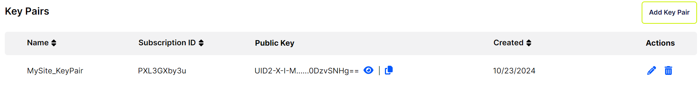
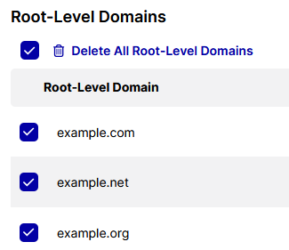
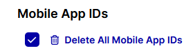

import Link from '@docusaurus/Link';

# Client-side integration

:::note
これらの手順は Client-Side の実装向けです。UID2 の実装が Client-Server または Server-Side である場合は、異なる値を設定する必要があります。詳細は、[API keys](api-keys.md) を参照してください。
:::

UID2 Portal では、Client-Side でトークンを生成する実装オプションを使用する場合、実装タイプに該当する以下の値を定義する必要があります:

| Value | Implementation Type | Details | Documentation Link |
| :--- | :--- | :---| :---|
| Key pair | すべて (Web または Mobile) | 少なくとも 1 つ。実装では、公開鍵を共有します。 | [Subscription ID と公開鍵](../getting-started/gs-credentials.md#subscription-id-and-public-key) |
| Domain | Web | 少なくとも 1 つ。提供する必要があるのは、ルートレベルドメインの完全なリストです。 | [Client-side web integrations](../getting-started/gs-account-setup.md#client-side-web-integrations) |
| Mobile App ID | Mobile | Android App ID、iOS/tvOS Bundle ID、iOS App Store ID など、モバイルアプリに適用される ID。 | [Client-side mobile integrations](../getting-started/gs-account-setup.md#client-side-mobile-integrations) |

:::important
サイトのルートレベルドメインとモバイルアプリ ID の完全なリストを提供することが重要です。これは Client-Side の実装にのみ関連するセキュリティ対策です。UID2 Portal で定義されていないドメインやアプリからの UID2 Token リクエストは失敗します。
:::

Client-Side インテグレーションページでは、これらの値を設定および管理するためのすべてのアクティビティを実行できます。次の内容が含まれます:
- [Adding and managing key pairs](#adding-and-managing-key-pairs)
- [Adding and managing root-level domains](#adding-and-managing-root-level-domains)
- [Adding and managing mobile app ids](#adding-and-managing-mobile-app-ids)

:::note
Client-Side インテグレーションページに移動すると、少なくとも 1 つのキーペアと、少なくとも 1 つのルートレベルドメインまたはモバイルアプリ ID を作成していない場合、不足している構成項目を提供するよう促されます。
:::

## Client-side implementation options

Client-Side の実装オプションは、次の表に示すとおりです。利用可能なオプションは、役割によって異なります。

| Client-Side Implementation Option | Available For (Role) | Documentation Link |
| :--- | :--- | :--- |
| UID2 JavaScript SDK | パブリッシャー、広告主 | [Client-side integration guide for JavaScript](../guides/integration-javascript-client-side.md) |
| Prebid.js client-side integration | パブリッシャーのみ |[UID2 client-side integration guide for Prebid.js](../guides/integration-prebid-client-side.md) |
| UID2 Mobile SDK | パブリッシャーのみ |[UID2 client-side integration guide for mobile](../guides/integration-mobile-client-side.md) |

## Adding and managing key pairs

:::note
このキーペアによって UID2 Service に識別されますが、その値は秘密ではありません。このキーペアは安全に保管する必要はなく、共有することも可能です。これは Client-Side での実装での使用を目的としているためです。
:::

Client-Side インテグレーションページでは、キーペアを設定および管理するための次のアクティビティを実行できます:

- [Adding a key pair](#adding-a-key-pair)
- [Copying or viewing a public key](#copying-or-viewing-a-public-key)
- [Changing the name of a key pair](#changing-the-name-of-a-key-pair)
- [Deleting a key pair](#deleting-a-key-pair)

:::important
キーペアを作成する際には、ルートレベルのドメイン名またはモバイルアプリ ID を追加する必要があります。順序は問いません。キーペアを最初に作成しても問題ありませんが、Client-Side のインテグレーションを構成するには、両方の手順を完了する必要があります。
:::

### Adding a key pair

キーペアを追加するには、次の手順を実行します:

1. UID2 Portal アカウントにログインします。
1. **Client-Side Integration** ページに移動し、Key Pair セクションにある **Add Key Pair** をクリックします。
1. **Add Key Pair** オーバーレイで名前を入力し、**Add Key Pair** をクリックします。

   キーペアは自動的に生成されます。**Client-Side Integration** ページで、新しいキーペアが名前、Subscription ID、Public Key、作成日付とともに表示されます。次の例を参照してください。

   

### Copying or viewing a public key

Client-Side インテグレーションページでキーペアを作成すると、公開鍵を共有できます。UID2 Service は、メッセージを認証するために、対応する秘密鍵と他の値を使用します。

Public Key を表示またはコピーするには、次の手順を実行します:

1. UID2 Portal で、**Client-Side Integration** ページに移動します。
1. リストでキーペアを見つけ、次のいずれかを実行します:

   - **Public Key** 列の  (View Public Key アイコン) をクリックして、ポップアップでキーを表示します。
   - **Public Key** 列の  (Copy Public Key to Clipboard アイコン) をクリックします。

     公開鍵を安全な場所に保存します。

### Changing the name of a key pair

キーペアを作成した後は、名前のみを変更できます。値を変更するには、新しいキーペアを作成する必要があります。

キーペアの名前を変更するには、次の手順を実行します:

1. UID2 Portal で、**Client-Side Integration** ページに移動します。
1. リストでキーを見つけます。
1. **Actions** 列で  (Edit アイコン) をクリックします。
1. 名前を更新し、**Save Key Pair** をクリックします。

### Deleting a key pair

キーペアを削除するには、次の手順を実行します:

1. リストでキーを見つけ、**Actions** 列で  (Delete アイコン) をクリックします。
1. 確認メッセージで、キーペアを削除することを確認するために Subscription ID を入力します。画面からコピーして貼り付けることができます。
1. **Delete Key Pair** をクリックします。

   キーペアはリストから削除され、有効ではなくなります。

## Adding and managing root-level domains

Client-Side インテグレーションページでは、次のアクティビティを実行して、ドメインを設定および管理できます:

- [Adding domains](#adding-domains)
- [Updating a domain](#updating-a-domain)
- [Deleting a domain](#deleting-a-domain)
- [Deleting multiple domains](#deleting-multiple-domains)

### Adding domains

ルートレベルのドメイン名の完全なリストを提供することが重要です。UID2 Token リクエストは、UID2 Portal で設定されたドメインからのみ受け付けられます。

:::tip
ルートレベルドメインのみがアカウント設定に必要です。たとえば、example.com、shop.example.com、example.org の Client-Side でトークンを生成するために UID2 を実装する場合、ドメイン名 example.com と example.org だけを提供します。
:::

1 つ以上のルートレベルドメインを追加するには、次の手順を実行します:

1. UID2 Portal アカウントにログインします。
1. **Client-Side Integration** ページに移動し、**Add Domains** をクリックします。
1. **Add Domains** オーバーレイで、ドメインのリストを入力または貼り付けます。Note:

   - リストの区切り文字として、次のものが有効です: カンマ、セミコロン、スペース、タブ、または改行。
   - ドメインはデフォルトで既存のリストに追加されます。既存のリストを置き換える場合は、**Replace all existing domains with the new ones** をチェックします。

1. **Add Domains** をクリックします。
   
      **Client-Side Integration** ページが更新されます。

### Updating a domain

リスト上のドメイン名を更新するには、次の手順を実行します:

1. UID2 Portal で、**Client-Side Integration** ページに移動します。
1. **Root-Level Domains** セクションで、更新するドメインを見つけます。必要に応じて、検索ツールを使用してリスト内を検索します。
1. Actions 列で  (Edit アイコン) をクリックします。
1. 名前を更新し、**Save Domain** をクリックします。

### Deleting a domain

ドメインをドメインリストから削除するには、次の手順を実行します:

1. UID2 Portal で、**Client-Side Integration** ページに移動します。
1. **Root-Level Domains** セクションで、削除するドメインを見つけます。必要に応じて、検索ツールを使用してリスト内を検索します。
1. **Actions** 列で  (Delete アイコン) をクリックします。
1. 確認メッセージで、**Delete Domain** をクリックします。

   ドメインはドメインリストから削除されます。

### Deleting multiple domains

一度に複数のドメインを削除するには、次の 2 つの方法があります:

- リストから複数の個々の値を選択して、選択したドメインを削除します。
- 追加する更新されたリストで既存のリストを置き換えます。[Adding domains](#adding-domains) を参照してください。

複数のドメインを削除するには:

1. UID2 Portal で、**Client-Side Integration** ページに移動します。
1. ページの **Root-Level Domains** セクションで、見出しの下にあるチェックボックスを選択します。

   削除アイコンが表示され、すべてのドメインが削除対象として選択されます。

   

1. 条件付き: いくつかのドメインを保持する場合は、それらのドメインのチェックボックスをクリアします。

1. リストの上で、 Delete Root-Level Domain/Delete Root-Level Domains/Delete All Root-Level Domains (選択に応じて) をクリックします。

1. 確認メッセージで、**Delete Domains** をクリックします。

   ドメインはドメインリストから削除されます。

## Adding and managing mobile app ids

Client-Side インテグレーションページでは、モバイルアプリ ID を設定および管理するための次のアクティビティを実行できます:

- [Adding mobile app ids](#adding-mobile-app-ids)
- [Updating a mobile app ID](#updating-a-mobile-app-id)
- [Deleting a mobile app ID](#deleting-a-mobile-app-id)
- [Deleting multiple mobile app ids](#deleting-multiple-mobile-app-ids)

### Adding mobile app ids

すべてのモバイルアプリ ID の完全なリストを提供することが重要です。これには、以下が含まれます。
- Android App ID: 該当するもの。
- iOS/tvOS Bundle ID and corresponding iOS App Store ID: 該当するもの。

:::important
UID2 Token リクエストは、UID2 Portal に該当する ID が追加されているソースからのみ受け付けられます。
:::

1 つ以上のモバイルアプリ ID を追加するには、次の手順を実行します:

1. UID2 Portal アカウントにログインします。
1. **Client-Side Integration** ページに移動し、**Mobile App IDs** セクションで **Add Mobile App IDs** をクリックします。
1. **Add Mobile App IDs** オーバーレイで、モバイルアプリ ID のリストを入力または貼り付けます。Note:

   - リスト内の値の区切り文字として、次のものが有効です: カンマ、セミコロン、スペース、タブ、または改行。
   - 追加する ID はデフォルトでリストに追加されます。既存のリストを置き換える場合は、**Replace all existing mobile app IDs with the new ones** をチェックします。

1. **Add Mobile App IDs** をクリックします。

   **Client-Side Integration** ページでリストが更新されます。

### Updating a mobile app ID

リスト上のモバイルアプリ ID の名前を変更するには、次の手順を実行します:

1. UID2 Portal で、**Client-Side Integration** ページに移動します。
1. **Mobile App IDs** セクションで、更新する ID を見つけます。必要に応じて、検索ツールを使用してリストを検索します。
1. Actions 列で  (Edit アイコン) をクリックします。
1. 名前を更新し、**Save Mobile App ID** をクリックします。

### Deleting a mobile app ID

リストからモバイルアプリ ID を削除するには、次の手順を実行します:

1. UID2 Portal で、**Client-Side Integration** ページに移動します。
1. **Mobile App IDs** セクションで、削除する ID を見つけます。必要に応じて、検索ツールを使用してリストを検索します。
1. Actions 列で  (Delete アイコン) をクリックします。
1. 確認メッセージで、**Delete Mobile App ID** をクリックします。

   エントリはモバイルアプリ ID リストから削除されます。

### Deleting multiple mobile app ids

一度に複数のモバイルアプリ ID を削除するには、次の 2 つの方法があります:

- リストから複数の個々の値を選択して、選択したモバイルアプリ ID を削除します。
- 追加する更新されたリストで既存のリストを置き換えます。[Adding mobile app ids](#adding-mobile-app-ids) を参照してください。

複数のモバイルアプリ ID を削除するには:

1. UID2 Portal で、**Client-Side Integration** ページに移動します。
1. **Mobile App IDs** セクションで、見出しの下にあるチェックボックスを選択します。

   削除アイコンが表示され、すべてのモバイルアプリ ID が削除対象として選択されます。

   

1. 条件付き: いくつかのモバイルアプリ ID を保持する場合は、それらのエントリのチェックボックスをクリアします。

1. リストの上で、 Delete Mobile App ID/Delete Mobile App IDs/Delete All Mobile App IDs (選択に応じて) をクリックします。

1. 確認メッセージで、**Delete Mobile App IDs** をクリックします。
