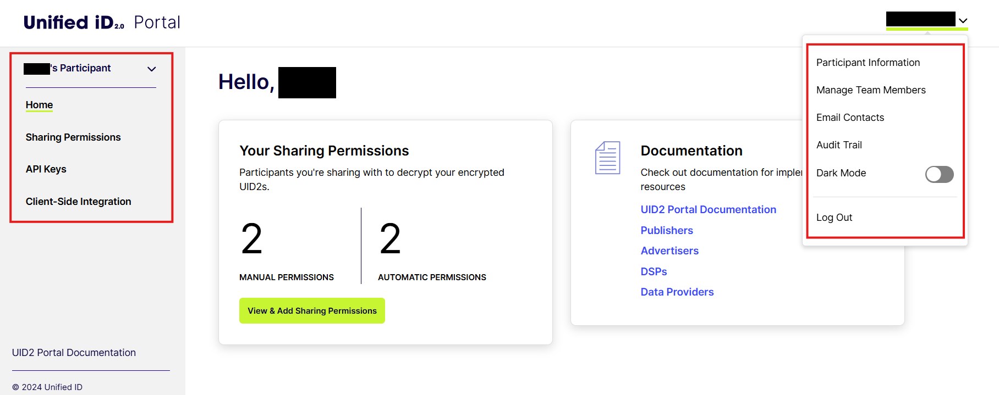

import Link from '@docusaurus/Link';

# UID2 Portal: Overview

UID2 Portal は、UID2 アカウントを設定・構成するためのワンストップショップです。このセルフサービスポータルでは、UID2 参加のための基本的な設定手順をすべて完了することができます。各アクティビティの詳細は、以下のリンクをクリックしてください:

| Activity | Documentation Link |
| :--- | :--- | 
| アカウントのリクエスト、名前や場所などの基本的なアカウント情報の設定、初回ログイン、パスワードのリセットを行います。 | [Getting Started with the UID2 Portal](portal-getting-started.md) |
| プロフィールを確認します。 | [Participant Information](participant-info.md) |
| Server-Side または Client-Server インテグレーション: API Key の管理、キーの追加、変更、削除などを行います。 | [API Keys](api-keys.md) |
| Client-Side インテグレーションのみ: Client-Side で UID2 Token を生成するために必要な値を設定し、管理します。 | [Client-Side Integration](client-side-integration.md) |
| 個々の共有参加者または共有参加者のグループの権限を構成します。 NOTE: 共有の使用には API Key ([API Keys](api-keys.md) を参照) または Client-Side キーペア ([Client-Side Integration](client-side-integration.md) を参照) が必要です。共有権限を設定する前にこれらの値を構成してください。 | [Sharing Permissions](sharing-permissions.md) |
| アカウントを管理する権限を持つチームメンバーを追加します。 | [Team Members](team-members.md) |
| ニュースやアップデートを通知する指定メール連絡先を設定します。 | [Email Contacts](email-contacts.md) |
| 現在の参加者、またはその代理人によって実行された過去のすべてのアクションの詳細なログを表示します。 | [Audit Trail](audit-trail.md) |
| Portal から指示があった場合は、パスワードを変更してください。 | [Password Change Requirement](portal-getting-started.md#password-change-requirement) |

## Access the UID2 Portal

Portal にアクセスするには、UID2 の担当者にアカウントを作成する権限をリクエストしてください。リクエストにはいくつかの情報が必要です: [Request an Account](portal-getting-started.md#request-an-account) を参照してください。

担当者は、開始するためのリンクを送信します。

UID2 Portalの URL: [https://portal.unifiedid.com/](https://portal.unifiedid.com/)

### UID2 Portal Structure

UID2 Portal はナビゲーションが簡単になるように構造化されています。

ページにアクセスするための 2 つの主要な方法が次の画像に示されています:

左サイドバーの上部に、現在の参加者の名前が表示されます。アカウントが複数の参加者にアクセスできる場合、アクセスできる参加者のドロップダウンリストが表示されます。これを使用して、参加者間を切り替えることができます。

:::important
UID2 Portal で実行する操作（チームメンバーの追加、ドメイン、API キーの追加など）は、左側に表示されている現在の参加者のコンテキストで行われます。複数の参加者にアクセスできる場合は、正しいコンテキストで操作を実行してください。詳細は、[Participant Switcher](#participant-switcher) を参照してください。
:::

左サイドバーをスクロールすると、アカウントの構成に関連する以下のページにアクセスできます:

- Home: ホームページへのリンク、常に表示されます。
- [Sharing Permissions](sharing-permissions.md)
- [API Keys](api-keys.md)
- [Client-Side Integration](client-side-integration.md)

左のサイドバーの上部に名前が表示されます。

ここから、個人のアカウント設定と日常のアクティビティに関連する以下のページにアクセスできます:

- [Participant Information](participant-info.md)
- [Manage Team Members](team-members.md)
- [Email Contacts](email-contacts.md)
- [Audit Trail](audit-trail.md) (Admin ユーザーのみ)
- Dark Mode: Dark モードをオンまたはオフに切り替えます。Dark モードの設定は、次回のセッションに適用されます。
- [Log Out](portal-getting-started.md#log-out)

## Set Up Your Account

アカウントの設定については、[Getting Started with the UID2 Portal](portal-getting-started.md) を参照してください。

## Participant Switcher

ほとんどの場合、各ユーザーは 1 つの UID2 共有参加者のデータにアクセスできます。ただし、個々のユーザーが複数の参加者のチームに所属している場合があります。この場合、ユーザーは参加者間を切り替えることができます。

現在の参加者は、左サイドバーの上部に表示されます。現在のユーザーが複数の参加者のチームに所属している場合、矢印が表示され、ユーザーは正しい参加者のコンテキストで操作を実行するために参加者間を切り替えることができます。

図については、[UID2 Portal Structure](#uid2-portal-structure) を参照してください。

ユーザーがログアウトすると、最新の参加者の選択が保存され、次回ユーザーがログインすると適用されます。
