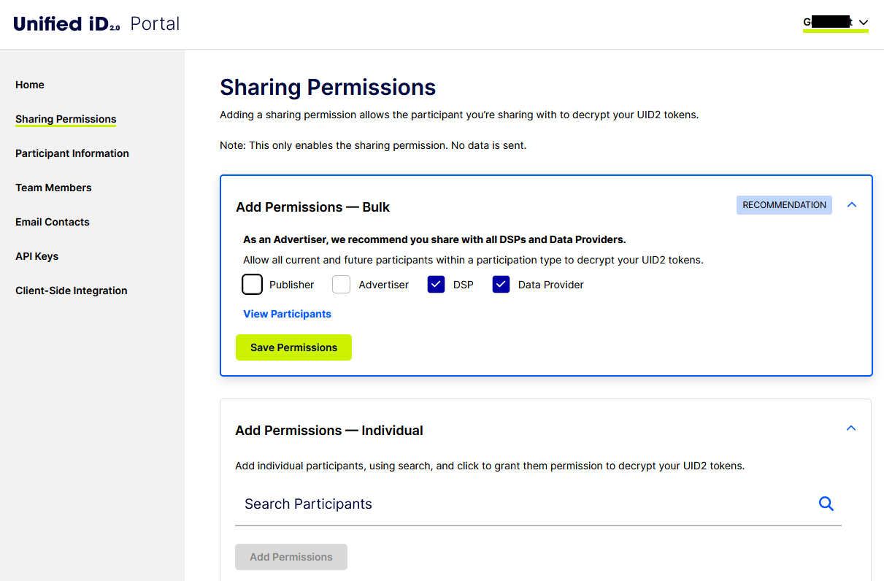

import Link from '@docusaurus/Link';

# Sharing Permissions

共有権限を設定すると、他の UID2 <Link href="../ref-info/glossary-uid#gl-sharing-participant">共有参加者</Link>と UID2 を共有できるようになります。共有権限を追加すると、共有先の参加者が UID2 Token を <Link href="../ref-info/glossary-uid#gl-raw-uid2">raw UID2</Link> に復号化できるようになります。

:::tip
UID2 Portal での共有権限の設定は、<Link to="../ref-info/glossary-uid#gl-tokenized-sharing">Tokenized Sharing</Link>に使用されます。raw UID2 を共有するためのものではありません。詳細は、[UID2 Sharing Approaches](../sharing/sharing-overview.md#uid2-sharing-approaches)を参照してください。
:::

期待した通りの共有関係を作成するためのさまざまなオプションがあります:

- **Bulk Recommendations**: 1 回のクリックで、複数のカテゴリ (Publisher、Advertiser、DSP、または Data Provider) の現状、および将来の参加者と共有することを受け入れることができます。詳細は、[Add Sharing Permissions&#8212;Bulk](#add-permissionsbulk)を参照してください。

  推奨事項は、アカウント設定で指定された参加者タイプに基づいています。詳細は、[Participant Information](participant-info.md)を参照してください。
- **Sharing Categories**: 一括設定を行わず、設定した複数のカテゴリー (Publisher、Advertiser、DSP、または Data Provider) の現状、および将来の参加者と共有することを受け入れることができます。
- **Individual Sharing Relationships**: 現在の参加者との共有関係を作成できます。このオプションを選択すると、将来の参加者に対しては手動で共有権限を追加する必要があります。

:::note
他の参加者との共有限限の設定は、データの共有を意味しません。これは、UID2 Token を raw UID2 に復号化できるようにするだけです。情報は、明示的に他の参加者に送信するか、他の参加者が送信する場合にのみ共有されます。
:::

## Sharing Permissions Overview

共有権限に関する重要な情報は次のとおりです:

- 共有権限を設定すると、データは共有されません。
- 共有権限を有効にすると、選択した共有参加者が復号化キーにアクセスできるようになります。共有権限を有効にした各参加者は、UID2 SDK または Snowflake インテグレーションを介して、送信した UID2 Token を raw UID2 に復号化できます。
- 共有権限はいつでも更新できます。共有権限を削除すると、次回の復号化キーの更新時に、これらの参加者と復号化キーが共有されなくなります。詳細は、[Deleting Sharing Permission](#deleting-sharing-permission)を参照してください。
- When you choose bulk settings, you're choosing to share with a group of sharing participants, defined by role. if you configure bulk permissions, you'll automatically share with any new members of a group you've selected.
- When you configure individual sharing permissions, future participants are not affected. To create relationships with future participants, you'll need to update your sharing permissions manually.

## Getting Started

送信者は、UID2 Token を raw UID2 に復号化できるようにするため、受信者に権限を付与する必要があります。共有権限は、UID2 Portal を介して定義されます。

UID2 Portal へのアクセスについては、UID2 の担当者にお問い合わせください。詳細は、[Request an Account](portal-getting-started.md#request-an-account)を参照してください。UID2 が初めての場合は、[Account Setup](../getting-started/gs-account-setup.md)を参照してください。

:::note
共有機能を使用するには、API キー (詳細は、[API Keys](api-keys.md)を参照) またはクライアントサイドキーペア (詳細は、[Client-Side Integration](client-side-integration.md)を参照) を設定してください。
:::

## Sharing Options

UID2 Portal では、次の共有オプションが利用可能です。これらのオプションは相互に排他的ではありません&#8212;必要に応じて組み合わせることができます。

- 特定のタイプの参加者全員に自動的に権限を付与できます。たとえば、すべてのパブリッシャー、広告主、DSP、またはデータプロバイダーに権限を付与することができます。たとえば、パブリッシャーはすべての DSP に共有権限を付与することを勧めます。

  このオプションを選択すると、選択した参加者タイプのすべての新規参加者が、送信したデータを復号化する権限を自動的に取得します。詳細は、[Add Sharing Permissions&#8212;Bulk](#add-permissionsbulk)を参照してください。

- 複数の特定の参加者に権限を付与できます。[Add Permissions&#8212;Individual](#add-permissionsindividual)を参照してください。
 
UID2 Portal でいつでも共有権限を更新できます。

:::note
共有権限を有効にすると、選択した共有参加者が復号化キーにアクセスできるようになります。共有権限を有効にした各参加者は、UID2 SDK または Snowflake インテグレーションを介して、送信した UID2 Token を raw UID2 に復号化できます。ただし、権限を付与することは最初のステップに過ぎません。共有するためには、トークンを参加者に送信する必要があります。UID2 Portal は権限を有効にしますが、データの送信はユーザーの責任です。
:::

## Add Permissions&#8212;Bulk

:::tip
一括設定を行うと、選択したグループの新規メンバーと自動的に共有するようになります。
:::

UID2 Portal は、次の役割に応じた推奨事項を示します:

- パブリッシャー: DSP と共有
- 広告主: DSP およびデータプロバイダーと共有
- DSP: 広告主およびデータプロバイダーと共有
- データプロバイダー: パブリッシャー、広告主、DSPと共有

<!-- The UID2 Portal makes recommendations based on your role. For example:
- If you're a publisher, you could share with all DSPs (current and future).
- If you're an advertiser, you could share with all data providers (current and future).
- If you’re a DSP, you could share with all advertisers and all data providers (current and future). 
- If you’re a data provider, you could share with all advertisers, all publishers, and all DSPs (current and future).   -->

次の図は、広告主向けの推奨事項を示しています。

### Configure Current and Future Permissions

推奨事項を受け入れることが、共有オプションを設定する最も迅速かつ簡単な方法です。

例えば、20 の DSP すべてと共有することを選択した場合、次の日に DSP 21 が共有にサインアップすると、DSP 21 は自動的に送信したデータを復号化する権限を取得します。DSP 21 と共有するには、1 つ以上の UID2 トークンを送信するだけで、DSP 21 はトークンを raw UID2 に復号化できます。自動共有を選択したため、DSP 21 を含む共有権限を明示的に更新するためにログインする必要はありません。また、UID2 エコシステムにサインアップする将来の DSP についても同様です。

### View Participants

必要に応じて **View Participants** をクリックして、共有する参加者のリストを表示できます。変更を行うと、リストが更新されて選択内容が表示されます。完了したら、リストを閉じるために **Hide Participants** をクリックしてください。

次の例は、**View Participants** リストの一部を示しています。

希望すれば、1 つ以上の共有参加者と個別の共有関係を設定できます。

## Add Permissions&#8212;Individual

特定の共有関係を作成してたい場合は、**Add Permissions&#8212;Individual** をクリックして、共有参加者を見つけて追加してください。

ここの権限を設定する際の一般的な情報は次のとおりです:
- 複数の参加者タイプに対して一括権限を指定した場合、これらの権限を個別の共有権限として設定することはできません。
- 一括権限で選択していない参加者タイプについて、個別の権限を設定することができます。
- 一括ではなく個別の共有権限を設定する場合、将来の参加者は影響を受けません。将来の参加者との関係を作成するには、共有権限を手動で更新する必要があります。
- 個々の参加者を表示するには、検索を使用します。詳細は、[Use Filters to Add Individual Permissions](#use-filters-to-add-individual-permissions)を参照してください。
- 特定の種類の参加者を検索して追加するには、検索機能を使用します。詳細は、[Use Search to Add Individual Permissions](#use-search-to-add-individual-permissions)を参照してください。

### Use Search to Add Individual Permissions

共有関係を作成するために特定の参加者を見つけたい場合は、検索機能を使用してください。

[the Search icon](images/icon-magnifying-glass-solid.png) (the Search icon) をクリックして、参加者の名前を入力してください。入力すると、一致する結果が表示されます。

次の例は、最初の 2 文字を入力した後の検索結果を示しています:

選択内容を更新すると、**Add Permissions** ボタンが有効になります。

また、フィルタを使用して参加者タイプを限定することもできます。詳細は、[Use Filters to Add Individual Permissions](#use-filters-to-add-individual-permissions)を参照してください。

### Use Filters to Add Individual Permissions

個々の権限を設定する際に、フィルタを使用して、共有する 1 つ以上の個別の参加者を定義できます。フィルタは、利用可能な共有参加者のリストに適用されます:

利用可能な共有参加者のリストには、次のフィルタがあります:
- Advertiser
- Data Provider
- DSP
- Publisher

いくつかのシナリオを次に示します:
- １社を除くすべてのデータプロバイダーと共有したい場合は、次の手順に従ってください:
  1. Individual Permissions に移動します。
  2. **Search Participants** バーをクリックし、**Data Provider** フィルタをクリックします。
  3. すべてのデータプロバイダーのチェックボックスをクリックします。
  4. 共有したくない会社のチェックボックスをクリックします。
  5. 保存: [Saving Your Choices](#saving-your-choices)を参照してください。
- 特定の広告主と DSP と共有したい場合は、次の手順に従ってください:
  1. Individual Permissions に移動します。
  2. **Advertiser** と **DSP** のフィルタをクリックします。すべての広告主と DSP が表示されます。
  3. チェックボックスをクリックして、共有パートナーを選択します。
  4. 保存: [Saving Your Choices](#saving-your-choices)を参照してください。

### Saving Your Choices

選択内容を保存するには、**Add Permissions** をクリックしてください。変更内容を確認するためのリストが表示されます。次の例は、実際の参加者名が隠されています:

変更を確定するには、**Save** をクリックしてください。

共有権限はいつでも更新できます。

:::note
個々のアクセス権を設定して共有関係を作成すると、現在の権限が作成されますが、将来の権限は作成されません。将来の参加者を含めるためには、一括権限を使用する以外に方法はありません。
:::

## Deleting Sharing Permission

共有権限を削除する方法はいくつかあります:

- 一括権限:

  ページの **Add Permissions&#8212;Bulk** セクションで、共有したくない参加者グループのチェックボックスをクリアし、**Save Permissions** をクリックします。
- グループごとの個別の権限:

  ページの **Add Permissions&#8212;Individual** セクションで、**Your Sharing Permissions** の下にある **Participant Type** ドロップダウンをクリックし、1 つ以上の参加者タイプを選択します:
  
  

  次の例のように、削除したい参加者を指定するために、トップのチェックボックスをクリックし、またはリストをカスタマイズし、**Delete Permissions** をクリックします。

  
  
  **Are you sure...** プロンプトで **Delete Permissions** をクリックして確認してください。
- 共有者ごとの個別の権限:

  ページの **Add Permissions&#8212;Individual** セクションで、共有したくない 1 つ以上の参加者を見つけ、**Actions** 列で  (the Delete icon) をクリックします。**Are you sure...** プロンプトで **Delete Permissions** をクリックして確認してください。

:::note
 共有権限を削除すると、次回の復号化キーの更新時に、これらの参加者と復号化キーが共有されなくなります。即時ではありませんが、迅速に行われます。詳細は、[Decryption Key Refresh Cadence for Sharing](../sharing/sharing-best-practices.md#decryption-key-refresh-cadence-for-sharing)を参照してください。
:::
