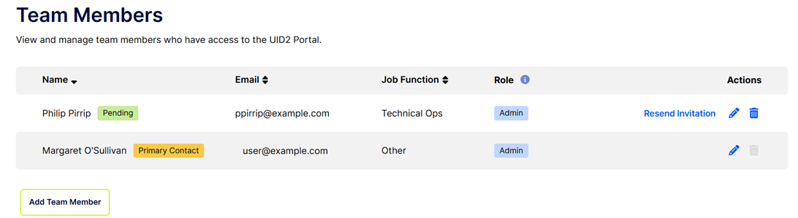

import Link from '@docusaurus/Link';

# Team Members

UID2 Portal の **Team Members** ページでは、Admin 権限を持つユーザーが、アカウントへのアクセスを許可する個人の設定に関連するすべてのアクティビティを実行できます。これには、次の操作が含まれます:

- [Add a Team Member](#add-a-team-member)
- [Set the Primary Contact](#set-the-primary-contact)
- [Resend an Invitation to a Team Member](#resend-an-invitation-to-a-team-member) 
- [Edit Information for a Team Member](#edit-information-for-a-team-member) 
- [Remove a Team Member](#remove-a-team-member)

## Accessing the Team Members Page

Team Member ページにアクセスするには、UID2 Portal ユーザーインターフェースの右上にある名前が表示されている場所に移動し、下矢印をクリックして **Manage Team Members** を選択します。

各 Team Member について、次の情報が表示されます:
- Name

  招待されたがまだ承認されていない場合、名前の後に **Pending** タグが表示されます。
- Email
- Job Function
- Role
- Actions: 
  - すべての人が利用可能:  (Edit) と  (Delete)。
  - ユーザーが招待されたがまだ承認されていない場合、**Resend Invitation** リンクも利用可能です。

Team Member のうち、主要な連絡先であるメンバーには、名前の後にタグが表示されます。

例は、[Resend an Invitation to a Team Member](#resend-an-invitation-to-a-team-member) を参照してください。

## User Roles

各 Team Member は、次の表に示す役割のいずれかを担います。

| Role | Actions |
| :--- | :--- |
| Admin | Admin 権限を持つユーザーは、[UID2 Portal Overview](portal-overview.md) に記載されているように、現在の参加組織に関連する UID2 参加に関連するすべてのアクティビティを実行できます。 |
| Operations | Operation 権限を持つユーザーは、Admin ユーザーとほぼ同じアクションを実行できます。ただし、いくつかの制限があります:<ul><li>Team Member を追加、変更、削除することはできません。代わりに、[Team Members](team-members.md) ページには読み取り専用アクセスがあります。</li><li>[Audit Trail](audit-trail.md) ページを表示できません。</li></ul> |

ユーザー権限は、Admin 権限を持つユーザーのみが変更できます。詳細は、[Edit Information for a Team Member](#edit-information-for-a-team-member) を参照してください。

## Add a Team Member

Team Member を追加するには、次の手順を実行します:

1. UID2 Portal アカウントでログインします。
1. 右上にある下矢印をクリックし、**Manage Team Members** を選択します。
1. **Add Team Member** をクリックします。
1. 姓、名、メールアドレス、職務、役割を入力します。役割の詳細については、[User Roles](#user-roles) を参照してください。
1. オプション: このユーザーを主要な連絡先として設定するには、**Set as primary contact** ボックスをチェックします。主要な連絡先には Admin 権限が必要です。詳細は、[Set the Primary Contact](#set-the-primary-contact) を参照してください。
1. **Save Team Member** をクリックします。

   Team Member がリストに追加され、保留中のステータスで、招待メールが招待された人に送信されます。

:::note
同じチームメンバーを複数の参加者に追加できます。複数の参加者に属するチームメンバーは、[UID2 Portal Structure](portal-overview.md#uid2-portal-structure) に示されているように、参加者間を切り替えることができます。
:::

## Set the Primary Contact

各チームには、UID2 に関するコミュニケーションの主な窓口となる主要な連絡先がいます。

主要な連絡先に関する重要な情報は次のとおりです:

- デフォルトでは、最初のチームメンバーが追加されると、その人が主要な連絡先になります。
- 主要な連絡先は Admin 権限を持っている必要があります。
- 現在の主要な連絡先を削除するか、その人の役割を Operations に変更するには、最初に別のチームメンバーを主要な連絡先として指定する必要があります。
- チームメンバーのリストには、主要な連絡先の名前の後にタグが表示されます。例については、[Resend an Invitation to a Team Member](#resend-an-invitation-to-a-team-member) を参照してください。

主要な連絡先を設定するには、次の手順を実行します:

1. UID2 Portal アカウントでログインします。
1. 右上にある下矢印をクリックし、**Manage Team Members** を選択します。
1. 次のいずれかの操作を行います:

   - 既存のチームメンバーを主要な連絡先として設定するには: リストからそのチームメンバーを見つけ、 (Edit アイコン) をクリックします。**Set as primary contact** をチェックし、必要に応じて役割を Admin に更新し、変更を保存します。
   - 新しいチームメンバーを主要な連絡先として追加するには: [Add a Team Member](#add-a-team-member) の手順に従います。**Set as primary contact** をチェックし、役割を Admin に設定し、変更を保存します。

## Resend an Invitation to a Team Member

Team Member を追加した場合、招待状を再送する必要がある場合があります。たとえば、Team Member が招待状を受け取っていないか、誤って削除したか、招待状の有効期限が切れている場合などです。

ユーザーが招待されたがまだ承認されていない場合、Team Members リストには、次の図に示すような追加情報が表示されます:

- 氏名の後に **Pending** ラベルが表示されます。
- **Resend Invitation** リンク。

Team Member 宛に招待状を再送信するには、次の手順を実行します:

1. UID2 Portal アカウントでログインします。
1. 右上にある下矢印をクリックし、**Manage Team Members** を選択します。
1. リストから Team Member を見つけ、Actions 列で **Resend Invitation** をクリックします。

   ステータスが **Invitation Sent** に更新され、新しい招待状が送信されます。

:::note
招待状が送信されたがまだ承認されていない場合にのみ、Resend Invitation リンクが表示されます。
:::

## Edit Information for a Team Member

役割に関する注意事項:
- Admin 権限を持つユーザーは、参加組織内の任意の Team Member について、これらの値を更新できます。
- Operation 権限を持つユーザーは、Team Members ページを表示できますが、情報を変更することはできません。

Team Member の情報を編集するには、次の手順を実行します:

1. UID2 Portal アカウントでログインします。
1. 右上にある下矢印をクリックし、**Manage Team Members** を選択します。
1. リストから Team Member を見つけ、Actions 列で  (Edit) をクリックします。
1. 以下の値を更新します:
   - 名
   - 姓
   - 職務
   - 役割: 役割についての詳細は、[User Roles](#user-roles) を参照してください。
   
   **Note**: 既存の Team Member のメールアドレスを更新することはできません。メールアドレスを変更する必要がある場合は、新しいメールアドレスを使用して新しい Team Member を追加します。これにより、メールアドレスの確認プロセスが正しく実行されます。このシナリオでは、古いメールアドレスの既存エントリも削除することを忘れないでください。
1. 変更内容を保存します。

## Remove a Team Member

チームから誰かを削除するには、次の手順に従います:

1. UID2 Portal アカウントでログインします。
1. 右上にある下矢印をクリックし、**Manage Team Members** を選択します。
1. リストから Team Member を見つけ、Actions 列で  (Delete) をクリックします。
1. 確認メッセージで **Remove Team Member** をクリックします。

   Team Member がチームから削除されます。

## Log In for the First Time as a Team Member

誰かがあなたを新しい Team Member として追加した場合、確認メールを送信します。メールアドレスを確認するために、次の手順に従ってください:

1. メールのリンクをクリックして招待を受け入れます。
1. 最初のデフォルトからパスワードを更新するためにクリックします。
1. 新しいパスワードを使用して UID2 Portal にログインします。これにより、アカウントが確認されます。
1. 最初のログイン時に、UID2 Sharing Portal の利用規約を確認して承認します。
