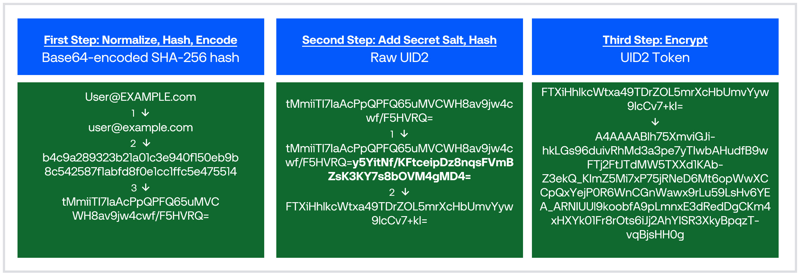

import Link from '@docusaurus/Link';

# How the UID2 Token Is Created

:::note
This article describes how the UID2 token that the publisher sends in the bidstream is created. The process is the same for advertisers creating UID2 tokens for conversion pixels. It does not apply to <Link href="../ref-info/glossary-uid#gl-tokenized-sharing">tokenized sharing</Link>, where raw UID2s are encrypted into UID2 tokens before sending to another sharing participant.
:::

When a publisher sends a user's <Link href="../ref-info/glossary-uid#gl-dii">DII</Link>&#8212;<Link href="../ref-info/glossary-uid#gl-hash">hashed</Link> or unhashed email addresses or phone numbers&#8212;to the UID2 Operator, and in return receives a <Link href="../ref-info/glossary-uid#gl-uid2-token">UID2 token</Link> to use for targeted advertising, there is a very specific sequence of processing steps that occurs along the way.

 Some preliminary steps are taken by the publisher, but most of the processing steps are done by the UID2 <Link href="../ref-info/glossary-uid#gl-operator">Operator</Link>.

It's very important that the publisher steps are performed in the correct sequence:
- When steps are performed in sequence, the resulting value can be recognized as related to other [UID2 identifiers](uid-infrastructure.md#uid2-identifier-types) generated from online activity by the same individual: the underlying [raw UID2](../ref-info/glossary-uid.md#gl-raw-uid2) matches the raw UID2s generated by other UID2 participants from the same DII, and therefore the token is suitable for targeted advertising.
- If steps are taken out of sequence, the resulting value cannot be related to other UID2 identifiers generated from online activity by the same individual, and therefore the token is not suitable for targeted advertising.

For a summary, see [Steps to Create a UID2 Token](#steps-to-create-a-uid2-token). For an example in diagram form, see [Creating a UID2 Token&#8212;Example](#creating-a-uid2-tokenexample).

## Steps to Create a UID2 Token

The following table shows the steps for creating a UID2 token from DII, the sequence, and who performs each step.

For an example with sample values, see [Creating a UID2 Token&#8212;Example](#creating-a-uid2-tokenexample).

<table width="100%">
  <thead>
    <tr>
      <th width="5%">Step</th>
      <th width="35%">Action</th>
      <th width="30%">Who Does It?</th>
      <th width="35%">Documentation</th>
    </tr>
  </thead>
  <tbody>
    <tr>
      <td>1</td>
      <td><Link href="../ref-info/glossary-uid#gl-normalize">Normalization</Link></td>
      <td>**Email**: Publisher or UID2 Operator **Phone number**: Publisher must normalize</td>
      <td>[Email Address Normalization](../getting-started/gs-normalization-encoding.md#email-address-normalization) [Phone Number Normalization](../getting-started/gs-normalization-encoding.md#phone-number-normalization)</td>
    </tr>
    <tr>
      <td>2</td>
      <td><Link href="../ref-info/glossary-uid#gl-sha-256">SHA-256</Link> hashing of normalized email address</td>
      <td>Publisher or UID2 Operator</td>
      <td>[Email Address Hash Encoding](../getting-started/gs-normalization-encoding.md#email-address-hash-encoding) [Phone Number Hash Encoding](../getting-started/gs-normalization-encoding.md#phone-number-hash-encoding)</td>
    </tr>
    <tr>
      <td>3</td>
      <td>Base64 encoding of SHA-256 hash</td>
      <td>Publisher or UID2 Operator</td>
      <td>[Email Address Hash Encoding](../getting-started/gs-normalization-encoding.md#email-address-hash-encoding) [Phone Number Hash Encoding](../getting-started/gs-normalization-encoding.md#phone-number-hash-encoding)</td>
    </tr>
    <tr>
      <td>4</td>
      <td>Send value to UID2 Operator via the [POST&nbsp;/token/generate](../endpoints/post-token-generate.md) endpoint, an SDK, Prebid.js, or another supported integration.</td>
      <td>Publisher</td>
      <td>Various: for a summary, see [Implementation Resources](../overviews/overview-publishers.md#implementation-resources)</td>
    </tr>
     <tr>
      <td>5</td>
      <td>Perform multiple steps including hashing and adding the secret <Link href="../ref-info/glossary-uid#gl-salt">salt</Link> value to create a raw UID2.</td>
      <td>UID2 Operator</td>
      <td>Not applicable: these steps are all performed by the UID2 Operator.</td>
    </tr>
     <tr>
      <td>6</td>
      <td>Encrypt the raw UID2 to create a UID2 token.</td>
      <td>UID2 Operator</td>
      <td>Not applicable: performed by the UID2 Operator.</td>
    </tr>
 </tbody>
</table>

## Creating a UID2 Token&#8212;Example

The following diagram shows the high-level steps for creating a [raw UID2](../ref-info/glossary-uid.md#gl-raw-uid2) (first column, second column) and then a [UID2 token](../ref-info/glossary-uid.md#gl-uid2-token) (third column).

The publisher can send a request to the [POST&nbsp;/token/generate](../endpoints/post-token-generate.md) endpoint or use one of the other integration options, such as an SDK or Prebid. Whatever the integration option, the result is a UID2 token&#8212;an encrypted value that the publisher can send in the bidstream for targeted advertising.

