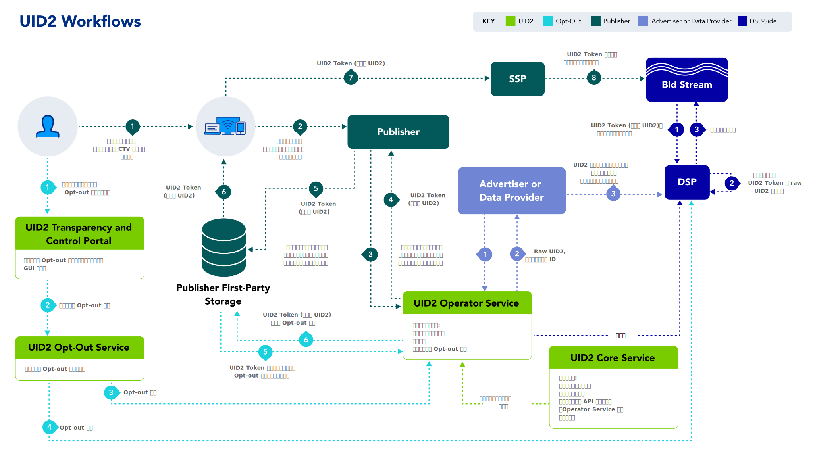

import Link from '@docusaurus/Link';

# UID2 Infrastructure

The following sections explain and illustrate the key elements of the UID2 framework infrastructure:

- [UID2 Identifier Types](#uid2-identifier-types)
- [UID2 Components](#uid2-components)
- [Workflows](#workflows)

### UID2 Identifier Types

UID2 is a deterministic ID that is based on <Link href="../ref-info/glossary-uid#gl-dii">directly identifying information (DII)</Link>, such as email address or phone number. There are two types of UID2s: raw UID2s and UID2 tokens (also known as advertising tokens). The following table explains each type.

| ID Type | Shared in Bidstream? | Description |
| :--- | :--- | :--- |
| **Raw UID2** | No | An unencrypted alphanumeric identifier created through the UID2 APIs or SDKs with the user's verifiable personal data, such as a hashed or unhashed email address or a phone number, as input. To avoid revealing the source data, the input value is hashed if it was not already hashed, and then hashed again using a secret <Link href="../ref-info/glossary-uid#gl-salt">salt</Link> value to create the raw UID2. The process that creates the raw UID2 is designed to create a secure, opaque value that can be stored by advertisers, third-party data providers, and demand-side platforms (DSPs). Raw UID2s are case sensitive. Example: A request for the raw UID2 for the fictitious email address `user@example.com` resulted in this value: `E2dxEv3oMBzNHPw5iUVmwH2Hv+60D4AXYe+2ge9U0No=`. |
| **UID2 Token (Advertising Token)** | Yes | An encrypted form of a raw UID2. UID2 tokens are generated from hashed or unhashed email addresses or phone numbers that are converted to raw UID2s and then encrypted to help ensure protection in the <Link href="../ref-info/glossary-uid#gl-bidstream">bidstream</Link>. UID2 tokens are designed to be used by publishers or publisher service providers. Supply-side platforms (SSPs) pass UID2 tokens in the bidstream and DSPs decrypt them at bid request time. UID2 tokens are case sensitive. Example: A request for a UID2 token for the fictitious email address `user@example.com` resulted in this value: `A4AAAAs6ZBcEbwAPoFhVV7CNW5W-4R-9TKDNL4RS0ctkw1U-IkNOXSnWczvwOMgCQaXHPf3Gd1o1W6IBmlZBFIloM67XOsOgwP5jUrQrclGkq1zBJJUJmOFTe6sJJA7pM1GP9gLd-hz5did6baZvcKd8DXkUYM-WALRZFnzHivu_1YEsC_CeXNdMexKDN7EwSQ6L5eZvOd1F1RkF_nLy_J0twg`. |

:::note
For the fictitious email address `user@example.com` used in these examples, the corresponding refresh token was: `AAAABrexFHvQVhNJqu+y/ua7rsgShF8e9NUXUJOZFmeFRD8TAsJadaLfOlLkwC5iSxcOKWFD9YwMBzbbcPa92CInba+bcPTaAFNmM2ZpIHgGy6lDcNPzvEnPQh/5fyZ3MD44SX/tHyIXa0R2OBAOLBA1A81r3jefhSsxZdyyBF58KtnaX6UbaeOEaguOfMnJdmhaPeWKj33v7vGfROWtxDWmi6wvGL5lHTX9H6iIZ9i1WSsemYPUgmoDOQeT7nzllJK968OECFj5LkCazDN3pCrYSeuJby9o0fMuSZNxzp6EVzi6XVED4ETtzpcaY0AArzzdh0IXV9MgH8jyg7bJSUWXQG+8kMPZzwbs9EB+7ddAUOLZL/GBna8Hm3Im03EjN3sJ`.
:::

### UID2 Components

The UID2 framework consists of the following components, all of which are currently managed by The Trade Desk.

| Component | Description |
| :--- | :--- |
| **Core Service** | A centralized service that manages access to <a href="../ref-info/glossary-uid#gl-salt">salts</a>, <a href="../ref-info/glossary-uid#gl-encryption-key">encryption keys</a>, and other relevant data in the UID2 ecosystem. | 
| **Operator Service** | A service that enables the management and storage of encryption keys and salts from the UID2 Core Service, hashing of users' personal data, encryption of raw UID2s, and decryption of UID2 tokens. There can be multiple instances of the service (public or private) operated by multiple [participants](../overviews/participants-overview.md#uid2-component-services), known as operators. <Link href="../ref-info/glossary-uid#gl-public-operator">Public Operators</Link> run publicly available instances of the <Link href="../ref-info/glossary-uid#gl-operator-service">Operator Service</Link> and make them available to all relevant UID2 participants. There might also be <Link href="../ref-info/glossary-uid#gl-private-operator">Private Operators</Link> that run private instances of the Operator Service exclusively for their own use. All instances are designed with protections to keep critical UID2 data secure and interoperable, regardless of who operates the service. |
| **Opt-Out Service** | A global service that manages and stores user opt-out requests and disseminates them to publishers, operator service instances, and DSPs. |
| **Transparency and Control Portal** | A user-facing website, [https://www.transparentadvertising.com/](https://www.transparentadvertising.com/), that allows consumers to opt out of UID2 at any time. |

### Workflows

The following table lists four key workflows in the UID2 framework with links to their high-level overviews. It also provides links to the respective integration guides, which include diagrams, integration steps, FAQs, and other relevant information for each workflow.

| Workflow | Intended Primary Participants | Integration Guides |
| :--- |:--- |:--- |
| [Workflow for DSPs](../overviews/overview-dsps.md#workflow-for-dsps) (Buy-Side) | DSPs who transact on UID2 tokens in the bidstream. | See [DSP Integrations](../guides/summary-guides#dsp-integrations) |
| [Workflow for Advertisers](../overviews/overview-advertisers.md#workflow-for-advertisers) and [Workflow for Data Providers](../overviews/overview-data-providers.md#workflow-for-data-providers) | Organizations that collect user data and push it to DSPs. | See [Advertiser/Data Provider Integrations](../guides/summary-guides#advertiserdata-provider-integrations) |
| [Workflow for Publishers](../overviews/overview-publishers.md#workflow-for-publishers) | Organizations that propagate UID2 tokens to the bidstream via SSPs.  NOTE: Publishers can choose to integrate using Prebid, leverage the SDK for JavaScript, or complete their own server-side integration without using an SDK. | See [Publisher Integrations](../guides/summary-guides#publisher-integrations) |
| [Opt-Out Workflow](../getting-started/gs-opt-out.md#opt-out-workflow) | Consumers who engage with publishers or their SSO providers and other identity providers. | N/A |

The following diagram summarizes all four workflows. For each workflow, the [participants](../overviews/participants-overview.md#uid2-external-participants), [components](../overviews/participants-overview.md#uid2-component-services), [UID2 identifier types](#uid2-identifier-types), and numbered steps are color-coded.

