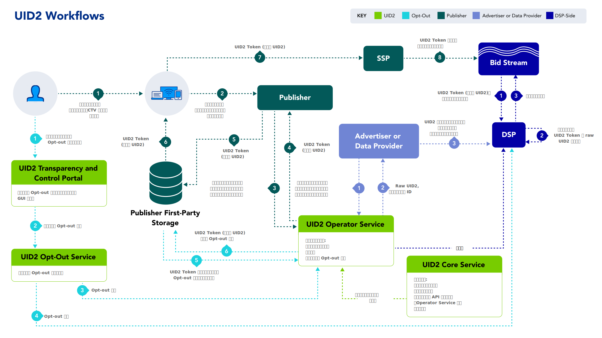

import Link from '@docusaurus/Link';

# UID2 workflows

以下の表は、UID2 フレームワークの 4 つの主要なワークフローを概要へのリンクとともに示しています。また、それぞれのワークフローに関する図、インテグレーション手順、FAQ、およびその他の関連情報を含むインテグレーションガイドへのリンクも提供しています。

| Workflow | Intended Primary Participants | Integration Guides |
| :--- |:--- |:--- |
| [Workflow for DSPs](../overviews/overview-dsps.md#workflow-for-dsps) (Buy-Side) | ビッドストリームで UID2 Token 取引を行う DSP。 | [DSP integrations](../guides/summary-guides#dsp-integrations) を参照 |
| [Workflow for advertisers](../overviews/overview-advertisers.md#workflow-for-advertisers) and [Workflow for data providers](../overviews/overview-data-providers.md#workflow-for-data-providers) | ユーザーデータを収集し、DSPに提供する組織。 | [Advertiser/data provider integrations](../guides/summary-guides#advertiserdata-provider-integrations) を参照 |
| [Workflow for publishers](../overviews/overview-publishers.md#workflow-for-publishers) | SSP を介して UID2 Token をビッドストリームに送る組織。  注意: パブリッシャーは、Prebid を使用したインテグレーション、SDK for JavaScript の活用、または SDK を使用しない独自の Server-Side インテグレーションを選択できます。 | [Publisher integrations](../guides/summary-guides#publisher-integrations) を参照 |
| [Opt-out workflow](../getting-started/gs-opt-out.md#opt-out-workflow) | パブリッシャーやその SSO プロバイダー、その他のアイデンティティプロバイダーと関わる消費者。 | N/A |

以下の図は、4 つのワークフローすべてをまとめたものです。各ワークフローについて、[外部参加者](../overviews/participants-overview.md#uid2-external-participants)、[コンポーネント](../ref-info/uid-components.md)、[UID2 識別子タイプ](../ref-info/uid-identifier-types.md)、および番号付きのステップが色分けされています。

