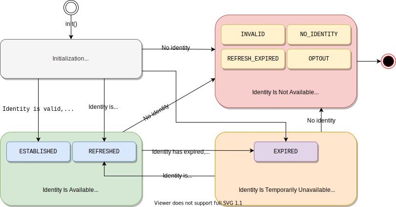

# Client-Side JavaScript SDK (v2)

この SDK を使用すると、UID2 を使用してクライアントの ID を確立し、Advertising Token を取得するプロセスを容易に行えます。以下のセクションでは、UID2 アイデンティティを確立するための大まかな [ワークフロー](#workflow-overview)、SDK [API reference](#api-reference) および [UID2 クッキー形式](#uid2-cookie-format) について説明しています。

- コンテンツパブリッシャーのインテグレーション手順は、[UID2 SDK Integration Guide](../guides/publisher-client-side.md) を参照してください。
- [アプリケーション例](https://example-jssdk-integ.uidapi.com/)と関連ドキュメントは、[UID2 SDK Integration Example](https://github.com/IABTechLab/uid2-examples/blob/main/publisher/standard/README.md)ガイドを参照してください。

このガイドには、以下の情報が含まれています。

- [Terminology（用語解説）](#terminology)
- [Include the SDK Script（SDK スクリプトのインクルード）](#include-the-sdk-script)
- [Workflow Overview（ワークフローの概要）](#workflow-overview)
  - [Workflow States and Transitions（ワークフローの状態と遷移）](#workflow-states-and-transitions)
  - [Background Token Auto-Refresh（バックグラウンドでのトークン自動更新）](#background-token-auto-refresh)
- [API Reference（API リファレンス）](#api-reference)
  - [constructor()](#constructor)
  - [init()](#initopts-object-void)
  - [getAdvertisingToken()](#getadvertisingtoken-string)
  - [getAdvertisingTokenAsync()](#getadvertisingtokenasync-promise)
  - [isLoginRequired()](#isloginrequired-boolean)
  - [disconnect()](#disconnect-void)
  - [abort()](#abort-void)
- [UID2 Cookie Format（UID2 クッキーフォーマット）](#uid2-cookie-format)
  - [Properties（プロパティ）](#properties)
  - [Contents Structure（コンテンツ構造）](#contents-structure)

## terminology

この文書では、以下の用語が適用されます:

- **Identity** は、[POST /token/generate](../endpoints/post-token-generate.md) または [POST /token/refresh](../endpoints/post-token-refresh.md) エンドポイントによって返される値のパッケージで、 UID2 Token、Refresh Token、Timestamp などの関連値が含まれます。

- **Advertising Token** は、UID2 Token を指します。

## Include the SDK Script

UID2 をターゲティング広告に使用したいすべてのページで、以下の SDK スクリプトをインクルードします。

```html
<script
  src="https://prod.uidapi.com/static/js/uid2-sdk-2.0.0.js"
  type="text/javascript"
></script>
```

## Workflow Overview

SDK を使用して UID2 ID を確立するためのクライアント側ワークフローは、以下のステップで構成されます:

1. Publisher: [init](#initopts-object-void)関数で SDK を初期化し、ステップの正常終了時に呼び出す[コールバック関数](#callback-function)を指定します。

2. Publisher: SDK がコールバック関数を呼び出すのを待ちます。コールバック関数は、ID の利用可能性を示します。

   - ID が利用可能な場合、SDK は[バックグラウンドトークン自動更新](#background-token-auto-refresh)をセットアップします。
   - ID が利用できない場合、利用できない理由がコールバック関数に渡されるオブジェクトに指定されます。

3. SDK: ID の[状態](#workflow-states-and-transitions)に基づいて、SDK は以下の処理を行います。

   - 有効な ID が利用可能な場合、SDK はその ID が[ファーストパーティクッキー](#uid2-cookie-format)で利用可能であることを確認します。
   - ID が利用できない場合、SDK は ID がリフレッシュ可能かどうかに基づいて適切なアクションを実行します。詳しくは、[ワークフローの状態と遷移](#workflow-states-and-transitions)を参照してください。

4. Publisher: ID の状態に基づいて処理します:

   - Advertising Token が利用可能な場合、それを使用してターゲティング広告のリクエストを開始します。
   - Advertising Token が利用できない場合は、ターゲット外の広告を使用するか、同意フォームを使用して UID2 ログインにリダイレクトします。

Web インテグレーションの手順は、[Client-Side JavaScript SDK Integration Guide](../guides/publisher-client-side.md) を参照してください。

### Workflow States and Transitions

次の表は、2 つの主要な関数である [getAdvertisingToken()](#getadvertisingtoken-string) と [isLoginRequired()](#isloginrequired-boolean) が返す値の組み合わせに基づいて、SDK が取り得る 4 つの主要な状態の概要を示し、それぞれの状態で開発者として取れる適切な行動を示しています。

| Workflow State                      | Advertising Token | Login Required | Description                                                                                                                                                                                                                                                                                                                                                                                                                                                                                      | Identity Status Value                                    |
| :---------------------------------- | :---------------- | :------------- | :----------------------------------------------------------------------------------------------------------------------------------------------------------------------------------------------------------------------------------------------------------------------------------------------------------------------------------------------------------------------------------------------------------------------------------------------------------------------------------------------- | :------------------------------------------------------- |
| Initialization                      | `undefined`       | `undefined`    | コールバックが呼び出されるまでの初期状態。                                                                                                                                                                                                                                                                                                                                                                                                                                                       | N/A                                                      |
| Identity Is Available               | available         | `false`        | 有効な ID が正常に確立またはリフレッシュされました。Advertising Token は、ターゲティング広告で使用できます。                                                                                                                                                                                                                                                                                                                                                                                     | `ESTABLISHED` or `REFRESHED`                             |
| Identity Is Temporarily Unavailable | `undefined`       | `false`        | Advertising Token の有効期限が切れたため、自動リフレッシュに失敗しました。[バックグラウンドでのトークン自動更新](#background-token-auto-refresh) の試行は、Refresh Token の有効期限が切れるか、ユーザーが拒否するまで続きます。<br/>以下のいずれかを行えます：<br/>- ターゲティングのない広告を使います。<br/>- 同意フォームを使って UID2 ログインにユーザーを誘導します。<br/>NOTE: UID2 Service が一時的に利用できない場合など、しばらくすると ID が正常に更新される場合があります。 | `EXPIRED`                                                |
| Identity Is Not Available           | `undefined`       | `false`        | ID が利用できないため、リフレッシュできません。SDK はファーストパーティクッキーをクリアします。<br/>UID2 ベースのターゲティング広告を再び使用するには、同意フォームを使用してユーザーを UID2 ログインにリダイレクトする必要があります。                                                                                                                                                                                                                                                | `INVALID`, `NO_IDENTITY`, `REFRESH_EXPIRED`, or `OPTOUT` |

次の図は、4 つの状態と、それぞれの ID の [status value](#identity-status-values)、およびそれらの間の可能な遷移を表しています。SDK は、各遷移で [コールバック関数](#callback-function) を呼び出します。



### Background Token Auto-Refresh

SDK の [初期化](#initopts-object-void) の一部として、ID のトークン自動更新が設定され、ID 上のタイムスタンプまたは断続的なエラーによる更新の失敗によりバックグラウンドでトリガーされます。

以下は、トークンの自動リフレッシュについて知っておく必要があることです:

- 一度にアクティブにできるのは、1 つのトークンリフレッシュコールのみです。
- [POST /token/refresh](../endpoints/post-token-refresh.md) レスポンスが、ユーザーのオプトアウトや Refresh Token の期限切れにより失敗した場合、バックグラウンドでの自動リフレッシュ処理は中断され、新しいログインが必要となります ([isLoginRequired()](#isloginrequired-boolean) は `true` を返します)。それ以外の場合、自動更新の試みはバックグラウンドで継続されます。
- SDK 初期化時に指定された　[コールバック関数](#callback-function) は、次の場合に呼び出されます:
  - 更新が成功するたびに呼び出されます。
  - 有効期限切れのアドバタイジングトークンのリフレッシュに初めて失敗した場合に呼び出されます。
  - ユーザーがオプトアウトするなどして ID が無効になった場合に呼び出されます。<br/>注：コールバックは、ID が一時的に使用できず、自動更新が失敗し続けた場合には呼び出されません。この場合、SDK は既存の Advertising Token を継続して使用します。
- [disconnect()](#disconnect-void) 呼び出しは、アクティブなタイマーをキャンセルします。

## API Reference

> IMPORTANT: Client-Side JavaScript SDK とのすべてのやりとりは、グローバルな `__uid2` オブジェクトを通して行われます。以下の Javascript 関数はすべて `UID2` クラスのメンバです。

- [constructor()](#constructor)
- [init()](#initopts-object-void)
- [getAdvertisingToken()](#getadvertisingtoken-string)
- [getAdvertisingTokenAsync()](#getadvertisingtokenasync-promise)
- [isLoginRequired()](#isloginrequired-boolean)
- [disconnect()](#disconnect-void)
- [abort()](#abort-void)

### constructor()

UID2 オブジェクトを作成します。

> TIP: この関数をコールする代わりに、グローバルな `__uid2` オブジェクトを使用することもできます。

### init(opts: object): void

SDK を初期化し、ターゲティング広告のためのユーザー ID を確立します。

この関数について知っておくべきことは、以下のとおりです:

- `init()`は、SDK が対応するスクリプトタグによってロードされた後、通常はページのロード中にいつでも呼び出せます。
- 初期化呼び出しには、SDK が初期化された後に呼び出される [コールバック関数](#callback-function) が必要です。
- クライアントで UID2 ライフサイクルのインスタンスを作成する場合、`init()` コールの `identity` プロパティは、サーバーサイドで生成された ID を持つ [POST /token/generate](../endpoints/post-token-generate.md) または [POST /token/refresh](../endpoints/post-token-refresh.md) コールに成功すると返ってくる応答 JSON オブジェクトの `body` プロパティを指します。
- SDK は [ファーストパーティクッキー](#uid2-cookie-format) を使って、渡された UID2 情報をセッションに保存するので、異なるドメインのページから `init()` を呼び出した場合、クッキーにアクセスできない場合があります。`cookieDomain`と`cookiePath`オプションで、クッキーに使用する設定を調整できます。
- 特定の動作を調整するために、初期化コールにはオプションの設定 [パラメータ](#parameters) を含まれる場合があります。

以下は、サーバーサイドで生成された ID を含む `init()` 呼び出しのテンプレートです。

```html
<script>
  __uid2.init({
    callback : function (state) {...}, // Check advertising token and its status within the passed state and initiate targeted advertising.
    identity : {...} // The `body` property value from the token/generate or token/refresh API response.
  });
</script>
```

たとえば:

```html
<script>
  __uid2.init({
    callback: onUid2IdentityUpdated,
    identity: {
      advertising_token:
        "AgmZ4dZgeuXXl6DhoXqbRXQbHlHhA96leN94U1uavZVspwKXlfWETZ3b/besPFFvJxNLLySg4QEYHUAiyUrNncgnm7ppu0mi6wU2CW6hssiuEkKfstbo9XWgRUbWNTM+ewMzXXM8G9j8Q=",
      refresh_token:
        "Mr2F8AAAF2cskumF8AAAF2cskumF8AAAADXwFq/90PYmajV0IPrvo51Biqh7/M+JOuhfBY8KGUn//GsmZr9nf+jIWMUO4diOA92kCTF69JdP71Ooo+yF3V5yy70UDP6punSEGmhf5XSKFzjQssCtlHnKrJwqFGKpJkYA==",
      identity_expires: 1633643601000,
      refresh_from: 1633643001000,
      refresh_expires: 1636322000000,
    },
  });
</script>
```

以下は、ファーストパーティクッキーの ID を使用した `init()` 呼び出しの例です。このようなスクリプトを、ID が確立された後にユーザーが訪れる可能性のあるどのページにも置けます。

```html
<script>
  __uid2.init({
    callback : function (state) {...} // Check advertising token and its status within the passed state and initiate targeted advertising.
  });
</script>
```

#### Parameters

`opts` オブジェクトは以下のプロパティをサポートしています。

| Property             | Data Type                | Attribute  | Description                                                                                                                                                                                                                                                                                           | Default Value             |
| :------------------- | :----------------------- | :--------- | :---------------------------------------------------------------------------------------------------------------------------------------------------------------------------------------------------------------------------------------------------------------------------------------------------- | :------------------------ |
| `callback`           | `function(object): void` | 必須       | 渡された ID を検証した後、SDK が呼び出す関数。詳しくは、[コールバック関数](#callback-function) を参照してください。                                                                                                                                                                                   | N/A                       |
| `identity`           | object                   | オプション | [POST /token/generate](../endpoints/post-token-generate.md) または [POST /token/refresh](../endpoints/post-token-refresh.md) がサーバ上で成功し、ID を生成したときの `body` プロパティ値です。<br/>[ファーストクッキー](#uid2-cookie-format) の ID を使用するには、このプロパティを空にしてください。 | N/A                       |
| `baseUrl`            | string                   | オプション | [POST /token/refresh](../endpoints/post-token-refresh.md) エンドポイントを呼び出すときに使用する UID2 オペレーターのカスタムベース URL です。<br/>例: `https://my.operator.com`                                                                                                                         | `https://prod.uidapi.com` |
| `refreshRetryPeriod` | number                   | オプション | 断続的にエラーが発生した場合に、トークンのリフレッシュを再試行する秒数です。                                                                                                                                                                                                                          | 5                         |
| `cookieDomain`       | string                   | オプション | [UID2 cookie](#uid2-cookie-format) に適用されるドメイン名文字列です。<br/>たとえば、`baseUrl`が`https://my.operator.com`の場合、`cookieDomain`の値は`operator.com`になります。                                                                                                                        | `undefined`               |
| `cookiePath`         | string                   | オプション | [UID2 cookie](#uid2-cookie-format) に適用されるパス文字列です。                                                                                                                                                                                                                                       | `/`                       |

#### Errors

`init()`関数は以下のエラーを投げることがあります。

| Error        | Description                                                                                                                                                                                                              |
| :----------- | :----------------------------------------------------------------------------------------------------------------------------------------------------------------------------------------------------------------------- |
| `TypeError`  | 以下のいずれかの問題が発生しました。<br/>- ファクションはすでに呼び出されています。<br/>- `opts` 値はオブジェクトではありません。<br/>- コールバック関数が指定されていません。<br/>- `callback` 値は関数ではありません。 |
| `RangeError` | リフレッシュリトライ回数が 1 回未満です。                                                                                                                                                                                |

#### Callback Function

コールバック関数 `function(object): void` は、初期化が完了したことを示します。その後、SDK は確立された ID のリフレッシュに成功すると、コールバックを呼び出します。

コールバック関数が呼び出されるタイミングは、[バックグラウンドでのトークン自動更新](#background-token-auto-refresh) を参照してください。

`object` パラメータには、以下のプロパティが含まれます。

| Property           | Data Type                  | Description                                                                                                                    |
| :----------------- | :------------------------- | :----------------------------------------------------------------------------------------------------------------------------- |
| `advertisingToken` | string                     | ターゲティング広告のために SSP に渡されるトークンです。トークン/ID が無効または利用できない場合、値は `undefined` となります。 |
| `status`           | `UID2.IdentityStatus` enum | ID のステータスを示す数値です。詳しくは、[status value](#identity-status-values)を参照してください。                           |
| `statusText`       | string                     | ID status に関する追加情報です。                                                                                               |

#### Identity Status Values

[コールバック関数](#callback-function) は `status` フィールドの値を `UID2.IdentityStatus` enum から数値として返し、`UID2.IdentityStatus[state.status]` をコールして対応する文字列に変換できます。以下の表は `status` enum に対応する文字列の一覧です。

> IMPORTANT: 以下の値は、ID の利用可能性を通知することのみを目的としています。条件ロジックでは使用しないでください。

| Status            | Advertising Token Availability | Description                                                                                                                                                                       |
| :---------------- | :----------------------------- | :-------------------------------------------------------------------------------------------------------------------------------------------------------------------------------- |
| `ESTABLISHED`     | Available                      | ID は有効で、渡された値またはファーストクッキーから設定され、ターゲティング広告に利用できるようになりました。                                                                      |
| `REFRESHED`       | Available                      | UID2 Operator へのコールにより ID が正常にリフレッシュされ、ターゲティング広告に利用できるようになりました。                                                                      |
| `EXPIRED`         | Not available                  | SDK がトークンのリフレッシュに失敗したため、ターゲティング広告に使用できる ID がありません。有効なリフレッシュ トークンがまだ存在するため、自動リフレッシュの試行は継続されます。 |
| `REFRESH_EXPIRED` | Not available                  | ファーストパーティクッキーの Refresh Token または渡された ID の有効期限が切れているため、ターゲティング広告に利用できる ID がありません。                                         |
| `NO_IDENTITY`     | Not available                  | ファーストパーティクッキーが設定されておらず、`init()`関数に ID が渡されていないため、ターゲティング広告に利用できる ID はありません。                                            |
| `INVALID`         | Not available                  | SDK がファーストパーティクッキーまたは渡された ID の解析に失敗したため、ターゲティング広告に利用できる ID がありません。                                                          |
| `OPTOUT`          | Not available                  | ユーザーが オプトアウトしているため、ID のリフレッシュができず、ターゲティング広告に利用できる ID はありません。                                                                  |

ID が利用できない場合、最適なアクションを決定するために、[isLoginRequired()](#isloginrequired-boolean) 関数を使用できます。

### getAdvertisingToken(): string

現在の Advertising Token を取得します。

次の例に示すように、この関数を呼び出す前に、必ず [init()](#initopts-object-void) を呼び出し、指定したコールバックが呼び出されるまで待ちます。

```html
<script>
  let advertisingToken = __uid2.getAdvertisingToken();
</script>
```

`getAdvertisingToken()` 関数を使用すると、初期化が完了したときに行われるコールバックだけでなく、どこからでも Advertising Token にアクセスできます。以下のいずれかに該当する場合は `undefined` を返します。

- [コールバック関数](#callback-function) がまだ呼び出されていないため、SDK の初期化がまだ完了していません。
- SDK の初期化は完了しましたが、使用する有効な ID が存在しません。
- SDK の初期化は完了しましたが、ユーザーがオプトアウトしたなどの理由で、自動更新により ID がクリアされました。

ID が使用できない場合、[isLoginRequired()](#isloginrequired-boolean) 関数を使用して、最善の方法を決定します。

### getAdvertisingTokenAsync(): Promise

現在の Advertising Token に対応する `Promise` 文字列を取得します。

この関数は、[init()](#initopts-object-void) の呼び出しの前または後に呼び出せます。返された promise は、初期化が完了し、[コールバック関数](#callback-function)が呼び出された後、Advertising Token の利用可能性に基づいて解決されます。

- Advertising Token が利用可能な場合、現在の Advertising Token でプロミスが実行されます。
- Advertising Token が一時的にでも利用できない場合、promise は現在の Advertising Token で実行されます。Advertising Token が一時的にでも利用できない場合、promise は `Error` のインスタンスで拒否されます。この場合、最適なアクションを決定するために、[isLoginRequired()](#isloginrequired-boolean) を使用できます。

> NOTE: 初期化が完了した後に `getAdvertisingTokenAsync()` 関数を呼び出した場合、現在の状態に応じてすぐに promise が決定されます。

```html
<script>
  __uid2
    .getAdvertisingTokenAsync()
    .then((advertisingToken) => {
      /* initiate targeted advertising */
    })
    .catch((err) => {
      /* advertising token not available */
    });
</script>
```

> TIP: この関数を使用すると、`init()` を呼び出したコンポーネント以外のコンポーネントから、Client-Side JavaScript SDK の初期化の完了を通知できます。

### isLoginRequired(): boolean

UID2 ログイン ([POST /token/generate](../endpoints/post-token-generate.md) 呼び出し) が必要であるかどうかを指定します。

この関数は、[Workflow States and Transitions](#workflow-states-and-transitions) に示すように、見つからない ID を処理するための追加のコンテキストも提供できます。

```html
<script>
  __uid2.isLoginRequired();
</script>
```

#### Return Values

| Value       | Description                                                                                                                                                                                                                                                               |
| :---------- | :------------------------------------------------------------------------------------------------------------------------------------------------------------------------------------------------------------------------------------------------------------------------ |
| `true`      | ID が利用できないため、UID2 ログインが必要です。この値は以下のいずれかを示しています。<br/>- ユーザーがオプトアウトしました。<br/>- Refresh Token の有効期限が切れています。<br/>- ファーストパーティクッキーが使用できず、サーバーで生成された ID も提供されていません。 |
| `false`     | ログインは必要ありません。この値は、以下のいずれかを示します。<br/>- ID が存在し、有効です。<br/>- ID は有効期限が切れていて、断続的なエラーのためにトークンがリフレッシュされませんでした。自動更新に成功すると、ID が復元される可能性があります。                       |
| `undefined` | SDK の初期化はまだ完了していません。                                                                                                                                                                                                                                      |

### disconnect(): void

[ファーストパーティクッキー](#uid2-cookie-format)から UID2 ID をクリアし、クライアントの ID セッションを閉じ、クライアントのライフサイクルを切断します。

未認証のユーザーが存在する場合、またはユーザーがパブリッシャーのサイトのターゲティング広告からログアウトしたい場合は、次の呼び出しを行います。

```html
<script>
  __uid2.disconnect();
</script>
```

この関数を実行すると、[getAdvertisingToken()](#getadvertisingtoken-string)　関数は`undefined`、[isLoginRequired()](#isloginrequired-boolean)　は`true`を返します。

### abort(): void

バックグラウンドのタイマーやリクエストを終了させます。UID2 オブジェクトは未指定の状態のままとなり、それ以上使用できなくなります。

この関数は、既存の UID2 オブジェクトを新しいインスタンスに置き換えるような高度なシナリオで使用することを目的としています。たとえばシングルページのアプリケーションでは、サーバーからの [POST /token/generate](../endpoints/post-token-generate.md) レスポンスで新しい ID を受け取った後に、 これを使用して現在の UID2 オブジェクトをクリアしたり新しいオブジェクトを構築・初期化できます。

## UID2 Cookie Format

この SDK は、ファーストパーティクッキーを使用して、ユーザーの ID を保存します。

### Properties

次の表は、クッキーのプロパティの一覧です。

| Properties | Default Value | Comments                                                                                                                                                                                       |
| :--------- | :------------ | :--------------------------------------------------------------------------------------------------------------------------------------------------------------------------------------------- |
| `Name`     | `__uid_2`     | N/A                                                                                                                                                                                            |
| `Expiry`   | N/A           | 値は、[POST /token/generate](../endpoints/post-token-generate.md) または [POST /token/refresh](../endpoints/post-token-refresh.md) で指定された Refresh Token の有効期限のタイムスタンプです。 |
| `Path`     | `/`           | SDK の初期化時に `cookiePath` [init() parameter](#parameters) で別のパスを設定できます。                                                                                             |
| `Domain`   | `undefined`   | 別の値を使用する場合は、SDK の初期化時に `cookieDomain` [init() parameter](#parameters) を使用して設定します。                                                                                 |

### Contents Structure

UID2 クッキーのコンテンツは、URI エンコードされた JSON オブジェクトの文字列表現で、[POST /token/generate](../endpoints/post-token-generate.md) または [POST /token/refresh](../endpoints/post-token-refresh.md) レスポンスの `body` プロパティと同じですが、 `private` オブジェクトが例外となります。

以下は UID2 クッキーの構造体の例です:

```json
{
  "advertising_token": "AgAAAAVacu1uAxgAxH+HJ8+nWlS2H4uVqr6i+HBDCNREHD8WKsio/x7D8xXFuq1cJycUU86yXfTH9Xe/4C8KkH+7UCiU7uQxhyD7Qxnv251pEs6K8oK+BPLYR+8BLY/sJKesa/koKwx1FHgUzIBum582tSy2Oo+7C6wYUaaV4QcLr/4LPA==",
  "refresh_token": "AgAAAXxcu2RbAAABfGHhwFsAAAF79zosWwAAAAWeFJRShH8u1AYc9dYNTB20edyHJU9mZv11e3OBDlLTlS5Vb97iQVumc7b/8QY/DDxr6FrRfEB/D85E8GzziB4YH7WUCLusHaXKLxlKBSRANSD66L02H3ss56xo92LMDMA=",
  "identity_expires": 1633643601000,
  "refresh_from": 1633643001000,
  "refresh_expires": 1636322000000,
  "private": {}
}
```

> IMPORTANT: `private` オブジェクトの内容は明示的に指定されておらず、SDK が解釈に委ねられています。このオブジェクトの構造、セマンティクス、互換性に関して、いかなる仮定もしないでください。クッキーを更新する場合は、その構造を保持する必要があります。
