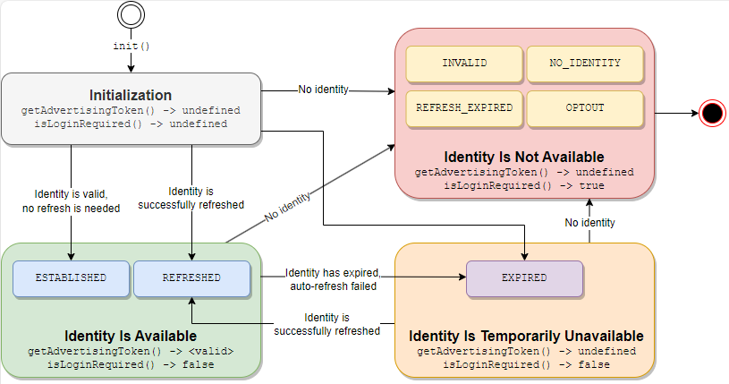

import Link from '@docusaurus/Link';
import ExampleUid2Cookie from '../snippets/_example-uid2-cookie.mdx';
import ExampleJavaScriptV2Init from '../snippets/_example-javascript-v2-init.mdx';

# SDK for JavaScript Reference Guide (v2.x and earlier)

:::important
このドキュメントは、SDK for JavaScript の旧バージョン用です。以前のバージョンを使用している場合は、アップグレードすることを勧めます。移行ガイドを含む [SDK for JavaScript Reference Guide](sdk-ref-javascript.md) を参照してください。
:::

この SDK を使用して、UID2 を使用してクライアントの ID を確立し、広告トークンを取得するプロセスを容易にします。以下のセクションでは、UID2 を確立するための [workflow](#workflow-overview) について説明し、SDK の [API reference](#api-reference) を提供し、[UID2 cookie format](#uid2-cookie-format) について説明します。

コンテンツパブリッシャー向けのインテグレーション手順については、[Client-Server Integration Guide for JavaScript](../guides/integration-javascript-client-server.md) を参照してください。

関連ドキュメントと [example application](https://example-jssdk-integ.uidapi.com/) については、[UID2 SDK Integration Example](https://github.com/IABTechLab/uid2-web-integrations/tree/main/examples/js-sdk) を参照してください。

## Functionality

この SDK は、UID2 をサポートしたいすべてのパブリッシャーに対して、UID2 とのインテグレーションを簡素化します。次の表は、SDK がサポートする機能を示しています。

| Encrypt Raw UID2 to UID2 Token for Sharing | Decrypt UID2 Token to Raw UID2 | Generate UID2 Token from DII | Refresh UID2 Token | Map DII to Raw UID2s | Monitor Rotated Salt Buckets |
| :--- | :--- | :--- | :--- | :--- | :--- |
| &#8212; | &#8212; | &#8212; | &#9989; | &#8212; | &#8212; |

## API Permissions

この SDK を使用するには、[Account Setup](../getting-started/gs-account-setup.md) ページの手順に従って、UID2 アカウントの設定を完了する必要があります。

SDK が提供する特定の機能を使用する権限が与えられ、そのアクセスのための資格情報が提供されます。

詳細は [API Permissions](../getting-started/gs-permissions.md) を参照してください。

## SDK Version

このドキュメントは SDK for JavaScript version 2 用です。

## GitHub Repository

この SDK のソースは、以下のオープンソースの GitHub リポジトリにあります:

- [https://github.com/iabtechlab/uid2-web-integrations](https://github.com/iabtechlab/uid2-web-integrations)

## Terminology

このドキュメントでは、以下の用語が使われます:
- **ID** とは、[POST&nbsp;/token/generate](../endpoints/post-token-generate.md) または [POST&nbsp;/token/refresh](../endpoints/post-token-refresh.md) エンドポイントによって返される、UID2 Token、Refresh Token、および Timestamp などの関連値を含む値のパッケージを指します。
- **Advertising Token** は UID2 Token を指します。

## Include the SDK Script

UID2 をターゲティング広告に使用したいすべてのページに、以下の SDK スクリプトを含めます:

```html
<script src="https://prod.uidapi.com/static/js/uid2-sdk-2.0.0.js" type="text/javascript"></script> 
```

## Workflow Overview

SDK を使用して UID2 ID を確立するための Client-Side ワークフローは、以下の Step で構成されます:

1. Publisher: [init](#initopts-object-void) 関数を利用して SDK を初期化し、Step の正常収容時に呼び出される [callback function](#callback-function) を指定します。
2. Publisher: SDK がコールバック関数を呼び出すのを待ちます。コールバック関数は ID の可用性を示します:
	- ID が利用可能な場合、SDK は[background token auto-refresh](#background-token-auto-refresh) を設定します。
	- ID が利用できない場合、利用できない理由はコールバック関数に渡されるオブジェクトに指定されます。
3. SDK: アイデンティティ [state](#workflow-states-and-transitions) に基づき、SDK は以下の処理を行います:
  - 有効な ID が利用可能な場合、SDK はその ID が[ファーストパーティクッキー](#uid2-cookie-format) で利用可能であることを保証します。
  - ID が使用できない場合、SDK は ID が更新可能かどうかに基づいて適切なアクションを実行します。詳細は [Workflow States and Transitions](#workflow-states-and-transitions) を参照してください。
4. Publisher: ID の状態に基づいて ID を処理します:
	- Advertising Token が使用可能な場合は、それを使用してターゲティング広告の要求を開始します。
	- Advertising Token が利用可能でない場合は、ターゲティング広告を使用しないか、同意フォームでユーザーを データキャプチャにリダイレクトします。
 
Web インテグレーションの詳細は [Client-Server Integration Guide for JavaScript](../guides/integration-javascript-client-server.md) を参照してください。

### Workflow States and Transitions

次の表は、[getAdvertisingToken()](#getadvertisingtoken-string) と [isLoginRequired()](#isloginrequired-boolean) という 2 つの主要な関数が返す値の組み合わせに基づいて、SDK が取り得る 4 つの主要な状態の概要を示し、それぞれの状態において開発者として取ることができる適切なアクションを示しています。

| Workflow State | Advertising Token | Login Required | Description| Identity Status Value |
| :--- | :--- | :---| :---| :---|
| Initialization | `undefined`| `undefined`| コールバックが呼び出されるまでの初期状態です。 | N/A |
| Identity Is Available | available |`false` | 有効な ID が正常に確立または更新されました。ターゲティング広告で Advertising Toke を使用できます。 |`ESTABLISHED` or `REFRESHED` |
| Identity Is Temporarily Unavailable |`undefined` | `false`| Advertising Token の有効期限が切れたため、自動更新に失敗しました。[Background auto-refresh](#background-token-auto-refresh) は、Refresh Token の有効期限が切れるか、ユーザーがオプトアウトするまで続きます。<br/>以下のいずれかを行ってください:<br/>- ユーザーをリダイレクトし、メールアドレスまたは電話番号の入力を求める。<br/>- ターゲティングしない広告を使用する。<br/>NOTE: ID は後で正常にリフレッシュされるかもしれません。&#8212;たとえば、UID2 Serviceが一時的に利用できなくなった場合などです。 | `EXPIRED` |
| Identity Is Not Available | `undefined`| `false`| ID が利用できず、リフレッシュできません。SDK はファーストパーティクッキーをクリアします。<br/>UID2 ベースのターゲティング広告を再度使用するには、UID2 を取得できるログインまたはフォーム入力にユーザーをリダイレクトする必要があります。 | `INVALID`, `NO_IDENTITY`, `REFRESH_EXPIRED`, or `OPTOUT` |

次の図は、対応する ID の [status values](#identity-status-values) を含む 4 つの状態と、それらの間で可能な遷移を示しています。SDK は各遷移で [callback function](#callback-function) を呼び出します。



### Background Token Auto-Refresh

SDKの [initialization](#initopts-object-void) の一部として、ID の Token Auto-refresh が設定され、ID の Timestamp または断続的なエラーによるリフレッシュの失敗によってバックグラウンドでトリガーされます。

Token の Auto-refresh について知っておくべきことは以下のとおりです:

- 同時にアクティブにできる [POST&nbsp;/token/refresh](../endpoints/post-token-refresh.md) エンドポイント呼び出しは1つだけです。
- [POST&nbsp;/token/refresh](../endpoints/post-token-refresh.md) レスポンスが、ユーザーがオプトアウトしたため、あるいは Refresh Token の有効期限が切れたために失敗した場合、バックグラウンドでの自動更新処理を一時停止します。UID2ベースのターゲティング広告を再び使用するには、ユーザーからメールアドレスまたは電話番号を取得する必要があります（[isLoginRequired()](#isloginrequired-boolean)は`true`を返します）。
- SDK の初期化時に指定された [callback function](#callback-function) は、以下の場合に呼び出されます:
	- リフレッシュが成功するたびに呼び出されます。
	- 有効期限が切れた Advertising Token のリフレッシュに最初に失敗した場合。
	- たとえば、ユーザーがオプトアウトした場合などです。<br/>NOTE: ID が一時的に利用できず、自動更新が失敗し続ける場合、コールバックは呼び出されません。この場合、SDK は既存の Advertising Token を使用し続けます。
- [disconnect()](#disconnect-void) 呼び出しはアクティブなタイマーをキャンセルします。

## API Reference

Client-Side JavaScript SDK とのやり取りはすべて `UID2` クラスのインスタンスであるグローバルな `__uid2` オブジェクトを介して行われます。以下の JavaScript 関数はすべて `UID2` クラスのメンバです。

- [constructor()](#constructor)
- [init()](#initopts-object-void)
- [getAdvertisingToken()](#getadvertisingtoken-string)
- [getAdvertisingTokenAsync()](#getadvertisingtokenasync-promise)
- [isLoginRequired()](#isloginrequired-boolean)
- [disconnect()](#disconnect-void)
- [abort()](#abort-void)

### constructor()

UID2 オブジェクトを構築します。

:::tip
この関数を呼び出す代わりに、グローバルの `__uid2` オブジェクトを使用することができます。
:::

### init(opts: object): void

SDK を初期化し、ターゲティング広告用のユーザー ID を確立します。

この関数について知っておくべきことは以下のとおりです:

- `init()` は、対応するスクリプトタグによって SDK がロードされた後、いつでも呼び出すことができます。
- 初期化呼び出しには、SDK が初期化された後に呼び出される [callback function](#callback-function) が必要です。
- クライアントで UID2 ライフサイクルのインスタンスを作成する場合、`init()` 呼び出しの `identity` プロパティは、Server-side で生成された ID を含む [POST&nbsp;/token/generate](../endpoints/post-token-generate.md) または [POST&nbsp;/token/refresh](../endpoints/post-token-refresh.md) 呼び出しが成功したときに返されるレスポンス JSON オブジェクトの `body` プロパティを参照します。
- SDK はセッションに渡された UID2 情報の保存に [ファーストパーティクッキー](#uid2-cookie-format) に依存しているため、異なるドメインのページから `init()` を呼び出すと、クッキーにアクセスできない可能性があります。`cookieDomain` オプションと `cookiePath` オプションでクッキーに使用する設定を調整することができます。
- 特定の動作を調整するために、初期化呼び出しにはオプションのコンフィギュレーション [parameter](#parameters) を含めることができます。

以下は、Server-side で生成された ID を含む `init()` 呼び出しのテンプレートです。

```html
<script>
 __uid2.init({
   callback : function (state) {...}, // Check advertising token and its status within the passed state and initiate targeted advertising. 
   identity : {...} // The `body` property value from the token/generate or token/refresh API response.
 });
</script>
```

たとえば:

<ExampleJavaScriptV2Init />

以下は、ファーストパーティクッキーから ID を取得する `init()` 呼び出しの例です。この様なスクリプトは、ID が確立された後にユーザーが訪れる可能性のある任意のページに配置することができます。

```html
<script>
 __uid2.init({
   callback : function (state) {...} // Check advertising token and its status within the passed state and initiate targeted advertising. 
 });
</script>
```

#### Parameters

`opts` オブジェクトは、以下のプロパティをサポートしています。

| Property | Data Type | Attribute | Description | Default Value |
| :--- | :--- | :--- | :--- | :--- |
| `callback` | `function(object): void` | 必須 | 渡された ID を検証した後に SDK が呼び出す関数です。[Callback Function](#callback-function) を参照してください。 | N/A |
| `identity` | object | オプション | [POST&nbsp;/token/generate](../endpoints/post-token-generate.md) または [POST&nbsp;/token/refresh](../endpoints/post-token-refresh.md) 呼び出しが成功したときの `body` プロパティ値です。<br/>[ファーストパーティクッキー](#uid2-cookie-format) からの ID を使用するには、このプロパティを空にしておきます。 | N/A |
| `baseUrl` | string | オプション | [POST&nbsp;/token/refresh](../endpoints/post-token-refresh.md) エンドポイントを呼び出す際に使用する UID2 Operator のカスタム Base URLです。<br/>たとえば: `https://my.operator.com`. | `https://prod.uidapi.com`. |
| `refreshRetryPeriod` | number | オプション | 断続的なエラーが発生した場合に、トークンのリフレッシュを再試行する秒数です。 | 5 |
| `cookieDomain` | string | オプション | [UID2 cookie](#uid2-cookie-format) に適用するドメイン名文字列です。<br/>たとえば、`baseUrl` が `https://my.operator.com` の場合、`cookieDomain` の値は `operator.com` となります。 | `undefined` |
| `cookiePath` | string | オプション | [UID2 cookie](#uid2-cookie-format) に適用する Path 文字列です。 | `/` |


#### Errors

`init()` 関数は、以下のエラーを throw することがあります。

| Error | Description |
| :--- | :--- |
| `TypeError` | 以下のいずれかの問題が発生しました:<br/>- 関数がすでに呼び出されています。<br/>- `opts` の値がオブジェクトではありません。<br/>- コールバック関数が指定されていません。<br/>- `callback` の値が関数ではありません。 |
| `RangeError` | リフレッシュの再試行期間が 1 未満です。 |

#### Callback Function

`function(object): void` コールバック関数は、初期化が完了したことを示します。これ以降、SDK は確立された ID のリフレッシュに成功した時にコールバックを呼び出します。

コールバック関数がよばれるタイミングについての詳細は [Background Token Auto-Refresh](#background-token-auto-refresh) を参照してください。

`object` パラメータは以下のプロパティを含みます。

| Property | Data Type | Description |
| :--- | :--- | :--- |
| `advertisingToken` | string | ターゲティング広告のために SSP に渡す Token です。トークン/ID が無効または使用できない場合、値は `undefined` になります。 |
| `status` | `UID2.IdentityStatus` enum | ID のステータスを示す数値です。詳細は [Identity Status Values](#identity-status-values) を参照してください。 |
| `statusText` | string | ID ステータスに関する追加情報です。 |

#### Identity Status Values

[callback function](#callback-function) は `UID2.IdentityStatus` enum から `status` フィールドの値を数値として返します。`UID2.IdentityStatus[state.status]` を呼び出すことで、対応する文字列に変換することができます。次の表に `status` enum の文字列を示します。

:::important
以下の値は、ID の可溶性を通知することのみを目的としています。条件文などでは使用しないでください。
:::

| Status | Advertising Token Availability | Description |
| :--- | :--- | :--- |
| `ESTABLISHED` | Available | ID は有効で、渡された値またはファーストパーティクッキーから設定され、ターゲティング広告に利用できるようになりました。 |
| `REFRESHED` | Available | ID は UID2 オペレータへの呼び出しによってい正常に更新され、ターゲティング広告に使用できる様になりました。 |
| `EXPIRED` | Not available | SDK がトークンのリフレッシュに失敗したため、ターゲティング広告に使用できる ID がありません。まだ有効な Refesh Token があるため、自動リフレッシュの試行は継続されます |
| `REFRESH_EXPIRED` | Not available | ファーストパーティクッキーの Refresh Token または渡された ID の有効期限が切れているため、ターゲティング広告に利用できる ID がありません。 |
| `NO_IDENTITY` | Not available | ファーストパーティクッキーが設定されておらず、`init()` 関数に ID が渡されていないため、ターゲティング広告に利用できる ID がありません。 |
| `INVALID` | Not available | SDK が ファーストパーティクッキーまたは渡された ID の解析に失敗したため、ターゲティング広告に利用できる ID がありません。 |
| `OPTOUT` | Not available | ユーザーがオプトアウトしているため、ID を更新できず、ターゲティング広告に利用できる ID はありません。 |

ID が利用できない場合は、[isLoginRequired()](#isloginrequired-boolean) 関数を使用して、最善の対応策を決定します。

### getAdvertisingToken(): string

現在の Advertising Token を取得します。

この関数を呼び出す前に、必ず [init()](#initopts-object-void) を呼び出し、次の例に示すように、指定したコールバックが呼び出されるまで待ちます。

```html
<script>
  let advertisingToken = __uid2.getAdvertisingToken();
</script>
```

`getAdvertisingToken()` 関数を使うと、初期化完了時のコールバックだけでなく、どこからでも Advertising Token にアクセスすることができます。この関数は以下の条件のいずれかに該当する場合に `undefined` をします:

- [callback function](#callback-function) はまだ呼び出されていません。これは SDK の初期化が完了していないことを意味します。
- SDK の初期化は完了していますが、使用する有効な ID がありません。
- SDK の初期化は完了しましたが、自動更新により ID がクリアされました&#8212;たとえば、ユーザーがオプトアウトした場合などです。

ID が利用できない場合は、[isLoginRequired()](#isloginrequired-boolean) 関数を使用して最良の対処法を決定します。

### getAdvertisingTokenAsync(): Promise

現在の Advertising Token の `Promise` 文字列を取得します。

この関数は、[init()](#initopts-object-void) の呼び出しの前でも後でも呼び出すことができます。返された promise は、初期化が完了し、[callback function](#callback-function) が呼び出された後、Advertising Token が利用可能かどうかに基づいて Settle されます:

- Advertising Token が利用可能な場合、Promise は現在の Advertising Token で実行されます。
- Advertising Token が利用可能であれば、Promise は現在の Advertising Token で実行されます。Advertising Token が一時的にでも利用できない場合、Promise は `Error` のインスタンスで拒否されます。この場合に最適なアクションを決定するには、[isLoginRequired()](#isloginrequired-boolean) を使います。

:::note
もし `getAdvertisingTokenAsync()` 関数が初期化が完了した *後* に呼ばれた場合、Promise は現在の状態に基づいて即座に Settle されます。
:::

```html
<script>
  __uid2.getAdvertisingTokenAsync()
    .then(advertisingToken => { /* initiate targeted advertising */ })
    .catch(err => { /* advertising token not available */ });
</script>
```

:::tip
この関数を使用すると、`init()`を呼び出したコンポーネントではないコンポーネントから、Client-Side JavaScript SDK の初期化の完了を通知することができます。
:::

### isLoginRequired(): boolean

UID2 [POST&nbsp;/token/generate](../endpoints/post-token-generate.md) 呼び出しが必要かどうかを指定します。

この関数は、[Workflow States and Transitions](#workflow-states-and-transitions) で示したように、ID が見つからない場合の処理に追加のコンテキストを提供することもできます。

```html
<script>
  __uid2.isLoginRequired();
</script>
```

#### Return Values

| Value | Description |
| :--- | :--- |
| `true` | ID が利用できません。この値は以下のいずれかを示します:<br/>- Refresh token の有効期限が切れた。<br/>- ファーストパーティクッキーは利用できず、サーバーで生成した ID も提供されていません。 |
| `false` | この値は以下のいずれかを示します:<br/>- ID が存在し、有効。<br/>- ID の有効期限が切れており、断続的なエラーによりトークンがリフレッシュされなかった。<br/>- ID の有効期限が切れており、断続的なエラーによりトークンがリフレッシュされなかった。 |
| `undefined` | SDK の初期化はまだ完了していません。 |


### disconnect(): void

[ファーストパーティクッキー](#uid2-cookie-format) から UID2 ID をクリアします。これにより、クライアントの ID セッションが閉じられ、クライアントのライフサイクルが切断されます。

ユーザーがパブリッシャーのサイトからログアウトしたら、次の呼び出しを行います:

```html
<script>
  __uid2.disconnect();
</script>
```

この関数が実行されると、[getAdvertisingToken()](#getadvertisingtoken-string) 関数は `undefined` を返し、[isLoginRequired()](#isloginrequired-boolean) 関数は `true` を返します。

### abort(): void

バックグラウンドのタイマーやリクエストを終了します。UID2 オブジェクトは指定されていない状態のままで、これ以上使用することはできません。

この関数は、既存の UID2 オブジェクトを新しいインスタンスで置き換えるような高度なシナリオで使用することを想定しています。たとえば、シングルページのアプリケーションでこれを使用すると、[POST&nbsp;/token/generate](../endpoints/post-token-generate.md) レスポンスでサーバーから新しい ID を受け取った後に、現在の UID2 オブジェクトをクリアして新しいオブジェクトを作成したり初期化したりすることができます。

## UID2 Cookie Format

SDK はファーストパーティクッキーを使用してユーザーの ID を保存します。

### Properties

次の表に、cookie のプロパティを示します。

| Properties | Default Value | Comments |
| :--- | :--- | :--- |
| `Name` | `__uid_2` | N/A |
| `Expiry` | N/A | 値は、[POST&nbsp;/token/generate](../endpoints/post-token-generate.md) または [POST&nbsp;/token/refresh](../endpoints/post-token-refresh.md) レスポンスで指定された Refresh Token の有効期限タイムスタンプです。 |
| `Path` | `/` | 別の値を使用したい場合は、SDK の初期化時に `cookiePath` [init() parameter](#parameters) を使用して設定することができます。 |
| `Domain` | `undefined` | 別の値を使用したい場合は、SDK の初期化時に `cookieDomain` [init() parameter](#parameters) を使用して設定することができます。 |

### Contents Structure

UID2 Cookie の内容は、[POST&nbsp;/token/generate](../endpoints/post-token-generate.md) または [POST&nbsp;/token/refresh](../endpoints/post-token-refresh.md) レスポンスの `body` プロパティと同じ構造を持つ JSON オブジェクトを、`private` オブジェクトを除いてURI エンコードした文字列表現です。

以下は UID2 cookie 構造の例です:

<ExampleUid2Cookie />

:::important
`private` オブジェクトの内容は明示的に指定されておらず、SDK が解釈するようになっています。このオブジェクトの構造、セマンティクス、互換性について、いかなる仮定もしないでください。クッキーの更新はその構造を保持しなければなりません。
:::