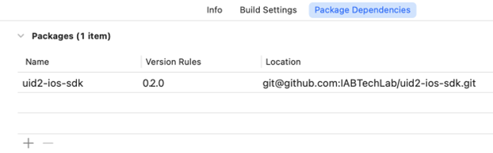

# UID2 SDK for iOS Reference Guide

<!-- This guide includes the following information:

- [Functionality](#functionality)
- [API Permissions](#api-permissions)
- [SDK Version](#sdk-version)
- [Features](#features)
- [GitHub Open-Source Repository](#github-open-source-repository)
- [Minimum Requirements](#minimum-requirements)
- [Installation](#installation)
  -  [Installing with Gradle ](#installing-with-gradle)
  -  [Installing with Maven ](#installing-with-maven)
- [Usage Guidelines](#usage-guidelines)
- [UID2Manager API](#uid2manager-api)
  -  [Functions](#functions)
  -  [Variables](#variables)
- [Android Initialization](#android-initialization)
- [Code Samples](#code-samples) -->

UID2 SDK for iOS を使用すると、UID2 を使用してクライアント ID を確立し、iOS デバイスで Advertising Token を取得するプロセスを容易にすることができます。

以下のiOS関連プラグインと関連ドキュメントも利用できます:

| Purpose | Product/Documentation |
| :--- | :--- |
| Google Mobile Ads (GMA) SDK を使用して、iOS アプリからの広告リクエストで [UID2 Token](../ref-info/glossary-uid.md#gl-uid2-token) を [Secure Signal](https://support.google.com/admob/answer/11556288) として送信するには、次のの手順に従います。 | [UID2 GMA Plugin for iOS Integration Guide](../guides/mobile-plugin-gma-ios.md) |
| Google Interactive Media Ads SDK for iOS  を使用して、iOS アプリからの広告リクエストで [UID2 Token](../ref-info/glossary-uid.md#gl-uid2-token) を [Secure Signals](https://support.google.com/admob/answer/11556288) として送信するには、次のの手順に従います。 | [UID2 IMA Plugin for iOS Integration Guide](../guides/mobile-plugin-ima-ios.md) |

## Functionality

この SDK は、iOS デバイス上で動作するアプリで UID2 をサポートしたいパブリッシャー向けに、UID2 とのインテグレーションを簡素化します。以下の表に、この SDK がサポートする機能を示します。

| Encrypt Raw UID2 to UID2 Token | Decrypt UID2 Token | Generate UID2 Token from DII | Refresh UID2 Token |
| :--- | :--- | :--- | :--- |
| Not supported | Not supported | Not supported | Supported |

## API Permissions

この SDK を使用するには、[Account Setup](../getting-started/gs-account-setup.md) ページに記載されている手順に従って、UID2 アカウントのセットアップを完了する必要があります。

SDK が提供する特定の機能の使用許可が与えられ、そのアクセス用の認証情報が与えられます。SDK には、使用する権限を持たない機能があるかもしれないことに留意してください。例えば、パブリッシャーはトークンの生成と更新のために特定の API Permissions を取得しますが、SDK は共有などの他のアクティビティをサポートするかもしれません。

詳細は、[API Permissions](../getting-started/gs-permissions.md) を参照してください。

## SDK Version

<!-- As of 2023-07-15 -->

このドキュメントは UID2 iOS SDK バージョン 0.2.0 用です。

## Features

UID2 iOS SDK は、iOS アプリケーションに代わって UID2 Identity を管理するように設計されています。プラットフォームネイティブの暗号化ツールを使って Identity をデバイス上に安全に保存することで、UID2 Identity をアプリのライフサイクル全体にわたって持続させることができます。

デフォルトでは、SDK は有効期限に基づいて UID2 Identity を自動的にリフレッシュします。ただし、これを無効にして、実装アプリが UID2 Identity のライフサイクルを手動で管理できるようにすることもできます。

## GitHub Open-Source Repository

この SDK は以下のオープンソースの GitHub リポジトリにあります:

- [https://github.com/IABTechLab/uid2-ios-sdk](https://github.com/IABTechLab/uid2-ios-sdk)

## Minimum Requirements

この SDK の最小要件は以下の通りです:

- Xcode version: 14.0+
- iOS	minimum target version: 13.0+	
- Swift version: 5.0+

<!-- See also: [Requirements](https://github.com/IABTechLab/uid2-ios-sdk/blob/main/README.md#requirements). -->

## Installation

Swift Package Manager (SPM) を使って iOS SDK をインストールします。2つのインストールオプションがあります:

-   [Package.swift](#installing-with-packageswift)
-   [Xcode](#installing-with-xcode)

### Installing with Package.swift

Package.swift に以下の依存関係を追加します:

``` javascript
dependencies: [
.package(url: \"https://github.com/IABTechLab/uid2-ios-sdk.git\", from: "0.2.0"),
]
```

### Installing with Xcode

Xcode 経由で以下の依存関係を追加します:



## Usage Guidelines

最初の UID2 Identity は、実装アプリケーションが生成し、UID2 SDK に渡す必要があります。セキュリティ要件のため、UID2 Mobile SDK は新しい UID2 Identity を作成できません。

UID2 Mobile SDK は、ID が確立された後、UID2 Identity のリフレッシュを実行できます。これは、リフレッシュ機能が UID2 Identity の一部である Refresh Token に依存しているためです。

**UID2Manager** シングルトンは、UID2 Android および iOS SDK の主要な開発者 API です。UID2 Identity の保存、リフレッシュ、取得を行います。

iOS の場合、`UID2Manager` は最初にアクセスされたときに自動的に初期化されます。自動または手動のリフレッシュ機能をサポートするように設定できます。

## UID2Manager API

このセクションには、UID2Manager API の一部である関数と変数が含まれています。

### Functions

UID2Manager API の一部として、以下の関数が利用できます:
- [setIdentity()](#setidentity)
- [resetIdentity()](#resetidentity)
- [refreshIdentity()](#refreshidentity)
- [getAdvertisingToken()](#getadvertisingtoken)
- [setAutomaticRefreshEnabled()](#setautomaticrefreshenabled)

#### setIdentity()

SDK が管理する UID2 Identity を設定します。

#### resetIdentity()

SDK が現在管理している UID2 Identity をリセットまたは削除します。

#### refreshIdentity()

SDK が管理しているUID2 Identity を手動でリフレッシュします。

#### getAdvertisingToken()

現在の UID2 Identity が有効な場合、この関数は UID2 Token (Advertising Token) を返します。

#### setAutomaticRefreshEnabled()

自動更新機能のトグルです。

### Variables

UID2Manager API では、以下の変数を使用できます:

- [identity](#identity)
- [identityStatus](#identitystatus)

#### identity

identity 変数は、SDK によって管理されている現在の UID2Identity データオブジェクトを格納し、返します。

#### identityStatus

identityStatus 変数は、SDK が管理している現在の UID2 Identity のステータスを格納し、返します。

## Code Samples

以下のコードサンプルは、UID2 iOS SDK を使用して UID2 を管理する具体的なアクティビティを実行する例です。

初期 UID2 Identity を設定します:

``` javascript
UID2Manager.shared.setIdentity(_ identity: UID2Identity)
```

Advertising SDK に渡す UID2 Token (Advertising Token) を取得します:

``` javascript
UID2Manager.shared.getAdvertisingToken()
```
