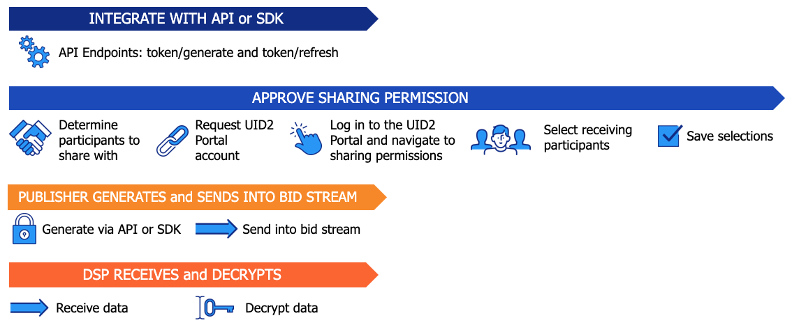

# Sharing in the Bid Stream

<!-- It includes the following:

- [Account Setup in the UID2 Portal](#account-setup-in-the-uid2-portal)
- [UID2 Sharing Workflow: Sharing in the Bid Stream](#uid2-sharing-workflow-sharing-in-the-bid-stream)
- [Token Example for Publishers in the Bid Stream](#token-example-for-publishers-in-the-bid-stream) -->

パブリッシャーは、API エンドポイントまたは SDK を介して [directly identifying information (DII)](../ref-info/glossary-uid.md#gl-dii)(メールアドレスまたは電話番号) を UID2 Token に暗号化し、UID2 Token をビッドストリームに送信することで、UID2 を共有します。

その他のリソース:

Additional resources:
- [UID2 Overview for Publishers](../overviews/overview-publishers.md)
- [UID2 Portal Overview](../portal/portal-overview.md)

## Account Setup in the UID2 Portal

UID2 Portal では、送信者と受信者がアカウントを設定し、共有権限を設定する必要があります。

送信者が共有許可を設定する必要があるのは、受信者または参加者のタイプごとに一度だけです。ただし、新しい共有権限を追加したり、既存の共有権限を変更したりする場合は、設定を調整するために再度アクセスする必要があります。

パブリッシャーとしては、すべての DSP と共有するように共有権限を設定することをお勧めします。

詳細については、[UID2 Portal Overview](../portal/portal-overview.md) を参照し、各タスクのリンクをたどってください。

## UID2 Sharing Workflow: Sharing in the Bid Stream

ビッドストリームで UID2 Token を送信する場合は、API または以下の SDK のいずれかを使用してインテグレーションできます:

- Java server-side SDK ([UID2 SDK for Java (Server-Side) Reference Guide](../sdks/uid2-sdk-ref-java.md) を参照してください)。
- Python server-side SDK ([UID2 SDK for Python (Server-Side) Reference Guide](../sdks/uid2-sdk-ref-python.md) を参照してください)。

これらのオプションは、メールアドレスや電話番号から UID2 Token を生成し、トークンを定期的に更新することをサポートしています。他の SDK は、現時点ではトークン生成とトークン更新をサポートしていません。

API または指定された server-side SDK を介して、DII から UID2 Token を生成するためのワークフローは、以下のステップで構成されています (各ステップは、対応するセクションにリンクしています):

1. パブリッシャー: 以下のいずれかを使用して、UID2 とインテグレーションします:

   - Java SDK: [UID2 SDK for Java (Server-Side) Reference Guide](../sdks/uid2-sdk-ref-java.md) を参照してください。
   - Python SDK: [UID2 SDK for Python (Server-Side) リファレンスガイド](../sdks/uid2-sdk-ref-python.md) を参照してください。
   - API endpoint との直接インテグレーション: [Endpoints](/docs/category/endpoints-v2) を参照してください。
   - API endpoint との直接インテグレーションでは、[POST /token/generate](../endpoints/post-token-generate.md) エンドポイントを使用して UID2 Token を生成しますが、UID2 SDK for JavaScript ([UID2 SDK for JavaScript Reference Guide](../sdks/client-side-identity.md) を参照してください)を使用して UID2 Token をリフレッシュします。

   >NOTE: DSPは、Server-Side SDK のいずれかを使用して UID2 とインテグレーションする必要があります。[Sharing Steps: Summary](sharing-implementing.md#sharing-steps-summary)(step 2) を参照してください。

1. パブリッシャー: UID2 Portal で共有許可を承認します:

   1. パブリッシャー: 送信者の UID2 Token の復号化を許可する DSP を定義します。
   1. パブリッシャーおよび DSP: UID2 Portal アカウントを作成します。
   1. パブリッシャー: UID2 Portal にログインし、sharing permissions ページに移動します。
   1. パブリッシャー: 共有したい DSP を1つ以上選択します。必要に応じて、検索機能を使用して特定の DSP を検索します。
   1. パブリッシャー: 共有の選択を保存します。

1. パブリッシャーが以下の手順を実行して、UID2 Token を作成して送信します:

   1. メールアドレスまたは電話番号から UID2 Token を生成します。
   1. UID2 Token をビッドストリームに投入します。

1. DSP は以下の手順を実行します:

   1. UID2 Token を受信します。
   1. UID2 Token を raw UID2 に復号して使用します。

以下の図は、パブリッシャー向けの UID2 sharing ワークフローを示しています。

## Token Example for Publishers in the Bid Stream

パブリッシャーは、次の例に示すように、1回の操作で、入力されたメールアドレスまたは電話番号をビッドストリームで使用する UID2 Token に直接変換します。

<table>
<colgroup>
    <col style={{
      width: "30%"
    }} />
    <col style={{
      width: "40%"
    }} />
    <col style={{
      width: "30%"
    }} />
   
  </colgroup>
<thead>
<tr>
<th>Input Example</th>
<th>Process/User</th>
<th >Result</th>
</tr>
</thead>
<tbody>
<tr>
<td>user@example.com</td>
<td>正規化されたメールアドレス/電話番号を UID2 Token に変換します: <a href="../endpoints/post-token-generate">POST /token/generate</a> エンドポイント NOTE: SDK を使用している場合は、SDK がトークン生成を管理します。</td>
<td style={{
  wordBreak: "break-all"
}}>KlKKKfE66A7xBnL/DsT1UV/Q+V/r3xwKL89Wp7hpNllxmNkPaF8vdzenDvfoatn6sSXbFf5DfW9wwbdDwMnnOVpPxojkb8KYSGUte/FLSHtg4CLKMX52UPRV7H9UbWYvXgXC4PaVrGp/Jl5zaxPIDbAW0chULHxS+3zQCiiwHbIHshM+oJ==</td>
</tr>
</tbody>
</table>
